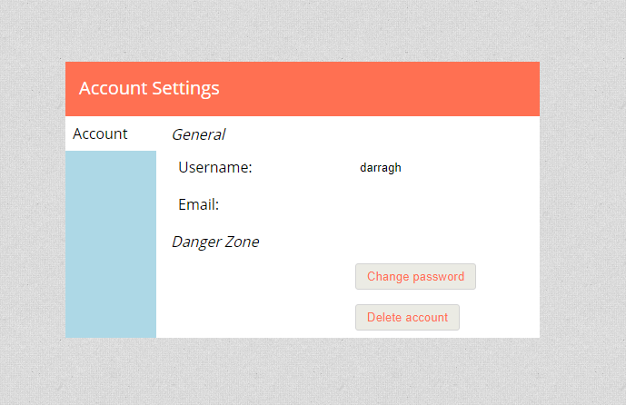

With 0.19.0 we have our first release of the year! There are a couple of big new features (floors and badges) and a lot of small quality of life fixes and changes.

The topics mentioned in this release update are listed on the left, the full changelog can be found on [github](https://github.com/Kruptein/PlanarAlly/releases/tag/0.19.0).

## Vision

### Floors

One of the biggest additions in this release is the introduction of floors. Just as in real life a building can consist of multiple floors.
Until now if you wanted to emulate this in PA, you would have to either use separate locations or have different areas in one location that represent different floors.
Both approaches require a bunch of jumping around, which is ultimately undesirable.

With this release that changes, the DM can create/delete a floor using the floor button in the lowerleft corner, right next to the layer selector. The number displayed in this box is the active floor number.

Vision and lights work across floors in a natural manner; A token on the upper floor can see a token with a light in the garden through a window, similarly someone in the garden can see the person on the upperbalcony. _Do note that this is no true 3D rendering, so some small edge cases where the height of certain items are unknown can occur._

**The video below might contain map spoilers for the WotC adventure Waterdeep Dragonheist.**

<video autoplay loop muted style="max-width: 750px;">
   <source src="/assets/0.19.0/newfloors.webm" type="video/webm">
   <source src="/assets/0.19.0/newfloors.mp4" type="video/mp4">
</video>

The above example shows how floor vision works where the left side represents a player with ownership of the Y token on the first floor. The right side represents the DM who has access to both tokens.

To change floors you click on the floor button in the bottom left and select your desired floor. To change the floor of a shape or a group of shapes, you right click them and use the floor submenu.

**Top tip:** There are some extra keybindings dedicated to floors, which will allow you to switch around seamlessly. Page Up/Down moves you one floor up or down. You can also move a selection of shapes to other floors through keybindings; Ctrl + Page Up/Down will move the tokens one floor up/down, if you want to immediately move along use Ctrl + Shift + Page Up/Down instead.

Note that currently players are free to move to whichever floor they desire. Extra access control will be added in the future, but with the proper vision settings this should actually be completely fine!

Each floor in essence is an entire new set of layers. This also means that there is addditional client side load for each floor you add. In the future an option to only render the active floor will be added for those players that might nog be able to handle the increase in load. The default case with just one floor will have no extra overhead compared to earlier releases.

### Available modes

The legacy vision mode based on bounding volume hierarchies (bvh) is now removed from the game, any map that was still using it should be changed to the default mode based on triangle expansion.

Additionally a new vision mode is available. It's an experimental upgrade from the default triangle based vision mode, that does not have to recalculate the entire scene, but works iteratively. This should provide noticeable performance improvements on maps with many vision elements, but could still contain bugs that will brick the vision, if that happens reloading the page should work fine.

## shapes

### badges

Another new feature as suggested by @adunis on github, is the introduction of badges; These are small numbered icons in the lowerright corner of tokens.

The display of badges can be toggled on or off per group of tokens. A group of tokens here is defined as all instances that are a result of copy pasting the same token. _(e.g. I drag an orc token on the board and copy paste it a bunch, all these tokens are a single group. Dragging a new orc token on the board is a different group.)_

Badges take their background colour from the shape's stroke colour, and their border colour and font colour as either black or white depending on what's best legible. The token numbers are automatically incremented upon paste.

<video autoplay loop muted style="max-width: 750px;">
   <source src="/assets/0.19.0/badges.webm" type="video/webm">
   <source src="/assets/0.19.0/badges.mp4" type="video/mp4">
</video>

### annotations

I managed to forget about a bug that was reported in August, but it is now fixed at last!

Annotations would stop working when changing locations. This has now been resolved :)

## tools

### snapping

The polygon tool is a tool I use a lot. In particular the version that does not auto-close. One issue I frequently bumped into however is that I had no reliable way to accurately add a point to my polygon that should match exactly with an existing point (e.g. connecting walls). This would cause very small, but noticeable issues with lighting around these areas where open ended polygons would meet.

This release now adds a snapping feature, that will automatically yank your mouse cursor towards a closeby existing point if you come near it. This snapping behaviour is only active when resizing or using the draw tool. The draw tool now also highlights snappable points when activating (this might be something I remove in the future, depending on feedback).

<video autoplay loop muted style="max-width: 750px;">
   <source src="/assets/0.19.0/snapping.webm" type="video/webm">
   <source src="/assets/0.19.0/snapping.mp4" type="video/mp4">
</video>

As you can see at the end of the video, only 1 red dot appears in the location where two polygons meet. In the past this used to be multiple dots very close to eachother.

_As a reminder, to close a polygon use right click; A future release should make this clearer in the UI_.

### touch gestures

Touch support has always been very iffy at best. This is a first step to allow touch devices to interact with PlanarAlly in a more intuitive way.

The addition of these changes is mostly limited to interacting with the various UI elements using touch, some of the more 'advanced' gestures like pinch to zoom etc are not yet added.

_This feature was contributed by @ZachMyers3 on github_

### select fixes

There were a set of bugs related to the select tool that could result in a bad user experience, these are now hopefully resolved.

In particular dragging a group of tokens would often start with a sudden unexpected jump, this was caused by bad vector math and dragging multiple shapes at once should now be much better.

The resize cursor would also not appear properly for all shapes in a multiselection.

Resizing in general was also broken if you dragged a corner over another corner.

## settings

### account settings

A very barebones account settings page has been created. The cog wheel in the dashboard now actually has a purpose!

As can be seen it is fairly limited in its scope, but you can now change your username, add an email address, change your password and delete your account if you so desire.

Note that the email address is not used in any way by PA (nor is it mandatory), but is there for possible future changes or if a server admin desires to send out an email to his/her users.

## Varia

### ctrl 0

Given that PA has an infinite map, it can happen that you can't find back your actual map after panning/scrolling around.

As a simple workaround there now is a keybinding ctrl+0 to reset your camera to the origin of the map.

_This feature was contributed by @LDeeJay1969 on github_

### /\_load

Hopefully most users will not have noticed this, but PA used to have a special /\_load path that would be used for transitioning between paths.
If however you would go back using your browser back button, you could land on this special page that has nothing to interact with.

The loading mechanism has been changed now and no longer needs the special path.

_This feature was contributed by @ZachMyers3 on github_

### version number

To be able to see which version of PA the server you're on is actually using, the login panel now shows the version number in its title.

_This feature was contributed by @ZachMyers3 on github_

### removal of js artifacts

This is a technical change that is only relevant to code contributers.

In the past the js build artifacts would be stored in the git repository such that the server folder could be immediately used without any extra js building.
This however leads to a ton of merge conflicts and unnecessary files in the repository.

You should now properly build the js files yourself if you want to test locally.

## Planned for 0.20.0

### Location overhaul

What I absolutely would like to tackle in the next release is the UI/UX for the locations bar. It now is just an ugly thing that has limited functionality.

### Markers

@LDeeJay1969 has been working on a marker system to jump to marked locations.

### Keybindings window

@Daniferrito started work on a keybindings window.
