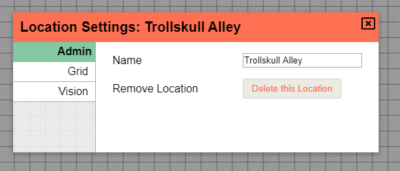

I want to start of with a big thanks! Our little community is starting to grow and it really warms my heart to see all these people joining and sharing their experiences.
In these times having something to do with your friends like dungeons and dragons is important and thus I hope that PlanarAlly can bring joy to some of you out there.

In this release we've got some improvements to asset management, an overhaul of the location bar, improved UI/UX and a whole bunch of bugfixes.

The topics mentioned in this release update are listed on the left, the full changelog can be found on [github](https://github.com/Kruptein/PlanarAlly/releases/tag/0.20.0).

_I also set up a [patreon account](https://www.patreon.com/planarally), feel free to check it out :)_

## Assets

### In-game search bar

When you have a large number of assets, organising them in folders is one way to traverse your files in-game, but can still take some time.
We now have a search bar at the top of the in-game asset list! It's a very simple search implementation, so no fancy regexes for now, but it already eased my prep work immensely.

<video autoplay loop muted style="max-width: 750px;">
   <source src="/assets/0.20.0/search.webm" type="video/webm">
   <source src="/assets/0.20.0/search.mp4" type="video/mp4">
</video>

### Upload progress information

Uploading images in the asset manager gave no feedback on progress whatsoever. You had to wait until it completed for it to show up and there also was a bug where it wouldn't even always show up until a refresh.

Those days are over and we now have a progress bar :)

<video autoplay loop muted style="max-width: 750px;">
   <source src="/assets/0.20.0/progressbar.webm" type="video/webm">
   <source src="/assets/0.20.0/progressbar.mp4" type="video/mp4">
</video>

### Varia

When removing assets in the asset manager they will also be removed on disk if no other user is using the same file. If you want to retroactively apply this to all your existing files that are no longer used, the server owner can use [this code snippet](/assets/0.20.0/remove_old_assets.txt)

The right click context menu would not show up correctly if you scrolled in the file browser. This has now been resolved as well as the aforementioned bug were files would not show up in the explorer until a refresh.

## Locations

The location bar received a massive overhaul and now has several new features!

### Moving players

Prior to this release, if the DM clicked a location, the DM and all players would move. This is ofcourse not ideal and this has been reworked.

If you click the name of a location, you and only you will move to that location.
If you want to move your players you can choose to either drag the entire player group to another location or you can open the player element and drag an individual player to another location.

<video autoplay loop muted style="max-width: 750px;">
   <source src="/assets/0.20.0/location-move.webm" type="video/webm">
   <source src="/assets/0.20.0/location-move.mp4" type="video/mp4">
</video>

### Reordering locations

Along with the option to drag players around, you can now also drag the locations themselves around to rearrange them in any order you prefer.

<video autoplay loop muted style="max-width: 750px;">
   <source src="/assets/0.20.0/location-rearrange.webm" type="video/webm">
   <source src="/assets/0.20.0/location-rearrange.mp4" type="video/mp4">
</video>

### Settings

An often confusing aspect of configuring locations is that their settings were partially in the DM settings for the entire session.
There were no clear signs which settings would apply to all locations or which one only applied to the active location.

This has now been reworked and the DM settings now dictate the default values for all locations. Individual locations can then override this behaviour in their own settings.
Any overriden value will be highlighted to make sure it's clear that it diverges form the default settings.

<video autoplay loop muted style="max-width: 750px;">
   <source src="/assets/0.20.0/settings.webm" type="video/webm">
   <source src="/assets/0.20.0/settings.mp4" type="video/mp4">
</video>

Additionally it is now also possible to rename or even remove a location.

## Other UI/UX improvements

The aforementioned location overhaul is an obvious big win in UI/UX improvement, but there are other places where some advances were made as well!

### Shape ownership

It was a pain in the past to add users as owners of shapes because you had to manually type the names. Additionally there were instances where you would want someone to have vision access but not general edit access.

Both those things are now a thing of the past!

The access part of the shape properties dialog has been upgraded. It now always shows a default permission line, that you can use to immediately give vision and edit access to all players.

A dropdown can be used to add permissions for a specific user and the icons allow you to finetune permissions as used in other places.

The pencil provides edit access; This entails basically everything: shape movement, editing fields in the properties etc.

The lightbulb provides vision access; It just allows the player to see what the shape can see.

### Map tool

The map tool always has been handy, but was never very clear on how it worked. This release adds some more obvious information on how to use it and also slightly changes the behaviour.

The map tool works only on a selected shape, to make this clear a tooltip will now appear and ask to select a shape. This can also be done from within the map tool, so you no longer need to swap to the select tool and then back.

In the past you had to insert your desired X/Y dimensions upfront and the resize would happen as soon as you were done selecting. This has been changed so that you can select an area and still tweak it until you're satisfied before finalizing the resize.

<video autoplay loop muted style="max-width: 750px;">
   <source src="/assets/0.20.0/maptool.webm" type="video/webm">
   <source src="/assets/0.20.0/maptool.mp4" type="video/mp4">
</video>

Another small UX improvement is that the shape will no longer be able to jump out of screen after a resize. There is always a guaranteed part of it that will always remain in the same place.

### Shape resize

Resizing a shape will no longer try to center the shape given its contraints amongst cells. Instead it will just resize the dragged corner to the nearest grid point which provides a more natural effect.

<video autoplay loop muted style="max-width: 750px;">
   <source src="/assets/0.20.0/resize.webm" type="video/webm">
   <source src="/assets/0.20.0/resize.mp4" type="video/mp4">
</video>

### Draw brush size

For the polygon and brush tool, the default size of the brush has been reduced from 1 grid unit to 1/10th of a grid unit.
In practice those tools are used mostly in the context of visibility lines and smaller lines are preferred in that case.

### Shape markers

You can now set a marker on a shape. This will add an entry to the markers submenu which can be accessed in the left sidebar.

This menu allows you to center the screen on a selected marker.

<video autoplay loop muted style="max-width: 750px;">
   <source src="/assets/0.20.0/markers.webm" type="video/webm">
   <source src="/assets/0.20.0/markers.mp4" type="video/mp4">
</video>

## New keybindings

### Retain aspect ratio

When resizing a shape you sometimes want to make sure the aspect ratio is kept. This is from now on possible by holding the ctrl key during the resize operation.

The ctrl key is also used for multi select, but the two operations have no overlap so the double use seemed appropriate.

The usual alt and shift modifiers can also be used along with this modifier.

<video autoplay loop muted style="max-width: 750px;">
   <source src="/assets/0.20.0/aspectratio.webm" type="video/webm">
   <source src="/assets/0.20.0/aspectratio.mp4" type="video/mp4">
</video>

### Center screen on token

Along with the new marker system and the ctrl+0 keybinding introduced in 0.19.0, another option is available to center your screen on important tokens.

By pressing the spacebar you will cycle through your tokens and center them on your screen. This will also move you to other floors if you happen to be somewhere else.

### Invert alt behaviour

Some people dislike the default snapping behaviour and from now on they can live happily ever after. This release adds a toggle to the client settings in the sidebar to invert the alt behaviour.

If this options is enabled, the default actions will not perform any snapping and only when the alt modifier is pressed it will attempt to snap to the grid or nearby points.

## Varia

### Additions

-   cors origin options
-   logo, version in topleft
-   tooltips to most icons
-   tiered server configuration

### Bugfixes

-   Polygon width now taken into account for hit detection
-   Floor/Layer bar now moves along with the side menu when opened
-   Side menu and locations menu no longer overlap
-   Window resizing messing with the lighting borders
-   Previous prompt values are now cleared before showing a new prompt
-   Grid layers of al lower floors being visible
-   DM being able to invite themselves to the room as a player
-   Draw tool no longer delays rendering brush helper after layer/floor change
-   Active floor is remembered upon rejoining the session
