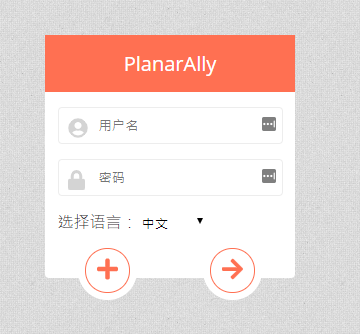
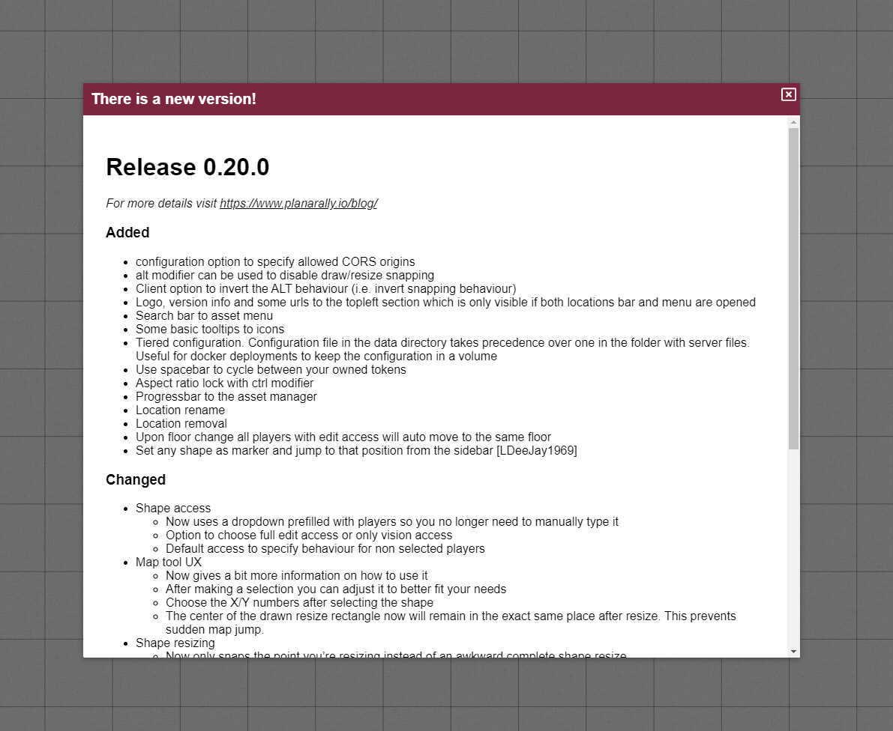

This release we've got some new shape properties, a spawn location system, translations, a bunch of quality of life changes and multiple bug fixes to round out the usual.

## Shape

Some new goodies have been added to the shape properties and there is also an improvement to collision detection during movement.

### Invisible toggle

It's now possible to mark a shape as invisible. This will cause it to be invisible for all players who do not have vision access to the shape.
Players with vision access will see the shape as normal.

This is especially handy for things like invisible familiars, but also for various light emitting objects.
The latter is interesting because the invisible toggle does not apply to the auras of these invisible shapes.
This is ideal if you want to add a lamp to a scene without having some ugly circle visible to your players from which the light emenates.

<video autoplay loop muted style="max-width: 750px;">
   <source src="/assets/0.21.0/invisible.webm" type="video/webm">
   <source src="/assets/0.21.0/invisible.mp4" type="video/mp4">
</video>

### Locked toggle

Another new toggle is the locked toggle, which when enabled prevents the token from being moved and/or resized.
This is mostly useful for the DM who wants to make sure they don't accidentally move their map or lighting boundaries.

There is also a keybinding (ctrl + L) that also works on larger selections, so you don't have to open the properties for each shape individually.

Important to note is that locked shapes won't be included in selections unless there are only locked shapes in the selected region.

<video autoplay loop muted style="max-width: 750px;">
   <source src="/assets/0.21.0/locked.webm" type="video/webm">
   <source src="/assets/0.21.0/locked.mp4" type="video/mp4">
</video>

### Movement access

In the last release the access section was extended by adding a vision only access permission for other players that should not be allowed to edit a shape but are allowed to see their private vision.

This release adds an extra access permision that allows another user to move the shape.

### Collision improvements

Hitbox collision testing with walls has always been very strict and sometimes too strict (due to small rounding errors).
This provides an unpleasant experience during play when trying to go through a small corridor or a door.

Starting this release the hitbox used to test collision is much smaller during movement, resulting in smoother gameplay.

## Spawn locations

A new concept in this release is the notion of spawn locations.
This is a DM feature that dictates where tokens will appear if they move location.

A special shape should now always appear on the DM layer that can be freely moved around (also between floors) by the DM.
When the DM moves a token to a different location it will appear centered on the aforementioned spawn shape.

Currently this is limited to just one spawn per location, but support for multiple spawns will be supported in the future.

<video autoplay loop muted style="max-width: 750px;">
   <source src="/assets/0.21.0/spawn.webm" type="video/webm">
   <source src="/assets/0.21.0/spawn.mp4" type="video/mp4">
</video>

In the above video the tokens are moved to the active location for presentation reasons, but the same concept applies to moving shapes to other locations.

## i18n

Internationalization (i18n) is added to the codebase which means that translations can now be worked on. There are already translations for Chinese and German at the time of writing.

There is a language selection element in the login screen to swap between the currently supported languages.

## Quality of Life

A number of smaller quality of life changes have been worked on this release.

### Build/Play mode

One of the most notable changes are the new 'tool modes'. The toolbar was becoming bigger and bigger with every release.
Additionally some tools are not relevant during most sessions but only during DM prep.

That's why the toolbar now is split up in 2 modes: build and play mode.
One can toggle between the two modes by clicking on the letter at the end of the toolbar or by pressing TAB.

Some tools now only appear in one of the two modes (e.g. draw in build mode and ping in play mode).

<video autoplay loop muted style="max-width: 750px;">
   <source src="/assets/0.21.0/toolmode.webm" type="video/webm">
   <source src="/assets/0.21.0/toolmode.mp4" type="video/mp4">
</video>

#### Resizing shapes

Some tools can now also have different behaviour depending on their active mode.

Starting in 0.21.0 the select tool can only resize shapes in build mode. All other functionality of the select tool will remain usable in play mode.

This change is introduced because people would often accidentally resize shapes when trying to move them and resizing a shape is something that does not occur often during play.

### Changelog

Another noticeable change is that there will now be a changelog popup to inform players that the server has updated.

### Public ruler toggle

The ruler tool now has a small options popup like the draw and map tools have.
It has only one setting and that's a toggle to decide if your ruler should be private or public.

### Initiative

When inserting your initiative while all other players are doing the same, you often had to retry because someone else was faster causing a reorder of the initiative list and resulting in you losing your input focus.

From now on, while you have an input field focussed in the initiative dialog the UI will wait with updating until you leave the input element.

### Restrict player UI

There were some places where players had access to options that should only be available to the DM.

Starting with this release players can no longer remove or add floors and can no longer move their shape to other layers/floors/locations themselves

### Varia

-   Creating a new floor will no longer automatically move everyone to that floor
-   The version shown in the topleft area in-game will now be limited to the latest release version
-   Basic tokens will now have their default name set to their label instead of 'Unknown shape'
-   Mobile device users are now unable to trigger overscroll refresh by simply moving around
-   Hovering over an image in the initiative list will now show the name of the shape

## Bugfixes

-   Polygon server creation with initial vertices list breaks session
-   Player floor location not being remembered
-   Ruler not showing decimal points
-   DM settings/grid unit size showing invalid input on firefox for floating point numbers
-   Server showing JSON decode errors
-   Players not being able to update initiative effects
-   Active layer sometimes resetting on reload
-   DMs being able to kick themselves
-   Some UI components not properly updating on shape reset
-   Area right of layer selector preventing draw/select
-   Keyboard center throwing error when no tokens are defined
-   Multiple bugs with initiative syncing
-   Three bugs with location specific options not properly loading/saving
-   Scrollbar on bottom of page in firefox when location bar does not fit the screen
-   Bug where a light source with 0/0 radii would block all lights of that shape

## Up next

Looking ahead there are a bunch of things that are on my radar to focus on.
The following list of topics might not all be selected for the next release cycle, but I wanted to already let you know some things on my mind.

##### Preparation work on metadata/export/import

There have been some discussions on the discord server about adding metadata to assets and the posibility to import/export these to other servers.
Some preparation steps have to be done before I can tackle the main problem.

##### Rotation

Rotating is something that has been missing for a while now in PA and should finally be taken care of.

##### Extend aura options

Auras could use some new features like border colours and other shapes like cone auras.

##### Floor public visibility

Floor information is currently public to all players, this should probably receive some public/visibility treatment like many of the other things in PA.

##### Improve cursor in draw tool

A custom mouse cursor is used in the draw tool to accomodate a smoother drawing experience. However, it is not always clearly visible, which is very annoying.

##### Hex grid

Support for hexagonal grids is being requested a couple of times in the past, so I should add some support for this type of grid sooner or later.

Some existing logic is based on rectangular grids, so maybe an initial version will only have render support for hexes but no snapping capabilities. To be investigated.

##### Fast load current floor

Currently when loading a location the game waits with loading until all floors are loaded.
This can be improved by first loading the active floor and then load the other floors.

##### Blurhash

Some images, especially maps, can take a longer time to load. I would like to provide a quick blurhash as a visual cue that an image is loading until the full image is available.

##### Multiple spawn locations

As noted in the release notes, the new spawn location system has no support for multiple spawns in one location.
Extending this is possible and mostly a UI problem that should be relatively simple.

##### More grouping options

There is some grouping logic when you copy-paste shapes, but there are no other capabilities.
Things like adding a token to a group, merging groups, splitting groups etc are interesting for various reasons.

Automatically applying the group initiative toggle for groups is another QoL change I intend to add.
