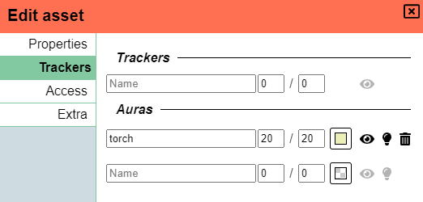

For the second release of the year, I got a maybe smaller than usual release, but it does pack some punch.

This release contains a couple of features that players will also really enjoy!

## Aura overhaul

First up and one of my personal favourite features of this release is an overhaul to auras!

Most will immediately spot the dramatic UI change the auras section got, but the trained eye will also notice 3 new features being added.

### UI changes

The UI has been changed so that only the base information is by default visible (name + enabled/disabled) and when one opens the aura they can see all the details.
Another big change is that the cryptic aura icons now have dedicated text labels to hopefully prevent any confusion.

### Enable/Disable

In the past there was no explicit way to disable an aura, you could either remove it or set its range values to 0.

Both those actions are somewhat annoying and so now there finally is a dedicated toggle that is visible at all times.

### Border

In the past the border was invisible, but it's now possible to specify a colour for the border.

This is especially nice for use with non-light source auras, where you might want to track something but don't want to have the full aura filled with colour as it might become a visual mess if there are a lot of auras going on. So now you can make the aura transparent but give it a solid black border for example.

### Cones

The last change is the ability to change the aura to not cover a full circle, but limit itself to a cone.

The angle parameter contains 2 input tools, the first a regular number field to choose the width of the angle,
the second to choose the actual direction the aura should point towards.

This is a more niche feature, that I don't expect to be used a lot, but people can use it for some hardcore vision rules, special light sources or just anything that comes to mind!

## Undo/Redo

An often requested feature, for good reasons, is the ability to undo actions.

This release adds a first version of undo and redo functionality limited to an initial set of actions.
These actions are:

-   shape movement
-   shape rotation
-   shape resize
-   floor change
-   layer change
-   shape creation/removal

This should cover some basic stuff (moving around) and also the most important thing that is annoying: accidental shape removal.
So things like specific property changes and the likes are not yet undoable, but there is a basis to work with.

ctrl+z is used to undo actions, ctrl+shift+z is used to redo actions.

Currently there is a hardcoded action memory of 50 actions.

_Why not ctrl+r to redo? This would override a common browser reload key, which I rather don't._

## Spell casting

A request I've had a couple of times is to provide some thing to allow spells to be cast or at least some tooling to see if certain enemies would be hit by a certain spell.

You'll now see a new tool appearing in the toolbar (in play mode) aptly called 'Spell' that will allow you to do just that!

Here is a small preview of what you can expect:

<video autoplay loop muted style="max-width: 680px;">
   <source src="/assets/0.25.0/spell.webm" type="video/webm">
   <source src="/assets/0.25.0/spell.mp4" type="video/mp4">
</video>

As can be seen, you have the choice to select among 3 base shapes (circle/square/cone) and can configure things like spell size and range.

The default behaviour is focused on just measuring, seeing what the impact of spells would be,
but when you left click you actually "cast" the spell and the effect will remain on the battlefield!

For more info on how the spell tool works see [the documentation](/docs/tools/spell/)

## Location archiving

When a campaign goes on for a long time, there comes a time where your location bar might fill up.
You can just live with this and scroll to the right or you can manually drag the active locations to the left.

With this release there is now the option to archive locations. This simply hides them from the bar but leaves them otherwise in tact.
Archiving is done from the location settings.

A new UI button is added to the left of the locations bar to restore archived locations to the bar.

<video autoplay loop muted style="max-width: 680px;">
   <source src="/assets/0.25.0/archive.webm" type="video/webm">
   <source src="/assets/0.25.0/archive.mp4" type="video/mp4">
</video>

## Public annotations

A smaller feature is that there is now an option to make shape annotations public.

## Notable Fixes

### (DM) Location bar

The location of players is now accurately updated live when they are moved to another location as part of a teleport to a spawn.

### Vision tool private auras

The vision tool is a nice tool to have when you control multiple characters on 1 screen.
It did however not properly take into account the public/private setting of auras and would always show all auras of the tokens you control even though you disabled one of the tokens' vision.

### New floors not working till refresh

When creating new floors, you no longer will need to refresh due to them not being triangualted properly.

### Shape name sync

When toggling shape name visibility there were some sync issues that have been straightened out.

### Vision on multiple floors

There was a bug that slipped in recently that allowed auras on one floor to also illuminate stuff on the floors below it.
