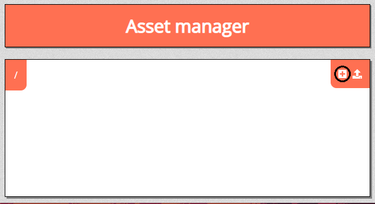
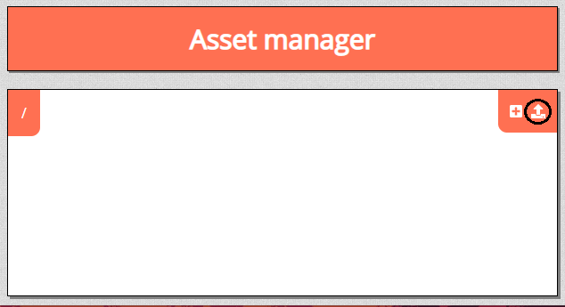
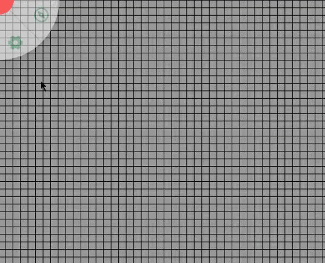

# Assets

The asset menu is used for inserting assets into your game. 
These can be maps, tokens, objects, or anything else you wish to insert. 
To access this menu, click <font-awesome :icon="['far', 'compass']"/> and click “Assets” from the dropdown menu.

## Asset Manager

If you’re just starting out, you will have no assets. 
To add them, you will need to enter the Asset Manager by clicking .

### Creating Folders

To create a folder, click the create folder icon.
A dialogue box should appear where you can write the new folder name.
With the folder created, you can place your assets into the folder for easier navigation.

### Uploading Files

To upload files, click the upload files icon.
This will open your file system.
Choose the asset you wish to upload to your campaign.
Once uploaded, your files will be accessible in-game. 

## Placing Assets

To use your assets, first open the asset tab. 
Then, open the folder where you have stored your files.
Last, drag the asset onto the game board. 
Your asset will now be able to be manipulated.

## Manipulating Assets

You can move your assets by selecting the “select” tool.
Then you can click and drag the asset.

Right clicking on your asset will give you a list of options.
These allow you to do specific things with your assets.

### Layer

Hovering over the “Layer” option in the list lets you change which layer you want your asset on.
For more information, check the [layers](/docs/dm/layers/) document.

### Move to Front & Move to Back

These options place your asset at either the front or the back of the layers.
This allows you to place multiple objects on the same layer but have them overlap in specific ways.

### Add initiative or Show initiative

This option places the asset in the initiative menu.
If already in the initiative menu, this will appear as “show initiative”.
For more information, check the [initiative](/docs/tools/intiative.md) document.

### Delete shapes

This option deletes your asset.

### Show properties

This option opens the “Edit asset” menu, described below.

### Set marker

This option sets the asset as a marker.
When an object is added as a marker, it can be accessed from the dropdown menu.
To access the Markers menu, click <font-awesome :icon="['far', 'compass']"/> and “Markers”.
In the Markers menu, you can click the object to quickly snap your view to that object.

## Edit asset

By right clicking and selecting the “Show properties” option, you open the “Edit asset” menu.
This menu includes a plethora of options.

### Is a token

Selecting this option classifies the asset as a token. 
This will help you keep track of which assets are tokens and which are other assets.

### Is invisible

Selecting this option turns the asset invisible to your players.
As the DM, you will still be able to see the asset.
This can be useful for hiding future encounters or placing enemies in stealth. 

### Is locked

Selecting this option locks the object in place.
This can be useful for maps you don’t want to accidently move while playing.

### Show badge

Selecting this option displays a badge at the bottom right of the object.

### Blocks vision/light

Selecting this option blocks vision and light from passing through the object.
More information about lighting can be found in the [lighting and vision](/docs/dm/light-shadows/) document.

### Blocks movement

Selecting this option prevents other objects from moving through it.
This is useful for creating walls in your dungeon you don’t want your players to pass through.

### Border colour & Fill colour

These options control the color of the borders around and the fill color of default tokens. 

### Access

Here is listed the players who have access to the asset.
Selecting a player name and “add access” will allow them to interact with the asset.
Selecting any of the icons next to “default” gives all players access to the asset.
The pen icon allows those with access to edit the asset.
The four arrows icon allows those with access to move the asset unless locked.
The lightbulb icon allows those with access to see the asset. 

### Trackers

Trackers can track numerical values of assets, such as health to player tokens.
To use, under “name” label the value you wish to track, such as health.
Next, write the current value which the player has and the maximum value.
By clicking the eye icon, you can toggle whether this information is public to all players or strictly visible to the DM.

With these values established, when you click the asset, you will now see the values in a quick menu.
You can quickly edit these values by clicking the number and typing in the new value.

This can be used for health, gold, death saves, or any other value that you need to track. 

### Auras

Auras are visible light which emanates from an asset.
These can be any color or strength you wish.

More information about lighting can be found in the [lighting and vision](/docs/dm/light-shadows/) document.

### Labels

Labels allow the DM to categorize objects.
To start, type a category at the bottom left.
Then, type a name within that category.
This will appear above.
Under Cat. is the category, and under Name is the specific member of that category.

To assign an asset its category, click on the label in the list.
To the right is an eye icon, which makes this label public.
Beside that is the option to delete the label.

Once these categories have been defined, you can click “filter” in the bottom right corner.
This will present a menu of all categories.
Enabling one shows you all assets with that category.

### Annotation

At the bottom of the Edit asset menu is a space to write anything localized on that one asset.
