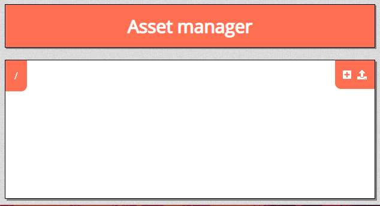

# Assets

The asset menu is used for inserting assets into your game.
These can be maps, tokens, objects, or anything else you wish to insert.
To access this menu, click the <font-awesome :icon="['fas', 'cog']"/> icon and click “Assets” from the dropdown menu.

## Asset Manager

If you’re just starting out, you will have no assets.
To add them, you will need to enter the Asset Manager by clicking .

### Creating Folders

To create a folder, click the create folder icon.
A dialogue box should appear where you can write the new folder name.
With the folder created, you can place your assets into the folder for easier navigation.

### Uploading Files

To upload files, click the upload files icon.
This will open your file system.
Choose the asset you wish to upload to your campaign.
Once uploaded, your files will be accessible in-game.

When multiple files are selected a progress bar will be visible to update you on the state.

### Downloading Files

To download files, select the asset(s) you want to download and click the download files icon.
This will open a download dialogue, providing you with a single `\*.paa` file (the extension meaning **p**lanar **a**lly **a**sset).
They will unpack into any compatible PlanarAlly instance once uploaded like any normal asset.

Downloaded assets will keep folder structure and file names of your assets as well as any information saved to a [template](#templates).

## Placing Assets

To use your assets, first open the asset tab.
Then, open the folder where you have stored your files.
Last, drag the asset onto the game board.
Your asset will now be able to be manipulated.

Alternatively, you can also search for an asset using the search bar.
This will filter out folders and subfolders that have no items matching your search query.

### Templates

At any point you can persist the state of an asset from the right click context menu.

This state includes default properties but also trackers, auras and dimensions (width and height).

When you drop an asset on the board that has templates associated with it, you'll get a prompt to choose a template instead of the base empty preset.

<video autoplay loop muted style="max-width: 680px;">
   <source src="/assets/0.23.0/templates.webm" type="video/webm">
   <source src="/assets/0.23.0/templates.mp4" type="video/mp4">
</video>

This can be very handy to reuse some tokens you frequently use to prepopulate things like HP and light sources.
This will also be key to sharing sets with other players (see [downloading files](#downloading-files) above).
