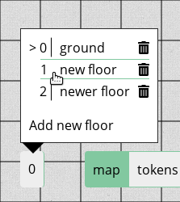

# Floors

A complete set of stacked [layers](/docs/dm/layers/) is called a *floor*.

Floors are drawn on top of each other.
Thus, on a newly created floor, the floor below it would be fully visible.
This will hold true for every portion of the game board that is not covered by anything else, be it an asset on the *map* layer, or a shape on the *tokens* layer.

Floors can be accessed by the floors button at the bottom left of the screen.
Floors are numbered (presented on the left of the opened menue) and they have names (presented on the right).
The floors button always shows the number of your active floor.

Note that currently, the floors are presented in the order they are *drawn*, not in the order they are *presented*, i.e. the layer that is *drawn first* (to the bottom of the game board) appears *at the top* of the list.
This behaviour is planned to be changed in some upcoming release.

For the sake of clarity, floors are highlighted as presented above when they are hovered.

## Creating new floors

You can create new floors by clicking on `Add new floor`.
You will be asked for the name of the floor in a pop-up.

Please note that, at the moment, you can neither re-name nor re-order the floors, so it is recommended that you plan ahead which floors you need in what order.

## Modifying floors

At the moment, you can neither re-name nor re-order floors.
However, you can of course modify how the floor is presented on the game board.
Simply make use of layers and tools as normal.

## Deleting floors

Deleting floors is as easy as clicking the <font-awesome :icon="['fas', 'trash-alt']"/> button in the opened menue.
You will need to confirm deleting the floor *as there is no way of reverting this action*!

## Floors vs. Locations
A set of floors is called a [location](/docs/dm/locations/).
An easy explanation would be that floors are stacked vertically, while locations are ordered next to each other, horizontally.

Of course, however, you can also build places that are atop/below each other in different locations.
This is recommended for places where the players will at no point be able to see what happens at a floor below them:
Not drawing floors that will not seen by anybody, anyway, will increase performance.
