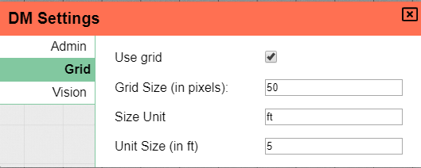
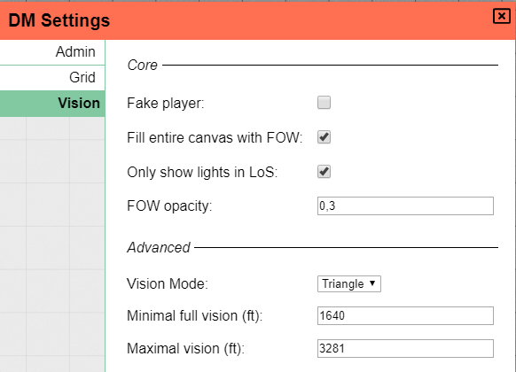

# Campaign Settings

As the DM you'll have a special dialog of options to configure various settings of the active campaign.
This dialog can be accessed from the sidebar during gameplay.

## Admin

As can be seen in the above image, the admin section provides some administrative options.

You can see a list of the players with access to the session and kick those that are no longer welcome :(.

The URL to invite someone new to the session is also displayed with a copy button to make sharing easy.
Additionally a button to change the invite code is also there, in case the code would become known to more people than you would like.

The last two buttons require special attention. The first one locks or unlocks the campaign.  When a campaign is locked, only the DM can access it.  This feature is useful if you want to edit your maps and make sure none of your players starts nosing around during your work.

The last button **permanently** removes the campaign from the PlanarAlly server. USE WITH CAUTION.

## Grid

The grid settings offer you the ability to tweak the grid settings or even disable the grid all together.
These settings are *Location-specific*!

The grid size is used to actually draw the grid on you screen, whereas the unit size is the distance one grid should represent in your game system.
The latter is for example used when you use the ruler tool to measure distances.

The size unit allows you to change the default representation of units in ft (the dnd norm) to something else.  This could be used to change everything to meters, but could also be used to have one location with a world map in kilometers.

## Vision

One of the most important settings are those for vision.  These settings require some special description and are also referenced often in the DM section on [lighting and vision](/docs/dm/light-shadows/).

### Fake Player
The first option _Fake Player_ is a DM toggle to render the board as if you were a player instead of the default DM mode.  You'll still have access to most of your DM tools, but the vision is calculated as if you were a player, so you can verify whether everything looks as it should.

As there are often multiple players you might be wondering which player is chosen.  As it turns out you can choose!  The vision tool (in the tool bar) allows you to select which of the players in the session you want to mimick.  This can be just one player, but can also be a group of players.

_Currently there is no keybinding to toggle this mode or visual cue for when you're in fake player mode.  This is one of the many things planned for a future version of PlanarAlly._

### Fill with FoW

When you play with vision you typically want to have areas on the screen that are hidden and areas that are visible.  With this option you decide what the default mode is. When toggled on everything on the screen is hidden for players by default and lights need to be added to grant vision to areas.

_FOW stands for Fog of War_

### Only LoS

This option toggles a more advanced mode of lighting whereby only things in Line of Sight (of player tokens) will be visible on screen.

By default, every location on screen with a light source will be visible, whether a player is in that location or not, with this setting active,
a player needs to see the light in order for it to show up on the screen.

See the lighting docs for more information on this topic.

### FoW Opacity

This simple setting allows you to choose what the opacity of the hidden areas is just for you. Players will always have this setting as 1.0 for themselves and can't edit this.

Do remember that in fake player mode you'll also be stuck on 1.0

### Vision Mode

_This is a technical option that I intend to remove in the next release of PlanarAlly._

Historically PlanarAlly calculated vision with bounding volume hierarchies or bvh for short.
Later on a different method was introduced based on triangulation. This was initially an optional experimantal mode you could select using this vision mode setting.

As time went on however the triangle mode became the default as it is much more potent.  The option to choose the older mode is still there for legacy reasons, but is not being maintained currently.

### Minimal/Maximal vision

These settings are additional tuning factors to the vision system and determine limits to the vision of all tokens.

Suppose there is one giant open field that stretches 5000 ft. and is completely illuminated. One could expect the entire area to be visible to your token standing in the middle of this field.  There are however limitations to the human (and to most non-human, for that matter) eye, hence the introduction of these settings.

Everything up to the minimum vision range can be seen as usual. Everything past the maximum range can not be seen and is fog of war.  Everything in between is shown in a diminishing opacity as you go further towards the edge of vision.
