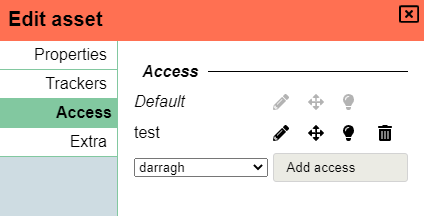

# Assets

_To bring assets on the map at this moment, you need to be a DM, see the [DM asset docs](/docs/dm/assets/)._

## Manipulating Objects

Selecting/interacting with objects is primarily done through the [select tool](/docs/tools/select/).

When the shape is selected, you may also use your arrow keys to move it.
As the DM, holding down shift lets you move shapes through movement-blocking terrain.

### Context menu

Right clicking on a shape will give you a list of options.
The options presented will be different depending on whether you are a DM or not,
but also on the state of the token (e.g. Add vs Show initiative).

The list presented above is the DM view.

#### (DM) Floor/Layer/Location

Hovering over the Floor/Layer/Location options, will open a submenu allowing you to move the selected shape to the selected option.

For more information, check the [floors](/docs/dm/floors/), [layers](/docs/dm/layers/) or [locations](/docs/dm/locations/) documents.

#### Move to Front & Move to Back

These options place your shape at either the front or the back of the active layer stack.
This allows you to place multiple objects on the same layer but have them overlap in specific ways.

#### Add initiative or Show initiative

This option places tokens in the initiative menu.
If already in the initiative menu, this will appear as “show initiative”.
For more information, check the [initiative](/docs/tools/intiative/) document.

#### Delete shapes

This option deletes the selected shape(s).
You may also press `Del` or `Backspace` to do this.

#### Set marker

This option sets the shape as a marker.
See [markers](/docs/player/markers/) for more information.

#### Show properties

This option opens the “Edit asset” menu, described below.

## Edit asset

By right clicking and selecting the “Show properties” option, you open the “Edit asset” menu.
This menu includes a plethora of options.

This dialog consists of muliple panels.

### Properties

The properties panel consists of common properties related to the shape in question.

#### Name

The name of the shape, this is an optional field that defaults to 'Unknown shape'.

The <font-awesome icon="eye"/> symbol is used to toggle whether other players without edit access are allowed to see this name.

#### Is a token

Selecting this option classifies the object as a token.
Tokens have a specific meaning, see [tokens] for more information on what this entails.

Check the [lighting and vision](/docs/dm/light-shadows/) document for more information on how lighting works in relation to tokens.

This should only be used for player controlled shapes.

#### Is invisible

Selecting this option turns the shape invisible to all players, except those with vision or edit access to the shape.
As the DM, you will still be able to see the shape.
This can be useful for having objects that are invisible but player-controlled, or invisible, but still affecting movement.

There is currently no special indicator to inform a user that their shape is invisible.

#### Border colour & Fill colour

As the names suggest, these options affect the colours of the shape.

Note that in some circumstances these colours are not used (specific shapes).

#### Blocks vision/light

Selecting this option blocks vision and light from passing through the shape.
More information about lighting can be found in the [lighting and vision](/docs/dm/light-shadows/) document.

#### Blocks movement

Selecting this option prevents other shapes from moving through it.
This is useful for creating walls in your dungeon you don’t want your players to pass through.

For the DM, you may still pass through shapes that have this option enabled.
To do this, hold down `shift` and move the shape.

#### Is locked

Selecting this option locks the shape in place.
This can be useful for maps you don’t want to accidently move while playing.
Press `Ctrl + L` to do this without opening the Edit asset menu.

#### Show badge

Selecting this option displays a badge at the bottom right of the shape.
By default, the badge number is 1.
As you copy and paste this shape, the badge number will increase incrementally.

This option is key for situations where you have large groups of repeated tokens, such as enemy encounters repeating the same enemy.
If all creatures have the same icon, it is difficult to track.
Enabling this option ensures the players and the DM do not lose track of who's who.

### Trackers

This panel is used to add trackers and auras.
These values often dynamically change throughout a game.

You can at all times see the values of both trackers and auras of a selected shape at the right hand side of the screen,
without opening the edit dialog.

Additionally you can modify these values from this quick info panel, by clicking on their value.
A small popup will appear in which you can insert a new value.
This value can be absolute, or relative by providing an input with a `+` or `-`.
For example, if the base value is 13, and you type `-5`, you will subtract 5, leaving you with 8.

#### Trackers

Trackers can be used to keep track of various states.
Common usages are for example HP, NPC attitude or arrows used.

A tracker consists of a value and optionally a name and a secondary value.
The second value can be used to denote a maximum (e.g. HP 20/40).

By clicking the <font-awesome icon="eye"/> symbol, you can toggle whether this information is public to all players or strictly visible to the DM and players with edit access.

#### Auras

Auras are similar to trackers, but have a visual impact on the board.
The 2 input values are used to delineate a circular aura on the board.
With the first value representing the bright aspect and the second value the dim aspect.

They have 2 additional fields compared to trackers: a colour box and a <font-awesome icon="lightbulb"/> icon.
The colour field can be used to give your aura some colour.

When the lightbulb is toggled on, it signals that the aura is a light/vision source.
More information about lighting can be found in the [lighting and vision](/docs/dm/light-shadows/) document.

Common examples are a torch which is a publicly visible light that shes 20/20 yellowish light and
darkvision which is a private lightsource that is typically 30/30.

### Access

Here is listed the players who have access to the shape.
Selecting a player name and “add access” will allow them to interact with the shape.
Selecting any of the icons next to “default” gives all players access to the shape.

Enabling <font-awesome icon="pencil-alt"/> allows those with access to edit the shape.
This access type automatically includes movement and vision.

Enabling <font-awesome icon="arrows-alt"/> allows those with access to move the shape unless locked.
This access type automatically includes vision.

Enabling <font-awesome icon="lightbulb"/> allows those with access to see the private auras/lights the shape has.

### Group

Groups are a way to organize shapes with an optional badge to differentiate them (e.g. ogre 5).
Within a group each shape has a unique\* value, its badge.

_\* when merging groups you have the option to retain original badge values, which could lead to duplicate badges_

Group options are configured in this UI menu. It shows the rules in place, the existing members in the active location and you're able to toggle/remove individual members or toggle the entire group at once.

Outside of this dialog, there is also a context menu when right clicking with a selection that contains multiple elements.
This context menu provides options to create/merge/split/remove groups as well.

By default when copy-pasting shapes, shapes are put in the same group.

#### Character set

By default badges consist of numbers, but other characters may be preferred,
there are 2 presets (numbers and latin characters), but a custom set of characters can be provided as a `,` separated list (e.g. `α,β,γ,δ,ε,ζ,η,θ,ι,κ,λ,μ,ν,ξ,ο,π,ρ,ς,τ,υ,φ,χ,ψ,ω`).

#### Creation order

By default when adding a new member to the group, it will receive a new number that is 1 higher than the previous highest number in the group.
This means that removed numbers are skipped (e.g. if there are 5 orcs and orc 2 dies, and a new orc is created it will receive number 6 and not 2)

Another option available is to randomize numbers.
When randomizing, a badge index will be asigned randomly between 0 and 2 times the number of members in the set (with a minimum of 10).
The available random space will thus automatically scale upwards without revealing too much for metagamers.

When changing the creation order, all existing shapes will be rebadged (after a confirmation popup).

<video autoplay loop muted style="max-width: 680px;">
   <source src="/assets/0.24.0/groups.webm" type="video/webm">
   <source src="/assets/0.24.0/groups.mp4" type="video/mp4">
</video>

#### Groups spread over multiple locations

Yes this can be the case, if a group of monsters chase the party to a different location,
they might not all arrive at the same time or even ever all move to the new location.

Although technically possible, tracking over multiple locations is a giant pain with a lot of special cases.
For this reason and the fact that actual impact seems slim, simplicity is what PA choses.
When adding a new group member in a group with multiple locations, its badge uniqueness will only be guaranteed within the set of members that share its location.
For random creation order the chance of an actual collision is very slim, for incrementing order it depends on which location has the highest value member.
Either way the impact this has is so small compared to the extra programming logic that would need to be added that it is a worhtwhile trade-off.

### Extra

This panel contains some settings that do not fit in any of the other places.

#### Labels

Labels are used to assign some context to a shape that can be used either purely for informational reasons,
or to filter on using the [filter tool](/docs/tools/filter/).

To add a label press the + and the label manager will open in which you can select an existing label or create a new label.

#### Annotation

Annotations are a freeflow place to write down information you want to track on a shape.
**This field is markdown aware!**

Additionaly, when hovering over a shape\* with an annotation, the annotation will be displayed on the top side of the screen.

_\*Only shapes you have edit access to._
