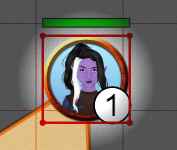

# Shapes

_To bring assets on the map you need to be a DM, see the [DM asset docs](/docs/dm/assets/)._

## Manipulating Objects

Selecting/interacting with objects is primarily done through the [select tool](/docs/tools/select/).

When the shape is selected, you may also use your arrow keys to move it.
As the DM, holding down shift lets you move shapes through movement-blocking terrain.

### Context menu

Right clicking on a shape will give you a list of options.
The options presented will be different depending on whether you are a DM or not,
but also on the state of the token (e.g. Add vs Show initiative).

The list presented above is the DM view.

#### (DM) Floor/Layer/Location

Hovering over the Floor/Layer/Location options, will open a submenu allowing you to move the selected shape to the selected option.

For more information, check the [floors](/docs/dm/floors/), [layers](/docs/dm/layers/) or [locations](/docs/dm/locations/) documents.

#### Move to Front & Move to Back

These options place your shape at either the front or the back of the active layer stack.
This allows you to place multiple objects on the same layer but have them overlap in specific ways.

#### Add initiative or Show initiative

This option places tokens in the initiative menu.
If already in the initiative menu, this will appear as “show initiative”.
For more information, check the [initiative](/docs/tools/initiative/) document.

#### Delete shapes

This option deletes the selected shape(s).
You may also press `Del` or `Backspace` to do this.

:::tip Undo/Redo
If you accidentally remove a shape, you can undo it by using the ctrl+z keybinding.
This also works for certain other operations like movement.
:::

#### Set marker

This option sets the shape as a marker.
See [markers](/docs/player/markers/) for more information.

#### Show properties

This option opens the “Edit asset” dialog, described below.

## Shape properties

By right clicking and selecting the “Show properties” option, you open the “Edit asset” dialog,
which allows you to modify various settings related to the selected shape.

:::tip Opening the shape properties faster
You can also press **enter** to immediately open this dialog!
:::

### Properties

The first section consists of common properties related to the selected shape.

#### Name

The name of the shape, this is an optional field that defaults to 'Unknown shape'.
This name will show up in some other places like the quick selection info and the [initiative](/docs/tools/initiative/) list.

The <font-awesome icon="eye"/> symbol is used to toggle whether other players without edit access are allowed to see this name.
If this is not allowed, other players will see 'Unknown shape' irregardles of whether the name was set.

#### Is a token

Selecting this option classifies the object as a token.
Tokens have a specific meaning, see [the terminology section](/docs/terminology/#tokens) for more information on what this entails.

Check the [lighting and vision](/docs/dm/light-shadows/) document for more information on how lighting works in relation to tokens.

In general you only want to enable this property for shapes controlled by players.

#### Is invisible

Selecting this option turns the shape invisible to all players without vision or edit access to the shape _(\*)_.

Example uses for this feature are invisible summons that a player controls.

There is currently no special indicator to inform a user that their shape is invisible.

_(\*) The DM will also see invisible shapes as they have implicit edit access to all shapes_

#### Is defeated

When checked, this will display a simple, red `x` over the shape to indicate it is defeated.
This property can also be toggled by pressing `x`.

#### Border colour & Fill colour

As the names suggest, these options affect the colours of the shape.

_Note that for some specific shape types only one of the two colours is used._

#### Blocks vision/light

Selecting this option blocks vision and light from passing through the shape.
More information about lighting can be found in the [lighting and vision](/docs/dm/light-shadows/) document.

Example uses are walls/doors/...

For performance reasons you typically don't want to assign this property to shapes that regularly move.

#### Blocks movement

Selecting this option prevents other shapes from moving through it.

This is commonly paired together with blocks vision for walls, but can also be used alone for things like windows.

:::tip DM cheats
As a DM you can circumvent this restraint by using the **shift** modifier will you move shapes.
:::

For performance reasons you typically don't want to assign this property to shapes that regularly move.

#### Is locked

Selecting this option locks the shape in place.
This can be useful for static shapes you don’t want to accidently move while playing.
Especially useful for your maps which might otherwise take you some time to grid align again.

Press `Ctrl + L` to do this without opening the Edit asset menu.

#### Show badge

Selecting this option displays a badge at the bottom right of the shape.
By default, the badge number is 1.
As you copy and paste this shape, the badge number will increase incrementally.

This option is key for situations where you have large groups of similar tokens.
If all creatures have the same icon, it can be difficult to differentiate between them during combat.
Enabling this option ensures the players and the DM are talking about the same shapes.

You can configure the details of how the badge values are generated in the Group section.

### Trackers & Auras

:::tip Quick info

If you just want to see the value of a certain tracker or aura quickly you don't have to open the shape properties.
You can see the values of both trackers and auras at all times from the quick selection info in the top right of the screen if the shape is selected.

Additionally you can modify these values from this panel, by clicking on their value.
A small popup will appear in which you can insert a new value.
This value can be absolute, or relative by providing an input with a `+` or `-`.
For example, if the base value is 13, and you type `-5`, you will subtract 5, leaving you with 8.
:::

#### Trackers

Trackers can be used to keep track of various states.
Common usages are for example HP, NPC attitude or arrows/ammunition usage.

A tracker consists of a value and optionally a name and a secondary value.
The second value can be used to denote a maximum (e.g. HP 20/40).

Trackers are created by clicking `New Tracker` and filling in some value.

A tracker that is set to be `public` will be shown for everyone who selects the shape.
Otherwise, only players with `edit` access to the token will be able to see it.

Activating `display on token` will show a horizontal bar on top of the token.
It can be configured with two colours, the primary colour showing the first value to the left of the bar, the secondary showing the second value to the right of the bar.
The bar follows the `public` setting to determine its visibility.

Clicking the tracker's title bar will collapse the tracker to reduce clutter.
A tracker will be removed by clicking the trash <font-awesome :icon="['fas', 'trash-alt']"/> icon on the title bar's right.

#### Auras

Auras are similar to trackers, but have a visual impact on the board.

##### Range

To draw an aura on the board you need to specify its range.
This concept consists of two values. The "normal" part and the "dim" part.

The normal value will be used to draw a circle with the provided radius at full opacity,
whereas the dim part will be used to draw an additional radius that will drop down in opacity towards the edge.

For example, In dnd 5e a torch is defined as 20ft bright and 20ft dim light, so here one would fill in 20/20 as well.

The numbers filled in are directly related to the way the DM configured the grid. This defaults to 5ft = 1 grid, so a value of 20 would translate to an aura that covers 4 squares (radius).

##### Angle

This is a niche feature that can be used when you don't want the aura to cover a full circle, but rather want a cone.

The first value dictates the width of the cone angle and defaults to 360 (i.e. a full circle).
The second value, set by dragging the knob on the circle or by changing the text field,
dictates the direction the cone should look to. For a full circle this value is ignored for obvious reasons.

The direction is relative to the rotation of the shape. So if you rotate your shape, the cone will rotate along!

##### Colour & Border

Every aura can have two distinct colours (including transparency settings).
These will be drawn on the game board if the aura is active.
The colour set for `aura` will affect the area covered by the aura.
Independently, a colour for the aura's border can be set.

:::tip Lights & Spells
Use angles and colours to indicate lights worn by the character and borders to indicate reach of spells centered on you, e.g. _detect magic_ or _invisibility purge_.
You can also use this to remind yourself of special attack reach etc.
:::

##### Public

By default any shape or aura is only visible to the DM and any player that has edit access to the shape.

Sometimes however you want to show auras to all players, that's when you make the aura public.

You would enable this setting for a torch, but disable it for darkvision for example.

##### Light source

This small toggle has a lot of impact on the aura and is something that makes the vision system in PA so nice!

By default auras will just render on the board irregardless of walls or other obstacles and won't give you vision.
This is perfect for things like paladin auras and the likes.

By toggling the 'light source' option, you signal to PA that this is no normal aura but is actually a source of light/vision.
If there are walls in the way the aura will stop at the borders and not reveal anything behind it. Additionally it will actually reveal everything in the aura to the player (and all other players if it's a public light source).

Common uses are darkvision, which is a private light source and a torch which is a public light source.

_Note: vision and lighting are typically only relevant when you use the line of sight vision system_

### Access

Player access to the shape can be configured in this section.
By default the creator of the shape has full access right to the shape as well as the DM.

You can modify the default access or set specific access rights for a player using the dropdown.

Three levels of access can be given with a higher access level immediately also granting access to the lower levels.

<font-awesome icon="pencil-alt"/> EDIT ACCESS /
<font-awesome icon="arrows-alt"/> MOVEMENT ACCESS /
<font-awesome icon="lightbulb"/> VISION ACCESS.

### Group

Groups are a way to organize shapes with an optional badge to differentiate them (e.g. ogre 5).
Within a group each shape has a unique\* value, its badge.

_\* when merging groups you have the option to retain original badge values, which could lead to duplicate badges_

Group options are configured in this UI menu. It shows the rules in place, the existing members in the active location and you're able to toggle/remove individual members or toggle the entire group at once.

Outside of this dialog, there is also a context menu when right clicking with a selection that contains multiple elements.
This context menu provides options to create/merge/split/remove groups as well.

By default when copy-pasting shapes, shapes are put in the same group.

#### Character set

By default badges consist of numbers, but other characters may be preferred,
there are 2 presets (numbers and latin characters), but a custom set of characters can be provided as a `,` separated list (e.g. `α,β,γ,δ,ε,ζ,η,θ,ι,κ,λ,μ,ν,ξ,ο,π,ρ,ς,τ,υ,φ,χ,ψ,ω`).

#### Creation order

By default when adding a new member to the group, it will receive a new number that is 1 higher than the previous highest number in the group.
This means that removed numbers are skipped (e.g. if there are 5 orcs and orc 2 dies, and a new orc is created it will receive number 6 and not 2)

Another option available is to randomize numbers.
When randomizing, a badge index will be asigned randomly between 0 and 2 times the number of members in the set (with a minimum of 10).
The available random space will thus automatically scale upwards without revealing too much for metagamers.

When changing the creation order, all existing shapes will be rebadged (after a confirmation popup).

<video autoplay loop muted style="max-width: 680px;">
   <source src="/assets/0.24.0/groups.webm" type="video/webm">
   <source src="/assets/0.24.0/groups.mp4" type="video/mp4">
</video>

#### Groups spread over multiple locations

Yes this can be the case, if a group of monsters chase the party to a different location,
they might not all arrive at the same time or even ever all move to the new location.

Although technically possible, tracking over multiple locations is a giant pain with a lot of special cases.
For this reason and the fact that actual impact seems slim, simplicity is what PA choses.
When adding a new group member in a group with multiple locations, its badge uniqueness will only be guaranteed within the set of members that share its location.
For random creation order the chance of an actual collision is very slim, for incrementing order it depends on which location has the highest value member.
Either way the impact this has is so small compared to the extra programming logic that would need to be added that it is a worhtwhile trade-off.

### Extra

This panel contains some settings that do not fit in any of the other places.

#### Labels

Labels are used to assign some context to a shape that can be used either purely for informational reasons,
or to filter on using the [filter tool](/docs/tools/filter/).

To add a label press the + and the label manager will open in which you can select an existing label or create a new label.

#### Annotation

Annotations are a freeflow place to write down information you want to track on a shape.

:::info Markdown
The annotation is markdown aware!
:::

Annotation of shapes you have _edit_ access to, will be displayed on the top side of the screen on hover.
The annotation can be marked as public to allow everyone in the session to see it on hover.
