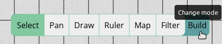

# Tools Overview

PlanarAlly provides a set of tools to interact with the Game Board and other players.
GMs are provided with some additional tools suitable for their needs.
Most, but not all, of these tools are accessible via a toolbar at the bottom right of the Game Board.

## Toolbar and Modes

Right of the toolbar, you will see a highlighted `B` or `P`.
This indicates the mode you are currently in.
Hovering over the characters will expand them into `Build` and `Play`, respectively, to tell you that you are currently either in build or in play mode.
Clicking will switch to the other mode.

Not all tools will be accessible in every mode and some tools will behave differently, depending on your current mode.

## Tools Quick Reference

| Tool                                  | Access | Mode       | Description                                             |
| ------------------------------------- | ------ | ---------- | ------------------------------------------------------- |
| [Select](/docs/tools/select/)         | All    | Both\*     | Select, move, rotate, or resize Shapes.                 |
| [Pan](/docs/tools/pan/)               | All    | Both       | Pan your viewport of the Game Board.                    |
| [Draw](/docs/tools/draw/)             | All    | Build      | Create Shapes of various basic forms.                   |
| [Ruler](/docs/tools/ruler/)           | All    | Both       | Measure Distances on the Game Board.                    |
| [Ping](/docs/tools/ping/)             | All    | Play       | Display a Beacon on the Game Board for all to see.      |
| [Zoom](/docs/tools/zoom/)             | All    | Both\*\*   | Zoom in/out a portion of the Game Board.                |
| [Initiative](/docs/tools/initiative/) | All    | Both\*\*   | Track initiative order and timed effects.               |
| [Map](/docs/tools/map/)               | DM     | Build      | Helps to resize assets (mostly maps) to match the grid. |
| [Filter](/docs/tools/filter/)         | DM     | Both\*\*\* | Highlight Shapes by their labels.                       |
| [Vision](/docs/tools/vision/)         | DM     | Play\*\*\* | See what players are able to see.                       |
\* Functionality differs depending on the mode.  
\*\* Not part of the tools toolbar.  
\*\*\* Only visible in the toolbar, when actually usable.
