## Guide to Building Wall Masks.

This method should work for any map depending on the fidelity of it but even irregular maps like cave can be easily masked out.

# Requirements
The below instructions are for using freely available tools [GIMP](https://gimp.org) and [potrace](https://potrace.sourceforge.net/) you can of course use proprietary tools to achieve the same results but there is no guarantee it will behave the same. 

___

Below I will show 2 methods. 
* One method is for dungeons and pre-made maps
* The other method is for irregular maps and custom maps. 

# __Method One__

For this method I will pick a random map from Free Friday Maps. Which you can get [here](https://www.drivethrurpg.com/browse/pub/10213/Paths-to-Adventure/subcategory/25973_33572/Free-Map-Friday) but any map will do so long as it has a few key characteristics. 
* It has a black and white version and 
* it has a no-grid option. 
  
  These are not essential but it just makes making the mask a little less time consuming.  

So this is the map I will start with.

It comes in a few types include Lineart. Which is what we will use. 

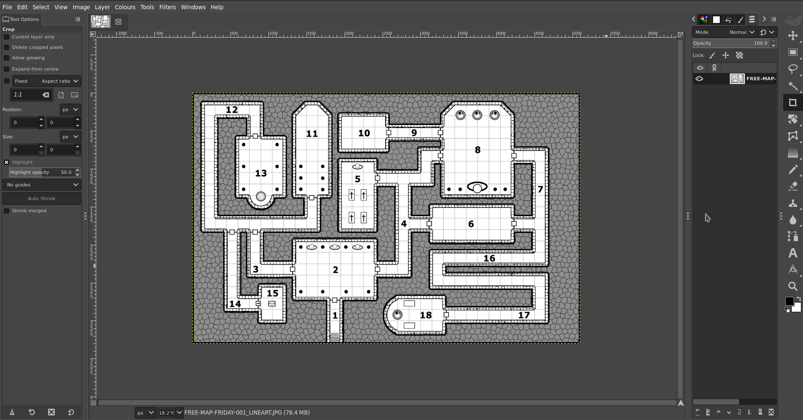

For this I will use GIMP which is free and multiplatform. 

# Removing the background

In this map is has some irregular hashing around the map for a background. Fortunately though it is a different colour a sort of grey. So selecting the `Fuzzy select/Colour Select` tool, choose `Colour Select` select one of the grey areas of the background and you should see all the grey become highlighted. 

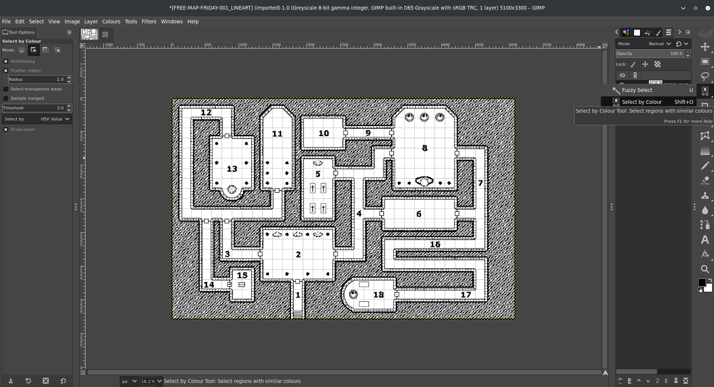

This is good but because the lines between them are not selected if were were to delete them now it would just leave the black crazy paving look.

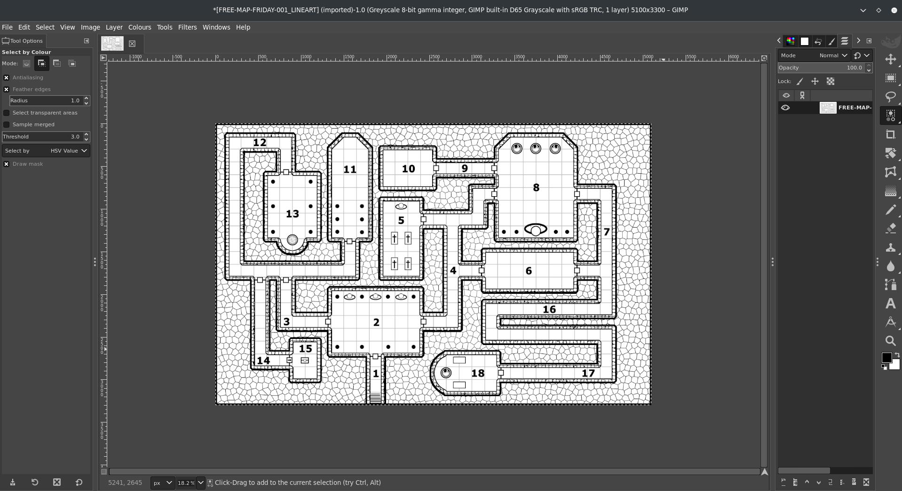

 So while everything is selected right click on the image got to `Select` `>` `Grow...`

Grow the selection a few pixels until it covers the lines between the grey spots. Once you are satisfied you have caught it all, press `Delete` and *POOF* the background disappears. 

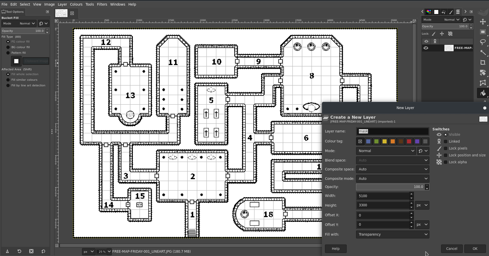

Now go back to the `Fuzzy Select` and this time choose `Fuzzy Select`. Click on the now whit background and see everything is selected. 

* *Note if you have enclosed spaces, like this map does, you need to hole the shift key and click in it to add that to the selection.*

Now in the `Layers` panel `Add New Layer to Image` Name this layer `mask`. 

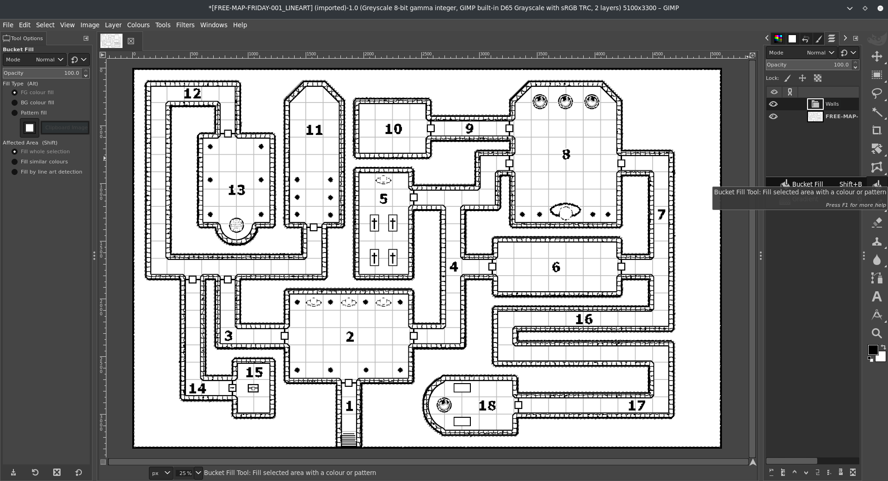

On that layer select the `Bucket Fill` tool. Click on the selection of the background you did earlier and it should fill it all black. Hide the line art layer and check you have a complete mask wth no missing bits. 

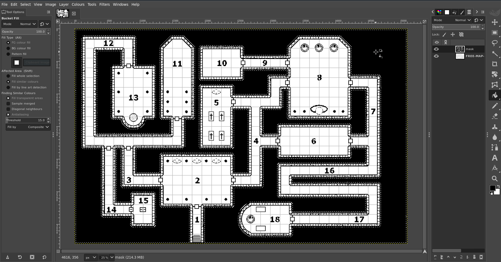

If you did miss something, don't panic, just press `Cntrl-Z` to undo and go back to selecting the parts you missed before. 

Depending on the map and how you selected the background some doors might also be painted. You will have to do is with the Erase tool and whatever shaped brush fits best, go over all the doors and secret doors and remove the black. If you don't do this you will make a door impassible. You can always add door tokens to any opening you have made once the map is imported and the walls added. 

Now you are happy with your mask you can delete the line art layer. 

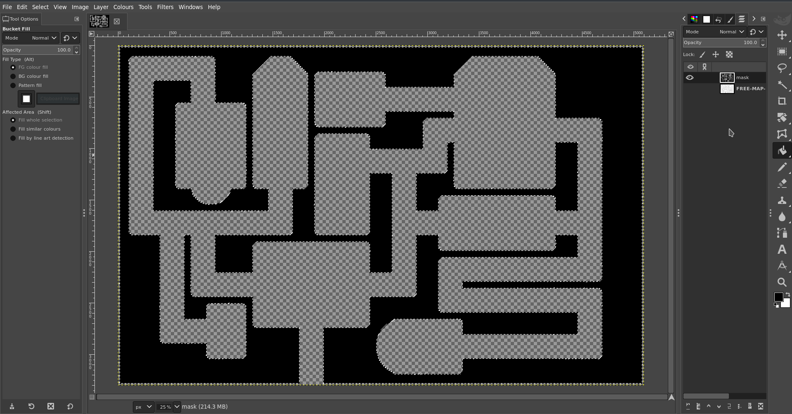

The next part is **vital** if you want to convert it properly to SVG, which is what PlanarAlly uses for walls.

Right click on the image and go `Image` `>` `Mode` , if you imported the Line art like I did it would have been greyscale. Sometime you will need to convert an colour map to greyscale to make it easier to delete backgrounds etc. But now the mode must be RGB. Change the image to that. Then right click on the image go `File` `>` `Export As...`  and save the image as a `BMP`  Turn OFF `Run Length Encoding` Turn OFF `Do not write colour space information` and make sure under `Advanced` you are `32 Bits`

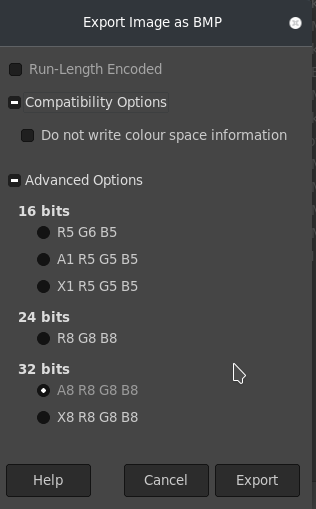

Once that is saved you can either use the command line `potrace` or you can do it online for free from [this website](https://svg-converter.com/potrace)

The command to do it  yourself is extremely simple. 

`potrace -s FREE-MAP-FRIDAY-001_LINEART_WALLS.bmp`

This should give you an `svg` that if you open up in graphic program or your  browser should be black, where the light will be blocked and clear where the light can shine.

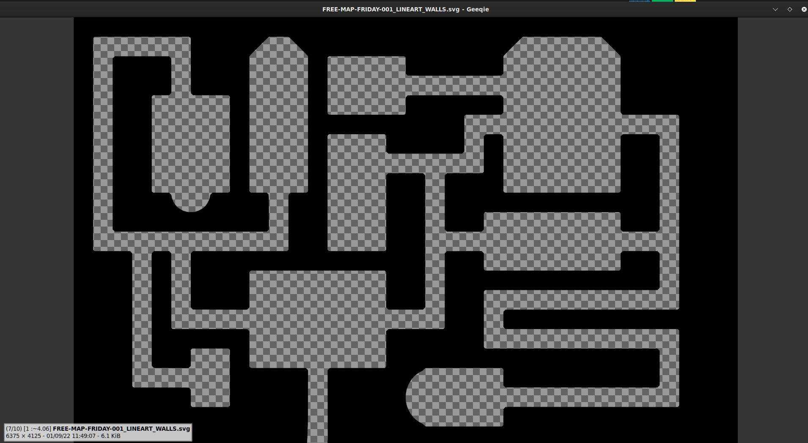

#__METHOD Two__

Say you have an irregular map or the background is not so easy to remove. Well you can still hand make a mask just using normal tools.

https://www.reddit.com/r/FantasyMaps/comments/hrf51h/battlemap30x202160x1440pxcavejunglepirateoc/

Import the map into gimp.

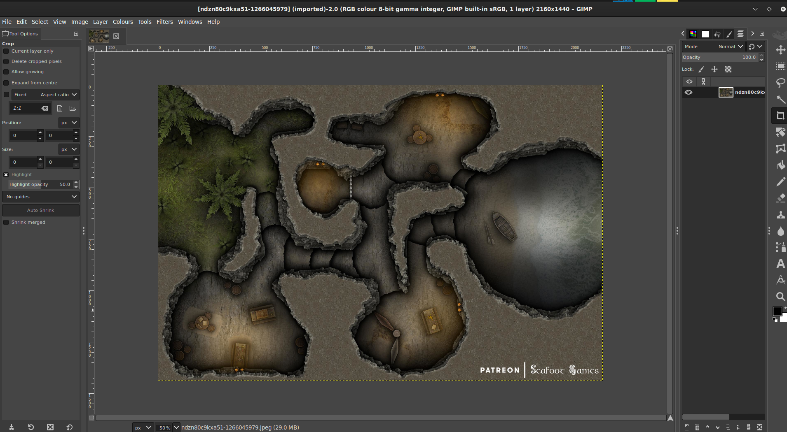

Create a new layer, call it `guide`.

With the `Pencil tool` select a `Circle` as a brush and make it black. Resize as needed. Making sure you selected the `guide` layer, start drawing on the coloured portions of the map **within** the walls.

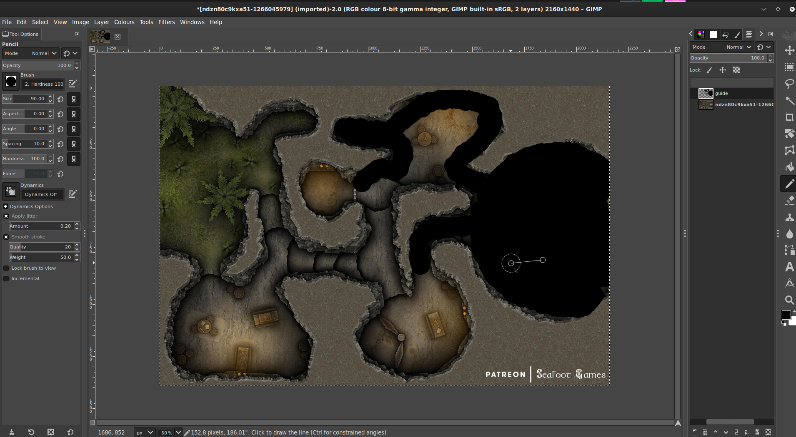

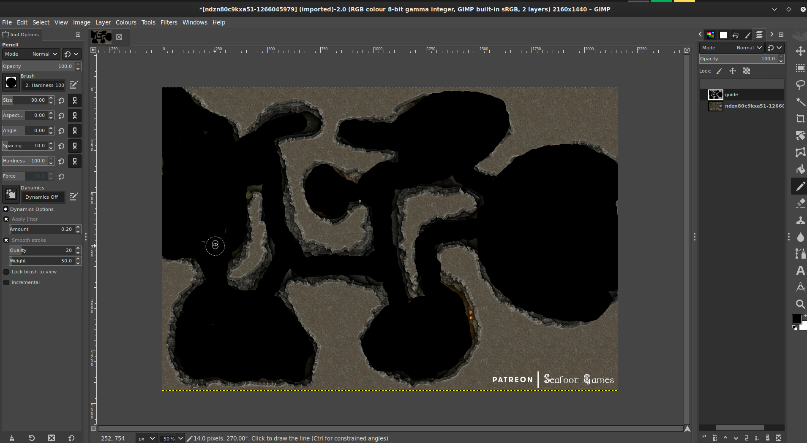
Once you are happy you have all the shape filled in crete another layer called `walls.` 

On the `guide` layer use the `Select by colour` tool and click on the black guide you have made. Then invert the selection.

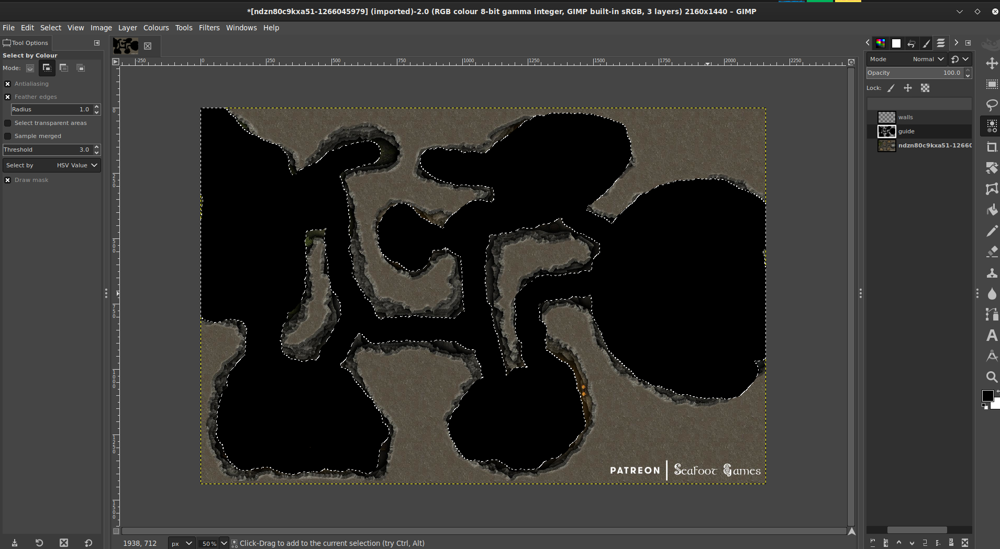

Then on the `walls` layer use the bucket fill tool to fill in the inverted selection with black and fill out the walls.

Once that it done and you are happy you have not missed any where, save it as BMP as above and convert it using either method above.

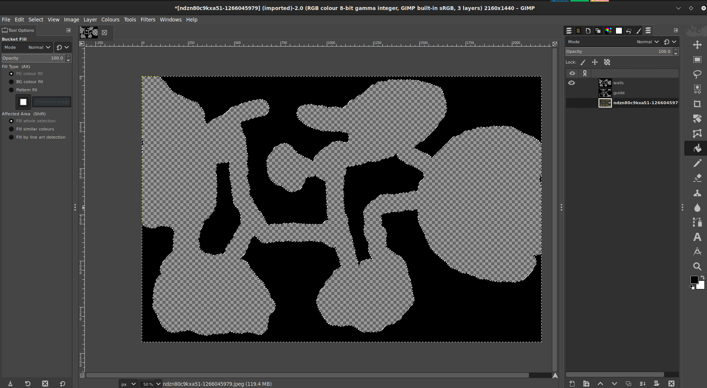

# Importing Walls into PA

Now upload this SVG to your `Assets` folder on PlanarAlly along with the Playermap and GM map if there is one. 

Drag those assets into a location which the player map being on the MAP layer. and the GM map beng on the GM layers. On the MAP layer right click on it, bring up Properties and set a `Name` and under `Advanced`  tick `Blocks Vision/Light` and `Blocks Movement`. Then go to the `Extra` tab and under `Lighting & Vision` `>` `Upload walls`. Select the SVG you just uploaded to your assets. Your walls should now be applied. 

Test it with a token that has a light source on the `Token` layer and you are nearly done. Now if there are doors or secret passages they have to be manually isolated off with door tokens or FOW, your choice. But all being well you should not have to worry about hand crafting walls again. 

Happy gaming!

