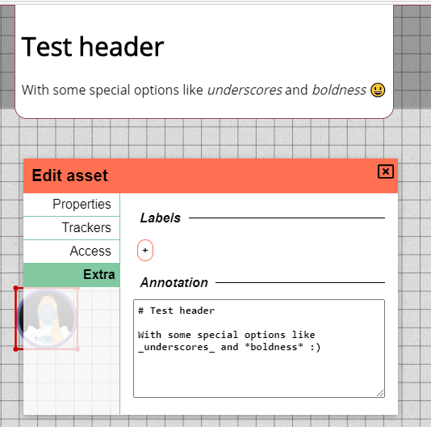

import { Image } from "astro:assets";
import LoginPicture from "../learn/_out-of-game/login.png";
import EditAssetPropertiesPicture from "../docs/dm/assets/edit-asset-properties.png";

Time for a new release! Just like other releases we have a bunch of bugfixes, but there are other exciting things to be had as well.
A rework of some UI elements, spawn location improvements, a templating system and more!

**Important for server owners** This release adds a new section to the server_config, make sure to update your server_configs by either overwriting the new config with your custom changes, or by adding the new section added to your existing config.

## Spawn location changes

This release brings two changes to the spawn location system. Multi spawn location support and a change to the initial spawn location system.

### Removal of automatic spawn creation

The first iteration of spawn locations would automatically create the spawn location for you.
In practice this didn't feel amazing. The spawn would not always be created the first time,
sometimes it showed up double, and sometimes it was just not where you expected it.
On top of that not all locations actually need a spawn.

Thus the choice was made to no longer do this automatic creation.
You'll now be able to manually create spawn locations where you want.

### Multi spawns

Along with the above change, the limit on 1 spawn location is now also removed.
When creating a spawn location you'll be prompted for a name.

When moving shapes to another location a prompt will be given where you can choose between the spawns defined for that location.
If only 1 spawn exists, the prompt will be skipped instead.

<video autoplay loop muted style="max-width: 680px;">
    <source src="/blog/release-0.23/spawn.webm" type="video/webm" />
    <source src="/blog/release-0.23/spawn.mp4" type="video/mp4" />
</video>

## Templating

Perhaps the most exciting change is the ability to save templates of assets for later reuse.
At any point you can persist the state of an asset from the right click context menu.

This state includes default properties but also trackers, auras and dimensions (width and height).

When you drop an asset on the board that has templates associated with it, you'll get a prompt to choose a template instead of the base empty preset.

<video autoplay loop muted style="max-width: 680px;">
    <source src="/blog/release-0.23/templates.webm" type="video/webm" />
    <source src="/blog/release-0.23/templates.mp4" type="video/mp4" />
</video>

This can be very handy to reuse some tokens you frequently use to prepopulate things like HP and light sources.
This will also be key to sharing sets with other players.

## UI Redesigns

### Login page

The login page has been redesigned and now has some more flair :)
Additionally the register flow is more explicit as the old behaviour was not clear to everybody.

<Image src={LoginPicture} width={800} aspectRatio={1920 / 947} alt="Login" />

### Edit dialog

The shape edit dialog was becoming quite big with every couple of releases adding something to the dialog.
This release thus adds some subsections to the edit dialog to organize things better without filling the entire screen.

<Image src={EditAssetPropertiesPicture} width={500} aspectRatio={569 / 435} alt="Edit Asset" />

## System notifications

A new addition for server owners is the option to create server messages.
These messages will be broadcasted to all current players and future visitors.
The messages will stay visible until either the player closes them or until the server owner removes them again.

The prime intended usage for these messages is to inform users about things like expected downtime.

A separate API endpoint is available to publish these messages with simple REST semantics.
There is a new section in the server_config (ApiServer) dedicated to configuring this webserver.
It's configured in the same manner as the main web server, but defaults to `localhost` instead of `0.0.0.0`
and uses 8001 is its default port.

For more info on how which endpoints are available check the [API docs](/docs/server/api/).

## Quality of Life

### ruler snapping

The ruler now also has [snapping behaviour](/docs/game/snapping/) and will try to snap to one of 9 points for a certain grid cell.
The 4 corners of a grid cell, their midsections and the absolute center are all snapping locations.

### Annotation markdown

The annotation field in the shape edit dialog now supports markdown.
The UI of displayed annotations has also received a small update.

### Server backups

Server saves will now be saved to a dedicated subdirectory.
Before this release they would be stored in the main server folder,
which could really clutter up things.

Older saves will not be touched, but feel free to move them to this new subdirectory.

## Varia fixes

-   Run docker container as non-root
-   Unlocking shape via quick menu no longer puts shape in drag mode
-   Map allowing some invalid inputs (negative numbers, 0, everything that isn't a number)
-   Note and annotation textareas not having the correct height initially
-   Console errors when attempting to move floors that you cannot access
-   Private shape names showing up as ? for users with access
-   [tech] Display error messages based on response body
