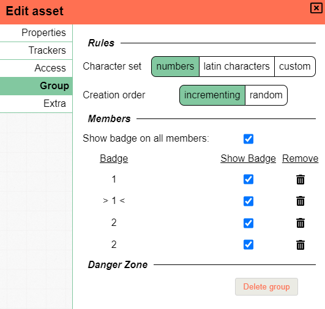
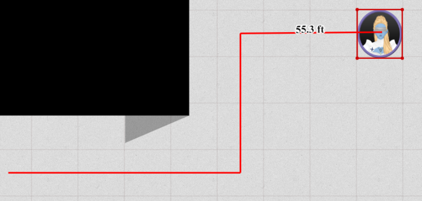

It's been a while! But I had a lot of free time in the past month so this release contains some exciting new features and a ton of bug fixes!

A small warning when opening a map on the new version:
Due to a bugfix with zoom for non-default gridsizes, you will likely encounter your first load on a map to be slightly off centered
from where you had your camera last time. This should normally not be far off from the original location.
If you have issues finding your stuff back try the space bar to center on your tokens or ctrl+0 to go to the world center.
If you still have issues contact me and I can give you some console code.

## Hexagons

An often requested thing for good reason is hexagon support.
I can now finally say that there is _some_ support.

As part of the DM grid settings you can now select the grid type, this defaults to square grids,
but can be changed to flat or pointy hexes.
This can be configured on a campaign or location level.

<video autoplay loop muted style="max-width: 680px;">
    <source src="/blog/release-0.24/hexagons.webm" type="video/webm" />
    <source src="/blog/release-0.24/hexagons.mp4" type="video/mp4" />
</video>

_It might not be extremely clear due to my low grid opacity, sorry for that_

One important thing to know is that grid snapping is not yet supported, so I highly recommend to invert your ALT behaviour for now when using hexes.

## Group improvements

Groups are a way to organize shapes with an optional badge to differentiate them (e.g. ogre 5).
Within a group each shape has a unique value, its badge.

Up until this release there was an implicit grouping concept that would apply when you copy paste a shape.

This release greatly expands the grouping system and makes it much more configurable and explicit.

A new tab in the edit asset dialog is now available to shape owners/DMs.
This tab allows the configuration of various things related to the group the selected shape belongs to.

Character sets can be configured, 2 premade sets are available, but you're free to set a custom set (e.g. `α,β,γ,δ,ε,ζ,η,θ,ι,κ,λ,μ,ν,ξ,ο,π,ρ,ς,τ,υ,φ,χ,ψ,ω`).

Badges can be toggled individually or for the entire group at once. Individual members can be removed and the entire group can also be removed.

Badges can now also be randomized to temper possible metagaming players.

<video autoplay loop muted style="max-width: 680px;">
    <source src="/blog/release-0.24/groups.webm" type="video/webm" />
    <source src="/blog/release-0.24/groups.mp4" type="video/mp4" />
</video>

Additionally there is also a new context menu option related to groups when right clicking on a selection of shapes.
This allows you to create/merge/split/delete groups as you please.

This also means that groups are no longer limited to shapes of the same asset!

For more information on the grouping system [check the docs](/docs/game/assets/#group)

## Variants

_This is **experimental**, I expect some cornercases to appear, so please do let me know if you encounter any bugs!_

A new feature for shapes is the ability to add variants. Variants are loosely defined as any other shape one might want to swap to without having to create a new token and removing a previous token.
Think wildshapes, alternate art, multistage bosses, surprise reveals ...

At any time only one variant is visible and can be swapped out for another one.
Each variant retains its own size, properties and trackers, but trackers and auras can be configured to be shared among all variants.

<video autoplay loop muted style="max-width: 680px;">
    <source src="/blog/release-0.24/variants.webm" type="video/webm" />
    <source src="/blog/release-0.24/variants.mp4" type="video/mp4" />
</video>

As can be seen in the above video, variants can be created, renamed and removed from a new UI element at the bottom of the edit shape dialog.

#### Known limitations

When creating a new variant, it won't have any of the applied settings the base variant has.
This includes access rights, general shape properties (e.g. name, is a token etc) or annotations!

At the moment you can only add new variants that are assets in your asset manager. The base shape however can be any shape.
In the future you'll also be able to select a basic token as an alternative instead of only being able to pick from the asset manager.

At this moment, saving a shape with variants to the database is not possible, this will be possible in the future when you can also save other custom shapes to the database.

## Tools

### Initiative

The initiative tool got some small changes, it received an explicit button to remove effects instead of only relying on the auto remove behaviour for negative numbers.

Additionally the round counter now starts at 1 instead of 0 and a lot of bugs related to initiative syncing have been fixed.

### Map

The map tool now has keep-aspect ratio functionality! When configuring the grid values a lock icon kan be toggled to force aspect ratio lock.

Another new thing is that you can decide to skip the resize selection, but instead directly scale the entire asset.
This can be done in # of grid cells or in pixels.

### Ruler

The ruler got a new keybinding that allows you to bend rulers.
When pressing "space" you can start a new ruler starting from the last ruler's endpoint.
The displayed distance is the total sum of all the current rulers combined.

You can now also toggle 'show ruler' on the select tool, to show a ruler when moving shapes.
This will show a ruler starting at the original shape's position and follow the shape you're actively moving.
This also supports 'space' to measure distances behind corners.

When using the ruler in select mode it will retain the privacy mode (i.e. public/private) of the ruler tool.

### Vision

The vision tool's behaviour got changed when you deselect the last shape. In the past it would immediately select everything again.
This was however very counterintuitive and annoying so this has been removed.

To make it visually clear that you are limiting your vision view to a select set of tokens,
the vision tool will now have a different background colour when not showing everything.

## Asset import/export

Last release saw the addition of templates. It is now possible to export assets from the assetstore to your local computer and upload them to another PA server or keep them around as a sort of backup.

The exported file will end with the '.paa' extension, short for planar ally assets. It will retain the exact folder structure and naming scheme that you had including all template information.

When importing a paa file it will extract everything to the current folder you're looking at.
Do take into account that files with the same name will not be overwritten, but new files and folders will always be created.

<video autoplay loop muted style="max-width: 680px;">
    <source src="/blog/release-0.24/export.webm" type="video/webm" />
    <source src="/blog/release-0.24/export.mp4" type="video/mp4" />
</video>

**Important** The above footage is sped up (or rather some frames have been cut) as the process depends on the size of the files/folders and little feedback is provided during this period currently. I hope to improve this in future releases, but it provides a working baseline for now.

## General UX improvements

### Opening the edit dialog

The edit dialog could always be opened from either the right click shape context menu or the quick selection info in the top right.

Now you can also press 'enter' on a selected shape to immediately open this window.

### Moving around

You can now use the numpad to navigate around, this also has full hexagon movement support.
Pressing 5 will center the screen on the origin.

### Create token dialog

The input field is now auto focussed and pressing enter will submit the information!

### General tools

Most tools now support the right click context menu on selected shapes without having to swap to the select tool.

There are two exceptions to this: draw and map. These have their own right click behaviour.

Additionally the filter and vision tools allow a wider set of select tool options to be used without swapping.

Finally, when changing to a tool mode that the current tool does not support, automatically change to the Select tool.

### Delete performance

When removing multiple shapes at once, especially related to vision/lighting, the client could take a big performance hit or even outright stall and only perform a partial remove.

This was due to pretty inefficient recalculation of the vision/lighting triangulation. This is now done smarter and results in **much** snappier behaviour.

## Notable fixes

### Shape selection

Two fixes were made to shape selection regarding rotated shapes:

When clicking on a rotated shape with the intent to select it, the code would select the shape if you clicked on a location that the non-rotated shape would occupy.

When making a group selection, polygons (and other shapes) would use their biggest bounding box to determine hit collision.
This is rather inaccurate and has now be changed to be exact.

## Other Changes

Some smaller technical changes that should not immediately impact endusers have also been made:

-   Upgraded to socket.io v3
-   Reduced number of calculations used for determining the minimal vision range for tokens

## Other fixes

-   Locking shapes via keyboard shortcut did not sync to the server
-   Annotations from other floors being shown
-   Remember ruler visibility on tool change
-   `Ctrl 0` now centers viewport on origin (before, it would show origin on the top-left of the viewport)
-   Initiative effects becoming NaN for non-numeric inputs
-   New initiative effects not immediately synchronizing until a full client refresh
-   Shape name updates not syncing for public names to users that do not own the shape
-   Shape name updates not always updating on the initiative list
-   Moving shapes with default movement permissions not working
-   Various bugs with initiative permission updates
-   Negative values for Auras no longer causes drawing issues
-   Trackers not providing empty rows until re-opening dialog
-   Pasting shapes resulting in extra empty tracker rows
-   Rectangle resizing causing position shift
-   Location changes sometimes not going through for everyone
-   Resizing rotating shapes with snapping now correctly snaps to grid points
-   Dropped assets not immediately rendering
-   Shapes with a broken index value (used for move to back/move to front)
-   Area in the topcenter of the screen where the mouse could sometimes not be used
-   Auras that become public are not properly configured as a vision source on other clients
-   Selection of rotated rectangles and assets
-   Groupselection of rotated shapes
-   Double entries in the vision tool
-   Most assets automatically resizing to fit 1 grid cell
    -   they now retain their original size on drop (unless using templates)
-   Incorrect state in asset manager on reconnect
-   Sorting order in asset manager
-   Asset manager shift selection acting strange when mixing files and folders
-   More cases where the ruler and ping tool could get stuck
-   Tool dialogs now move correctly when changing mode
-   Edit dialog stays open when selecting another shape
-   Floor movement not recalculting vision/movement triangulation
-   Selection including shapes out of vision
-   Adding/Removing labels no longer being synced by the server
-   Current floor no longer being highlighted in context menu
-   Multiple issues when having a modified client gridsize
    -   auras/zoom/map would all use wrong math(s)
-   Teleporting to a spawn location, only changing location not setting the position
-   Synchronization of Label visibility
-   Initiative possibly not working when changing locations
-   [DM] Floor rename always setting a blank name
