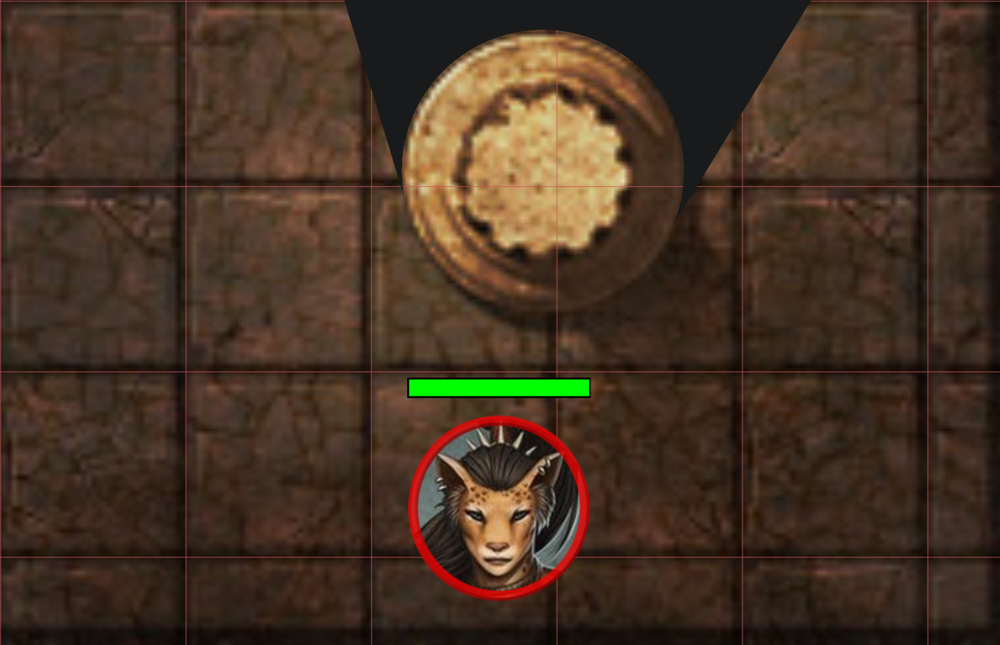

A new year, a new release!

As usual some bugs were fixed, but the two main stars of this release are an overhaul to the notes system and
the introduction of a new vision blocking mode that will improve immersion.

## A new vision blocking mode

### Why do we need an extra mode?

Up until now, vision blocking was a binary thing, either you can see through/past the object or it fully blocks vision.
This is fine for many cases, but when dealing with smaller objects (e.g. tree trunk, pillar, a rock)
this can often lead to a choice you have to make as a DM.

- Do you fully obscure the object, giving it correct vision blocking behaviour,
but ultimately lose immersion because it's not clear to the players what the random circle is that is blocking vision
- Do you make the vision blocking shape slightly smaller, to show a bit of the object, but lose correctness as a result

### The new mode

In this release a new vision blocking mode is introduced, called `behind`.
It will accompany the existing vision mode which will be renamed to `complete`.

When this mode is active, the shape marked as vision blocking will be rendered as if it's not a vision blocking shape,
but everything behind it will be fully obscured.
This will for example allow you to have a tree trunk that is vision blocking,
but still show the players what they are looking at (i.e. a tree trunk).

Another good usecase for this new mode is for doors.
By configuring it as blocking behind, you grant proper vision to the entire door object,
making it clearer to the players what they are looking at.

**Complete blocking:**

**Behind blocking:**

#### Limitations

This special mode only works for shapes that are closed.
In practice that means it works for most regular shapes (e.g. rectangle/circle),
but not for special shapes like the brush tool or text shapes.

Polygons can be either open or closed!
So if you want to use this to show an irregular shape using the polygon tool,
make sure that you've marked the polygon as closed.
(this is an option in the draw tool)

Another special case is that lights placed inside objects that have this mode enabled,
might render when your aura does not reach the shape.
This is an edgecase of the implementation, but shouldn't be too much of an issue in practice
as there isn't much reason to place lights inside vision blocking shapes.

## Notes & Annotations

PlanarAlly has 2 concepts of notes:
- loose campaign notes
  - These have a title and some freeform text
  - Are always private
  - can be kept open / dragged around
- shape notes (known as annotations)
  - These have markdown aware freeform text
  - Can be public or private
  - Limited to 1 per note
  - The rendered markdown is shown at the top of the screen when the related shape is hovered

### A collection of problems

Both of these concepts have their own problems and are inconsistent with eachother:

- for loose notes
  - there is no way to search
  - there is no way to filter (e.g. only notes relevant for the current location)
  - there is no way to share these with other users
  - it would be nice if you could pin these to the map
  - only 1 note can be open at the same time
  - there is no markdown rendering at all
- for shape notes
  - there is no way to have both private and public information
  - there is no way to have these popped out / access them without having the shape selected
  - if you need the info you wrote for a shape, you have to find the actual shape wherever it may be
  - unless it's a character, notes are lost when the shape is removed

### A unified solution

To solve these problems, a unified notes system is created.

In this new system there no longer is a difference between shape notes and campaign notes.
Notes are now a single concept, can be attached to shapes and managed through a new UI element called the Note Manager.

{/* insert image */}

### Noticeable changes

For a full overview of the new note system, check the [notes documentation](/docs/game/notes/).

#### UI changes

The note manager is a new UI element that can be opened by the <kbd>n</kbd> keybind or by clicking on the notes section in the left-side menu.
It's the core of the new note system and allows you to manage all your notes.

You can however also popout notes from the note manager (and some other locations) to keep them open while doing other things.
Multiple of these notes can be popped out at once and they can be dragged around individually.

Additionally popout notes can also be collapsed so that they only show their title.
This can be used for notes you frequently need access to in a short time span, without cluttering your screen.

#### Access

It's now possible to share notes with other users and define granular access rights for them.

This means you can give view access to all players when a certain note is retrieved or give a particualr player a private note that only they can see and edit.

#### Shapes

Notes can optionally be attached to shapes.
A single note can be attached to multiple shapes and a single shape can have multiple notes attached!

This allows you to have both public and private information attached to a shape.

Additionally there is also a new note setting that allows you to configure a note icon to appear on the shape.
This is useful to remember the presence of an important note.

The quick info section on the right side of the screen when you have a shape selected now also has info on all notes attached to the shape.
You can quickly hover over the notes to see their content, but you can also pop them out from there.

#### Global vs Local

When creating a new note, you choose whether it's a global or a local note.

What this means is that a global note is campaign agnostic and will be visible in all campaigns.
Whereas a local note, is related to the current campaign and even to the specific location it was made in.

Because global notes are available in each campaign,
this means you should take some care to not make too many of them as usually most notes are not relevant for all campaigns.

A good use case for global notes however are stat blocks. You don't want to redefine the stat block for a specific monster in every campaign.
Combined with the use of [Asset Templates](/docs/dm/assets/#templates) you can drop a goblin on the board and have it automatically have the stat block attached.

## Bug fixes

-   Polygon edit UI: was not taking rotation of shape into account
-   Teleport: shapes teleported without following would seemingly not move as the local sync was not updated
-   Dice tool: Ignore the GO button if nothing is entered
-   \[server\] log spam of "unknown" shape when temporary shapes are moved