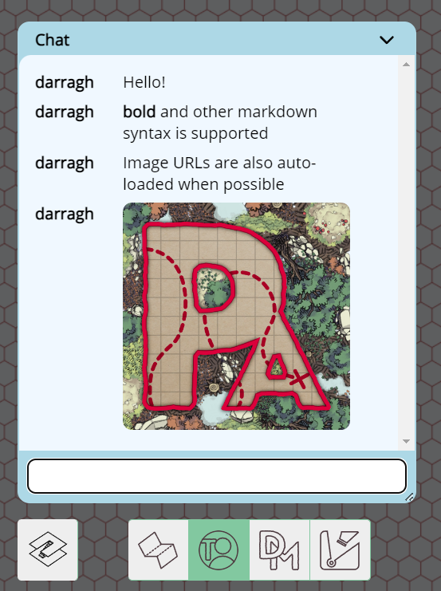
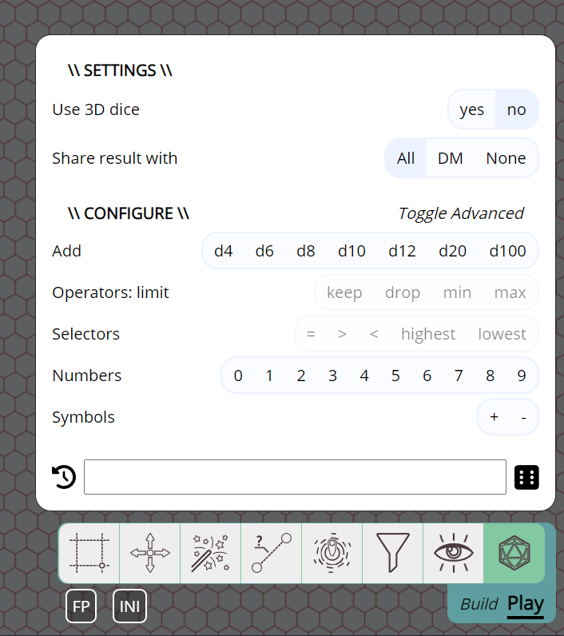
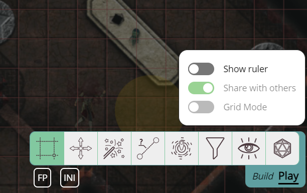
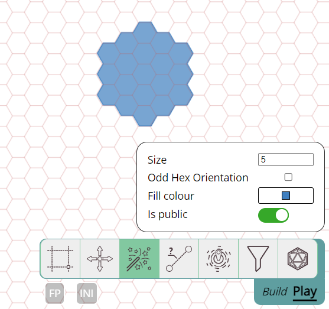

It's again been a few months since the last release, so without further ado, here is some new stuff :)

### Deprecation Notice repeat

As announced in the previous release, the label/filter system is deprecated and will be removed in the next release.

## Simple chat system

This release introduces a simple chat system that allows you to chat with other players in the campaign.

It's designed to be simple and to the point. Some formatting is available in the form of markdown, and image URLs are automatically converted to images.

It's important to note that messages sent are not stored on the server currently. So any refresh or reconnection to the session will clear the chat history.

It's not always easy for me to tell what kind of groups use PA, which is why the chat feature is relatively minimal.
If it would help your group to have a persistent chat history or some other chat features, reach out!

For more information on chat see the [docs](../../docs/game/chat), info about markdown can be found [here](../../learn/dm/Markdown_Tutorial/markdown/).

## Dice Improvements

A big chunk of this release was spent on improving various aspects of the dice rolling system.

### Dice tool UI

The dice tool UI has been revamped completely.

#### non-3D mode

In the past the only way to roll dice was by simulating them with 3D objects.
This can be fun, but is not always the best option for various reasons.

From now on there is an option to automatically resolve dice results without a 3D simulation.

#### Input improvements

The previous version had a text input and a simple click UI to select dice without typing them out (e.g. clicking 3 times on 'd6' would add 3d6 to the textbox).

This worked, but was fairly limited. The "click" UI has been expanded dramatically.

The grammar of the dice parser has also been expanded and now allows some more complex expressions like "kh2 (keep highest 2)" and the likes.

#### Result sharing

It's now possible to roll dice completely privately without the DM seeing the results either.

Users who receive roll results from another player can now click on the notification popup to see the details of the roll.

#### Result UI & history

The UI that shows the results of the die roll has changed slightly as well.

To reduce clutter, indivudal rolls in a group (e.g. 3d6) are no longer shown, but can be revealed by hovering over the group.

The roll history has also been changed slightly and whne clicking on a row in the history it will show the full result UI again.

### 3D library update

For the 3D simulation, the babylonjs game engine is used. It's been upgraded from version 4 to 7.
This change also includes a change in the physics engine used as babylonjs now uses the havok engine instead of ammo.

The 3D rolling logic has also slightly been changed, but for the most part the same behaviour should be expected.

### planarally-dice library and dice systems

Currently a lot of the dice UI revolves around the d20 system, which is common in D&D, but also some other systems.

That said, the dice library itself has been rewritten so that it can support a big variety of dice systems.
The PA UI however has no way yet to switch between systems so it's currently defaulting to the d20 system.

I'm currently thinking about how to best offer other dice systems in PA itself.
(e.g. having a "dice system" setting in your DM campaign settings, maybe even a general "rpg system" setting.)

So some more rpg-system/dice related changes might be coming in the future.

## Easier dungeon manoeuvring

It can sometimes be a hassle to move a group of tokens through a couple of tight corridors with turns due to collision with the walls.
Initially I often manually grouped them tightly together and then spread them out again once reaching some point where position became important again.
More recently I usually just moved 1 shape around and shift-moved the others to the end location just because that was less work.

Neither solution is very nice though, so this release adds a new feature that somewhat combines the two approaches in a less manual fashion.

You can now right click on a group of shapes and select "Collapse" which will move all of them to be centered on the shape you started the collapse on.
Now while just moving that one shape, all the others will follow along automatically. Once a certain position is reached you can right click and "Expand",
which will push out all the shapes in their original position in regards to the shape you started the collapse on.

There is also a keyboard shortcut, while holding the letter 'c' (for collapse) your selection will collapse, it will auto expand when either releasing the mouse button or pressing 'c' again.

<video autoplay loop muted style="max-width: min(750px, 75vw);">
    <source src="/blog/release-2024.3/collapse-drag.webm" type="video/webm" />
    <source src="/blog/release-2024.3/collapse-drag.mp4" type="video/mp4" />
</video>

 
 

## Campaign Features

A smaller addition is the ability for the DM to disable certain features.
In particular the chat and dice tools can be disabled starting in this release.

This is more of a beta feature, as I'm not yet sure how I feel about this.
These settings might be better fit as user preferences instead.

## Tools

### Toolbar UI change

A small change to the toobar UI: All tools extended UI will now be right aligned fully instead of hovering above the relevant tool.
This also means that the small arrow thingy that connected the tool UI and the toolbar is now also gone.

While working on the select tool changes (see below) it became apparent that the UI for tools further towards the center had some issues.
Either the tool could not have a big UI or it would block a big chunk of the main screen real estate.

By moving all the tool UIs to the right, they can take up more space without contesting for the center screen real estate.

### select & ruler state

When a shape is selected, the select tool UI offered an option to add a ruler to the movement of the shape.

This is pretty nice, but the settings of that ruler (e.g. is it visible to other players) were only configurable in the ruler tool.
Which meant that you often had to swap back and forth between both tools to either change or confirm the ruler settings.

Now the select tool also shows the ruler settings and allows you to change them directly.

### Hexes in the spell tool

The previous release did a big upgrade to hexagons, but did not cover all places where they might be useful.

This release sees the spell tool become aware of which grid type you're using and now offers the option to create spell effects in various hex sizes.

### Bugfixes

-   Draw tool: Clicking on the "blocks movement" label in the draw tool's vision setting now properly toggles the related checkbox
-   Ruler tool: Gridmode spacebar did not synchronize snapped end correctly to other players
