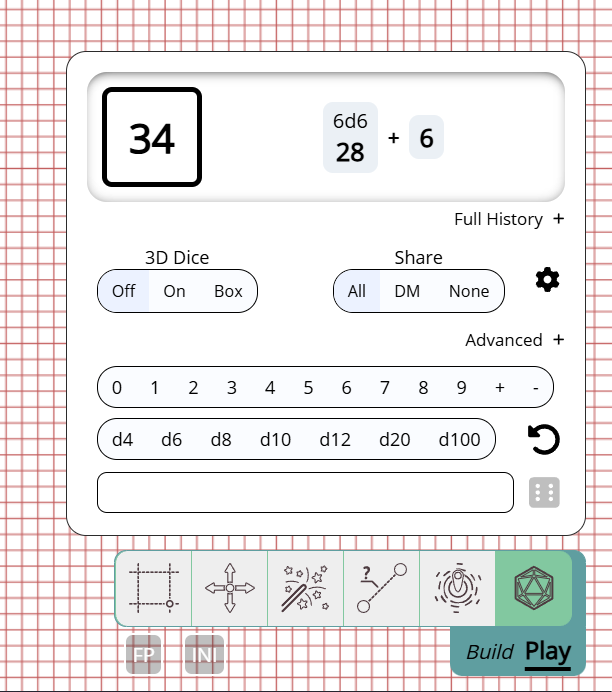
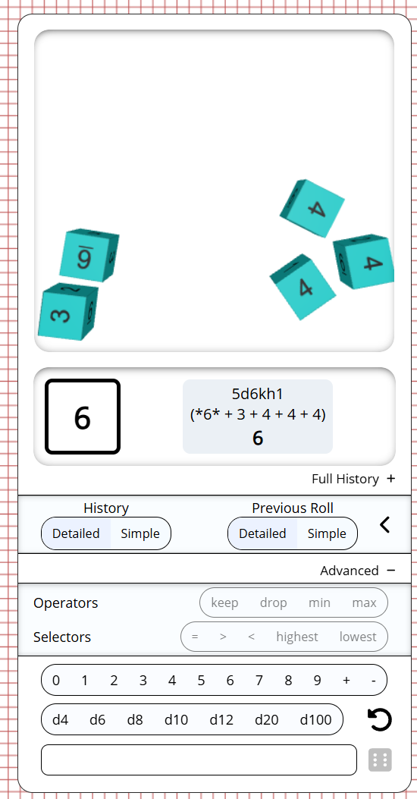
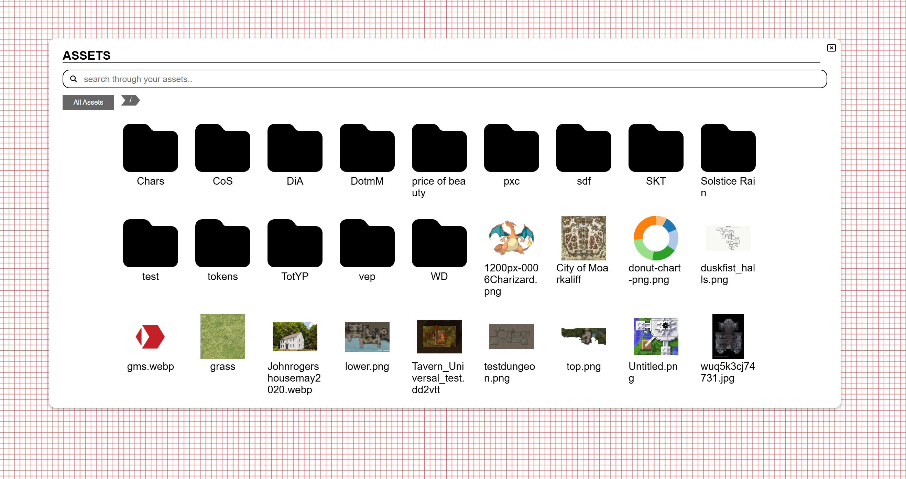

import Warning from "/src/components/directives/Warning.astro";

It's a new year and we've got some nice changes in store for you!

<Warning title="Server upgrade">
    If you're a server owner, check the changes to the assets for 2 server related changes.
</Warning>

## REMOVED

This release brings along some cleanup with 2 features being removed:

### Labels/Filters

As announced in the last 2 release notes, this set of features is now officially removed.

Labels were tags you could place on shapes and the filter tool allowed you to hide/show shapes on the screen by filtering on these tags.
I can still see some usecases for this, but the current implementation wasn't great, looked very dated and was just not used as far as I'm aware.
The fact that nobody reached out about them since putting up the deprecation notice is a sign that removing them won't hurt anybody.

### .paa files

In an older version of PA the asset manager had the option to export all your assets to a `.paa` file, which you could then import on another PA install.

Since then the asset manager got a rework which no longer offers this functionality in its UI.
It was originally my intention to bring this functionality back, but in the meantime the ability to export campaigns was added instead, which auto exports all related assets.

This covered most of the usecases of the original paa setup. Similarly to the other removal, I haven't had anybody ask about this feature no longer being available in the UI,
so it was a good time to clean things up as some of the internal asset logic has been rewritten for some changes further along in these release notes.

## Dice

### Tool UI

_contributed by rexy712_

In 2024.3 the dice tool got a shiny new UI, which was already a step up over the original UI, but rexy took it upon themselves to improve this even further.

The UI got some slick transitions and unifies the results of a roll into the UI instead of opening a separate modal, making the experience less distracting.
Additionally the dice history is better integrated and a quick redo last roll button has been added.

3D dice now also can be thrown in 2 separate modes: default and box. Default is the original behaviour where they are thrown across the entire screen,
box will open a small section on top that is like a little dice tray.

## Tweaks to 3D dice simulation

_contributed by rexy712_

Changes were made to the physical properties of the 3D dice which should result in better behaviour,
in particular the dice should stop sliding much faster now.

## D100 handling

The handling of D100 rolls was very different between the 2D mode and the 3D mode, with the 2D mode covering all values between 1-100,
whereas the 3D mode only did the tens (e.g. 10/20/30/...) and required the throw of an additional d10 to cover the units,
but no logic was present to handle what should happen is a 00 and a 0 were thrown for example.

This release improves upon all of the above. in 3D mode when throwing a d100 a d10 will automatically be thrown alongside it,
so you don't need to specify it yourself. Additionally builtin logic is present to dictate the behaviour of the 00/0 case.

The underlying dice library `@planarally/dice` can be configured to either be in 0-99 or 1-100 mode.
The current PlanarAlly interface however offers no way to configure this, so for now the 1-100 mode is always selected.

## Assets

Another set of big changes are related to assets. Some technical changes on the server as well as visual updates on the client were made!

### DM in-game UI

The asset manager is a nice way to organize your assets out-of-game, to prepare things for a session.

In-game however, the DM has a completely different view on their assets.
There is a sidebar with a tree structure, but no real interactions are possible, except for dragging a specific asset on the map.

This release changes this and removes the sidebar, replacing it with a big modal somewhat similar to the new notes UI,
but with a similar look and feel to that of the asset-manager out of game.
In fact the out-of-game and in-game asset managers now share the same code for a big chunk of their UI.

#### Search

The sidebar always had a searchbar, this is also still available in the new UI and is implemented much more efficiently,
no longer requiring all the asset info to be loaded upfront when connecting to the game.

It's behaviour is slightly different to that of the sidebar search given that the representation is completely different.
It will show all assets matching the search directly. The sidebar instead kept all folders that had a matching asset somewhere inside of them visible.

#### Shortcuts

Another new feature is the ability to mark a folder as a shortcut. Shortcuts will appear on the left side, below the permanent shortcut "All assets".
They allow you to quickly go to a particular folder that you might frequently need (e.g. main campaign folder, common dnd tokens, ...).

Shortcuts are stored per campaign.

### Smaller asset manager changes

#### Rename UI

_contributed by rexy712_

Renaming an asset used to open a popup where you had to insert the new name.
This has been made less intrusie, by instead allowing you to edit the name in place like you might be used to in your OS file explorer.

#### Context menu selection

When right clicking on an asset in the asset manager a context menu will appear.
This would always reset the selection to just the asset you right clicked on.

This is no longer the case, allowing you to properly select a bunch of files and remove them using the context menu.
Actions like "rename" are not shown when multiple assets are selected.

The selection will reset to just the clicked asset if it wasn't part of the current selection to begin with.

### Thumnbails

Assets can be uploaded in a wide variety of qualities and when shown on the map, we want them to be in the same quality.

There are however some other places where we interact with assets where the higher quality is not required and only makes things heavier.
The asset manager being the main candidate where we load a lot of images potentially at once.

Starting in this release the server will attempt to generate thumbnails for all uploaded assets and will prefer to use those when showing assets in e.g. the asset manager.
This will make the asset manager load much snappier as it doesn't have to load a bunch of higher quality images.

<Warning title="Server upgrade">
    When starting the server a background job will start to generate thumbnails for all existing assets. This will log
    some process every once in a while, but otherwise is not blocking for the main server behaviour.

    Fallback behaviour is also present in case thumnbails do not exist, so this process is less critical.

</Warning>

### Upload & Storage limits

The server owner can now configure global limits to asset limits in the server config.
Two new settings are available, one to limit the max size of a single asset and another to limit the total size of all assets a certain user has on the server.

Both of these settings default to no limit, so ensure that you modify this to whatever you want to do.

It's important to note that changes to limits only apply to newly uploaded assets.
If a user is using more space before the setting was added, none of their existing assets will be removed, but they won't be able to upload any more assets.

<Warning title="Server upgrade">
    This adds new entries to the config file, make sure you add these to your config or the server will fail to start.
</Warning>

### Save location

_this is a technical server change, you can skip this if you're a player_

The physical files associated with uploaded assets are stored on disk in a particular folder with all their names equal to the hash of the asset.
These were until now stored in 1 flat folder, but for performance reasons this release will store them instead in a subfolder structure based on the hash.
This will lower some I/O operation times as they no longer need to operate in 1 big folder.

<Warning title="Server upgrade">
    A 1 time migration will be done to move all existing files to their new location at startup.
    Depending on the amount of assets on your server this might take a while.

    It's essential that this process is not interrupted as both physical files are moved as well as data in the database that links everyting together.

</Warning>

## Notes

A last chunk of changes are related to notes. Most of these are smaller changes and bugfixes though.

### Complete popout

With the introcution of the new note UI, a note can be popped out from the note manager, resulting in a floating note modal that you can drag around within the PA screen.

This release makes it possible to pop-out this modal completely out of the page, allowing you to drag the note to another screen and continue interacting with it.
This floating dialog is still tied to the open PA page, but not bound to a particular screen location. Closing the PA tab, will result in the floating dialog to also close.

### Global note access

Default access on global notes has been removed.
This allowed users to set a note as visible (or even editable) globally among all users which is just not something we want.

### Small UI improvements

- You can now clear the notes searchbar with a button.
- The local/global switch is now a dropdown with the option to filter All notes
- The notes button in the sidebar is now also visible for players
- Note popouts for notes without write access now say "View source" instead of "Edit"

### Fixes

- Various UI bugs related to interacting with view-only access are resolved
- Pagination of notes was not resetting when altering search/filters
- Default edit access on notes was not working correctly
- Searchbar UI would overlap other UIs
- It was possible to locally edit a readonly note (these changes were always rejected by the server)

## Draw tool default colours

When drawing on the FOW layer, I tend to often swap between drawing walls, windows, doors etc.
For each of these I tend to use a particular colour so that they stand out visually immediately when I open the FOW layer.

Up until now this was a bit of a chore as you always had to change the colours when changing between the various kinds and even though the colour tool has a memory of recently used colours,
it was still a hassle.

This now changes with the addition of default colours, in your client settings you can now configure default colours for walls/windows and doors.
These will be applied by default when relevant in the draw tool.

To communicate this clearly, the colour pickers are disabled in the draw tool when a default colour would be used.
You can however still disable this behaviour and pick specific colours for a particular object by unchecking the 'use default colours' box in the draw tool's vision settings (2nd tab).

This is a small addition, but already saved me a lot of time!

## Varia

- SuikaXhq went out of their way to update a lot of the hardcoded english labels in the UI to use translation labels
- Dashboard new game button border colours were updated
- Fixed some odd handling of changes when selection changed (e.g. changing a name of a shape and clicking on another shape before leaving the name input field)
- Dragging modals now also focuses them
- Teleporting composite shapes could lead to some client side errors
- Selection tool snapping now behaves the same as draw tool snapping (i.e. Once snapped to a point, it will no longer snap to the grid on mouse up)
