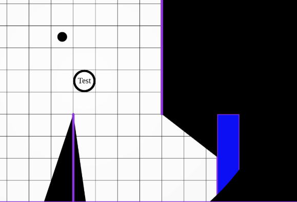

import Warning from "/src/components/directives/Warning.astro";

This is a very small release aimed at getting out some varia bug fixes, cleaning up the old server config setup and replacing the old separate admin client with a built-in admin panel.

## Admin panel move

Until this release, it was possible for the server owner to have a second special admin only webserver alongside the main planarally server.
This admin server could be used for some very simple things like listing all users, resetting passwords etc.

It was quite niche, required some technical knowledge to set up and made the server setup a bit more complicated.
With it being a separate application, it also often got ignored by me causing dependencies to be out of date and just not receiving updates in general.

So I decided to get rid of it all, and actually just add it to the main application.
A new config option "admin_user" (See [the config manual](/server/management/configuration/#field-admin_user)) is added, that can be configured to designate a specific user as the main admin.

This user will see an extra "Admin" section in their dashboard that opens the admin dashboard. It's mostly the same data as the original admin panel had, but with some small additions.

The aim is to expand on this in the future with things like:

- server config modification
- giving other users permissions to see/manage some things
- show the stats that are being collected since 2025.2

But this is for a future release ;)

## Zoom scroll improvements

When zoomed in quite far, there would be big jumps in the zoom level which is quite jarring and annoying.

The zoom experience should be much smoother now.

## Initiative fixes

Rexy did a variety of fixes to the initiative behaviour!

- Going back a turn was decrementing effect timers
- Removing an initiative entry could result in some state inconsistencies

When removing an initiative entry now, the next entry in the list will now become the active entry.

## "Behind" vision mode fixes

In [2024.1](/blog/release-2024.1) the "behind" vision blocking mode was introduced.

It was originally implemented with a sort of clever hack. It was however recently brought to my attention (by the aforementioned Rexy) that there were some cases where this would result in incorrect render results.

In the above image the blue rectangle is configured in "behind" vision block mode, but somehow a big portion of it is visible where it should not be.

The details are quite technical, but I spent a couple of days working on this and I completely rewrote the logic for the "behind" vision mode and it should now be robust (TM).

## Removal of old config setup

In the last release the config format was completely changed. It is since then stored in `data/config.toml` instead of the original `server_config.cfg`.

As the original config was checked into version control, I didn't want to surprise people when this file was suddenly removed when upgrading.
In retrospect I should have just removed it (or added a big banner to the file) as there was some confusion with those files still being present, although no longer used.

Lessons learned I suppose!

Either way, the old config files have been removed.

## Invalid server config

The server will now no longer start and report errors when unknown/wrong config data is encountered.

This is an extra measure to prevent surprises for people who think they configured something correctly, but in fact did not.

## Stats

Some small changes to the internal apis have been done, in particular the export to the main PA stat server is now done in chunks to prevent big data packets if the export hasn't happened in a while.

Also network issues for players causing rapid connects/disconnects will no longer be tracked in the stats as those could flood the data without any real value.

## Varia bugfixes

- Don't re-open shape properties after a re-select
- Last grid-line in X or Y axis sometimes not rendering
