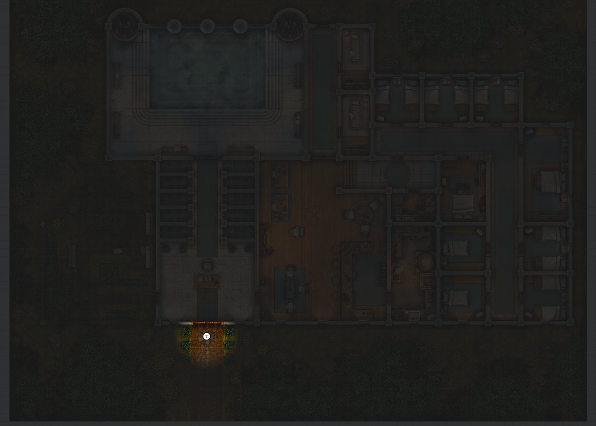
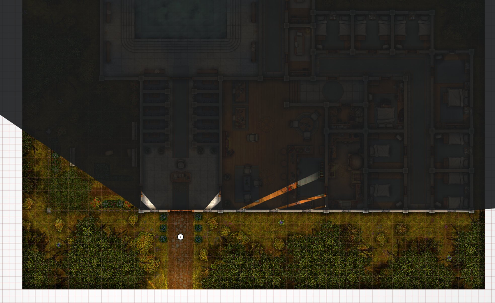
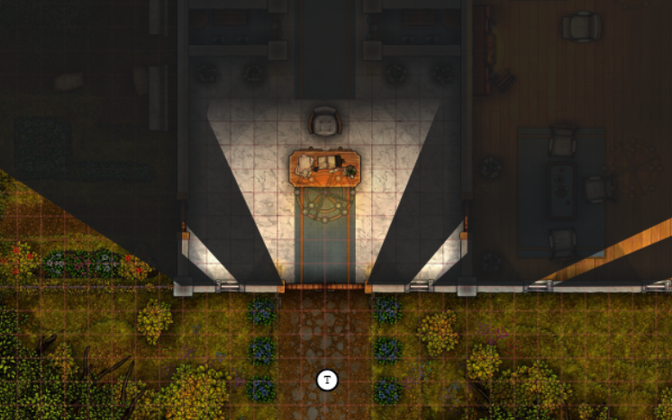
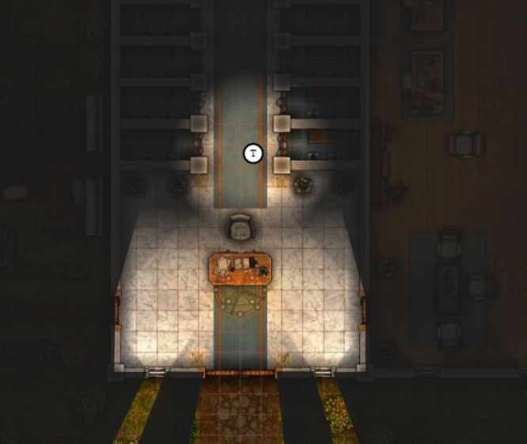
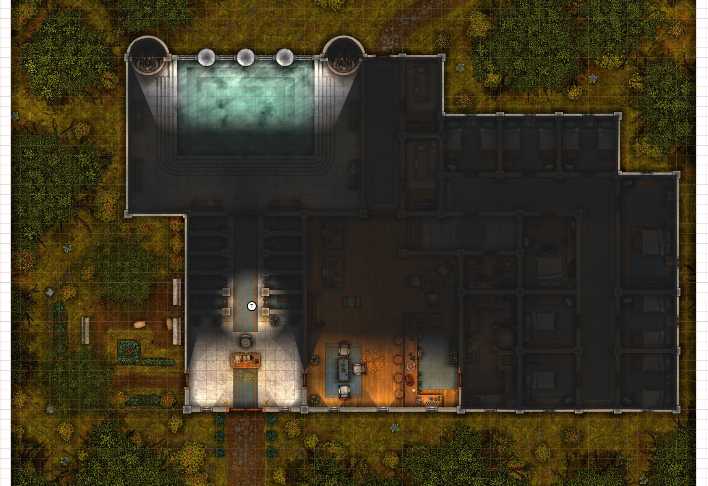
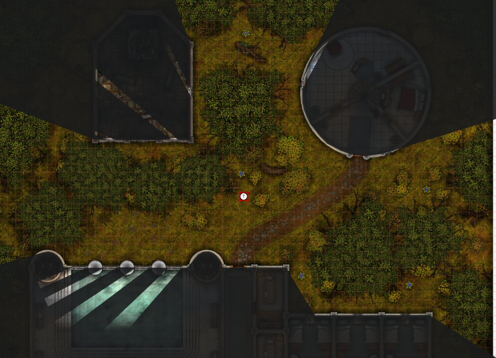
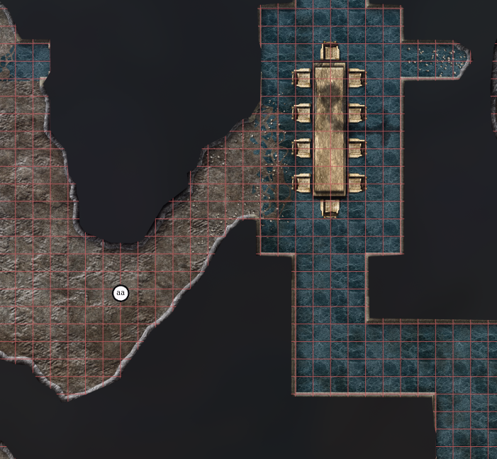
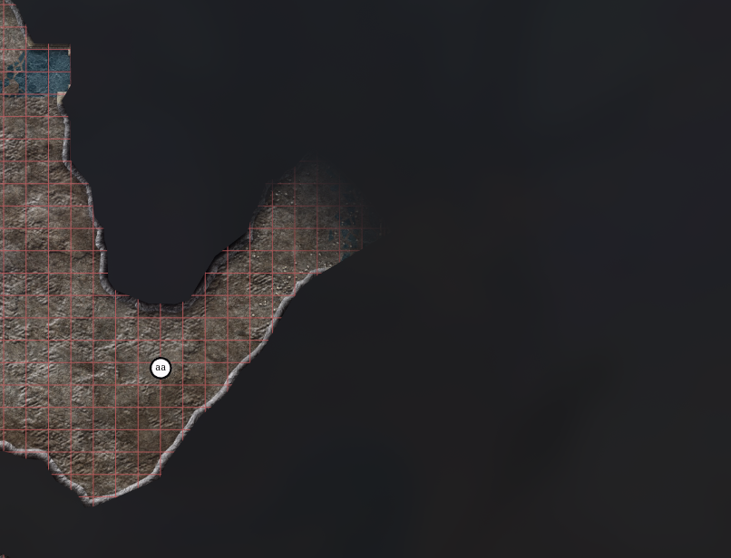
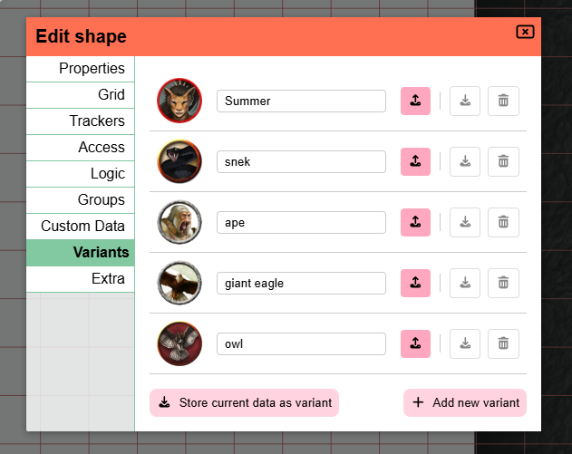

import Info from "/src/components/directives/Info.astro";
import Warning from "/src/components/directives/Warning.astro";

A long awaited introduction of outdoor lighting and a rework for the variant system are the two highlights of this otherwise mostly bugfix related release,
so let's dive in right away!

## Light changes

Light is a core foundation of a lot of games.
This release iterates on two pain points that have been missing for a long time:

- a proper answer for outdoor (and mixed indoor/outdoor) scenes
- a quicker, more intuitive way to drop lights while preparing a session

Point lights stay the core of the system.
They're not super fancy, but they tend to be pretty fast and flexible, and they remain the right default for most indoor setups.

### The outdoor conondrum

Point lights don't go around corners.
If you're in a village during the day you either sprinkle a lot of random lights around town,
or you hang a huge "sun" aura on the player characters.

Both kinda work, but also have their issues.
Manually placing them will require constant upkeep with where the players go or a lot of work in advance.
How much a player can see when they open a door will depend on where the closest outdoor light source is.

The quicker "sun" aura hack on the other hand does not require extra work while walking around town,
but falls apart once you want to enter a house or cave as it will sometimes illuminate more than you're allowed to see.
Disabling the sun aura when you open a door is tedious and also suddenly casts the outside world in darkness.

#### Ambient light

Ambient light is a flood fill.
It crawls every reachable tile and only stops at vision-blocking walls.
Pop it in a village and the streets light up; the houses stay dark (with the exception of light spilling through windows).

There are two ways to turn it on:

- a location or campaign vision setting called "ambient light"
- a manual ambient light placed with a new light tool

The setting is the daylight default.
It assumes the scene is outdoors and lights everything that can be reached from the edges of the map,
so you don't have to place a sun yourself.
The manual option is the same fill, but from a point you click.
That is useful when only part of a scene should be "outside",
for example a shaft in a cave roof.

It should also be noted that this new ambient light works with and without the line of sight setting.

<Warning>
    Ambient lights are significantly more expensive than traditional point lights. They need extra bookkeeping and extra
    work in the render pipeline. Try to keep it to one ambient light per location, especially if you know some of your
    players are on slower hardware.
</Warning>

<Info>If everything lights up, you likely have a small gap in a wall somewhere.</Info>

#### Barriers

Flooding the outdoors is only half the job.
The moment a door opens, that wall is no longer vision-blocking,
and the sun would happily crawl through the house or the entire cave system.
Usually not what we want.

Barriers mark a crossing between two areas, typically inside vs outside.
Ambient light treats them as an edge it is not allowed to crawl past.

A hard cut would look pretty jarring (you can obviously see a little way in through an open door),
so some light spills over to the unlit side to soften the transition.

Open doors and windows are registered as barriers automatically, no extra work.
For a natural cave mouth, draw a barrier with the light tool.
(You could fake that with an invisible door that is perpetually open,
but that is conceptually a bit odd, hence the dedicated feature.)

<Warning>
If a path can be traced from one side of the barrier to the other without crossing the barrier,
it will not functionally do anything as the ambient light can simply go around.

Ensure that all transition areas have a barrier!

</Warning>

### The Light tool

The other half of this work is a new DM-only build tool,
because the old "add a bunch of lights" workflow was a hassle.

You drew a random shape (circles, in my case),
made it invisible so you were not left with a circle on the map,
and only then created the aura that actually emits light.
Need more lights? Repeat, or start copy-pasting.

The light tool skips that.
Select it, configure what you want, and click to place.
It can create three things:

- a normal point light
- a manual ambient / flood light
- an ambient barrier

Lights placed this way show a lightbulb icon, but only while the light tool is open.
Switch to another tool and the aura stays; the lightbulb (or circle) does not.
They are also not selectable from the main select tool.
To move, edit, or delete them you go through the light tool's own edit UI.

### An example

I'm using [this free map](https://www.reddit.com/r/battlemaps/comments/mggn54/candlekeep_mysteries_thepriceofbeautyfreemap35x45/) to demonstrate the new features.

Traditionally I would take this map, enable FOW and LoS, start drawing walls and give some vision aura to a shape. This gets us this setup (I've turned up the DM shadows to 90% to contrast the light/dark clearly):

Turn on ambient light in the vision settings.
The outside area is now lit up everywhere we can see (because of LoS) and the only view inside the house is from light spilling in through the windows.

Open the door, and light spills into the hall.
It does not flood the whole building (because the door acts as a natural barrier!).

note that the light attached to the player is only 10/10 and thus not contributing to the indoor ilumination here!

Step inside, and the token's own light starts uncovering rooms that the outdoor light cannot reach.

Turn LoS off and the entire outside stays lit, while indoor vision from the token is kept.

The same idea works between buildings, not just around a single house.

The last case is a transition from an open sunlit area to a cave/dungeon area.

Without a barrier the fill discovers the whole tunnel complex.
Draw a barrier across the mouth and the cave stays dark, except for the short spill at the opening.

## Variant shapes

As announced in [the previous release](https://www.planarally.io/blog/release-2026.1/) the variant system is changing.

### Recap of old system

Every shape has a bottom bar in its Shape Settings UI where you can interact with Variants.

You can create a variant of the current shape here by selecting an asset and choosing a name. This creates an entirely new shape with the given asset, hiding the original shape.

From this point on you can swap between your variants, essentially hot-swapping the shapes.

Because they are completely different shapes, any action done on the shape was remembered (e.g. resizing the shape).

### Issues with the old system

To handle this hot-swapping and tracking of which shapes belong together and which one is actually currently active, a bunch of extra admin overhead was needed and this entire system is a bit brittle. These days PA has some more ergonomic APIs for hot-loading shapes during a game, but this was not available when variants were originally created.

Additionally the implementation causes a lot of overhead to common, frequently used client APIs, because variant shapes require special handling in a lot of cases. This is just not nice given the niche scope of the feature itself and also a frequent source of bugs.

A last issue is that because the variants are completely separate shapes, they also have separate state for some things you typically want to share like trackers or notes. For trackers and auras a special system was devised to share them across variants, but this is again added complexity just for variants.

### New system

While the first 2 issues could probably be solved to some degree using newer APIs/concepts we have, the third issue is more annoying to resolve using the existing concepts.

So instead I've decided to simply rework the concept from the ground up.

Variants will now just be data stored on a single shape. You can configure an icon and a name for the variant and you load the data of a particular variant, which will simply override the icon, name and size of the shape.

In the original setup resizing an asset and swapping variants would remember the size per variant. This just worked out of the box, because they were completely separate shapes.

This is no longer the case!

Variants are purely a state that you can load or create/update. They don't actively do or remember anything. This prevents any surprises or unexpected behaviour and also allows you to temporarily resize a shape due to some spell effect and just reload the variant to go back to its normal size without having to worry whether the resize was saved automatically or not.

This does also mean that the entire custom tracker/aura setup for variants is gone. The main shape just has trackers and auras like any other shape. There is no special auto switch behaviour when you load a variant. This might be something I could look into in the future, but for the first initial reboot I wanted to keep it simple. You'll just have to manually toggle some trackers/auras when needed.

## Dungeondraft

PA has traditionally supported dungeondraft files (.ddraft and .uvtt files).
These are files that contain both an image (a battle map / scene) and info on walls and lights.

This allows someone to design a scene in a tool more suited for this and then import the end result in PA.

In release 2026.1 I broke this functionality (oops) by reworking how templates are stored in the database.
Dungeondraft files were implemented as a bit of a hack and abused the original template system, hence why they no longer properly worked.

I fixed this in this release, by making the integration cleaner.
The downside is that any previously uploaded files will have to be re-uploaded for them to work properly as the files are stored in a different manner that is not recoverable from the already uploaded versions.

## Server changes

_These are changes that are only relevant to server owners_

<Warning title="Migrations">
    Last release we did some DB work by changing how templates are stored, this release we up the ante by reworking how
    asset metadata in general is stored. The details of these changes are described in the internal section later on,
    but this does mean some big migrations are required.
</Warning>

### Startup info

A small quality of life update to the PA server's startup sequence was made.

There is now a new line that mentions whether the default config is used or a specific path.
Additionally there is an extra line that refers to the config documentation if the default config is used, to help people out with configuring and avoid confusion.

Similarly a new line is added that shows the path to the main DB file.

Another line is added to list the number of users registered on the server.
When this is 0 a help message will instead be shown that informs the owner that they'll have to register a user. As PA does not create an admin user out of the box.

Lastly I removed the warning about running in a non-ssl context, as the default run mode should be behind a proxy server in which case you're very likely to run the PA server itself without https so it was just adding noise.

### Remote Asset Storage

For a variety of reasons some server owners would prefer to not host the actual user assets from the same server as the main PA server.

To accomodate this request, PA can now be configured to serve assets from an S3 compatible server (e.g. s3/r2/... ).
This allows you to offload the costs/disk-use to potentially cheaper alternatives.

This is configurable in the [server config](/server/management/configuration/#assets)

## Mod stuff

### Interest & Info

There has recently been some more interest from a variety of people in mods for PA.
I currently often have to disappoint people with the lack of resources or up to date info on what is available,
but it's promising to see that there is interest so it's one of my goals to make communication around this a bit clearer in the future.

I've added a small mod section to [the server docs](/server/management/mods/) as well as a section to the [main DM docs](/docs/dm/mods/#datablocks).
The goal is to update these with more info in the coming months.

### Updates

In the meantime github user SuikaXhq, a previous contributor to PA, has added some extra things to the server's mod API to improve certain interactions.
I'm going to leave the technical details to the PR descriptions, but you can check the info out here:

- giving mods access to modals and tool switching: [PR](https://github.com/Kruptein/PlanarAlly/pull/1830)
- Event bus and hooks system for mods to interact with PA systems: [PR](https://github.com/Kruptein/PlanarAlly/pull/1829)

## Varia fixes

- Selection: Collapse selection was not synced to other players until you started moving
- Auras: Changing a public aura created a duplicate light for players without vision access
- Initiative: Pressing enter in initiative input fields no longer sometimes opens the shape UI
- Floors: Moving shapes to another floor could be blocked and leave vision in a bad state if an aura was disabled
- Viewport: Removed the old (broken) client viewport visualization
- Notes: Filtering notes from the selection info did not update the list
- Notes: Opening notes for a shape could cancel the search depending on whether the note manager was already open
- Groups: Badges could show as 0 until a refresh if the group started on the DM layer

## Internal changes

A collection of changes made to internal logic, that is just added here for the interested reader.

### Assets

How PA stores uploaded images got a proper cleanup.

Previously every folder entry in the asset manager was also "the file".
If you had the same image in two folders, PA treated them as two unrelated things,
which made templates, sharing, and leftover-file cleanup more awkward than they needed to be.

There is now a single record for the actual file on disk,
and the folders you click through in the asset manager just point at it.
That also made it much easier to know when a file is truly unused and can be deleted,
including generated thumbnails, which we were previously leaving behind.

Along the way, file sizes are now stored in the database instead of being counted by walking the disk.
This was necessary to keep the new remote asset storage practical, and it is a bit cheaper even if you stay on local disk.

Two small visible side effects:

- spawn location markers are now stored as font icons instead of a special image link
- font-awesome icons on the map should actually render again (that had been broken since a 2025 release)

### Performance

A handful of under-the-hood speed tweaks, mostly around panning, selecting, and deciding what is in view.
Whether you notice will depend on your machine and how busy the map is.
If anything feels worse than before, let me know.
