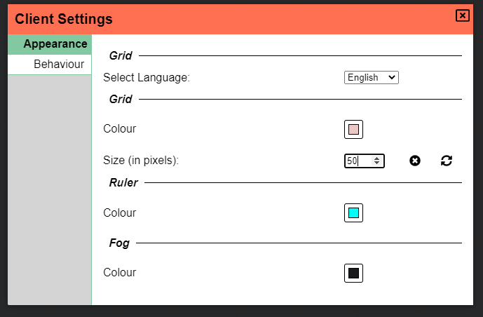

Denne udgivelse indeholder en hel del variation i typer af indhold; vi fik nogle UI-redesigns, nye værktøjsmuligheder, livskvalitetsændringer og meget mere!

Det er også værd at bemærke, at udgivelsen også indeholder bidrag fra flere bidragydere på discord-serveren; en særlig shoutout til scoodle og mischievous!

## Dashboard-redesign

Vi starter med en af de mest åbenlyse ændringer: dashboardet!
Dashboardet er den side, du ser efter at have logget ind, og hvor du vælger den kampagne, du vil spille/afvikle.

Denne side er blevet fuldstændig redesignet og ser nu sådan her ud:

### Menu

Sidebjælken til venstre fungerer som en menu, der giver dig øjeblikkelig adgang til forskellige visninger.

Den første sektion af menuen er relateret til alt spilrelateret; play viser alle de sessioner, du er en aktiv spiller i,
og run viser alle de sessioner, du er DM for. Endelig giver Create-muligheden dig mulighed for at oprette en ny kampagne.

Den anden del er relateret til alt aktivrelateret. Manage-menuen åbner aktivstyringen, en komponent, der tidligere kun var tilgængelig inde fra et spil. Create-muligheden her er endnu ikke tilgængelig, men vil blive afsløret i en fremtidig udgivelse!

Endelig har vi en handling til at åbne indstillingerne og til at logge ud.

En vigtig note: indstillingerne og styringen åbner i øjeblikket stadig i deres oprindelige komponenter, men intentionen er at redesigne dem, så de passer ind i dette nye dashboard-UI.

### Run/Play

I run- og play-tilstand dukker en anden linje op til højre, som indeholder nogle flere detaljer om den aktuelt valgte kampagne.

Bemærkelsesværdige nye tilføjelser bør være muligheden for at angive logos (kun dm), oprette små personlige noter relateret til en kampagne, se sidste gang, du spillede i den kampagne, samt handlinger til at forlade/slette kampagnen.

## Værktøjer

### Erase-etage-tilstand (DM)

En ny tilføjelse til draw-tilstandene for DM'en er 'erase'-tilstand.

Denne særlige tilstand giver dig mulighed for at gøre områder på din nuværende etage gennemsigtige, så du og spillerne kan se, hvad der sker på etagen nedenunder.

Du kan bruge dette til pludselige eksplosioner, der måske åbner et hul i etagen, eller måske glemte du simpelthen at gøre noget gennemsigtigt i forbehandlingen og vil redigere det i selve PA.

I billedet ovenfor er der 2 etager.
Den nederste etage indeholder et rektangel i en turkis farve.
Den øverste etage indeholder alle andre former.

Polygonformen, der groft ligner en tyk pil til højre, er en form, der er tegnet i erase-tilstand.
Den giver et kig ned i den nederste etage.

Denne form er en del af draw-stakken som enhver almindelig form! Som du kan se, ligger det røde rektangel oven på denne polygonform, som om der lå en træstamme hen over åbningen i etagen. Hvis du flytter polygonen til front (eller det røde objekt til baggrunden), ville kun de røde dele, der ikke er dækket af polygonen, være synlige!

En sidste vigtig detalje er, at denne form automatisk oprettes på map-etagen, når den tegnes. Der er dog intet, der forhindrer dig i at flytte den til en anden etage.

### Tekstformer

En ret ligetil ny tilføjelse til draw-værktøjet, tilgængelig for alle, er muligheden for at 'tegne' tekst.

Denne første version er relativt enkel; den giver en tekstprompt, når du venstreklikker med denne form valgt.
Formen kan roteres/ændres i størrelse som andre former.

Forvent yderligere forbedringer i fremtiden.

### Ændringer af Ping- og Ruler-størrelse

De pings og rulers, du tegnede, var altid ensartede i størrelse.
Men når andre spillere tegner dem, blev deres størrelse påvirket af det zoomniveau, de var på, og ikke det, du var på.
Dette kunne potentielt resultere i, at nogle rulers fremstod meget tykke eller meget tynde på din skærm, eller pings, der er svære at få øje på.

Denne udgivelse ændrer reglerne for disse former, og de vil altid blive tegnet i præcis samme størrelse. Zoomniveauet for dig eller den person, der tegner, er ikke længere relevant for denne beslutning.

### Opdatering af Spell-kegleikon

En lille QoL-opdatering er, at spell-kegleikonet nu er en udfyldt kegle.
Tak til min ven Jiri.

## Indstillinger

### Redesign af klientindstillinger

Dashboardet var ikke det eneste UI, der fik en opdatering; klientindstillingerne fik også et nyt lag maling!

I stedet for at være en del af sidemenuen åbner klientindstillingerne nu i en modal, ligesom DM-indstillingerne gør.
Dette giver mere luft og også mere spillerum for flere muligheder.

Som en del af dette redesign er der nu også et koncept med kampagnespecifikke klientindstillinger.
Når du ændrer en indstilling, vil du bemærke to ikoner, der dukker op ved siden af den, hvilket indikerer, at indstillingen afviger fra standardindstillingerne.

Det venstre ikon nulstiller værdien til den globale indstilling, mens det højre ikon gør denne nye værdi til den nye globale standard.

I en senere udgivelse vil de globale indstillinger også kunne redigeres fra dashboard-indstillingsvisningen.

### Deaktivér scroll-til-zoom

En ofte hørt klage fra spillere, der bruger touchpads, er en mulighed for at deaktivere, at zoom-værktøjet aktiveres ved scroll,
da dette meget nemt kan ske ved et uheld, når man bruger en touchpad.

Denne nye mulighed er nu tilgængelig i klientindstillingerne under adfærd!

### Co-dm-mulighed (DM)

Som DM kan du nu forfremme spillere til co-dm-rollen inde fra dine primære DM-indstillinger.

## Former

### Besejret

Former fik kun en lille ændring i denne udgivelse, nemlig en 'besejret'-egenskab.
Når du markerer dette felt i formegenskaberne, eller når du trykker på 'x' med en eller flere former valgt,
vil alle berørte former få tegnet et rødt X over sig.

_Dette blev bidraget af scoodle på discord!_

### Visuelle tracker-linjer

Trackers fik samme UI-gennemgang, som auraer fik i den sidste udgivelse.
De har nu et ekstra afkrydsningsfelt og to farveinput.

Hvis "vis på token" er markeret, tegnes en linje oven over token'et i de 2 farver, du valgte.

_Dette blev bidraget af scoodle på discord!_

## Indlæs væginfo (DM)

En anden frustration, nogle DM'er nogle gange har, er det besværlige arbejde forbundet med at tegne vægge til synssystemet.

Denne udgivelse tilføjer 2 muligheder for at 'importere' væginformation fra alternative kilder.

### dungeondraft

Dungeondraft er en populær tjeneste til at forberede dine maps, før du importerer dem til en VTT.
De tilbyder eksporter i et brugerdefineret dd2vtt-filformat.

Dette format er nu forstået af PlanarAlly, og når du dropper et aktiv på spillebordet, der er sådan en fil, vil det have denne information vedhæftet.

Af tekniske årsager tilføjes de vægge, døre og lys, der er forbundet med dd2vtt-filen, ikke umiddelbart til scenen.
I stedet kan du først ændre størrelsen/mappe aktivet til en form, du er tilfreds med, og derefter indlæse al den ekstra information ved at gå til fanen "Ekstra" i formens egenskaber og klikke på knappen 'Apply ddraft info'.

Al information tilføjes til spillebordet som egentlige PlanarAlly-former, hvilket betyder, at du kan ændre størrelsen på ting, fjerne lys, du ikke har brug for osv.

### svg

En anden tilgang, der nu er tilgængelig, er at vedhæfte en svg med væginformation til ethvert aktiv. I lighed med dungeondraft-filerne kan dette gøres fra fanen 'Ekstra' i formens egenskaber.

**En meget stor advarsel**: hold disse svg'er simple, ellers vil du være i en verden af smerte.

Disse svg'er er beregnet til blot at indeholde væginformation, så sørg for at fjerne væggene, baggrundene osv., før du tilføjer det.

En sidste ting at bemærke er, at disse vægge ikke er interaktive; de er udelukkende interne i formen, så du kan ikke ændre størrelsen på dem osv. på nuværende tidspunkt.

## Livskvalitet

### Den store røde kant

Der vil nu være en stor rød kant rundt om skærmen, når forbindelsen til serveren afbrydes.

Afhængigt af problemet skulle forbindelsen automatisk gendannes, men alt, du ændrede under afbrydelsen, kan gå tabt.
Dette har altid været tilfældet, men det burde nu være tydeligt for dig, hvornår fremskridt kan gå tabt.

### Mac-tastebindinger

Alle tastebindinger, der bruger ctrl-tasten, bruger nu cmd-tasten på mac-baserede computere.

### Skrifttypeindlæsning

Opensans-skrifttypen, der bruges i PlanarAlly, hentes nu fra serveren i stedet for google-fonts.
Dette kunne ellers føre til skrifttypeproblemer, når du spiller offline.

### Indlæsningsanimation

Den kedelige spinner er blevet erstattet med en smart 3d-terningtransformationsanimation.

<video loop autoplay muted style="max-width: 680px;">
    <source src="https://app.planarally.io/static/img/loading.webm" type="video/webm" />
</video>

_animation lavet af Jiri på discord_

## Server

### Angiv offentligt værtsnavn

Som standard, når en DM får vist invitationlinket i DM-indstillingerne, bruger det den aktuelle browser-URL til at finde ud af værten.
Når DM'en dog er forbundet via en lokal IP eller localhost, vil URL'en være ubrugelig for andre spillere.

En ny server-config-indstilling giver dig mulighed for at angive et `public_name`, som, hvis det er angivet, altid vil blive brugt som rodværten.

_Dette blev bidraget af mischievous på discord!_

## Bemærkelsesværdige fejl

### Dubleret etagenavn (DM)

Det er ikke længere muligt at oprette en etage med et navn, der allerede er i brug.
Dette kunne føre til flere problemer, når man interagerer med de to etager.

Dette er en hurtig rettelse, men burde ikke rigtig pålægge alt for mange begrænsninger.

### Afbrydelser i filupload

Der er tilføjet en rettelse for at forhindre, at store filuploads stopper efter en kort periode.

_Dette blev bidraget af scoodle på discord!_

### Token-snap ved forladen af væg

Når du som en del af at flytte et token flytter din mus ind i en væg, kunne du blive ude af sync med formen, når du vendte tilbage fra væggen.
Dette er nu rettet.

### Skabelon-drop med ikke-standard gridstørrelse

Når du droppede en form med en skabelon, der indeholder størrelsesinformation, på spillebordet, men brugte en ikke-standard gridstørrelse,
ville formen blive fejlagtigt ændret i størrelse.

### Varianter, der dukkede op

Når man brugte den eksperimentelle variantfunktion, ville alle spillere kunne se enhver variantform til enhver tid.

### Kontekstmenu uden for skærmen

Når du åbnede en kontekstmenu ved bunden eller højre kant af skærmen, ville indholdet falde uden for skærmen.
Disse menuer er nu opmærksomme på kanterne og tilpasser sig derefter.

### Navigering baglæns

Når du navigerede baglæns, enten ved at bruge browserens tilbage-knap eller en knap på din mus, ville URL'en opdatere korrekt,
men intet ville ændre sig. Dette er nu rettet.
