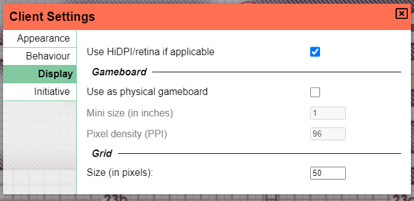

Det er et stykke tid siden, vi har haft en udgivelse.
Det gode er, at der er blevet rapporteret få fejl, så 0.26-udgivelsen var ret stabil, hvilket altid er rart at se.
Den dårlige nyhed er, at denne udgivelse måske bliver lidt mere ujævn, og vi skal snart se hvorfor.

Denne udgivelse var primært tiltænkt at gøre én ting, og det er at opgradere det reaktive framework, PA bruger (Vue), fra version 2 til version 3.
Det er en meget teknisk ændring, som _ideelt set_ ikke burde have en direkte indvirkning på brugeroplevelsen, men som berører en masse kode, hvilket er grunden til, at jeg ønskede en længere periode til at verificere, at tingene opførte sig korrekt. Jeg vil gå i detaljer med, hvad ændringerne indebærer til sidst i denne artikel for ikke at skræmme de faktiske brugere væk! :)

Men det er ikke kun interne kodeændringer, der er ændret: initiativ fik en overhaling, der er nogle nye godbidder til at bruge PA som et fysisk spillebord, og der har igen været nogle fantastiske bidrag fra fællesskabet. Så lad os dykke ind!

## Initiativ

Initiativværktøjet, som det fungerede indtil nu, er stort set blevet hakket sammen på et par dage efter en reddit-kommentar efterspurgte initiativunderstøttelse. Det gjorde jobbet, men havde altid nogle mindre problemer. Jeg tog mig endelig tid til at tage fat på disse udestående problemer og gentænke noget af initiativets funktionalitet.

### UI/UX

Et af problemerne var, at UI'et kunne være meget travlt.
Absolut for spillere, der altid kunne se admin-knapperne, men på ingen måde kunne interagere med dem.

#### DM-linje

Handlinger, der kun er for DM, er blevet flyttet til en separat "DM-linje" og vil kun være synlige for (med-)dm'er.

#### Indstillinger

Sammen med det er kamera- og synslås-ikonerne blevet flyttet til klientindstillingerne, som kan tilgås med et lille tandhjulsikon.
Dette løser også "fejlen", hvor folk, der ofte bruger disse indstillinger, tidligere altid skulle genanvende disse konfigurationer.

#### Fjernelse

En anden mærkbar ændring burde være fjernelsen af skraldespanden fra ikonerne for hver initiativaktør.
For noget, der ikke er _så_ vigtigt at se hele tiden, optog det noget plads.
Et lille rødt kryds vil nu i stedet vises i øverste højre hjørne, når man holder musen over en initiativaktør.

#### Inputfelt

Endelig har selve inputværdien fået mere bredde. Den har nu lidt plads til at ånde!
Den har også ændret styling og stikker ikke længere ud som dette mærkelige inputfelt, men ligner nu et "normalt" element i dialogen.

Mens du indtaster din initiativ, er det muligt, at du mister fokus på inputfeltet, hvis en anden samtidigt ændrer værdier, hvilket får initiativlisten til at hoppe rundt. Dette blev tidligere løst ved at vente med at opdatere initiativvinduet, indtil efter du har indsendt din ændring. Der var dog ingen indikation, der viste, at værdierne ikke var synkroniserede, hvis du stadig havde inputfeltet fokuseret. Det er ikke ideelt, da det er meget uklart og kan føre til en masse forvirring. Derfor bliver alle andre initiativrækker i det nye initiativvindue udvisket, mens du har et inputfelt fokuseret, for visuelt at vise, at du udfører en handling, der endnu ikke er afsluttet.

Som en sidste livskvalitetsændring virker det nu også at trykke på `enter` i initiativ-inputfelterne :).

### Adfærd

Et andet problem med det gamle initiativ var, at sorteringsadfærden kunne gå i stå, hvor initiativrækkefølgen ikke længere blev opdateret eller blev opdateret forkert. Datastrukturen bag kulisserne, som var ansvarlig for dette, er blevet ændret og burde nu opføre sig korrekt hele tiden.

Initiativ-DM-linjen har også gode nye godbidder:

Du kan nu gå tilbage i fortiden, hvis du ved et uheld sprang nogen over, eller nogen ikke var færdig med deres tur.
Du kan nu også rydde alle initiativværdier. Det giver dig mulighed for at bede om nyt initiativ og se, hvem der stadig skal opdatere deres værdi, hvor du ellers måske ikke er sikker på, om værdien er ny eller stadig den gamle.

#### Sortering

Endelig kan du nu også aktivt ændre sorteringsadfærden. De tre muligheder er: faldende, stigende og manuel.
Hvis du trækker i initiativlisten, vil sorteringen automatisk skifte til manuel tilstand, medmindre du byttede to aktører med samme initiativværdi.

## Kopier lokationer

_Bidraget af CalebKoch_

Denne smarte funktion giver DM'er mulighed for at kopiere en lokation til en anden session. Konceptet er ret simpelt, men sparer en masse arbejde, hvis du kører den samme kampagne for flere grupper og ikke skal genlave hele kortlægningen og tegningen af krigstågen!

Den kan tilgås som DM fra lokationsindstillingerne, som du ønsker at kopiere fra. En dialog vil vise dig alle de kampagner, du har.

## Spillebord

Dette kom delvist som en anmodning fra folkene på det sidste spillebord, som jeg har samarbejdet med om at bringe PA til deres platform,
men det har også generel nytte!

I de fleste tilfælde bruges PA rent som en digital løsning til bordrollespil.
I denne kontekst er det først og fremmest størrelsen i pixels, som en gridcelle skal repræsentere, der er vigtig.

I nogle tilfælde bruges PA som en udvidelse af "traditionelt" fysisk spil, og PA bruges således som et mere traditionelt spillebord med ekstra funktioner.
I denne kontekst er det mindre interessant at udfylde pixelstørrelsen direkte, men det, der er vigtigt, er at kunne sætte minis på bordet.

Det er nu muligt at definere størrelsen af grid'et i en fysisk kontekst ved at angive minis størrelse og skærmens PPI (undertiden kaldet DPI). En konsekvens af dette er, at zoom ikke giver mening, og det vil derfor ikke virke foreløbigt.

## Viewport

Som DM har du nogle gange din egen DM-skærm, men styrer også en anden skærm, der viser, hvad spillerne kan se.
I denne kontekst kan det nogle gange være besværligt at skifte skærme/enheder for at styre spillernes kamera.

Nyt i denne udgivelse er muligheden for at vise spillernes aktive viewports. I Admin-indstillingerne kan du slå viewport'en til for individuelle spillere.

Hver viewport vil blive gengivet på DM-laget som et rektangel uden fyld, og hvis kant viser præcis det område, som spilleren ser på det pågældende tidspunkt.

Hver viewport kan desuden flyttes rundt af DM'en, hvilket direkte paner spilleren vedkommendes skærm.

<video autoplay loop muted style="max-width: min(680px, 75vw);">
    <source src="/blog/release-0.27/viewport.webm" type="video/webm" />
    <source src="/blog/release-0.27/viewport.mp4" type="video/mp4" />
</video>

_undskyld billedfejlene, også bonuspoint til dem, der genkender billedet i baggrunden ;)_

## Livskvalitet

Det var det for de fleste større ændringer, men der er også lavet en masse dejlige livskvalitetsændringer!

### Aktivmenu-synkronisering

Sidebjælken i aktivmenuen, som indtil videre kun er tilgængelig for DM'er, blev aldrig liveopdateret, når nye aktiver blev tilføjet til aktivhåndteringen.
Det voldte mig selv og mange andre en masse besvær, hver gang vi skulle genindlæse siden, efter vi havde tilføjet nye aktiver.

Vi skal ikke længere udholde dette, da bjælken nu liveopdateres med, hvad der sker i aktivhåndteringen!

### Rediger formers tekstværdier

Nogle former (dvs. Text & CircularToken) har en vis tekstværdi knyttet til sig.
Tidligere var denne værdi kun konfigurerbar under oprettelsen af disse former og kunne ikke ændres bagefter.

En ny 'value'-række er blevet tilføjet til egenskabsfanen i disse formers redigeringsdialoger.

### HiDPI/Retina

Som du måske har set på et tidligere billede, har klientindstillingerne en ny skærmfane.
Den indeholder også en kontakt til at slå støtte til HiDPI- og retina-skærme til.
Det burde gøre alting skarpere!

**advarsler**:

- Det er tungere for din computer at tegne
- Jeg har haft nogle rapporter om, at zoom/pan kan gå galt med denne indstilling aktiveret, så vær opmærksom!

### ctrl fravalg

Ctrl-klik på former giver dig mulighed for at tilføje individuelle former til en aktiv markering. Andre værktøjer understøtter normalt også ctrl-klik på allerede markerede former for at fravælge dem. Dette er nu også understøttet.

### bekræftelse ved at sparke en spiller

At sparke en spiller vil nu først spørge om bekræftelse :)

## Server

### api-serveren er nu deaktiveret som standard

API-serveren er en meget nichefunktion og var aktiveret som standard, hvilket krævede en ekstra åben port.
Den er nu deaktiveret som standard for at forhindre arkane fejlmeddelelser for folk, der kører i containere med kun hovedporten åben.

### public_name kommenteret ud som standard

_bidraget af dthv_

En lille livskvalitetsændring, der gør det klart, at dette er en valgfri funktion.

### Dockerfile-ændringer

_bidraget af jirsat_

Oprydning af nogle ubrugte afhængigheder og støtte til ARM er blevet tilføjet til dockerfiles.

## Rettelser

- En fejl relateret til etager og belysning på højere etager, som ikke opdaterede
- Omrokering af etager blev gengivet forkert indtil en opdatering
- Redo virkede ikke på Mac
- Tracker-linjer med negative værdier viste en linje, der gik mod venstre
- Co-DM så ikke private initiativer
- Fjernelse af sidste etage gav en blank skærm
- Fjernelse af etager under den aktive etage gav en blank skærm
- Det var muligt at sætte en værdi &lt; 1 for unitSize

## Detaljer om klientomskrivningen

Som nævnt i introduktionen bruger PA nu Vue 3, som introducerede composition API, der er mere typescript-venligt.

Al UI-kode er blevet fuldstændig omskrevet for at gøre brug af dette nye API.
Derudover er alle "stores" blevet omskrevet til at bruge et selvskrevet, meget simpelt state API, der passer bedre til mine egne behov.
Det gjorde det muligt for mig at refaktorere en masse kode, der tidligere var spredt over rene ts-filer og en relateret store.

En anden rar fordel ved Vue 3 er, at det nu understøtter Map og Set i reaktive kontekster, hvilket i høj grad forbedrede nogle områder, hvor jeg tidligere måtte arbejde med Maplike-data på mindre ideelle måder.
