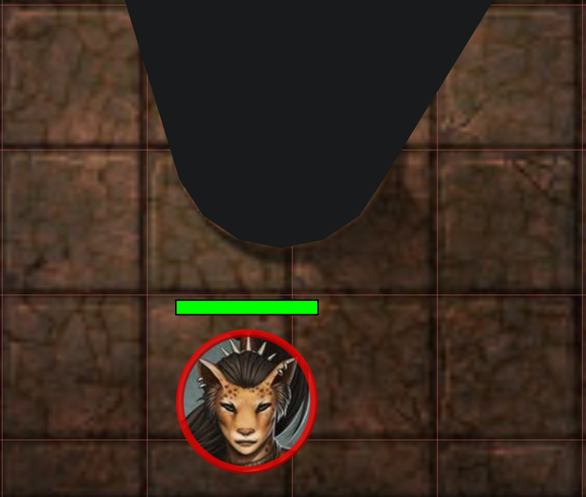

Et nyt år, en ny release!

Som sædvanligt blev nogle fejl rettet, men de to hovedstjerner i denne release er en omskrivning af notesystemet og
introduktionen af en ny synsblokerings-tilstand, der vil forbedre fordybelsen.

## En ny synsblokerings-tilstand

### Hvorfor har vi brug for en ekstra tilstand?

Indtil nu var synsblokering binær: enten kan du se igennem/forbi objektet, eller også blokerer det synet fuldstændigt.
Dette er fint i mange tilfælde, men når man har at gøre med mindre objekter (f.eks. træstamme, søjle, en klippe)
kan det ofte føre til et valg, du skal træffe som DM.

- Skjuler du objektet fuldstændigt og giver det korrekt synsblokerende adfærd,
  men taber du i sidste ende fordybelsen, fordi det ikke er klart for spillerne, hvad den tilfældige cirkel, der blokerer synet, er
- Gør du den synsblokerende form en smule mindre for at vise en smule af objektet, men taber du korrektheden som følge heraf

### Den nye tilstand

I denne release introduceres en ny synsblokerings-tilstand kaldet `behind`.
Den vil ledsage den eksisterende synstilstand, som vil blive omdøbt til `complete`.

Når den nye tilstand er aktiv, vil formen markeret som synsblokerende blive gengivet, som om den ikke er en synsblokerende form,
men alt bagved den vil være fuldstændigt skjult.
Dette vil for eksempel gøre det muligt for dig at have en træstamme, der er synsblokerende,
men som stadig viser spillerne, hvad de kigger på (dvs. en træstamme).

Et andet godt brugsscenarie for denne nye tilstand er døre.
Ved at konfigurere den som blokerende bagved giver du korrekt syn til hele dørobjektet,
hvilket gør det klarere for spillerne, hvad de kigger på.

**Fuld blokering:**

**Bag-blokering:**

#### Begrænsninger

Denne specielle tilstand virker kun for former, der er lukkede.
I praksis betyder det, at den virker for de fleste almindelige former (f.eks. rektangel/cirkel),
men ikke for specielle former som penselværktøjet (brush tool) eller tekstformer.

Polygoner kan være enten åbne eller lukkede!
Så hvis du vil bruge dette til at vise en uregelmæssig form med polygonværktøjet,
så sørg for, at du har markeret polygonen som lukket.
(dette er en mulighed i Draw-værktøjet)

Et andet særtilfælde er, at lys placeret inde i objekter, der har denne tilstand aktiveret,
kan blive gengivet, når din aura ikke når formen.
Dette er en kantcase i implementeringen, men burde ikke være et stort problem i praksis,
da der ikke er meget grund til at placere lys inde i synsblokerende former.

## Noter og annotationer

Den anden store ændring i denne release er en omskrivning af notesystemet.

PlanarAlly har indtil videre haft 2 koncepter af noter:

- løse kampagnenoter
    - Disse har en titel og noget fritekst
    - Er altid private
    - Kan holdes åbne / trækkes rundt
- formnoter (kendt som annotationer)
    - Disse har markdown-kompatibel fritekst
    - Kan være offentlige eller private
    - Begrænset til 1 pr. form
    - Den gengivede markdown vises øverst på skærmen, når den relaterede form svæves over

### En samling af problemer

Begge disse koncepter har deres egne problemer og er inkonsistente med hinanden:

- for løse noter
    - der er ingen måde at søge på
    - der er ingen måde at filtrere på (f.eks. kun noter relevante for den aktuelle lokation)
    - der er ingen måde at dele disse med andre brugere
    - kun 1 note kan være åben ad gangen
    - der er slet ingen markdown-gengivelse
- for formnoter
    - der er ingen måde at have både privat og offentlig information
    - der er ingen måde at have dem popped ud / få adgang til dem uden at have formen valgt
    - hvis du har brug for informationen, du skrev for en form, skal du finde den faktiske form, uanset hvor den er
    - medmindre det er en karakter, går noterne tabt, når formen fjernes

### En samlet løsning

For at løse disse problemer skabes et samlet notesystem.

I dette nye system er der ikke længere en forskel mellem formnoter og kampagnenoter.
Noter er nu et enkelt koncept, kan knyttes til former og administreres gennem et nyt UI-element kaldet Note Manager.

### Mærkbare ændringer

For et fuldt overblik over det nye notesystem, se [notedokumentationen](/da/docs/game/notes/).
Denne er blevet opdateret til at afspejle det nye system og indeholder flere billeder og en mere dybdegående forklaring.

#### UI-ændringer

Note manager er et nyt UI-element, der kan åbnes med <kbd>n</kbd> tastebindingen eller ved at klikke på notesektionen i venstre-menuen.
Det er kernen i det nye notesystem og giver dig mulighed for at administrere alle dine noter.

Note manager har en søgelinje, der giver dig mulighed for at søge gennem alle dine noter.
Noter kan nu også have vilkårlige tags, som både kan bruges til at søge og til at give mere kontekst.

Du kan dog også poppe noter ud fra note manager (og nogle andre steder) for at holde dem åbne, mens du laver andre ting.
Flere af disse noter kan poppes ud på én gang, og de kan trækkes rundt individuelt.

Derudover kan poppede noter også kollapses, så de kun viser deres titel.
Dette kan bruges til noter, du ofte har brug for adgang til i en kort tidsperiode, uden at fylde din skærm.

#### Adgang

Det er nu muligt at dele noter med andre brugere og definere granulære adgangsrettigheder for dem.

Det betyder, at du kan give visningsadgang til alle spillere, når en bestemt note hentes, eller give en bestemt spiller en privat note, som kun de kan se og redigere.

Spiller-oprettede noter er en af de få ting i PA, der ikke er synlige for DM'en! Så disse er virkelig private, medmindre de specifikt deles.

#### Former

Noter kan valgfrit knyttes til former.
En enkelt note kan knyttes til flere former, og en enkelt form kan have flere noter knyttet!

Dette giver dig mulighed for at have både offentlig og privat information knyttet til en form.

Derudover er der også en ny noteindstilling, der giver dig mulighed for at konfigurere et noteikon, der skal vises på formen.
Dette er nyttigt til at huske tilstedeværelsen af en vigtig note.
Det er også nu blevet en indstilling til at diktere, om noten skal vises øverst på skærmen, når en relateret form svæves over.
Dette er nu slået fra som standard!

Den hurtige info-sektion på højre side af skærmen, når du har en form valgt, har nu også info om alle noter knyttet til formen.
Du kan hurtigt svæve over noterne for at se deres indhold, men du kan også poppe dem ud derfra.

For at se et overblik over alle noter for en bestemt form kan du enten klikke på noteikonet i den hurtige info-sektion eller bruge den valgte forms kontekstmenu.

#### Global vs. lokal

Når du opretter en ny note, vælger du, om det er en global eller en lokal note.

Det betyder, at en global note er kampagneagnostisk og vil være synlig i alle kampagner.
Mens en lokal note er relateret til den aktuelle kampagne og endda til den specifikke lokation, den blev oprettet på.

Da globale noter er tilgængelige i hver kampagne,
betyder det, at du skal være lidt omhyggelig med ikke at lave for mange af dem, da de fleste noter normalt ikke er relevante for alle kampagner.

Et godt brugsscenarie for globale noter er dog statblokke. Du vil ikke omdefinere statblokken for et specifikt monster i hver kampagne.
Kombineret med brugen af [Asset Templates](/da/docs/dm/assets/#templates) kan du droppe en goblin på spillebordet og have den automatisk med statblokken knyttet.

## Asset Drop Ratio

Dette er en ny funktion, der på samme tid også er en fejlrettelse.
Den tilføjer en ny indstilling til lokationens grid-indstilling.

PA har en mulighed for automatisk at skalere aktiver, når de droppes, hvis de har et specifikt format i deres navn.
For eksempel burde goblin_1x1 under normale omstændigheder passe præcis til 1 grid-celle, og dragon_3x3 burde skaleres om til 3 gange 3 grid-celler.

Den eksisterende implementering brugte fejlagtigt en metode baseret på 5ft-systemet
til automatisk at justere dette, når en lokation havde en større størrelse (f.eks. ville 10ft-kort automatisk få something_2x2 til at passe i 1 celle).

Dette bryder dog fuldstændigt sammen for alt, der ikke bruger 5ft-systemet, uanset om det er fordi du bruger SI-enheder, eller fordi dit system bruger noget brugerdefineret, eller du kan lide at definere dine størrelser i form af pizzaer.

Den simple rettelse er at deaktivere det system, men så virker det at droppe aktiver på kort med en anden skala ikke længere korrekt.
Så for også at tage hånd om det, tilføjes en ny indstilling: Asset Drop Ratio, som definerer, hvordan disse aktiver skal skaleres, når de droppes på kortet.

En drop-ratio på 1 er standarden; det betyder, at aktivet vil blive skaleret udelukkende ud fra dets angivne dimensioner (dvs. goblin_1x1 vil fylde 1 grid-celle, selvom det repræsenterer 10ft).
En drop-ratio på 0,5 ville skalere et something_2x2 om til 1x1.

## Terningehistorik

_Bidraget af SuikaXhq_

Jeg har større planer om at omskrive terninge-UI'et og -adfærden, men mens jeg skrider langsomt frem på dette,
har SuikaXhq bidraget med en god forbedring til den eksisterende terningehistorik.

Terningehistorikken vil nu vise, hvem der kastede terningerne, mere fremtrædende (tidligere blev det kun vist ved svævning) og
indeholder flere detaljer om det specifikke kast i stedet for kun at vise det endelige resultat.

## Forbedringer af valginformation

_Bidraget af SuikaXhq_

Som tidligere nævnt inkluderer valginfo-sektionen på højre side af skærmen nu information om noter knyttet til den valgte form.

Det var dog ikke den eneste ændring af valginfo!

Trackere og auraer viser information om deres aktuelle tal og tilbyder hurtig ændring af disse tal.
For auraer er dette dog ikke super nyttigt; i de fleste tilfælde er dette ikke noget, du vil ændre ofte.

Denne release ændrer aurasektionen til i stedet at give et toggle til at slå auraen til/fra uden at skulle åbne de detaljerede tracker-indstillinger.
Derudover, hvis auraen er begrænset i vinkel (dvs. ikke 360 grader), vises der også en rotationsskyder, så du hurtigt kan ændre auraens rotation.

## Fejlrettelser

- Polygon-redigerings-UI: tog ikke højde for formens rotation
- Teleport: former teleporteret uden at følge så ud til ikke at bevæge sig, da den lokale synkronisering ikke blev opdateret
- Terningeværktøj: Ignorer GO-knappen, hvis der ikke er indtastet noget
- Karakter: en samling af fejl med varianter er blevet rettet
- Trackere: tilføj max-højde og scrolling for at rette UI'et, når der er mange trackere
- RotationSlider: Ret synkroniseringsproblemer
- RotationSlider: Ret skyder-ankeret, så det ikke holder fast i skinnen under visse vinkler
- \[server\] log-spam af "unknown"-form, når midlertidige former flyttes
