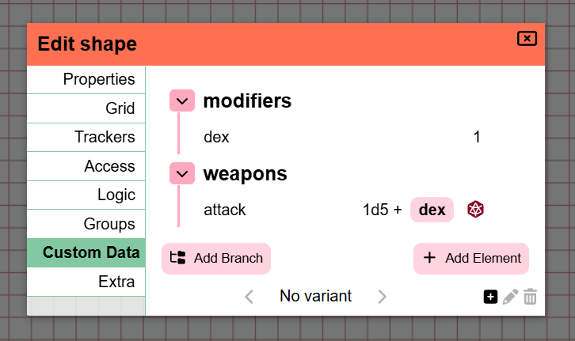

import Info from "/src/components/directives/Info.astro";
import Warning from "/src/components/directives/Warning.astro";

Der er en del spændende ting at se i denne udgivelse! Et par højdepunkter:

- UI/UX-opdateringer til Initiative og til Noter
- Rettelser til kopiering/indsætning og lignende systemer
- Et nyt 'custom data'-koncept er blevet tilføjet til former, som blandt andet gør et simpelt karakterark muligt

<Info title="Meddelelse om udfasning">
    Variantfunktionaliteten forenkles i 2026.2, se [Varianter](#variants) for mere info.
</Info>

Denne udgivelse var oprindeligt planlagt til november/december, men de tekniske omarbejdninger (se senere) endte med at kræve en længere periode for at få udjævnet stabilitetsproblemerne.

Denne udgivelse indeholder også bidrag fra en række forskellige personer – tak til jer alle, såvel som til alle dem, der har rapporteret bugs på udviklingsgrenen!

<Warning title="Ændringer i serverkonfiguration">Se [serverafsnittet](#server-changes)</Warning>

## Initiative

_Disse ændringer er bidraget med af Rexy712_

Som nævnt i indledningen er brugergrænsefladen blevet opdateret, som det kan ses nedenfor.

Den har nu også en intern overflow-scroll,
så selve initiativ-elementet ikke bliver gigantisk, hvis der er mange aktører i initiativet.

Endnu en ny tilføjelse er, at du nu kan gøre en effekt ubegrænset i tid, når du tilføjer effekter –
tidligere skulle du altid udfylde et antal omgange, før den ville forsvinde.

Som DM er der nu også muligheden for at rydde hele initiativet på én gang,
såvel som knapper til at rykke initiativet en hel omgang frem.

## Grundlæggende karakterark

### Hvorfor

En af de klager, jeg fra tid til anden modtager, drejer sig om manglen på karakterark.
Jeg har altid ment, at et generisk karakterark, der ville passe til alle systemer/brugsscenarier, ikke rigtig er realistisk,
og at karakterark derfor er bedre egnet til mods.

Det sagt, så er mods stadig meget eksperimentelle, kræver teknisk viden at skabe,
og lad os være ærlige: PA er et meget nichepræget VTT.
Det er derfor ingen overraskelse, at der ikke rigtig har været noget arbejde på dette område.

Jeg mener stadig, at et pænt udseende karakterark, der passer til alle, ikke rigtig er realistisk,
men jeg begav mig ud i at skabe et mere rudimentært system, der integreres med terningssystemet.
På den måde kan mods stadig bag kulisserne bruge dette fælles grundsystem, mens de tilbyder en mere visuelt tiltalende brugergrænseflade.

### Sådan fungerer det

Denne udgivelse tilføjer en ny fane til "edit shape"-brugerfladen med navnet "custom data".

Her kan du frit tilføje data relateret til formen. Du kan organisere dataene i et trælignende dataformat.

De data, du kan tilføje, kan i øjeblikket være af 3 typer:

- tekst
- tal
- terningudtryk

De fleste af disse er ret selvforklarende. Det gode ved terningudtryk er, at du med det samme kan indlæse terningeværktøjet
med det givne udtryk, som kan referere til andre custom data-elementer, kort sagt kaldet referencer.

Derudover kan du også bruge disse referencer direkte i terningeværktøjet, som vil vise en autofuldførelses-brugerflade, der hjælper med at vælge egenskaben fra den korrekte form.

En anden tilføjelse til terningeværktøjet er, at der er en genvejsknap for hver form i dit valg, som har terningudtryk.
Det gør, at du ikke konstant skal åbne formindstillingerne, navigere til custom data-fanen og klikke på rulknappen for det ønskede kast.

### Fremtiden

Målet er også at opdatere nogle andre steder, så de interagerer med referencerne.
Trackers og auras er blandt de mest oplagte steder, der kan drage fordel af denne interaktion.
(f.eks. en HP-tracker knyttet til en HP-reference)

Noget andet, som jeg gerne vil, er at lave en egentlig systemspecifik karakterark-mod som et fornuftigt showcase.
Der er dog et stort licens-/rettighedsproblem for mig i den forbindelse.

For en lang række systemer er det ikke tilladt – eller kræver indgåelse af kontrakter – at tilbyde disse ting i officielt regi.
D&D er for eksempel noget, jeg er meget tilbageholdende med at røre ved i denne sammenhæng; selvom der findes SRD,
har de ikke rigtig været imødekommende over for andre spillere, eftersom de har deres egne værktøjer.
På samme måde kontaktede jeg folkene bag Mothership for at se, hvad der er muligt, men jeg fik besked om, at der i øjeblikket ikke er tilladt med vtt-integrationer.
Wildsea-systemet er meget åbent, og jeg begyndte faktisk at arbejde på en wildsea-relateret mod i repository'et med eksempelmods,
men mit ene store problem der er, at dette system faktisk er et af de få systemer, hvor jeg slet ikke selv bruger en VTT,
så det føles lidt tåbeligt.

Så jeg er ikke rigtig sikker på, hvad jeg skal gøre fremadrettet, da det er en situation, hvor man er fordømt uanset hvad –
juridisk kan jeg ikke rigtig gøre meget, men folk synes at ønske integrationer.

## Noter

I udgivelse [2024.1](/da/blog/release-2024.1) blev der introduceret en stor omarbejdning af notesystemet.
Det tilføjede en samlet ramme og en bedre brugergrænseflade omkring nogle løse koncepter, der tidligere eksisterede.

Det introducerede konceptet om, at en note enten er en global note, der er tilgængelig i alle dine kampagner, eller at den er specifik for en kampagnelokation.
Tanken er, at du normalt har noter, der er specifikke for dit spil (lokale), eller noter, du ofte har brug for, som stat-blokke (globale).
Du kan skifte mellem lokale/globale eller begge dele, og du kan også lave filtrering som f.eks. "vis kun noter for den aktuelle lokation".

Nu, 2 år senere, er det et godt tidspunkt at revurdere, hvad jeg mener om systemet, og ændre de ting, der ikke føles rigtige.

### Problemer med det nuværende system

#### Kampagnenotater

Et af de problemer, jeg ofte løber ind i, er, at jeg laver en masse noter, der kun er relevante for en bestemt lokation.
Det betyder, at når jeg er på lokation X, enten ser jeg alle noterne for hver lokation i mit spil, eller også ser jeg kun dem for min nuværende lokation.

Dette lyder fint på papiret, men i praksis har jeg også nogle noter, der er relevante for hele kampagnen og kun for den kampagne.
Problemet er, at fordi hver note i sagens natur er knyttet til den lokation, den blev oprettet i, er disse kampagnebrede noter svære at finde.
Hvis du filtrerer dine noter til den nuværende lokation, ser du ikke længere de kampagnebrede noter (medmindre de tilfældigvis blev oprettet i din nuværende lokation); hvis du ikke filtrerer, ser du en million noter, og det er svært at holde styr på noget som helst.

Filteret for den aktive lokation er også gemt bag en ekstra menu, hvilket gør det ret besværligt at skifte mellem disse ofte.

#### Formnotater

En anden mærkelig ting er, at fordi en note er knyttet til den lokation, den blev oprettet i, kan vi komme i besværlige situationer, når noten er knyttet til en form, og denne form flytter lokation.
Det gjorde, at noten ikke altid dukkede op de rigtige steder.

#### Globale noter

Som nævnt tidligere udfylder globale noter en niche for nogle noter, du måske har brug for ofte.
I min oprindelige vision var dette mest for monster-stat-blokke eller systemregelsæt.
Sidenhen har nogle personer nævnt, at de nogle gange har noter, der er relevante for et udvalg af kampagner, fordi de samme (n)pc'er måske optræder i dem.

Problemet er dog, at opsætningen af adgang for globale noter kræver mere arbejde, fordi de ikke tilhører en bestemt kampagne; PA ved ikke, hvilke spillere der skal foreslås.
Så du er nødt til manuelt at knytte hver spiller til hver sådan note, hvilket hurtigt kan blive besværligt.

#### Lokationsnoter

En sidste irritation er, at fordi du kun har valget mellem "alle lokationer" eller "nuværende lokation", kræver enhver note fra en anden lokation, som du bare hurtigt vil slå op, enten at du helt skifter lokation eller søger gennem alle noterne.
Sidstnævnte kan være mere eller mindre praktisk muligt afhængigt af, om du husker titlen.

### Hvad ændrer sig

Så med disse smertepunkter i baghovedet gennemgår denne udgivelse nogle af koncepterne.

#### Afskaffelse af global/lokal

Lokal-global-konceptet endte bare ikke med at fungere, som jeg oprindeligt forventede.
Virkeligheden er, at noter varierer meget i deres brug og kan være relevante for 1 lokation, flere lokationer på tværs af flere kampagner eller slet ikke for en specifik kampagne.

Som følge heraf er det nu mere fokuseret på at knytte en specifik kampagne og/eller lokation til en note.
Når du opretter en note, vælger du nu, om dens primære formål er kampagnebredt, lokationsspecifikt eller slet ikke skal have en særlig tilknytning, men du kan stadig knytte enhver anden lokation, du ønsker.

#### Filter-brugerflade

I stedet for det forvirrende præferencepanel + tagfilterlinjen er søge-/filterbrugerfladen blevet omarbejdet til en aktiv filterlinje, der altid er umiddelbart tilgængelig, og som giver dig mulighed for at vise noter fra lokationer, du ikke aktuelt er aktive på.

#### Serverbaseret paginering

Noget, der ikke specifikt blev nævnt i smertepunkterne, er, at noter indtil nu blev pagineret fuldstændigt på klienten.
Det betyder, at alle noter skulle leveres til klienten, når du indlæser en kampagne.
Det gjorde det nemt at få en hurtigt fungerende version ud i første omgang, men det lægger blot mere belastning på både opstartstiden og databasen, mens du i virkeligheden normalt ikke interagerer med størstedelen af noterne.

Nu hentes noter kun fra serveren, når de faktisk anmodes om.

Pagineringens brugerflade er også flyttet til nederst til venstre og gjort mere visuelt tydelig.

#### Tags

Det var muligt frit at tilføje tags til enhver note.
Der var dog ingen rigtig livskvalitetsfunktion til at hjælpe dig med at administrere tags.
Du var stort set nødt til at vide, præcis hvordan du tidligere havde skrevet et bestemt tag, når du tilføjede det til en ny note, da der ikke er nogen dropdown, autofuldførelse, søgning eller lignende.

Denne udgivelse ændrer det, så tags administreres korrekt i en separat databasesamling i stedet for at være tilfældige JSON-data knyttet til en note.
Det giver brugerfladen mulighed for faktisk at vise eksisterende tags i dine notedetaljer ved redigering samt at være til stede i filterlinjen.

<video autoplay loop muted style="max-width: min(680px, 75vw);">
    <source src="/blog/release-2026.1/notes-tags.webm" type="video/webm" />
    <source src="/blog/release-2026.1/notes-tags.mp4" type="video/mp4" />
</video>

.

## Varianter

### Rettelser til tilladelser

_bidraget med af Rexy712_

Den måde, adgang/tilladelser for variantformer var opsat på, forhindrede ikke-DM'er i at ændre nogle aspekter af dem.
Følgende rettelser er blevet foretaget:

- Spillere kan nu tilføje varianter til former, de har redigeringsadgang til
- Spillere kan nu skifte mellem varianter af former, de har redigeringsadgang til
- [teknisk] Varianternes adgangstilladelser er nu kun baseret på tilladelserne for den overordnede form

### Annoncering af omarbejdning

Varianter er i øjeblikket implementeret på en temmelig kompliceret måde.
For hver variant er der en rigtig forminstans, og der er en skjult controllerform, der er ansvarlig for at vise den korrekte form og administrere tilstanden/interaktionerne for alle varianter.

Det positive aspekt ved dette er, at hver variant kan indstilles fuldstændigt til præcis, hvad den skal være.
Alle formindstillinger er unikke for den variant, hvilket giver fuld kreativ frihed.

Det kommer dog med en lang række ulemper.

- Ethvert koncept, der skal deles mellem varianterne, skal duplikeres. Enhver ændring, du foretager, som muligvis gælder alle varianter, skal udføres på alle varianterne.
    - Undtagelsen er trackers/auras, for hvilke der blev tilføjet et særligt system for at gøre dem delbare.
- Hele kodebasen er nødt til at udføre ekstra logik bare for dette nichekoncept, da den måde, formerne administreres på, påvirker mange interaktioner
    - Dette tilføjer ekstra overhead til alle andre funktioner for at forsøge at fungere godt sammen med potentielle variantformer
- Fordi de fungerer så afvigende i forhold til langt størstedelen af former, ender de ofte med subtile problemer

Virkeligheden er, at fuld kreativ frihed for hver form bare ikke er al besværet værd, og i praksis er den heller ikke nødvendig i langt de fleste tilfælde.
I sin kerne handler idéen om varianter bare om hurtigt at kunne skifte mellem nogle kunstaktiver med potentielt nogle små forskelle.

De små forskelle, jeg kan forestille mig faktisk være nyttige, er token-størrelsen, potentielt et andet navn og nogle trackers/auras.

Jeg har til hensigt at reducere hele kompleksiteten med flere former og skiften mellem dem til blot 1 form.
Denne 1 form vil få en ny fane til at administrere varianter, hvor du kan tilføje en ny post med et ikon og et navn.

Og det er det. For trackers og auras betyder det også, at det særlige "delt"-koncept kan fjernes.
Mine indledende planer er at tilbyde ingen særlige interaktioner for trackers/auras og blot lade brugeren slå trackers/auras til og fra efter behov, når de skifter varianter.
Hvis dette ender med at blive for besværligt, er jeg åben for at undersøge at tilføje en specifik til-/fra-logik for trackers/auras til den nye variantfane.

Det betyder også, at brugeroplevelsen generelt vil blive forbedret, da det i øjeblikket ikke er muligt faktisk at indlæse en bestemt variant direkte, hvis du har flere konfigureret.
Du skal i øjeblikket bladre gennem dem, hvilket kortvarigt afslører dem for alle spillere, der kan se formen.

<Warning>
    Dette vil blive ændret i 2026.2. Hvis du har bekymringer/problemer med denne ændring, så kontakt mig, så vi kan se,
    hvad der er muligt.
</Warning>

## Rettelser til grid-snapping

_bidraget med af Rexy712 og Craftidore_

Der er foretaget en række rettelser af snapping-adfærden.

### Tastaturinteraktioner

Tastaturflytning klikker nu også fast på den nærmeste grid-celle (når snapping er relevant).
Indtil nu blev dette ikke gjort, hvilket forårsagede nogle mærkelige tilfælde, hvor du flytter en form uden for grid'et, fordi den rørte en væg en enkelt gang undervejs.

Derudover blev der rettet en bug, der forårsagede, at tastaturflytning flyttede en form to gange, hvis ruler'en var aktiveret i select-værktøjet under flytningen.

### Vandret vs. lodret størrelse

I [2024.2](/da/blog/release-2024.2#shape-grid-size) blev der tilføjet mere kontrol over en forms størrelse i grid'ets kontekst.
Det giver brugeren mulighed for at angive, hvor stor formen skal opføre sig på grid'et, når den flyttes rundt, uanset den faktiske kunststørrelse.
Det ville også vise dig den udledte størrelse, PA ellers mener, formen er.

Denne udgivelse tilføjer yderligere forbedringer hertil ved at opdele denne størrelsesejenskab i en vandret og en lodret komponent (for kvadratiske grids).
Dette retter noget snapping-adfærd, når en form er irregulær (f.eks. 2x7).

## Tekniske omarbejdninger

### Forbedringer af dataduplikering

PA gennemgik flere tekniske refaktoreringer, som rettede en række langvarige uløste problemer,
som jeg ikke kunne rette, før disse ændringer blev foretaget.

Især to ting blev ændret:

- Hvordan mellemliggende formdata repræsenteres på klienten
- Hvordan (form)skabeloner gemmes i databasen

Jeg vil spare dig for de tekniske detaljer, men resultatet er, at følgende handlinger alle havde en række fælles bugs, som nu burde virke korrekt

- fortryd/genfortryd sletning af former
- kopier-indsæt en form
- slippe en skabelon på spillebordet

Disse 3 systemer har alle eksisteret og fungeret (i en vis grad).
De var dog alle ikke i stand til at håndtere forminformation, der er gemt mere specialiserede steder.
Noter gemmes for eksempel i en separat databasesamling, hvilket får fortryd/genfortryd til at glemme en note-relation til en form, og kopier-indsæt har heller ingen idé om det.

I stedet for at skulle tilføje specialtilfælde alle mulige steder fungerer den nye omstrukturering sådan, at de 3 ovenstående systemer faktisk ikke behøver at kende detaljerne – det bare virker.

### Aktiv-skabeloner

#### Ændringer i lagringen

Aktiv-skabeloner er et godt system, der giver brugeren mulighed for at gemme data relateret til et bestemt aktiv,
så hvis du senere slipper aktivet på spillebordet, er det præudfyldt. (f.eks. huske HP/AC for en goblin)

Blandt de problemer, der blev nævnt i det tidligere afsnit, havde skabeloner også nogle andre problemer.
På grund af den måde, de blev gemt i databasen på, blev de ikke påvirket af nogen migration af databasen til en ny version.

Det betyder, at skabeloner lavet i tidligere versioner potentielt ikke kunne opføre sig korrekt, når de blev brugt i en ny version.

De vil nu blive gemt som almindelige former i databasen, hvilket muliggør automatisk migration samt gør noget anden intern logik mere konsistent.

#### Aktivadministrator-ikon

Dette er ikke en teknisk omarbejdning, men det er relateret til aktiv-skabeloner.

Aktivadministratoren viser nu et ikon på de aktiver, der har skabelondata.
Dette hjælper, hvis du har flere aktiver med samme navn (på grund af forskellige samlinger eller lignende), og du ikke er sikker på, hvilket du har gemt oplysninger om.

### Pydantic-opgradering

Dette er en rent teknisk opgradering af et datavalideringsbibliotek, som serveren bruger.
Det har dog en betydelig indvirkning på dataflowet, og selvom der ikke burde være nogen reel mærkbar ændring for spillerne,
er det altid muligt, at jeg har overset nogle tilfælde, der forårsager fejl på serveren.

Jeg nævner det her mest for serverhosts,
så de rapporterer disse problemer hurtigst muligt, hvis de ser valideringsfejl dukke op i deres serverlogge!

## Fejlrettelser

#### Inkonsistens i formrækkefølgen

For at sikre, at former vises visuelt i den korrekte rækkefølge, når de overlapper hinanden,
holder serveren styr på en position per form.
Når en form flyttes rundt, skal nogle former have justeret deres position, da de kan have bevæget sig op eller ned.

Selvom dette har fungeret temmelig godt i lang tid,
er der i dag ingen reel fejlkorrektion,
så hvis der af en eller anden grund et sted opstår en bug, der forårsager et hul i rækkefølgen eller en dublet position,
kan det forårsage noget mærkelig adfærd.

Det ville være temmelig dyrt konstant at kontrollere rækkefølgens integritet,
så i stedet gav jeg mig til at finde et sted, hvor inkonsistensen nemt kan kontrolleres, og som ikke køres ofte.

Fra nu af vil der, når du udfører handlingen "flyt form bagest",
blive foretaget en kontrol for at se, om antallet af opdaterede former svarer til det forventede antal.
Hvis dette ikke er tilfældet, vil alle former blive omplaceret, og der vil fremkomme en meddelelse til alle tilsluttede klienter,
som forklarer problemet og beder om en opdatering for at sikre visuel korrekthed.

Derudover er positionsopdateringsforespørgslen blevet forbedret fra et ydelsessynspunkt,
selvom du sandsynligvis ikke kommer til at bemærke det.

## Serverændringer

### Logning

_bidraget med af nwhansen_

Logning-adfærd kan nu konfigureres via serverkonfigurationen.

Det giver serverejeren mulighed for at vælge, om der føres fil-logs, og hvilken alvorlighed de forskellige loggere fanger.

Se [konfigurationsdokumentationen](/da/server/management/configuration/#logging) for flere detaljer.

<Warning title="Ændringer i serverkonfiguration">
    Med denne ændring er standardlogningen kun til stdout, så der føres ikke længere fil-logning, som der gjorde før denne udgivelse.

    Derudover er logindstillingerne "max_log_backups" og "max_log_size_in_bytes", som oprindeligt var i sektionen "general" i konfigurationen, nu flyttet til fil-logningssektionen.
    Hvis du havde konfigureret disse specifikt, vil din server ikke længere starte!

</Warning>

## Diverse

- token-retningsbilleder uden for skærmen overskred deres container
- ignorer tastebindinger i select-elementet
- &-tegn i kampagnenavn fik spillet til at gå ned
- rettelser til roterede polygoner
    - klipning
    - flytning af punkter
- Kampagneopretteren kan ikke længere ændre deres egen rolle eller sparke sig selv ud
- tekst i kontoindstillingerne overlappede ved mindre viewport-bredder
- flytning af særlige skjul/vis-former fra krigståge-laget kunne føre til en niche-bug
- rotationsskyderen viste ikke den aktuelle værdi i tekstinputtet ved komponentindlæsning
- DDraft-filer kan ikke længere uploades til aktivadministratoren
- hvis man holdt musen hen over en initiativpost, der er en del af en gruppe, men ikke er markeret som gruppepost, blev alle gruppemedlemmer fremhævet
- fejllog om viewports på serveren
- at slå initiativ fra låste vision-interaktioner
- Initiativ-tandhjulet åbnede ikke initiativ-fanen i klientindstillingerne
- Initiativposter forblev slørede, hvis den fokuserede post blev fjernet af en anden spiller.
- gruppesystemet ryddede ikke ordentligt op ved lokationsændringer
- gruppemærker blev ikke sorteret numerisk i en forms gruppeindstillinger, når de var sat til tegnsættet for tal.
- tracker-input nulstilles til sidste værdi, hvis det efterlades tomt
