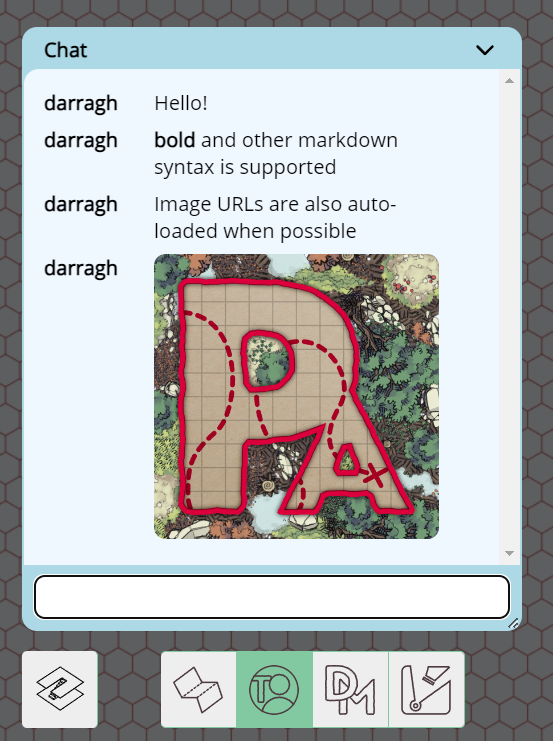

import Warning from "/src/components/directives/Warning.astro";

# **Chat**

Chat i spillet er fra og med version 2024.3 nu muligt ved blot at klikke på `Chat`-knappen nederst til venstre i viewport-vinduet.

Når en chatbesked sendes af en bruger, vises et antal ulæste beskeder ved siden af knappen.

Chatvinduet accepterer Markdown-input, hvilket betyder, at stilarter og links kan inkluderes samt mere avanceret formatering. Se [Markdown-tutorialen](../../../learn/dm/Markdown_Tutorial/markdown)

<Warning title="Chat-persistens">
    Chat gemmes ikke på serveren. Den er flygtig og forsvinder, når du opdaterer siden, eller forbindelsen nulstilles.
</Warning>

Chat kan deaktiveres fra `DM settings`-fanen `Feature` ved at fjerne markeringen i feltet, der aktiverer chat.

