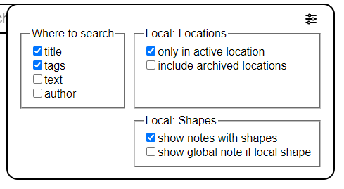

import Info from "/src/components/directives/Info.astro";
import Warning from "/src/components/directives/Warning.astro";

# Noter

Som DM eller spiller vil du nogle gange have brug for at lave noter om en karakter, en lokation, en begivenhed, ...
Denne side viser dig, hvad PlanarAlly tilbyder i form af notehåndtering.

## Koncepter

I sin kerne er alle noter simple beholdere, der indeholder tekst, en valgfri titel og en forfatter.
De kan dog bruges på en række forskellige måder.

Noter kan deles med andre spillere eller holdes private for noteopretteren.
Noter kan også vedhæftes til former, så du hurtigt kan få adgang til noten, når du vælger formen.
Eller simpelthen for at minde dig selv om noget i forbindelse med formen.

Noter understøtter Markdown-formatering. For mere information om det, se [Markdown-tutorialen](../../../learn/dm/Markdown_Tutorial/markdown)

### Global vs. lokal

I de fleste tilfælde er en note kun relevant for den aktuelle kampagne/lokation.
Men der er nogle kanttilfælde, hvor du måske vil have en note, der er kampagneuafhængig og tilgængelig fra hvor som helst.

Den førstnævnte kaldes lokal, og den sidstnævnte global.
Når du opretter en note, skal du beslutte dig for, hvilken en du vil oprette.

Et godt eksempel på en global note er en statblock for et monster.
Hvis du kombinerer dette med [Aktiv-skabeloner](/da/docs/dm/assets/#templates), kan du placere en goblin på spillebordet og
få en note med dens statblock vedhæftet.

## Noteadministratorens UI

I centrum af noteinteraktionen står noteadministratoren.
Dette er et stort UI-element, der giver mulighed for at søge, filtrere og oprette noter.

### Åbning

Noteadministratoren kan åbnes ved at klikke på sektionen "Noter" i sidemenuen i venstre side af skærmen.

Den kan også åbnes/lukkes med tastaturgenvejen <kbd>n</kbd>.

Endelig kan den også åbnes via kontekstmenuen på en form eller
via panelet med udvalgsinformation i højre side af skærmen, når en form er valgt.
I disse tilfælde åbnes noteadministratoren med et filter, så kun noter, der er relateret til formen, vises.

### Hovedvisning

Dette viser listen over alle noter, der aktuelt er tilgængelige (med specifikke filtre anvendt).

#### Søgning og filtrering

Det første store UI-element er søgefeltet, som giver dig mulighed for at søge i alle noter og filtrere dem.

Søgefeltet indeholder en skifteknap til at skifte mellem lokale og globale noter.
Disse noter er normalt meget forskellige af natur og har derfor deres egen dedikerede visning.

Det andet element er selve inputfeltet i søgefeltet, hvor du kan skrive din søgeforespørgsel.

PA matcher alle kendte noter mod denne forespørgsel og viser resultaterne i listen nedenfor.
Hvor PA leder efter din forespørgsel afhænger af de anvendte filtre,
dette kan konfigureres ved hjælp af det sidste element i søgefeltet.

Som standard leder PA efter din forespørgsel i notens titel og tags.
Det kan dog ændres til også at søge i notens indhold samt forfatteren.

PA leder som standard også kun i noter, der er oprettet i den aktive lokation.
Dette kan ændres til at søge i alle ikke-arkiverede lokationer eller endda i alle lokationer i den aktuelle kampagne.

Det er muligt at skjule alle noter, der er vedhæftet til former,
hvilket kan være nyttigt, hvis du vil fokusere på noter, der er mere relateret til den overordnede historie.

Et sidste muligt filter er at ignorere den lokale skifteknap for globale noter, der er vedhæftet til lokale former.
I bund og grund inkluderer dette alle noter (uanset lokal/global status), der er vedhæftet til en form i den aktive lokation.
(f.eks. vil en goblins globale statblock fremgå af den lokale liste, hvis der er en goblin i den aktuelle lokation)

##### Formfiltrering

Det er muligt at sætte noteadministratoren i formfiltertilstand ved at bruge kontekstmenuen på en form og
vælge vis noter eller ved at gå gennem sektionen for noter i den aktive formudvælgelse.

Når dette sker, vises kun noter, der er vedhæftet til den relevante form.
De fleste søgefiltre forsvinder/deaktiveres, når dette sker, da de ikke længere er relevante. (bemærk, at både globale og lokale noter vedhæftet til formen vises)

Når du er i denne tilstand, vil knappen til oprettelse af en ny note også automatisk vedhæfte en note til formen.

<Info>Det er også muligt at vedhæfte noter til eksisterende noter via fanen 'former' i redigeringsvisningen.</Info>

#### Noteliste

I midten af hovedvisningen vises titlen, forfatteren, tags og nogle hurtige handlinger for hver note, der matchede søgeforespørgslen og filtrene.

Titlen er et klikbart link, der åbner noten i redigeringsvisningen.

De 2 hurtige handlinger, der er tilgængelige lige nu, er redigerings- og popout-knapperne.
Redigeringsikonet åbner, ligesom når du klikker på titlen, noten i redigeringsvisningen,
og popout-ikonet åbner noten i en separat modal. (Se [Popout-noter](#popout-notes) for mere info)

Denne visning pagineres, hvis for mange noter matcher de aktive filtre. I så fald vises en `<` og `>` knap øverst til højre.

### Opret en ny note

Efter at have klikket på knappen til oprettelse af en ny note i hovedlistevisningen, vises en ny skærm, hvor du kan forudkonfigurere en ny note.
I denne visning kan du konfigurere titlen og notetypen (global eller lokal).

Dette gøres i en separat visning for at give plads til at forklare forskellen mellem globale og lokale noter.

Efter at have oprettet en note bliver du automatisk ført til redigeringsvisningen for yderligere konfiguration.

### Redigeringsvisning

Denne visning er den avancerede tilstand til at redigere en note.
Hvis du vil tilbage til hovedvisningen, kan du trykke på pilen tilbage øverst til venstre, ved siden af notens titel.

Redigeringsvisningen er opdelt i flere sektioner, fra top til bund:

#### Titel

Dette viser blot notens titel.

Hvis du har redigeringsrettigheder til noten, kan du redigere den.

I højre side er der igen nogle hurtige handlinger tilgængelige.
Der er endnu et [popout](#popout-notes)-ikon og et papirkurvsikon, der sletter noten.

#### Tags

Dette viser alle tags, der aktuelt er vedhæftet til noten.

Hvis du har redigeringsrettigheder til noten, kan du tilføje/fjerne tags.

Tags er frit formulerede og kan være hvad som helst, du ønsker, selvom de ideelt set bør være relativt korte.
Deres eneste anvendelse for PA er til filtrering/søgning af noter, så du kan organisere dem, som du vil.

Et tag tildeles automatisk en konsistent farve baseret på sit indhold.

<Warning>
    Tags er synlige for enhver bruger, der har 'kan se'-rettigheder til noten. (se [Adgangsfanen](#tab-access))
</Warning>

_Farvegenereringen fungerer kun i HTTPS-kontekster, da den bruger en SHA1-algoritme, så den falder tilbage til en grålig farve i HTTP-kontekster_

#### Fane: Vis & Rediger

Disse to faner arbejder sammen og udgør notens kerne.

I fanen Rediger kan du skrive/redigere notens faktiske indhold i et tekstformat, der er markdown-bevidst.
Den faktiske gengivne markdown kan derefter ses i fanen Vis.

#### Fane: Triggers & Visuals

Denne fane kan kun åbnes, hvis noten er vedhæftet til en form.

Den giver mulighed for at konfigurere noget speciel adfærd for noten.

Den tilbyder aktuelt to muligheder:

Vis noteikon: Dette viser et lille ikon ved siden af formen (på kortet).
Dette kan bruges til at minde dig selv om en vigtig note.

Vis tekst ved svæven over formen: Dette viser notens (markdown-gengivne) indhold, når du svæver over formen.
Det vises øverst i midten af skærmen. Vær opmærksom på, at hvis din note er stor, vil den sandsynligvis dække en stor del af skærmen.

#### Fane: Adgang

Denne fane giver dig mulighed for at konfigurere, hvem der kan se og redigere noten.

Som standard er det kun notens forfatter, der kan se og redigere noten.
Men du vil måske give alle spillere adgang til at se en note, de har fundet et sted.

Du kan også give granuleret adgang til specifikke spillere, så du kan dele skjulte noter med bestemte spillere.

Det er vigtigt at være opmærksom på, at en notes tags er synlige for spillere med seadgang.
Sørg for, at du ikke utilsigtet afslører noget ved at have et `faction:evil`-tag eller noget lignende.

<Info>
Når du giver en spiller seadgang (det være sig specifikke eller alle spillere), vil de modtage en notifikation om, at en ny note er tilgængelig.

Så som DM er det blot at give seadgang til en note en god måde at underrette dine spillere om et bestemt stykke information, de lige har opdaget.

</Info>

#### Fane: Former

Denne fane viser alle former, der aktuelt er vedhæftet til noten.

Den gør dette ved først at vise et numerisk samlet tal for alle former på tværs af alle kampagner, efterfulgt af et samlet tal for den aktive lokation.

For den aktive lokation viser den også alle former med deres navn. Ved at klikke på navnet centreres skærmen omkring den form.
Ved at svæve over et navn vises også et papirkurvsikon, som, når der klikkes på det, fjerner noten fra formen.

## Popout-noter

Nogle gange har du ofte brug for adgang til en eller flere noter.
Konstant at åbne noteadministratoren og skifte mellem noter er besværligt i så fald.

For at løse dette tilbyder PA muligheden for at poppe en note ud i en separat modal.
Flere af disse kan være åbne på samme tid og kan trækkes rundt individuelt.

En popout tilbyder kun vis- og redigeringsfunktionalitet. For andre noteindstillinger skal du åbne selve noteadministratoren.

Det er også muligt at kollapse en popout, hvilket skjuler notens indhold og kun viser titlen.
Dette er især nyttigt, hvis du har flere popouts åbne eller ved, at en bestemt note ikke længere er relevant, men vil blive det i den nærmeste fremtid.

## Noter i den aktive formudvælgelse

PA viser altid et UI-element i højre side af skærmen med nogle hurtige oplysninger om den aktuelt valgte form.

Denne sektion har også en dedikeret noter-sektion.
Den viser antallet af vedhæftede noter og et ikon til straks at åbne noteadministratoren med et filter, så kun noter, der er relateret til formen, vises. (Se [Formfiltrering](#shape-filtering) for mere info)

Hvis der er vedhæftet 1 eller flere noter til formen, kan du også udvide/kollapse denne sektion for at vise noterne.
Dette giver dig mulighed for hurtigt at poppe en note ud eller åbne den i noteadministratoren.
Derudover vises notens indhold, når du svæver over disse noter, øverst i midten af skærmen, uanset deres triggerkonfiguration.
