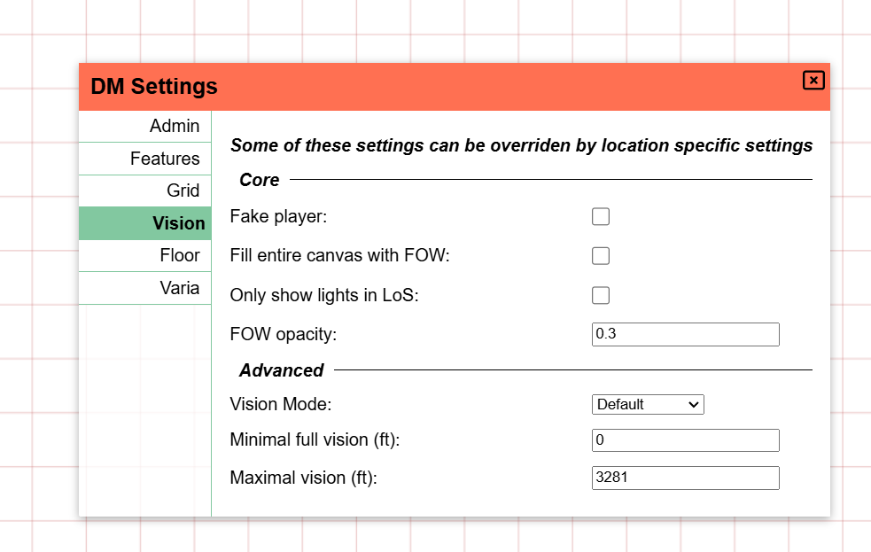
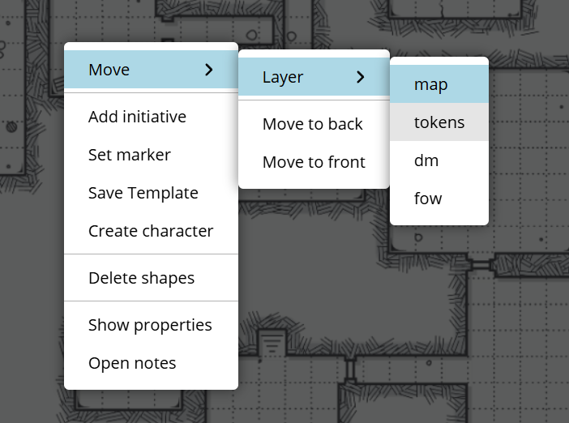
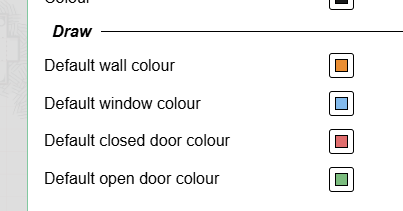
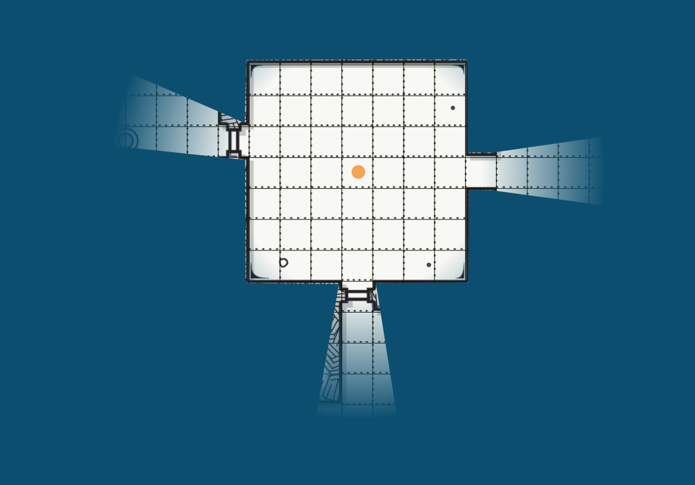

import Cog from "~icons/fa-solid/cog";
import Info from "/src/components/directives/Info.astro";
import Tip from "/src/components/directives/Tip.astro";

# Første kort

De fleste spil kommer til at kredse om et kort. Det er ikke altid tilfældet, men i disse guides går vi ud fra et traditionelt dungeon crawl-opsætning.

I denne guide tilføjer vi et kort, konfigurerer vægge, lys, spillerkarakterer og monstre.

## Konfiguration

Inden vi går i gang med det egentlige arbejde, så lad os først se på noget af den konfiguration, vi måske ønsker at ændre.

Åbn <Cog /> i øverste venstre hjørne og klik på "DM Settings".
Dette åbner brugergrænsefladen, hvor du kan konfigurere en række globale indstillinger for hele kampagnen.

### Admin-indstillinger

<Info>For at tilføje spillere til dit spil skal du sende dem inviteringslinket, som du kan finde på denne fane!</Info>

Mere relevant for vores nuværende forberedelser er dog fanerne for grid og syn.

### Grid-indstillinger

Afhængigt af dit spil kan disse standardindstillinger være fine, eller de kræver lidt justering.

Nogle ting, der er værd at bemærke her:

- Der bruges et firkantet grid som standard, dette kan ændres til hex-grids
- En enkelt grid-celle fortolkes som standard som et 5x5 ft grid til forskellige formål (f.eks. ruler-værktøjet)

### Synsindstillinger

Indtil videre skal du blot aktivere "Fill canvas with FOW".

Personligt kan jeg også godt lide at sætte FOW-dækningsgraden højere (f.eks. 0.7), men det er en smagssag.
Det bestemmer, hvor kraftigt de områder, spillerne ikke kan se, vil være synlige for dig som DM.

Hvorfor aktiverede vi denne FOW-indstilling?

Vi skal simulere en dungeon, der ligger dybt under jorden, så standardopsætningen vil formentlig være, at alt er dækket af mørke, og kun nogle få fakler her og der bringer lys ind i scenen.
Det er derfor, vi fyldte lærredet med FOW.

Med disse indledende indstillinger konfigureret, så lad os lukke DM-indstillingerne og faktisk tilføje et kort.

## Tilføjelse af aktiver

PA har en aktivadministrator, hvor du ligesom i din operativsystems filhåndtering kan organisere uploadede aktiver i mapper, omdøbe dem osv.
Når du har flere spil eller bare vil uploade en masse token-kunst på én gang, så bør du undersøge aktivadministratoren nærmere.

Indtil videre trækker vi bare et aktiv fra dit operativsystems filhåndtering hen på kortet.
Hvis alt gik som det skulle, bør du nu se følgende:

Det kort, der bruges her, blev genereret tilfældigt med [donjon dungeon-generatoren](http://donjon.bin.sh/d20/dungeon/index.cgi).

Bemærk, at skærmen er temmelig mørk. Det skyldes min indstilling på 0.7 for dækningsgrad. Lige nu ville en spiller, der sluttede sig til sessionen, se en helt sort skærm.

## Et intermezzo om lag

Hvis du også fulgte spiller-guiden, har du måske bemærket den ekstra brugergrænseflade i nederste venstre hjørne, som spilleren ikke kunne se.
Det er her, du styrer etager og lag. Etager er et mere avanceret emne, som vi springer over for nu, men lag er et essentielt værktøj i dit DM-arsenal.

Lag er organiseret oven på hinanden og bruges til at forbedre renderingsydelsen, men også til at adskille ansvarsområder.

Det standardvalgte lag er "token"-laget. Dette er beregnet til alle generelle tokens (det være sig spillere, npc'er eller monstre) at leve på.
Det er det eneste lag, som spillerne faktisk kan interagere med.

Som DM har du adgang til en hel række flere lag. Til venstre for token-laget er der map-laget. Dette er det laveste lag, og idéen er, at du placerer dine store kortelementer her.
Dette sikrer, at ingen form på noget tidspunkt sidder fast bag kort-kunsten, eller at du ved et uheld flytter selve kortaktivet.

Det tredje lag er DM-laget. Dette er blot et lag, hvor du som DM kan gemme alt det, du ønsker, som spillerne ikke skal kunne se.
Måske har du et skjult monster et sted, som du kun vil afsløre, når tiden er inde, eller måske har du tilføjet noget tekst bestemte steder som påmindelser.

Det sidste lag er Vision-laget. Vi får snart brug for det, men for nu skal du blot vide, at dette er det sædvanlige sted at tegne vægge og lignende.

### Flytte vores kort

Det, vi faktisk lærte nu, er, at det kort, vi tilføjede tidligere, er på det forkerte lag!

Vi kunne slette kortet, skifte til map-laget og tilføje kortet igen, men det er en del besvær.

I stedet kan du højreklikke på kortaktivet. (Sørg for, at du stadig er på token-laget! Du kan ikke interagere direkte med aktiver fra et andet lag)

Her kan vi flytte den valgte form til et andet lag!
Det er også sådan, du får det skjulte monster på DM-laget til at vise sig på token-laget.

<Info title="Det skjulte lag">
    Der er faktisk et endnu et lag, et som du ikke kan vælge: grid-laget. Grid-laget ligger lige imellem
    map-laget og token-laget og kan kun konfigureres fra DM-grid-indstillingerne, som vi så tidligere.

    Bemærk, hvordan grid-linjerne, da kortet lå på token-laget, var skjult bag kortet, hvorimod de nu faktisk ligger oven på kortet!

</Info>

## Opsætning af lys

Godt, vi har fået vores kort på det rigtige lag, lad os oplyse det!

Enhver form kan fungere som lyskilde, så lad os starte med at tegne en lille cirkel for at repræsentere en fakkel i et eller andet rum.

### Grundform

For at tegne former skal vi bruge draw-værktøjet. Det er et af de værktøjer, der er en del af toolbar'ens Build-tilstand, da dets primære brug er under forberedelsen af sessionen.
Så lad os skifte tilstand til build mode (husk <kbd>tab</kbd>-genvejen) og vælge draw-værktøjet.

Vælg en cirkel (eller en anden form!), en farve, og tegn den på spillebordet. Former tegnes generelt ved at venstreklikke med musen og trække.

<video autoplay loop muted style="max-width: min(680px, 75vw);">
    <source src="/learn/dm/add-light-shape.webm" type="video/webm" />
    <source src="/learn/dm/add-light-shape.mp4" type="video/mp4" />
</video>

### Tilføj lyskilde

Vi kan nu åbne egenskaberne for den netop tegnede form og tilføje en lyskilde!

Dette kan gøres i trackers-fanen ved at konfigurere en aura, der fungerer som lyskilde og er offentlig.

Leg gerne rundt med dette! De to rækkeværdier er henholdsvis den lyse og den svage lysrækkevidde.
I stedet for en fuld cirkel kan du begrænse lyskilden til en kegle og vinkle den i en bestemt retning.

Du kan også give dit lys en bestemt farve for at give det mere af en ægte fakkel-følelse.

<video autoplay loop muted style="max-width: min(680px, 75vw);">
    <source src="/learn/dm/add-light-source.webm" type="video/webm" />
    <source src="/learn/dm/add-light-source.mp4" type="video/mp4" />
</video>

## Ret op på kortets dimensioner

Nu hvor vi har tilføjet et lys, der formodes at have en radius på 40 ft,
spekulerer du måske på, hvordan det egentlig hænger sammen med kortets dimensioner, da vi bare smed kortbilledet på spillebordet uden yderligere ændringer.

Hvis du tog ruler-værktøjet og målte størrelsen af en enkelt grid-celle på kortet, ville du få bekræftet dine mistanker: Kortet er slet ikke skaleret korrekt!
Kortets uoverensstemmelse med PA's grid har måske også allerede afsløret dette ;)

Vi kunne forsøge manuelt at rette kortets dimensioner ved hjælp af select-værktøjet og ændre størrelsen på kortet (i build mode).
Dette er dog fejlfølsomt og besværligt arbejde. I stedet bruger vi et build-værktøj, som kun DMs har adgang til: Map-værktøjet.

Dette værktøj lader dig konfigurere kortets dimensioner. Du kan indtaste den fulde bredde/højde enten i forventede grid-celler eller bare i forventet pixel-bredde/-højde,
men du kan også trække et område op og konfigurere, hvad det område skal repræsentere i antal grid-celler. Jeg synes, det sidste er nemmest.

<video autoplay loop muted style="max-width: min(680px, 75vw);">
    <source src="/learn/dm/map-tool.webm" type="video/webm" />
    <source src="/learn/dm/map-tool.mp4" type="video/mp4" />
</video>

I videoen ovenfor gør vi følgende:

1. Flyt til map-laget (da vi vil interagere med vores kortform)
2. Vælg kortet, og skift til map-værktøjet
3. Træk et område op på kortformen
4. Indtast i map-værktøjet, hvor mange grid-celler det trukne område skal repræsentere både vandret og lodret
5. Jeg talte antallet af vandrette celler, jeg trak, hvilket var 5, og indtastede det i det vandrette felt
6. Før jeg indtastede tallet, klikkede jeg på kædeikonet, som sikrer, at enhver ændring automatisk opdaterer det andet felt for at bevare billedformatet
7. Dette endte med ~5.02 i det lodrette felt, hvilket virker fint
8. Efter at have trykket på apply, bliver kortformen øjeblikkeligt ændret i størrelse, så den passer til vores begrænsninger
9. Det er dog stadig ikke justeret korrekt, så vi går tilbage til select-værktøjet og trækker det, så det overlapper med PA's grid (de røde linjer)

Dette kan føles ret omfattende, men når du først får hovedet omkring det, er det faktisk en ganske hurtig måde at justere kort på.

<Tip title="Tips">
    1. Hvis du trækker et større område, vil præcisionen gå op! Det kræver blot mere arbejde at tælle antallet af
    grid-celler, du har valgt.  
    2. Jeg har mit grid-omrids relativt svagt. Du kan ændre dette i dine klientindstillinger  
    3. Selv hvis slutresultatet ikke er perfekt, burde du nu nemmere kunne ændre kortets størrelse til et mere præcist
    match, nu hvor den generelle størrelse nogenlunde er i orden
</Tip>

## Tilføjelse af vægge

Vi har nu et korrekt justeret kort og et lys, men lyset ignorerer bare vores kort.
For at rette op på dette skal vi informere PA om, hvor væggene er.

<Info>
    Der findes nogle mere avancerede muligheder, som f.eks. at uploade en svg med væginformationen, der kan hjælpe dig
    med denne proces. (Selvom jeg personligt bare tegner væggene manuelt det meste af tiden)
</Info>

Som med lyset vil væggene også blive tegnet med draw-værktøjet.
Det vigtigste spørgsmål er: På hvilket lag ønsker vi at tegne dem?

Selvom der er et optimalt valg, kunne vi faktisk vælge hvilket som helst lag med undtagelse af DM-laget, da disse ikke vil være synlige for spillerne.

Vi kunne tegne dem på map- eller token-laget, men Vision-laget har nogle bekvemmelighedsforbedringer, der gør det mere interessant:

For det første bliver former på Vision-laget ikke gengivet, når de ligger på et andet lag, hvilket betyder, at den visuelle støj fra mange vægforme osv. kan skjules, når du faktisk spiller.
Det betyder også, at du kan farvekode dine former til at betyde bestemte ting (f.eks. at de orange vægsegmenter er hemmelige døre) uden at farverne potentielt bløder ind i hovedscenen.

Den anden fordel er, at når du vælger Vision-laget, aktiverer draw-værktøjet automatisk nogle indstillinger:

Som du kan se, er indstillingerne `blocks vision/light` og `blocks movement` automatisk aktiverede.
Dette er en lille bekvemmelighedshjælp, der gør konfigureringen af vægge en smule nemmere, da du ikke behøver at huske at konfigurere disse indstillinger, hver gang du vil tegne en væg.

Disse 2 indstillinger er ganske vigtige og kan ændres efter tegning. Som navnet antyder, vil lys og bevægelse blive blokeret gennem denne form.
Hvilket du normalt ønsker for en væg! Hvis vi vil efterligne et vindue, vil vi beholde `blocks movement` aktiveret, men deaktivere blokeringen af lys og syn.

<Info title="Standardfarver">
En anden bekvemmelighedsfunktion er standardfarveopsætningen for vision-former.
Disse kan konfigureres under Appearance-fanen i dine klientindstillinger:
 

Formen vil automatisk bruge den farve, der er defineret her, når det er relevant. (f.eks. former med begge block-indstillinger aktiveret fungerer som vægge, og dem med kun bevægelse blokeret fungerer som vinduer).

Hvis du vil tegne disse former i en bestemt farve i stedet for deres standard, kan du fjerne markeringen i 'Prefer default colours'-indstillingen i draw-værktøjets vision-indstillinger.

</Info>

Med alt det af vejen, så lad os faktisk tegne vores væg! Du kan bruge hvilken som helst form, men polygon-værktøjet er det mest alsidige til vægtegning.

<video autoplay loop muted style="max-width: min(680px, 75vw);">
    <source src="/learn/dm/draw-walls.webm" type="video/webm" />
    <source src="/learn/dm/draw-walls.mp4" type="video/mp4" />
</video>

Som du kan se, er det super nemt at tegne vægge! Det er lidt en stilistisk præference, hvor meget af selve væggen du vil holde synlig for spillerne.
Jeg kan normalt godt lide at vise dem lidt, så de visuelt kan se, at der er en væg, i stedet for kun at stole på skygger.

<Tip>
    Du skal højreklikke for at færdiggøre polygonformen!
     
    Vær ikke for bekymret over linjer, der ikke er lige, eller punkter du glemte at tilføje. Select-værktøjet i build
    mode giver dig mulighed for at flytte punkter på polygonen samt tilføje nye punkter eller fjerne eksisterende
    punkter. At få det store billede tegnet først med nogle justeringer bagefter er normalt meget hurtigere.
</Tip>

Tjek, hvordan det ser ud, når du nu f.eks. går til token-laget, og bemærk, at de tegnede vægformer er væk, men skyggen er tilbage!

## Tilføjelse af karakterer

Vi har nu et kort med nogle vægge og en lyskilde, men ingen karakterer endnu. Der er intet, der repræsenterer spillerne, og der er ingen monstre eller npc'er.

Vi kan trække og slippe nogle tokens på spillebordet, ligesom vi gjorde med kortet. I dette eksempel-opsætning vil vi dog oprette en basiskarakter-token i PA selv.
Disse er små cirkulære tokens med bare et tekstlabel. Nemme til hurtig prototyping, eller når du hurtigt har brug for en npc på spillebordet og ikke vil spilde tid på at lede efter et aktiv i din session.

For at tilføje en basiskarakter-token skal du højreklikke på et tomt sted på spillebordet. Ideelt set gør vi dette på token-laget!

<video autoplay loop muted style="max-width: min(680px, 75vw);">
    <source src="/learn/dm/basic-token.webm" type="video/webm" />
    <source src="/learn/dm/basic-token.mp4" type="video/mp4" />
</video>

I videoen ovenfor:

- Opretter vi en basis-token med navnet "test"
- Giver vi spilleren med brugernavnet "test" adgang til formen
- Trækker vi rundt på den en smule for at teste, om væggen virker, og det gør den!

Hvis vi nu tjekker, hvad spilleren med brugernavnet "test" kan se, bemærker vi følgende problem:

Vores spiller kan se alt i rummet med lyset, mens deres karakter slet ikke er der!

### Synsadgang

Før vi dykker ned i synslinje-synet, må vi en hurtig afstikker for at tale om formernes adgangsniveauer.

Da vi tilføjede 'test'-spillerens adgang til formen ovenfor, blev de 3 adgangsrettigheder (edit/movement/vision) tildelt automatisk.
De 3 adgangsrettigheder gives ikke altid med det samme; det afhænger af konteksten, så det er vigtigt at forstå, hvad de gør.

Især synsadgangsrettigheden er vigtig, da den afgør, hvad spillerne kan se.
Med adgangen aktiveret antager PA, at spilleren har synsadgang til formens private auraer og i det væsentlige ser, hvad token kan se i verden.

Selv hvis der ikke er konfigureret nogen auraer på token, vil der altid være en minimal synsaura omkring dem, så du ikke mister dem, når du bevæger dig til et sted, hvor du ikke kan se meget.

Hvis du deaktiverede synsadgangen for token, ville vi i stedet se følgende:

Så selvom vi har edit- og movement-adgang, ser vi faktisk ikke formen, fordi intet i øjeblikket oplyser det område, som formen befinder sig i.

## Syn

Som nævnt tidligere kan det virke en smule mærkeligt, at spilleren kan se det rum, der var oplyst af lyset, mens de ikke er der med deres karakter.
Det skyldes, at vi i øjeblikket ikke anvender nogen synsbegrænsninger på spilleren. De kan bare se alt, der er (offentligt) oplyst.

Dette kan fungere fint i visse opsætninger, men når du forventer, at spilleren kun kan se, hvad deres karakter kan se,
kan dette blive meget besværligt, da du som DM bliver nødt til at tænde og slukke lys, mens de udforsker kortet.

Og denne arbejdskrævende tilgang vil stadig ende med, at spillere kan se, hvad andre spillere ser, hvilket heller ikke nødvendigvis er, hvad du ønsker.

For faktisk at aktivere syn pr. karakter korrekt har vi brug for to ting:

1. Spillerne skal have synsadgang over deres former
2. Lokationen skal konfigureres til at have synslinje aktiveret

(1) Vi dækkede dette i det tidligere afsnit om synsadgang, så det er allerede dækket, men for (2) skal vi tilbage til vores DM-indstillinger [hvor vi aktiverede "fuld FOW"-indstillingen tidligere](#vision-settings).

<Tip>
Hvis du har flere lokationer (se senere), kan disse DM-indstillinger ofte også konfigureres pr. lokation.

DM-indstillingerne er standardindstillingerne og vil blive brugt, når de ikke eksplicit er tilsidesat af en lokation.

</Tip>

Hvis alt gik rigtigt, har vi nu følgende visning (på DM-siden):

Det, der sker her, er, at spilleren nu kun ser de steder, hvor der er lys, visuelt inden for deres synslinje baseret på de vægge, vi tegnede.
(Husk, at vi kun tegnede den indre væg i kammeret til højre).

For at hjælpe dig med at visualisere, hvorfor dette vises, lavede jeg denne skitse:

- De røde linjer er de vægge, vi lavede. De blokerer lys.
- De gule linjer viser den kegle, som lyset udsender, og som går gennem den døråbning, vi efterlod i væggen
- De grønne linjer viser den kegle, som karakteren kan se ind i det andet rum med, gennem den samme døråbning

For det rum, karakteren er i:

- Karakteren kan se hele rummet
- Lyset oplyser kun et afsnit (den gule kegle)

-> Kun kegleafsnittet er faktisk synligt

For det rum, lyset er i:

- Karakteren kan kun se det grønne kegleafsnit
- Lyset oplyser hele rummet

-> Kun kegleafsnittet er faktisk synligt

### Spillerauraer

Normalt har karakterer en eller anden medfødt evne til at se gennem mørke op til en vis afstand, eller også har de simpelthen en genstand som en fakkel, der giver lys.

Vi [så tidligere](#add-light-source), hvordan man opretter en aura for lyset i det andet rum. Vi kan simpelthen gøre det samme for vores spillerkarakter!
Åbn formindstillingerne, gå til Trackers-fanen og tilføj en ny aura.

Auraer, der er konfigureret som offentlige, vil vise sig for alle spillere (med syn på auraen), så det er perfekt til en fakkel, hvorimod en privat aura er bedre egnet til medfødte evner som mørkesyn.

Det er vigtigt at markere egenskaben 'acts as light source', da det er det, der faktisk får den til at fungere som en lys/synskilde. (synskilde er nok et bedre navn)

--

Dette burde give dig det essentielle til at få dine kort klar til spil!

[Næste gang](/da/learn/dm/other-features) kigger vi på nogle andre funktioner, du formentlig bør kende til som DM.
