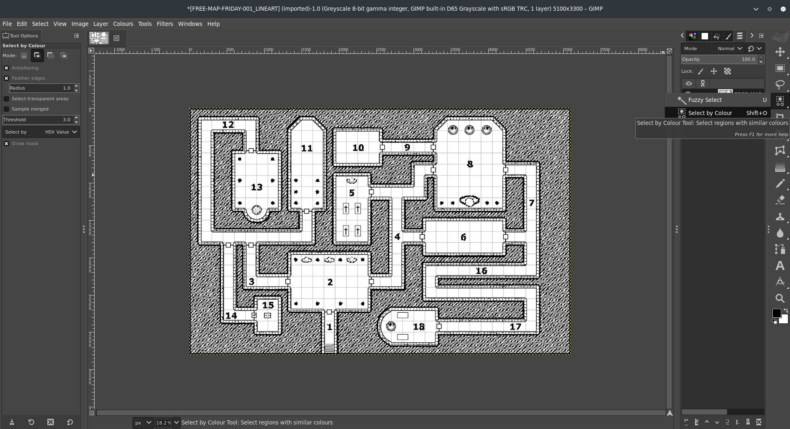
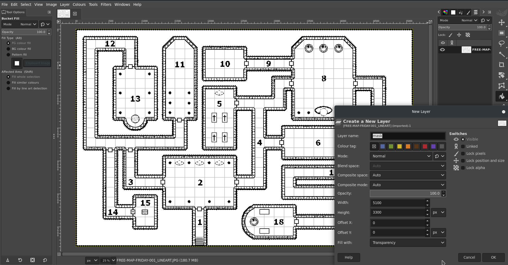

# Guide til vægmasker

Guide bidraget af [@veritanuda](https://keybase.io/veritanuda)

Denne metode burde virke på de fleste kort afhængigt af detaljegraden, men selv uregelmæssige kort som huler kan nemt maskeres ud.

# Krav

De følgende instruktioner er til de frit tilgængelige værktøjer [GIMP](https://gimp.org) og [potrace](https://potrace.sourceforge.net/). Du kan naturligvis bruge kommercielle værktøjer til at opnå det samme resultat, men der er ingen garanti for, at de opfører sig på samme måde.

---

Nedenfor vil jeg vise 2 metoder.

- Den ene metode er til dungeons og færdiglavede kort
- Den anden metode er til uregelmæssige kort og brugerdefinerede kort.

# **Metode ét**

Til denne metode vælger jeg et tilfældigt kort fra Free Friday Maps. Du kan få det [her](https://www.drivethrurpg.com/browse/pub/10213/Paths-to-Adventure/subcategory/25973_33572/Free-Map-Friday), men ethvert kort duer, så længe det har et par centrale egenskaber.

- Det har en sort/hvid-version, og
- det har en mulighed uden grid.

    Disse er ikke afgørende, men de gør blot det at lave masken lidt mindre tidskrævende.

Så dette er det kort, jeg starter med.

Det findes i flere varianter, inklusive Lineart. Det er det, vi vil bruge.

# Fjernelse af baggrunden

Dette kort har noget uregelmæssig skravering omkring kortet som baggrund. Heldigvis er den dog en anden farve, en slags grå. Så ved at vælge værktøjet `Fuzzy select/Colour Select`, vælge `Colour Select` og klikke på et af de grå områder i baggrunden burde du se alt det grå blive fremhævet.

Det er godt, men da linjerne imellem dem ikke er valgt, vil det, hvis vi sletter dem nu, blot efterlade det sorte, knækkede flise-mønster.

Så mens alt er valgt, skal du højreklikke på billedet og gå til `Select` `>` `Grow...`

Udvid markeringen et par pixels, indtil den dækker linjerne mellem de grå pletter. Når du er tilfreds med, at du har fået det hele med, skal du trykke `Delete`, og _POOF_ forsvinder baggrunden.

Gå nu tilbage til `Fuzzy Select`, og vælg denne gang `Fuzzy Select`. Klik på den nu hvide baggrund, og se at alt bliver valgt.

- _Bemærk: Hvis du har lukkede rum, som dette kort har, skal du holde shift-tasten nede og klikke i rummet for at tilføje det til markeringen._

Gå nu i panelet `Layers` til `New Layer`, og kald dette lag `mask`.

På dette lag skal du vælge værktøjet `Bucket Fill`. Klik på den markering af baggrunden, du lavede tidligere, og den burde blive fyldt helt sort.

Skjul lineart-laget, og kontrollér, at du har en komplet maske uden manglende stykker.

Hvis du har overset noget, så gå ikke i panik. Tryk blot `Cntrl-Z` for at fortryde og gå tilbage til at vælge de dele, du overså tidligere.

Afhængigt af kortet og hvordan du valgte baggrunden kan nogle døre også være blevet malet. Du bliver nødt til at gå over alle døre og hemmelige døre med Erase-værktøjet og den penselstørrelse, der passer bedst, og fjerne det sorte.

Hvis du ikke gør dette, gør du en dør ufremkommelig. Du kan altid tilføje dør-tokens til enhver åbning, du har lavet, når kortet er importeret, og væggene er tilføjet.

Når du er tilfreds med din maske, kan du slette lineart-laget.

Den næste del er **afgørende**, hvis du vil konvertere det ordentligt til SVG, hvilket er det, PlanarAlly bruger til vægge.

Højreklik på billedet og gå til `Image` `>` `Mode`. Hvis du importerede linearten, som jeg gjorde, ville den have været i `greyscale`. Nogle gange skal du konvertere et farvekort til `greyscale` for at gøre det nemmere at slette baggrunde osv. Men nu skal tilstanden være `RGB`. Skift billedet til det.

Højreklik derefter på billedet, gå til `File` `>` `Export As...`, og gem billedet som en `BMP`. Slå `Run Length Encoding` FRA, slå `Do not write colour space information` FRA, og sørg for, at du under `Advanced` er på `32 Bits`.

Når det er gemt, kan du enten bruge kommandolinjen `potrace`, eller du kan gøre det online gratis på [denne hjemmeside](https://svg-converter.com/potrace)

Kommandoen til at gøre det selv er ekstremt enkel.

`potrace -s FREE-MAP-FRIDAY-001_LINEART_WALLS.bmp`

Dette burde give dig en `svg`, som, hvis du åbner den i et grafikprogram, bør være sort, hvor lyset vil blive blokeret, og klar, hvor lyset kan skinne igennem.

# **Metode to**

Lad os sige, du har et uregelmæssigt kort, eller at baggrunden ikke er så let at fjerne. Du kan stadig lave en maske i hånden med bare normale værktøjer.

Til dette eksempel vil jeg bruge [dette kort](https://www.reddit.com/r/FantasyMaps/comments/hrf51h/battlemap30x202160x1440pxcavejunglepirateoc/)

Importer kortet til gimp.

Opret et nyt lag, og kald det `guide`.

Med `Pencil tool` skal du vælge `Circle` som pensel og gøre den sort. Tilpas størrelsen efter behov. Sørg for, at du har valgt `guide`-laget, og begynd derefter at tegne på kortets farvede dele **inden** for væggene.

Når du er tilfreds med, at du har fyldt hele formen ud, opretter du et andet lag kaldet `walls.`

På `guide`-laget skal du bruge værktøjet `Select by colour` og klikke på den sorte guide, du har lavet. Invertér derefter markeringen.

Brug derefter bucket fill-værktøjet på `walls`-laget til at fylde den inverterede markering med sort og fylde væggene ud.

Når det er gjort, skjuler du de tidligere lag. Hvis du er tilfreds med, at du ikke har overset noget, sletter du disse lag og gemmer billedet som BMP som ovenfor, så det kan konverteres med en af de to ovenstående metoder.

# Import af vægge til PA

Upload nu denne SVG til din `Assets`-mappe på PlanarAlly sammen med spillekortet og GM-kortet, hvis der er et.

Træk disse aktiver til en lokation, hvor spillerkortet ligger på MAP-laget og GM-kortet ligger på GM-lagene. På MAP-laget skal du højreklikke på det, åbne Properties og sætte et `Name`. Under `Advanced` skal du markere `Blocks Vision/Light` og `Blocks Movement`. Gå derefter til fanen `Extra`, og under `Lighting & Vision` `>` `Upload walls`. Vælg den SVG, du lige uploadede til dine aktiver. Dine vægge burde nu være anvendt.

Test det med en token, der har en lyskilde på `Token`-laget, og så er du næsten færdig. Hvis der nu er døre eller hemmelige passager, skal de isoleres manuelt med dør-tokens eller krigståge — dit valg. Men hvis alt går vel, burde du ikke behøve at bekymre dig om at lave vægge i hånden igen.

God fornøjelse med spillet!

\*/}
