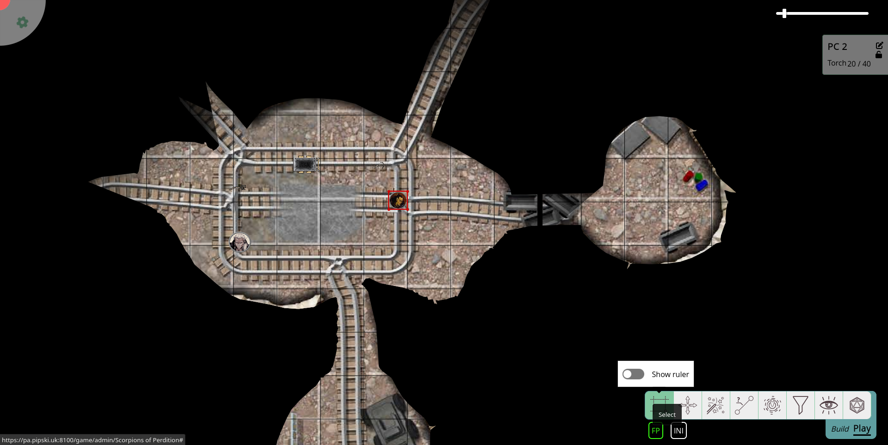

import Lightbulb from "~icons/fa-solid/lightbulb";

# RTS-lignende belysning

Guide bidraget af [@veritanuda](https://keybase.io/veritanuda)

Denne tutorial fokuserer på et mere komplekst belysningssetup.
Sørg for, at du er fortrolig med PlanarAllys [belysnings- og synssystem](/da/docs/dm/lighting-vision/) samt [lagene](/da/docs/dm/layers) og token'ernes [auraer](/da/docs/game/shapes/#trackers--auras) og [adgang](/da/docs/game/shapes/#access).

I denne tutorial vil vi efterligne RTS-lignende (*R*eal *T*ime *S*trategy) belysningssetups.
Setup'et **vil**:

- give spillerne et kort at udforske og
- vise dem de områder, de allerede har udforsket.

Setup'et **vil ikke**:

- tage højde for spillernes faktiske synslinje, men arbejde med forenklinger,
- tilføje 'tynd krigståge', der kun skjuler tokens, men ikke kortet (PlanarAlly kan ikke dette), eller
- automatisere processen.

## Koncept

Realtidsstrategi-spil konfronterer ofte spillerne med uudforskede kort.
Men i det øjeblik en spejder når frem til området, afsløres kortet, og enhver krigståge vil kun skjule andre spilleres enheder, men ikke kortet.
Dette er en funktion, der ofte er blevet efterspurgt.
Alligevel er den af forskellige årsager ikke blevet implementeret i PlanarAlly (endnu?).

Men det er nemt at efterligne en lignende effekt.
Den vil have de førnævnte ulemper, men vil give spillerne mere (og bedre) orientering på kortet end blot deres egen synslinje.

I bund og grund vil vi

- opdele kortet i zoner,
- forsyne disse zoner med lyskilder, én for hver zone,
- oplyse zonerne i det øjeblik, spillerne har udforsket dem, så de kan se dem, når de forlader dem.

## Forberedelse

Konfigurér først dit almindelige kort med belysnings- og synssystemet: fyld lærredet med krigståge, og tilføj nogle vægge og lys, som det passer dig.

### Sektorer

Kig derefter på dit kort for at identificere dele, der kan udforskes uafhængigt.
For din almindelige dungeon burde dette være let, da den allerede er opdelt i flere rum.

Placér nu en eller flere lyskilder (afhængigt af zonens layout).
Disse lys burde kunne oplyse hele zonen.
Du vil sandsynligvis have skarpe auraer uden dæmpet lys i kanterne.

Skjul lysene på _DM_-laget og/eller deaktiver auraerne til senere brug.

## Implementering

I det øjeblik zonen skal være synlig for dine spillere (enten når de træder ind i den, eller når de har udforsket den fuldt ud), tænder du lysene.
Gør dette ved at aktivere auraen (hvis du har deaktiveret den) og flytte lyskilden til `fow`-laget for at oplyse zonen.
Sæt også lyskilden til _public_, så spillerne faktisk kan se den.

Da lyskilden er på _fow_-laget, vil dens aura blive tegnet på token-laget, mens selve formen forbliver usynlig.
`fow`-laget vil også fjerne _enhver_ farve fra auraen.

Hvis du vil kunne skelne mellem faktisk syn og RTS-lignende syn, så giv enten spillernes syn en let farvetone, eller flyt lyskilderne til _map_-laget i stedet.
Du kan enten gøre token usynlig eller skjule den under eventuelle kortbilleder, du har tilføjet via funktionen `move to back`.
Brug funktionen `lock` til at forhindre, at du ved et uheld trækker lysene med din gruppe eller andre elementer på kortet.

Hvis du har aktiveret indstillingen _only show lights within line-of-sight_, skal du i stedet tilføje _vision_-adgang for alle spillere til de lys, du vil bruge.
Ellers vil de miste kendskabet til den allerede udforskede zone, så snart der er en væg mellem dem og den pågældende zone.
I så fald vil du måske tilføje adgangs-_entries_ for alle spillere i lyskildernes egenskaber på forhånd, mens du deaktiverer alle adgangsniveauer.

På denne måde skal du blot markere et par <Lightbulb/>-ikoner for at oplyse en zone.

Bemærk, at dette ikke kun oplyser _map_-laget, men også _tokens_-laget.

Hvis du vil skjule fjendens bevægelser for dine spillere, kan du flytte deres tokens til _DM_-laget.
