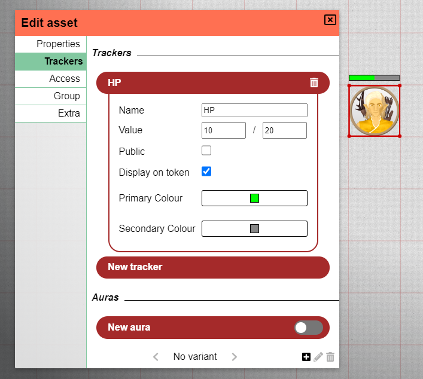

Dieses Release enthält eine ziemliche Vielfalt an Inhalten: Es gibt einige UI-Redesigns, neue Werkzeug-Optionen, QoL-Verbesserungen und mehr!

Erwähnenswert ist außerdem, dass das Release Beiträge mehrerer Mitwirkender vom Discord-Server enthält. Besonderen Dank an scoodle und mischievous!

## Dashboard-Redesign

Wir beginnen mit einer der offensichtlichsten Änderungen, dem Dashboard!
Das Dashboard ist die Seite, die du nach dem Einloggen siehst und auf der du die Kampagne auswählst, die du spielen/leiten möchtest.

Diese Seite wurde komplett neu gestaltet und sieht nun so aus:

### Menü

Die linke Seitenleiste fungiert als Menü, das dir sofortigen Zugriff auf verschiedene Ansichten bietet.

Der erste Abschnitt des Menüs dreht sich um alles Spielbezogene: „Play" listet alle Sitzungen auf, in denen du aktiver Spieler bist,
„Run" zeigt alle Sitzungen, die du leitest. Zuletzt erlaubt die Option „Create", eine neue Kampagne anzulegen.

Der zweite Teil dreht sich um alles rund um Assets. Das Menü „Manage" öffnet den Asset-Manager, eine Komponente, die zuvor nur aus einem Spiel heraus zugänglich war. Die Option „Create" ist hier noch nicht verfügbar, wird aber in einem zukünftigen Release enthüllt!

Schließlich gibt es noch eine Aktion, um die Einstellungen zu öffnen und sich auszuloggen.

Ein wichtiger Hinweis: Die Einstellungen und der Manager öffnen sich derzeit noch in ihren ursprünglichen Komponenten, aber es ist beabsichtigt, sie neu zu gestalten, damit sie in diese neue Dashboard-UI passen.

### Run/Play

Im Run- und Play-Modus erscheint rechts eine zweite Leiste mit weiteren Details zur aktuell ausgewählten Kampagne.

Auffällig neue Ergänzungen sind die Möglichkeit, Logos festzulegen (nur DM), kleine persönliche Notizen zu einer Kampagne zu erstellen, den letzten Spielzeitpunkt in der Kampagne zu sehen sowie Aktionen zum Verlassen/Löschen der Kampagne.

## Werkzeuge

### Erase-Modus für Etagen (DM)

Eine neue Ergänzung der Zeichenmodi für den DM ist der „Erase"-Modus.

Dieser spezielle Modus erlaubt es dir, Bereiche auf deiner aktuellen Etage transparent zu machen, sodass du und die Spieler sehen könnt, was auf der Etage darunter passiert.

Du könntest das für plötzliche Explosionen nutzen, die ein Loch in der Etage öffnen, oder vielleicht hast du einfach vergessen, etwas bei der Vorbereitung transparent zu machen, und möchtest es direkt in PA bearbeiten.

Im obigen Bild gibt es 2 Etagen.
Die untere Etage enthält ein Rechteck in Türkis.
Die obere Etage enthält alle anderen Formen.

Die Polygon-Form, die rechts grob einem dicken Pfeil ähnelt, ist eine Form, die im Erase-Modus gezeichnet wurde.
Sie gewährt einen Blick auf die untere Etage.

Diese Form ist wie jede reguläre Form Teil des Zeichen-Stapels! Wie du siehst, liegt das rote Rechteck über dieser Polygon-Form, als würde ein Baumstamm quer über die Öffnung in der Etage liegen. Wenn du das Polygon nach vorne (oder das rote Objekt nach hinten) bewegst, wären nur die roten Teile sichtbar, die nicht vom Polygon verdeckt werden!

Ein letzter wichtiger Aspekt: Diese Form wird beim Zeichnen automatisch auf der Karten-Etage erstellt. Es hindert dich jedoch nichts daran, sie auf eine andere Etage zu verschieben.

### Text-Formen

Eine ziemlich einfache neue Ergänzung des Zeichen-Werkzeugs, die allen zur Verfügung steht, ist die Option, Text zu „zeichnen".

Diese erste Version ist relativ einfach: Sie bietet eine Texteingabe, wenn du mit dieser ausgewählten Form linksklickst.
Die Form kann wie andere Formen rotiert/vergrößert oder verkleinert werden.

Erwarte in der Zukunft einige weitere Verbesserungen.

### Größenänderungen bei Ping und Lineal

Die Pings und Lineale, die du gezeichnet hast, hatten immer eine einheitliche Größe.
Wenn andere Spieler sie jedoch zeichneten, wurde ihre Größe von deren Zoomstufe beeinflusst und nicht von deiner.
Das führte möglicherweise dazu, dass einige Lineale auf deinem Bildschirm sehr dick oder sehr dünn erschienen oder Pings schwer zu erkennen waren.

Dieses Release ändert die Regeln für diese Formen: Sie werden immer exakt in derselben Größe gezeichnet. Die Zoomstufe von dir oder der zeichnenden Person ist für diese Entscheidung nicht mehr relevant.

### Update des Zauberkegel-Icons

Ein kleines QoL-Update: Das Zauberkegel-Icon ist jetzt ein gefüllter Kegel.
Danke an meinen Freund Jiri.

## Einstellungen

### Redesign der Client-Einstellungen

Das Dashboard war nicht die einzige UI, die aufgefrischt wurde, auch die Client-Einstellungen haben einen neuen Anstrich bekommen!

Statt Teil des Seitenmenüs zu sein, öffnen sich die Client-Einstellungen nun in einem Modal, genau wie die DM-Einstellungen.
Das bietet mehr Platz zum Atmen und auch mehr Spielraum für weitere Optionen.

Im Rahmen dieses Redesigns gibt es nun auch das Konzept kampagnenspezifischer Client-Einstellungen.
Wenn du eine Einstellung änderst, erscheinen daneben zwei Icons, die anzeigen, dass die Einstellung von den Standardeinstellungen abweicht.

Das linke Icon setzt den Wert auf die globale Einstellung zurück, während das rechte Icon diesen neuen Wert zum neuen globalen Standard macht.

In einem späteren Release werden die globalen Einstellungen auch aus der Dashboard-Einstellungsansicht heraus bearbeitbar sein.

### Scrollen zum Zoomen deaktivieren

Eine häufig gehörte Beschwerde von Spielern mit Touchpads betrifft eine Option, um zu deaktivieren, dass das Zoom-Werkzeug beim Scrollen aktiviert wird,
da dies bei einem Touchpad sehr leicht versehentlich passiert.

Diese neue Option ist nun in den Client-Einstellungen unter „Verhalten" verfügbar!

### Co-DM-Option (DM)

Als DM kannst du Spieler nun von deinen Haupt-DM-Einstellungen aus zur Co-DM-Rolle befördern.

## Formen

### Besiegt

Formen haben in diesem Release nur eine kleine Änderung erhalten, und zwar eine „Besiegt"-Eigenschaft.
Wenn du dieses Kästchen in den Formeigenschaften anklickst oder „x" drückst, während eine oder mehrere Formen ausgewählt sind,
wird über alle betroffenen Formen ein rotes X gezeichnet.

_Dies wurde von scoodle auf Discord beigesteuert!_

### Visuelle Balken für Tracker

Tracker haben dieselbe UI-Überarbeitung erhalten wie Auren im letzten Release.
Sie haben nun eine zusätzliche Checkbox und zwei Farbeingaben.

Wenn „Auf Token anzeigen" aktiviert ist, wird über dem Token ein Balken in den 2 von dir gewählten Farben gezeichnet.

_Dies wurde von scoodle auf Discord beigesteuert!_

## Wand-Informationen laden (DM)

Eine weitere Frustration, die manche DMs manchmal haben, ist die mühsame Arbeit beim Zeichnen von Wänden für das Sicht-System.

Dieses Release fügt 2 Optionen hinzu, um Wand-Informationen aus alternativen Quellen zu „importieren".

### dungeondraft

Dungeondraft ist ein beliebter Dienst, um deine Karten vorzubereiten, bevor du sie in einen VTT importierst.
Sie bieten Exporte im benutzerdefinierten dd2vtt-Dateiformat an.

Dieses Format wird nun von PlanarAlly verstanden. Wenn du ein solches Asset auf dem Spieltisch ablegst, sind diese Informationen angehängt.

Aus technischen Gründen werden die mit der dd2vtt-Datei verbundenen Wände, Türen und Lichter nicht sofort zur Szene hinzugefügt.
Stattdessen kannst du das Asset zuerst in eine Form bringen, mit der du zufrieden bist, und dann alle zusätzlichen Informationen laden, indem du zum Tab „Extra" in den Formeigenschaften wechselst und auf die Schaltfläche „Apply ddraft info" klickst.

Alle Informationen werden als richtige PlanarAlly-Formen zum Spieltisch hinzugefügt. Das bedeutet, du kannst Dinge vergrößern/verkleinern, unnötige Lichter entfernen usw.

### svg

Ein weiterer Ansatz, der nun verfügbar ist, besteht darin, eine svg mit Wand-Informationen an ein beliebiges Asset anzuhängen. Ähnlich wie bei den Dungeondraft-Dateien funktioniert das über den Tab „Extra" in den Formeigenschaften.

**Eine sehr große Warnung**: Halte diese svgs einfach, sonst erlebst du eine Welt voller Schmerzen.

Diese svgs sind dafür gedacht, nur Wand-Informationen zu enthalten. Stelle also sicher, dass du Wände, Hintergründe usw. entfernst, bevor du sie hinzufügst.

Ein letzter Hinweis: Diese Wände sind nicht interaktiv, sie sind rein intern in der Form, sodass du sie derzeit nicht vergrößern/verkleinern kannst usw.

## Lebensqualität

### Der große rote Rahmen

Es wird nun einen großen roten Rahmen um den Bildschirm geben, wenn die Verbindung zum Server unterbrochen ist.

Je nach Problem sollte sich die Verbindung automatisch wiederherstellen, aber alles, was du während der Unterbrechung geändert hast, könnte verloren gehen.
Das war schon immer so, aber jetzt sollte dir klar sein, wann Fortschritt verloren gehen könnte.

### Mac-Tastenkürzel

Alle Tastenkürzel, die die ctrl-Taste verwenden, nutzen auf Mac-Computern nun die cmd-Taste.

### Schriftarten-Laden

Die in PlanarAlly verwendete Opensans-Schriftart wird nun vom Server geladen statt von Google Fonts.
Andernfalls könnte das beim Offline-Spielen zu Schriftproblemen führen.

### Ladeanimation

Der langweilige Spinner wurde durch eine schicke 3D-Würfel-Transformationsanimation ersetzt.

<video loop autoplay muted style="max-width: 680px;">
    <source src="https://app.planarally.io/static/img/loading.webm" type="video/webm" />
</video>

_Animation erstellt von Jiri auf Discord_

## Server

### Öffentlichen Hostnamen festlegen

Standardmäßig verwendet die Einladungs-Link-Anzeige in den DM-Einstellungen die aktuelle Browser-URL, um den Host zu ermitteln.
Wenn der DM jedoch über eine lokale IP oder localhost verbunden ist, ist die URL für andere Spieler unbrauchbar.

Eine neue Einstellung in der Server-Konfiguration erlaubt es dir, ein `public_name` festzulegen, das, wenn gesetzt, immer als Root-Host verwendet wird.

_Dies wurde von mischievous auf Discord beigesteuert!_

## Bemerkenswerte Bugs

### doppelter Etagenname (DM)

Es ist nicht mehr möglich, eine Etage mit einem Namen zu erstellen, der bereits verwendet wird.
Das konnte zu mehreren Problemen bei der Interaktion mit den beiden Etagen führen.

Das ist ein Quick-Fix, sollte aber ohnehin keine allzu großen Einschränkungen mit sich bringen.

### Unterbrechungen beim Datei-Upload

Es wurde ein Fix hinzugefügt, um zu verhindern, dass große Datei-Uploads nach kurzer Zeit stoppen.

_Dies wurde von scoodle auf Discord beigesteuert!_

### Token-Einrasten beim Verlassen von Wänden

Wenn du beim Bewegen eines Tokens mit der Maus in eine Wand fährst, konntest du beim Zurückkehren aus der Wand desynchron von der Form werden.
Das ist nun behoben.

### Template ablegen mit nicht-standardmäßiger Rastergröße

Beim Ablegen einer Form mit einem Template, das Größeninformationen enthält, auf dem Spieltisch, aber mit einer nicht-standardmäßigen Rastergröße,
wurde die Form falsch skaliert.

### Sichtbarkeit von Varianten-Formen

Bei Verwendung der experimentellen Varianten-Funktion konnten alle Spieler jede Varianten-Form jederzeit sehen.

### Kontextmenü außerhalb des Bildschirms

Beim Öffnen eines Kontextmenüs am unteren oder rechten Bildschirmrand fiel der Inhalt aus dem Bildschirm.
Diese Menüs kennen nun die Ränder und passen sich entsprechend an.

### Zurücknavigieren

Beim Zurücknavigieren, entweder über die Browser-Zurück-Schaltfläche oder eine Taste an deiner Maus, aktualisierte sich die URL korrekt,
aber es änderte sich nichts. Das ist nun behoben.
