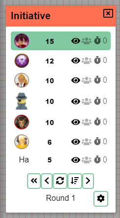

Es ist schon eine Weile her, seit wir ein weiteres Release hatten.
Die gute Nachricht ist, dass nur wenige Bugs gemeldet wurden, das 0.26-Release also ziemlich stabil war, was immer schön zu sehen ist.
Die schlechte Nachricht ist, dass dieses Release etwas holpriger werden könnte – und wir werden bald sehen, warum.

Dieses Release war in erster Linie für eine Sache gedacht: das reaktive Framework, das PA verwendet (Vue), von Version 2 auf Version 3 zu heben.
Das ist eine sehr technische Änderung, die _idealerweise_ keine direkten Auswirkungen auf die Benutzererfahrung haben sollte, aber eine Menge Code berührt, weshalb ich einen längeren Zeitraum haben wollte, um zu überprüfen, ob sich alles richtig verhält. Ich werde am Ende dieses Artikels im Detail erklären, was die Änderungen bedeuten, um die eigentlichen Benutzer nicht zu verschrecken! :)

Aber interne Codeänderungen sind nicht die einzige Änderung: Initiative wurde überarbeitet, es gibt einige neue Extras für die Nutzung von PA als physisches Spielbrett, und es gab wieder einige wunderbare Beiträge aus der Community. Also lass uns eintauchen!

## Initiative

Das Initiative-Werkzeug, wie es bisher funktionierte, wurde nach einem Reddit-Kommentar, der nach Initiative-Unterstützung fragte, quasi an ein paar Tagen zusammengehackt. Es erfüllte seinen Zweck, hatte aber immer einige kleinere Probleme. Ich habe mir endlich die Zeit genommen, diese offenen Probleme anzugehen und einige der Funktionalitäten der Initiative zu überdenken.

### UI/UX

Eines der Probleme war, dass die Benutzeroberfläche sehr unruhig wirken konnte.
Besonders für Spieler, die immer die Admin-Buttons sehen konnten, aber in keiner Weise mit ihnen interagieren konnten.

#### DM-Leiste

Aktionen, die nur für DMs gedacht sind, wurden in eine separate "DM-Leiste" verschoben und sind nur für (Co-)DMs sichtbar.

#### Einstellungen

Darüber hinaus wurden die Symbole für Kamera- und Sicht-Sperre zu den Client-Einstellungen verschoben, die über ein kleines Zahnrad-Symbol aufgerufen werden können.
Das löst auch den "Bug", dass Leute, die diese Einstellungen häufig verwenden, diese Konfigurationen in der Vergangenheit immer neu anwenden mussten.

#### Entfernen

Eine weitere auffällige Änderung sollte das Entfernen des Papierkorbs von den Symbolen für jeden Initiative-Akteur sein.
Für etwas, das nicht _so_ wichtig ist, dass es ständig sichtbar sein muss, nahm es einiges an Platz ein.
Stattdessen erscheint nun ein kleines rotes Kreuz in der oberen rechten Ecke, wenn du mit dem Mauszeiger über einen Initiative-Akteur fährst.

#### Eingabefeld

Schließlich wurde dem Eingabewert selbst mehr Breite gegeben. Es hat jetzt etwas Platz zum Atmen!
Es hat auch ein neues Styling und sticht nicht mehr als dieses seltsame Eingabefeld hervor, sondern sieht jetzt wie ein "normales" Element im Modal aus.

Während du deine Initiative eingibst, ist es möglich, dass du den Fokus über dem Eingabefeld verlierst, wenn jemand anderes gleichzeitig Werte ändert, wodurch die Initiativen herumspringen. In der Vergangenheit wurde dies angegangen, indem mit dem Aktualisieren des Initiative-Fensters gewartet wurde, bis du deine Änderung übermittelt hast. Es gab jedoch keinerlei Hinweis darauf, dass Werte nicht synchronisiert waren, wenn du das Eingabefeld noch fokussiert hattest. Das ist nicht ideal, da es sehr unklar ist und zu großer Verwirrung führen kann. Deshalb werden im neuen Initiative-Fenster alle anderen Initiative-Zeilen ausgeblendet (geblurrt), solange du ein Eingabefeld fokussiert hast, um visuell zu zeigen, dass du eine Aktion ausführst, die noch nicht abgeschlossen ist.

Als letzte Annehmlichkeit funktioniert das Drücken von `enter` jetzt auch in den Initiative-Eingabefeldern :).

### Verhalten

Ein zweites Problem der alten Initiative war, dass das Sortierverhalten hängen bleiben konnte und die Initiative-Reihenfolge nicht mehr oder falsch aktualisiert wurde. Die dahinterliegende Datenstruktur, die dafür verantwortlich war, wurde geändert und sollte sich nun zu jeder Zeit korrekt verhalten.

Die Initiative-DM-Leiste hat auch neue Annehmlichkeiten:

Du kannst jetzt in die Vergangenheit zurückgehen, wenn du versehentlich jemanden übersprungen hast oder jemand mit seinem Zug noch nicht fertig war.
Du kannst jetzt auch alle Initiative-Werte löschen. Das ermöglicht es dir, nach einer neuen Initiative zu rufen und zu sehen, wer seinen Wert noch aktualisieren muss, während du sonst vielleicht nicht sicher bist, ob der Wert neu oder noch der alte ist.

#### Sortierung

Schließlich kannst du jetzt auch das Sortierverhalten aktiv ändern. Die drei Optionen sind: absteigend, aufsteigend und manuell.
Wenn du Initiative herumziehst, wechselt die Sortierung automatisch in den manuellen Modus, es sei denn, du hast zwei Akteure mit demselben Initiative-Wert getauscht.

## Orte kopieren

_Beigetragen von CalebKoch_

Diese praktische Funktion ermöglicht es DMs, einen Ort in eine andere Sitzung zu kopieren. Das Konzept ist ziemlich einfach, spart aber eine Menge Arbeit, wenn du dieselbe Kampagne für mehrere Gruppen leitest und nicht die gesamte Kartenzeichnung und das Zeichnen des Kriegsnebels neu machen musst!

Sie ist als DM über die Orts-Einstellungen des Ortes zugänglich, von dem du kopieren möchtest. Ein Dialog zeigt dir alle Kampagnen an, die du hast.

## Spielbrett

Das kam teilweise als Anfrage von den Leuten vom letzten Spielbrett, mit denen ich zusammengearbeitet habe, um PA auf ihre Plattform zu bringen,
aber es hat auch allgemeinen Nutzen!

In den meisten Fällen wird PA rein als digitale Lösung für Tabletop-Spiele verwendet.
In diesem Kontext ist es in erster Linie die Größe in Pixeln, die eine Rasterzelle darstellen soll, die wichtig ist.

In einigen Fällen wird PA als Erweiterung des "traditionellen" physischen Spiels verwendet, und PA dient dabei eher als traditionelleres Spielbrett mit zusätzlichen Funktionen.
In diesem Kontext ist das direkte Ausfüllen der Pixelgröße weniger interessant, aber die Möglichkeit, Miniaturen auf das Brett zu stellen, ist wichtig.

Es ist jetzt möglich, die Größe des Rasters in einem physischen Kontext zu definieren, indem du die Miniaturgröße und den PPI (manchmal auch DPI genannt) des Bildschirms angibst. Eine Konsequenz davon ist, dass Zoomen keinen Sinn ergibt und daher vorerst nicht funktionieren wird.

## Ansicht

Als DM hast du manchmal deinen eigenen DM-Bildschirm, steuerst aber auch einen anderen Bildschirm, der zeigt, was Spieler sehen.
In diesem Kontext kann es mühsam sein, zwischen Bildschirmen/Geräten zu wechseln, um die Kamera der Spieler zu steuern.

Neu in diesem Release ist die Option, die aktive Ansicht der Spieler anzuzeigen. In den Admin-Einstellungen kannst du die Ansicht für einzelne Spieler aktivieren.

Jede Ansicht wird auf der DM-Ebene als Rechteck ohne Füllung gerendert, dessen Rand die exakte Region zeigt, die dieser Spieler zu diesem Zeitpunkt betrachtet.

Zusätzlich kann jede Ansicht vom DM herumbewegt werden, wodurch der Bildschirm des betreffenden Spielers direkt verschoben (gepannt) wird.

<video autoplay loop muted style="max-width: min(680px, 75vw);">
    <source src="/blog/release-0.27/viewport.webm" type="video/webm" />
    <source src="/blog/release-0.27/viewport.mp4" type="video/mp4" />
</video>

_Entschuldigung für das Artefakten, und Bonuspunkte für alle, die das Bild im Hintergrund erkennen ;)_

## QoL

Das war es für die meisten größeren Änderungen, aber es wurden auch viele schöne Verbesserungen der Lebensqualität vorgenommen!

### Asset-Menü-Synchronisierung

Die Asset-Menü-Seitenleiste, vorerst nur für DMs verfügbar, wurde nie live aktualisiert, wenn neue Assets zum Asset-Manager hinzugefügt wurden.
Das verursachte mir und vielen anderen jedes Mal Schmerzen, wenn wir die Seite nach dem Hinzufügen neuer Assets neu laden mussten.

Das müssen wir nicht mehr ertragen, denn die Leiste wird jetzt live mit dem aktualisiert, was im Asset-Manager passiert!

### Textwerte von Formen bearbeiten

Einige Formen (d. h. Text & CircularToken) haben einen bestimmten Textwert.
In der Vergangenheit war dieser Wert nur bei der Erstellung dieser Formen konfigurierbar und danach nicht mehr änderbar.

Der Eigenschaften-Tab der Bearbeiten-Dialoge dieser Formen hat jetzt eine neue Zeile 'value'.

### HiDPI/Retina

Wie du vielleicht auf einem früheren Bild gesehen hast, haben die Client-Einstellungen einen neuen Anzeige-Tab.
Er enthält auch einen Umschalter, um die Unterstützung für HiDPI- und Retina-Bildschirme zu aktivieren.
Das sollte alles gestochen schärfer machen!

**Warnungen**:

- Das ist für deinen Computer schwerer zu rendern
- Ich habe einige Berichte gehört, dass Zoomen/Pannen mit dieser aktivierten Einstellung fehlgeht, also sei vorsichtig!

### Ctrl-Deselktieren

Ctrl-Klicken auf Formen ermöglicht es dir, einzelne Formen zu einer aktiven Auswahl hinzuzufügen. Andere Werkzeuge unterstützen üblicherweise auch Ctrl-Klicken auf bereits ausgewählte Formen, um sie abzuwählen. Das wird jetzt ebenfalls unterstützt.

### Kick-Bestätigung

Das Kicken eines Spielers fragt jetzt zuerst nach einer Bestätigung :)

## Server

### API-Server ist jetzt standardmäßig deaktiviert

Der API-Server ist eine sehr spezielle Funktion und war standardmäßig aktiviert, was einen zusätzlich zu öffnenden Port erforderte.
Er ist jetzt standardmäßig deaktiviert, um rätselhafte Fehlermeldungen für Leute zu verhindern, die Container mit nur dem Hauptport offen betreiben.

### public_name standardmäßig auskommentiert

_Beigetragen von dthv_

Eine kleine QoL-Änderung, die deutlich macht, dass dies ein optionales Feature ist.

### Dockerfile-Änderungen

_Beigetragen von jirsat_

Aufräumen einiger ungenutzter Abhängigkeiten, und Unterstützung für ARM wurde zu den Dockerfiles hinzugefügt.

## Fixes

- Ein Bug in Bezug auf Etagen und Beleuchtung auf höheren Etagen, die nicht aktualisiert wurden
- Neu angeordnete Etagen wurden bis zu einem Refresh falsch gerendert
- Redo funktionierte auf dem Mac nicht
- Tracker-Leisten mit negativen Werten zeigten eine Leiste, die nach links ging
- Co-DM sah private Initiativen nicht
- Das Entfernen der letzten Etage ergab einen leeren Bildschirm
- Das Entfernen von Etagen unterhalb der aktiven Etage ergab einen leeren Bildschirm
- Das Setzen eines Werts &lt; 1 für unitSize war möglich

## Details zur Client-Neuauflage

Wie in der Einleitung erwähnt, verwendet PA jetzt Vue 3, das die Composition API einführte, die TypeScript-freundlicher ist.

Der gesamte UI-Code wurde komplett neu geschrieben, um diese neue API zu nutzen.
Zusätzlich wurden alle "Stores" neu geschrieben, um eine eigens entwickelte, sehr einfache State-API zu verwenden, die besser zu meinen eigenen Bedürfnissen passt.
Das ermöglichte es mir, viel Code zu refaktorieren, der in der Vergangenheit über reine ts-Dateien und einen zugehörigen Store verteilt war.

Ein weiterer schöner Vorteil von Vue 3 ist, dass Map und Set jetzt in reaktiven Kontexten unterstützt werden, was einige Bereiche, in denen ich auf weniger ideale Weise mit Maplike-Daten arbeiten musste, stark verbessert hat.
