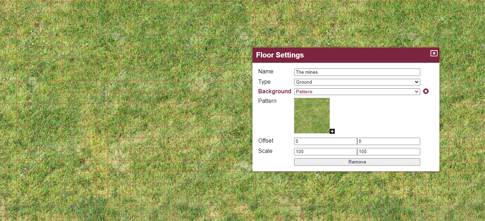

Das letzte Release war eine große technische Änderung, und ich bin froh zu sehen, dass der Übergang ziemlich reibungslos war und nichts Ernstes als kaputt gemeldet wurde. Dieses Release bringt eine weitere technische Änderung mit sich, indem das JS-Buildsystem von vue-cli (webpack) auf vite (esbuild + rollup) umgestellt wird. Diese Änderung sollte kaum bis keine Auswirkungen auf Endbenutzer haben, erhöht aber die Buildzeiten dramatisch!

Abgesehen von der technischen Änderung werden einige Komfort-Verbesserungen hinzugefügt, eine ordentliche Anzahl von Fehlern wurde ausgemerzt, und das Hauptneue Feature ist die Möglichkeit, eine Hintergrundfarbe oder ein wiederholtes Bild für eine Etage festzulegen.

## Etagenänderungen

Die Etagen-UI wurde leicht verkleinert und zeigt nicht mehr die Bearbeiten- und Papierkorb-Symbole. Stattdessen verfügt sie nun über ein Zahnrad, das in PlanarAlly durchgehend für Einstellungen verwendet wird.

Das Umbenennen und Entfernen von Etagen erfolgt nun über diese neue Etagen-Einstellungs-UI.

Wenn du mit Etagen vertraut bist, wirst du zwei neue Einstellungen bemerken.

_Der Hintergrund verdient seinen eigenen Abschnitt und wird unten ausführlich erklärt._

Dieses Release fügt das Konzept der Etagentypen hinzu, bestehend aus einer voreingestellten Liste von Optionen: unterirdisch/boden/luft (underground/ground/air).

Etagen-Einstellungen können wie in der obigen UI gezeigt auf etagenspezifischer Ebene konfiguriert werden, können aber auch auf Ort- oder Kampagnenebene konfiguriert werden, abhängig vom Etagentyp.

Derzeit ist die einzige Stelle, an der der Etagentyp Dinge beeinflusst, die Hintergrundeinstellung. In der Zukunft beabsichtige ich, einige automatische Leistungsverbesserungen in Abhängigkeit von den Etagentypen hinzuzufügen. (z. B. untere Etagen nicht rendern, wenn du dich im Erdgeschoss befindest)

Das ist noch sehr viel eine Idee, mit der ich spiele, und vielleicht entferne ich das Konzept der Etagentypen in der Zukunft und ersetze es durch Rendeinstellungen pro Etage.

## Hintergrundfüllung

In den meisten Fällen hat der DM eine Karte für die Spieler vorbereitet, die es zu erkunden gilt.
Manchmal kann jedoch eine spontane Seiten-Erkundung vorkommen, oder die Spieler verlassen deine Kartengrenzen, weil sie einen Exploit gefunden haben.

In diesen Fällen ist der standardmäßige weiße Hintergrund der Ort, an dem sie sich bewegen, und das kann etwas trostlos sein. Andere Karten oder Bilder können natürlich vom DM hinzugefügt werden, aber manchmal willst du einfach etwas, das die Leere füllt.

Wie bereits angedeutet, ist es nun möglich, den Hintergrund für eine Etage zu konfigurieren. Entweder für eine bestimmte Etage oder für alle Etagen desselben Typs.

### Einfache Farbe

Die grundlegendste Option ist, eine einzelne Farbe als Hintergrundfarbe festzulegen.

Das kann die Immersion schnell verbessern, um mit minimalem Aufwand ein grasiges Gefühl zu erzeugen

### Muster

Es ist jedoch auch möglich, ein Bild als Hintergrund festzulegen, das in alle Richtungen wiederholt wird. Das ermöglicht die Verwendung nahtloser Tilesets.

Wenn du ein Bild bereitstellst, ist es möglich, den Versatz und den Maßstab des Musters zu ändern.

Der Versatz ist ein Wert in Pixeln, um den das Muster in Bezug auf das Raster verschoben wird.

Der Maßstab ist ein Prozentsatz, der die Größe des Musters beeinflusst.

## Komfort (QoL)

### Initiative

Release 0.26 hat die Initiative-UI überarbeitet. Dieses Release fügt dieser Layoutänderung eine kleine Verbesserung hinzu, indem Spieler den Initiative-Zug weiterschalten können, wenn eine Figur, die ihnen gehört, gerade am Zug ist.

### Werkzeugleiste

Eine häufige Ursache für Verwirrung ist das Werkzeugleisten-Modussystem und insbesondere welcher Modus aktiv ist. In früheren Releases wurde der aktive Modus auf der rechten Seite der Werkzeugleiste mit seinem ersten Buchstaben sichtbar angezeigt. Beim Überfahren des Buchstabens mit der Maus wurde der vollständige Name angezeigt.

Viele Leute waren sich nie sicher, ob es den aktiven Modus oder den Modus anzeigte, der beim Klicken aktiviert würde.

Dieses Release behebt diese Verwirrung und zeigt alle möglichen Modi unter der Werkzeugleiste an, wobei der aktive Modus hervorgehoben ist.

### Draw-Hilfe

Den Überblick über das Draw-Werkzeug zu verlieren, ist eine weitere häufig gehörte Beschwerde.
Eine sehr kleine Verbesserung, die in diesem Release hinzugefügt wird, ist ein kleiner Kontrastrahmen um den Pinsel, um sicherzustellen, dass der Pinsel nicht mit dem Hintergrund verschmilzt, wenn er dieselbe Farbe hat.

Es ist keineswegs eine vollständige Lösung, um den Überblick über deinen Zeichenpinsel nicht zu verlieren, aber es ist ein erster kleiner Schritt.

Ich denke darüber nach, einen größeren Kreis um den Pinsel zu legen, wenn der Pinsel kleiner als eine bestimmte Größe ist, aber ich bin mir noch nicht sicher, ob die Leute damit zufrieden sein werden.

## Fixes

### Farbwähler

Der Farbwähler war am stärksten von den technischen Änderungen im letzten Release betroffen, da die ursprüngliche Komponente, die ich verwendet habe, für vue3 noch nicht verfügbar war, also habe ich meine eigene Version erstellt.

Dieses Release behebt:

- Behalte den Fokus auf der Sättigung, während die Maus gedrückt ist
- Höhe der Schieberegler erhöhen
- Behoben: Der Klick auf den Farbton-Schieberegler bewegte anfangs nicht
- Schachbrett-Hintergrund wieder hinzugefügt
- cursor\:pointer beim Überfahren des Schiebereglers anzeigen

### Anmerkungen

Die Markdown-Komponente war eine weitere, die noch nicht auf vue3 portiert war. Für diese Komponente habe ich jedoch ein anderes Open-Source-Tool gefunden, das Markdown-Unterstützung in vue3 bietet.

Es deaktivierte standardmäßig jedoch einige Rendereinstellungen, die wir mit der älteren Komponente gewohnt waren. Insbesondere rendert nun wieder eine Reihe von HTML-Änderungen.

### Sonstiges

#### Draw-Werkzeug

Der Draw-Werkzeug-Cursor aktualisierte seine Farbe nicht sofort, wenn eine andere Farbe gewählt wurde.

#### Initiative

Das Neuanordnen von Initiative-Einträgen warf Fehler, wenn einer der Einträge noch keinen Wert hatte.

#### Co-DM

Es ist nicht mehr möglich, den DM-Status des Kampagnenerstellers zu entziehen, noch ist es möglich, den Ersteller zu kicken.

#### Assets

Mit der Einführung der experimentellen SVG-Unterstützung wurde ein Fehler eingeführt, der dazu führte, dass die Eigenschaften „blockiert Sicht“ und „blockiert Bewegung“ von Assets (d. h. benutzerhochgeladenen Inhalten) nicht mehr funktionierten.

#### Notizen

Beim Wechseln von Orten wurde der Notizen-Bereich geleert
