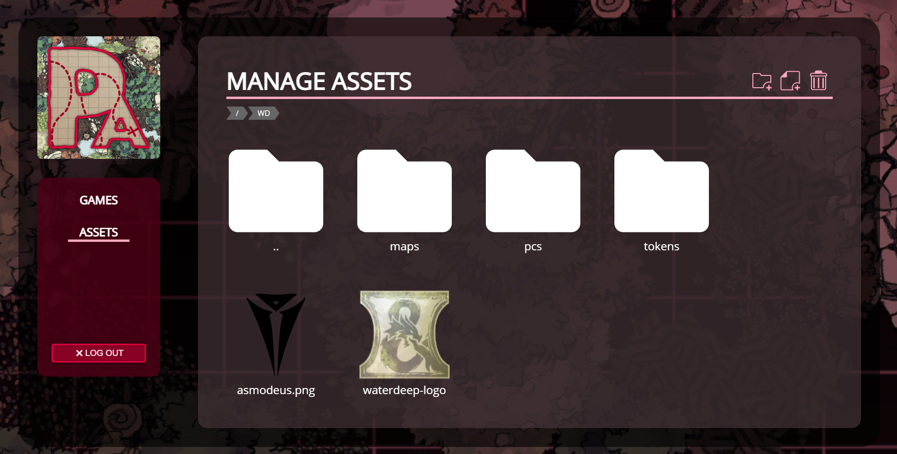
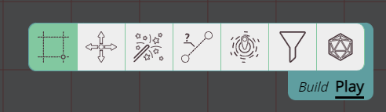

Ich habe regelmäßigere Updates versprochen und das kläglich nicht eingehalten, aber hey, hier ist ein neues Release!

_Server-Betreiber: Es wurden Änderungen am Serverstart vorgenommen, siehe [Server](#server)_

## UI-Änderungen

### Dashboard-Redesign

Wir hatten bereits in 0.26 (März 2021) ein Dashboard-Redesign, aber hier sind wir wieder \:D

Der Spiele-Bereich wurde von 3 Navigationseinträgen (run/play/create) auf einen einzigen Bereich reduziert.
Zusätzlich nahm die zuvor vorhandene „Details"-Sidebar auf Geräten mit weniger Bildschirmplatz viel Platz ein.
Dieser Bereich wurde nun so überarbeitet, dass die meisten dieser Optionen zur Verfügung stehen, wenn du in der Liste auf ein Spiel klickst.

Erwähnenswert ist außerdem, dass der Asset-Manager dieses Mal tatsächlich in das Redesign einbezogen wurde.
Das hoffentlich so manchen freut, denn die vorherige Version war etwas ganz anderes \:D

### Toolbar-Symbole

Eine weitere visuelle Änderung ist, dass die Toolbar nun Symbole anstelle von Beschriftungen enthält.

Es gibt eine Benutzereinstellung, um dies wieder auf Beschriftungen umzustellen, falls dir das nicht gefällt.

## Auf der Leinwand navigieren

Manchmal verlieren wir den Überblick darüber, wo wir uns auf dem Spielfeld befinden, oder möchten unsere Ansicht auf die eines anderen Charakters umstellen.

Erfahrene PA-Benutzer wissen, dass sie dafür normalerweise die Leertaste verwenden können.
In diesem Release habe ich jedoch 2 zusätzliche visuelle Elemente hinzugefügt, um dieses Erlebnis zu verbessern.

### Zurück zum Inhalt

Die erste Funktion ist ausdrücklich für den Fall gedacht, dass du dich auf der unendlichen Leinwand verloren hast und nur einen mit Kriegsnebel gefüllten Bildschirm siehst.

Wenn das passiert, erscheint ein neues UI-Element am unteren Bildschirmrand.
Wenn du auf dieses Element klickst, wird deine Ansicht auf das nächstgelegene sichtbare Element zentriert.

Dabei werden der Sichtmodus der Kampagne (Kriegsnebel- und Sichtlinien-Einstellungen) berücksichtigt.

### Token-Richtungen

Eine weitere Neuerung ist, dass Tokens (auf die du Zugriff hast), die sich außerhalb des Bildschirms befinden, nun am Bildschirmrand mit einem Pfeil angezeigt werden,
der in ihre Richtung zeigt.
Wenn du auf diesen Pfeil klickst, zentrierst du deine Ansicht auf die zugehörige Form.

Sie verwenden dieselbe Farbe wie deine konfigurierte Ruler-Farbe.
Die Funktion kann über eine neue Client-Einstellung auch deaktiviert werden.

## QoL

Es wurden eine Reihe von Verbesserungen für die Lebensqualität hinzugefügt.

### Panning

Es war bereits möglich, mit der mittleren Maustaste zu pannen; nun startet auch die rechte Maustaste beim Ziehen den Panning-Modus.

Dies dient hauptsächlich dazu, das Erlebnis für Menschen zu verbessern, die ein Touchpad verwenden, bei dem der Klick mit der mittleren Maustaste weniger trivial ist.

### Verhaltens-Hinweise

Das Draw- und das Sicht-Werkzeug haben nun eine orange Hintergrundfarbe, wenn ihr Verhalten verändert wurde.
Das soll deine Aufmerksamkeit erregen, wenn du etwas geändert und später vergessen hast.

Beim Sicht-Werkzeug wird es immer dann hervorgehoben, wenn nicht alle Tokens aktiv sind.

Beim Draw-Werkzeug werden die Reiter Logik und/oder Sicht hervorgehoben, wenn dort etwas aktiv ist.

### Unterstützung komplexer Tracker-Ausdrücke

Bei der Verwendung von Trackern ist die Schnellauswahl-Info ein Lebensretter, um Tracker während des Spiels schnell zu ändern.
Bisher warst du jedoch auf eine einzelne Zahl beschränkt und konntest ein `+` oder ein `-` davorstellen, um den Wert relativ zum ursprünglichen Wert zu machen.

Ab diesem Release wurde diese Oberfläche geändert, um komplexere Ausdrücke zu unterstützen.
So ziemlich jeder mathematische Ausdruck (unterstützt durch math.js) sollte nun unterstützt werden.

Es gibt nun außerdem 2 Modi: den absoluten und den relativen Modus. Letzterer addiert das Ergebnis des Ausdrucks zum ursprünglichen Wert.

Es gibt zudem eine neue Client-Einstellung, um festzulegen, welcher Modus standardmäßig ausgewählt ist, wenn du ein Spiel startest.

Ein paar Beispiele:

Wenn dein Tracker einen Wert von 50 hat und du den folgenden Ausdruck ausführst:

`-(10 + 20 + 5 * 2) + sqrt(4)`

Im absoluten Modus wird der Tracker nun `-38` sein, im relativen Modus `12` (`50-38`)

Ebenso, wieder ausgehend von 50:

`12`

Wird im absoluten Modus zu `12` und im relativen Modus zu `62` (`50+12`)

### Sicht-Werkzeug – private Auren

Wenn du eine Form im Sicht-Werkzeug abwählst, sind ihre privaten Auren nicht mehr sichtbar.

### Import/Export

Am Import- und Export-Code wurde einiges optimiert.

DMs können ihre Kampagne über die Spielliste im Dashboard exportieren.
Der Import erfolgt über „Neues Spiel".

Sowohl Import als auch Export zeigen nun eine separate Seite an, auf der Fortschrittsinformationen zu sehen sind.
Das sollte die Klarheit darüber verbessern, ob der Import/Export funktioniert oder irgendwo fehlgeschlagen ist.

### Würfel

Einzelne Würfelergebnisse werden nun ebenfalls zusammen mit den Zwischensummen und der Gesamtsumme eines Wurfs angezeigt.

Dies dient Systemen, bei denen einzelne Würfelergebnisse das Ergebnis beeinflussen können.

## DM: Spieler

### Client-Rechtecke

Der DM hat in den DM-Einstellungen die Möglichkeit, die Ansicht bestimmter Spieler zu sehen.
Diese Einstellung funktioniert gut, wenn deine Spieler nur einmal angemeldet sind (d. h. 1 Client haben).

Wenn ein Spieler in mehreren Browsern angemeldet ist (d. h. >1 Client), folgte die dem DM angezeigte Ansicht bisher immer dem zuletzt bewegten Client.
Das ist verwirrend und entspricht nicht den Erwartungen. Nun wird für jeden verbundenen Client ein separates Rechteck angezeigt.

Wichtig zu wissen: Die Bewegung eines Clients wirkt sich weiterhin auch auf den anderen Client aus.

### Aktive Spieler

Die linke Sidebar hat für den DM nun außerdem einen Spieler-Bereich, der alle verbundenen Spieler auflistet.
Wenn du in dieser Liste auf einen Namen klickst, wird deine Ansicht auf deren aktuelle Ansicht zentriert.

Dies ist eine vorläufige Lösung, da ich das Spieler-Konzept weiter erforschen möchte,
aber seit diesem groben Prototyp noch keine Zeit dafür gefunden habe.

## Leistung

Es wurden einige Leistungsverbesserungen hinzugefügt.

### Begrenzung des Renderings von Etagen

Es gibt nun eine Benutzeroption, um das Rendering auf die aktive Etage zu beschränken.

Das ist nützlich, wenn ein oder mehrere Spieler bei einer Karte mit vielen Etagen eine suboptimale Leistung feststellen.

### Berechnung des Formmittelpunkts

Der Mittelpunkt einer Form wird an vielen Stellen verwendet und wurde bisher jedes Mal, wenn er benötigt wurde, spontan neu berechnet.

Nun wird der Mittelpunkt einmal berechnet und gespeichert, bis eine Aktion eine Änderung des Mittelpunkts verursacht (z. B. wenn sich die Form bewegt), woraufhin er neu berechnet wird.

Die meisten Formen (z. B. Wände) ändern ihre Position nicht oft, daher _sollte_ dies theoretisch die Leistung verbessern.

### Sektoren

Beim Rendern der Szene werden pro Ebene nur die auf dem Bildschirm sichtbaren Formen berücksichtigt.
Bisher geschah dies, indem durch die Formen iteriert und eine visibleInCanvas-Prüfung durchgeführt wurde.

Neu in diesem Release ist, dass Formen in Sektoren (oder Chunks) geordnet werden und nur die Sektoren geprüft werden, die sich in der Ansicht befinden.

Dies könnte etwas sein, das weitere Feinabstimmung erfordert.

## Server

### Alternative Ablage für Asset-Dateien

Es ist nun möglich, den Speicherort des Ordners für Asset-Dateien zu ändern, von dem aus alle Assets bereitgestellt werden.

### Serverstart

Um den Server etwas einfacher zu verwalten, wurden Dateien neu organisiert.
Das betrifft den Serverstart: Du solltest nun die Datei `planarally.py` anstelle der Datei `planarserver.py` aufrufen.

Es akzeptiert dieselben Parameter usw. wie das ursprüngliche Skript.

Das Docker-Image wurde angepasst; wenn du das verwendest, musst du nichts ändern.

### Import/Export

Import und Export sollten nun stabiler sein und wurden in der server_config standardmäßig wieder aktiviert.

## Last-Gameboard

Dieses Release enthält außerdem Integrationscode für die last gameboard-Plattform.

## Fehler

### Fehlerbehebungen in der Formlogik

- Teleportzone wurde nicht richtig ausgelöst, wenn sie von einem Spieler initiiert wurde
- Teleportzone landete nicht richtig in der Mitte des Ziels
- Spieler-Türen-Umschaltungen wurden nicht mit dem Server synchronisiert bzw. nicht gespeichert
- Die Vorschau des Tür-/TP-Bereichs wechselte die Etage nicht

### Tracker/Auren

- Geteilte Tracker/Auren erschienen nicht in der Auswahlinfo
- Das Entfernen geteilter Tracker/Auren wurde im Client erst nach dem Aktualisieren angezeigt

### Initiative

Seit einer technischen Änderung in 2022.1 hat sich das Initiative-System falsch verhalten, wenn unbekannte Formen für den Client vorhanden waren.
Unbekannte Formen können durch zahlreiche Gründe entstehen (z. B. Form wurde an einen anderen Ort bewegt, Form liegt auf der DM-Ebene und ist daher einem Spieler nicht bekannt, ...).

Einige der untenstehenden Einträge hängen mit dem oben beschriebenen Problem zusammen, das nun behoben wurde, aber einige Einträge sind ein völlig separates Problem.

- Der Server sollte Client-Fehler in Initiative-Auflistungen besser erkennen und falsche Daten ablehnen
- Eine Änderung der Initiative sollte den aktuell aktiven Akteur unter mehr Umständen beibehalten
- Das Entfernen einer Form verursachte einige Initiative-Inkonsistenzen
- Der Wechsel zwischen DM-Ebene und für Spieler sichtbarer Ebene verwirrte die Initiative manchmal
- Die Initiative-Kameraverriegelung wechselte die Etage nicht

### Assets

- [DM] Assets konnten nicht in den übergeordneten Ordner verschoben werden
- [DM] Assets konnten nicht entfernt werden, wenn eine Form mit einer Verknüpfung zum Asset existierte
- [DM|server] Der Asset-Manager war bei einer Subpath-Einrichtung nicht mehr nutzbar

### Sonstiges

- Fehler in Prompt-Modalen waren nicht sichtbar
- Die Sichtbarkeitsinfo von Annotationen wurde bis zur Aktualisierung nicht mit anderen Clients synchronisiert (nur UI)
- Der Spielerstatus wurde beim Ortswechsel zurückgesetzt
- Zoom-Empfindlichkeit beim Touchpad
- Tippfehler im Ortsmenü
- Fehlerbehebungen in der UI des AssetPicker-Modals im Spiel
- Prompt-Modal leerte die Fehlermeldung nicht richtig
- Tool-Details befanden sich nicht immer am richtigen Ort (z. B. beim Wechseln des Modus)
- Überflüssige Leerzeichen in der Auswahlinfo reduziert
- Sprung zum Marker wechselte die Etage nicht
- Beim Bewegen einer zusammengesetzten/Varianten-Form auf eine andere Etage und deren Verfolgung wurden zusätzliche Auswahlboxen angezeigt
- Die Draw-Ebene wurde unterhalb des Nebels gerendert (z. B. Ruler/Ping usw.)
- Die Sicht wurde beim Entfernen blockierender Formen bei Multi-Etagen-Einrichtungen nicht richtig neu berechnet
- Die AssetPicker-UI erschien zu tief
- Die Polygon-Bearbeitungs-UI blieb beim Pannen zurück
- Bewegen eines Polygonpunkts, wenn das Polygon gedreht war
- Normale Formen wurden manchmal fälschlich als Spawn-Ort erkannt
- Würfel verschwanden manchmal vom Bildschirm
- Tastaturbewegung bewegte den Rotations-Helfer des Select-Werkzeugs nicht
- [DM] Annotationen waren nach dem Entfernen des Spielerzugriffs bis zur Aktualisierung weiterhin sichtbar
- [DM] Das Zurücksetzen ortsspezifischer Einstellungen wurde erst nach einer Aktualisierung mit den Clients synchronisiert
- [DM] Die Aktivierung des Fake-Spieler-Modus blendete die DM-Einträge aus der linken Sidebar aus
- [server] Der Diceroller funktionierte auf einem Subpath-Server nicht
