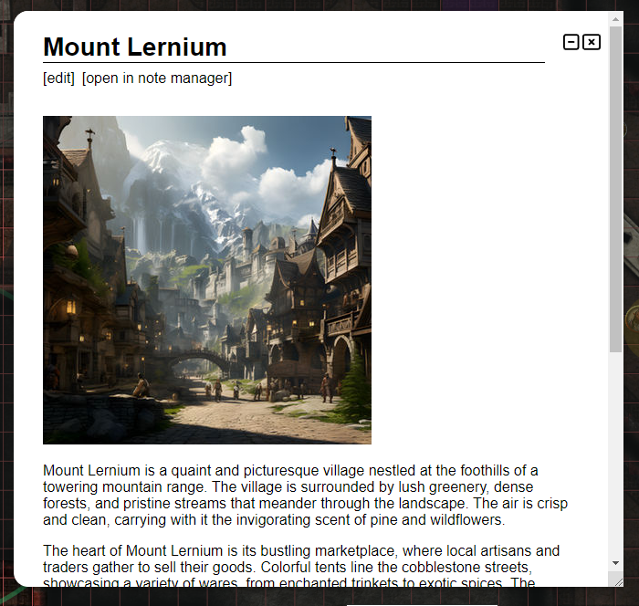

Ein neues Jahr, ein neues Release!

Wie üblich wurden einige Bugs behoben, aber die beiden Hauptstars dieses Releases sind eine Überarbeitung des Notizsystems und
die Einführung eines neuen Sichtblockierungsmodus, der die Immersion verbessern wird.

## Ein neuer Sichtblockierungsmodus

### Warum brauchen wir einen zusätzlichen Modus?

Bis jetzt war die Sichtblockierung eine binäre Sache: Entweder kannst du durch das Objekt hindurch/hinter es sehen oder es blockiert die Sicht vollständig.
Das ist für viele Fälle in Ordnung, aber bei kleineren Objekten (z. B. Baumstamm, Säule, ein Fels)
führt das oft zu einer Entscheidung, die du als DM treffen musst.

- Obstruierst du das Objekt vollständig und gibst ihm damit das korrekte Sichtblockierungsverhalten,
  verlierst du aber letztlich an Immersion, weil den Spielern nicht klar ist, was der zufällige Kreis ist, der die Sicht blockiert?
- Machst du die sichtblockierende Form etwas kleiner, um ein Stück des Objekts zu zeigen, verlierst du dafür aber an Korrektheit?

### Der neue Modus

In diesem Release wird ein neuer Sichtblockierungsmodus namens `behind` eingeführt.
Er begleitet den bestehenden Sichtmodus, der in `complete` umbenannt wird.

Wenn der neue Modus aktiv ist, wird die als sichtblockierend markierte Form so gerendert, als wäre sie keine sichtblockierende Form,
aber alles dahinter wird vollständig verdeckt.
Das ermöglicht dir zum Beispiel einen Baumstamm, der sichtblockierend ist,
bei dem die Spieler aber trotzdem sehen, worauf sie schauen (also einen Baumstamm).

Ein weiterer guter Anwendungsfall für den neuen Modus sind Türen.
Indem du sie als blockierend von hinten konfigurierst, erhältst du eine korrekte Sicht auf das gesamte Türobjekt,
sodass den Spielern klarer ist, worauf sie schauen.

**Komplette Blockierung:**

**Blockierung von hinten:**

#### Einschränkungen

Dieser spezielle Modus funktioniert nur für Formen, die geschlossen sind.
In der Praxis bedeutet das, dass er für die meisten regulären Formen funktioniert (z. B. Rechteck/Kreis),
aber nicht für spezielle Formen wie das Brush-Tool oder Textformen.

Polygone können offen oder geschlossen sein!
Wenn du damit also eine unregelmäßige Form mit dem Polygon-Tool zeigen möchtest,
stelle sicher, dass du das Polygon als geschlossen markiert hast.
(Das ist eine Option im Draw-Tool.)

Ein weiterer Sonderfall ist, dass Lichter, die in Objekten mit aktiviertem Modus platziert wurden,
gerendert werden könnten, obwohl deine Aura die Form nicht erreicht.
Das ist ein Randfall der Implementierung, sollte aber in der Praxis kein allzu großes Problem sein,
da es nicht viele Gründe gibt, Lichter in sichtblockierenden Formen zu platzieren.

## Notizen & Anmerkungen

Die andere große Änderung in diesem Release ist eine Überarbeitung des Notizsystems.

PlanarAlly hatte bisher 2 Konzepte für Notizen:

- lose Kampagnen-Notizen
    - Diese haben einen Titel und etwas Freitext
    - Sind immer privat
    - Können offen gehalten / herumgezogen werden
- Form-Notizen (auch als Anmerkungen bekannt)
    - Diese haben Markdown-fähigen Freitext
    - Können öffentlich oder privat sein
    - Auf 1 pro Form begrenzt
    - Das gerenderte Markdown wird oben auf dem Bildschirm angezeigt, wenn die zugehörige Form überfahren wird

### Eine Reihe von Problemen

Beide Konzepte haben ihre eigenen Probleme und sind zueinander inkonsistent:

- für lose Notizen
    - gibt es keine Suchmöglichkeit
    - gibt es keine Filtermöglichkeit (z. B. nur Notizen, die für den aktuellen Ort relevant sind)
    - gibt es keine Möglichkeit, sie mit anderen Benutzern zu teilen
    - kann nur 1 Notiz gleichzeitig geöffnet sein
    - gibt es überhaupt kein Markdown-Rendering
- für Form-Notizen
    - gibt es keine Möglichkeit, sowohl private als auch öffentliche Informationen zu haben
    - gibt es keine Möglichkeit, sie auszuklappen oder darauf zuzugreifen, ohne die Form ausgewählt zu haben
    - musst du, wenn du die Informationen für eine Form brauchst, die eigentliche Form finden, wo auch immer sie sein mag
    - gehen Notizen verloren, wenn die Form entfernt wird, es sei denn, es handelt sich um einen Charakter

### Eine vereinheitlichte Lösung

Um diese Probleme zu lösen, wurde ein vereinheitlichtes Notizsystem geschaffen.

In diesem neuen System gibt es keinen Unterschied mehr zwischen Form-Notizen und Kampagnen-Notizen.
Notizen sind nun ein einziges Konzept, können an Formen angehängt und über ein neues UI-Element namens Notiz-Manager verwaltet werden.

### Wichtige Änderungen

Für einen vollständigen Überblick über das neue Notizsystem wirf einen Blick in die [Notizdokumentation](/de/docs/game/notes/).
Sie wurde aktualisiert, um das neue System widerzuspiegeln, und enthält mehrere Bilder und eine ausführlichere Erklärung.

#### UI-Änderungen

Der Notiz-Manager ist ein neues UI-Element, das über das Tastenkürzel <kbd>n</kbd> oder durch Klicken auf den Notizbereich im Menü auf der linken Seite geöffnet werden kann.
Er ist das Herzstück des neuen Notizsystems und ermöglicht dir die Verwaltung aller deiner Notizen.

Der Notiz-Manager hat eine Suchleiste, mit der du alle deine Notizen durchsuchen kannst.
Notizen können nun außerdem beliebige Tags haben, die sowohl für die Suche als auch für mehr Kontext genutzt werden können.

Du kannst Notizen aber auch aus dem Notiz-Manager (und einigen anderen Stellen) herauslösen, um sie offen zu halten, während du andere Dinge tust.
Mehrere dieser Notizen können gleichzeitig herausgelöst werden und sie können einzeln herumgezogen werden.

Zusätzlich können herausgelöste Notizen eingeklappt werden, sodass nur noch ihr Titel angezeigt wird.
Das ist nützlich für Notizen, auf die du häufig in kurzer Zeit zugreifen musst, ohne deinen Bildschirm zu überladen.

#### Zugriff

Es ist jetzt möglich, Notizen mit anderen Benutzern zu teilen und detaillierte Zugriffsrechte für sie zu definieren.

Das bedeutet, du kannst allen Spielern Lesezugriff gewähren, wenn eine bestimmte Notiz abgerufen wird, oder einem bestimmten Spieler eine private Notiz geben, die nur er sehen und bearbeiten kann.

Von Spielern erstellte Notizen sind eines der wenigen Dinge in PA, die für den DM nicht sichtbar sind! Sie sind also wirklich privat, es sei denn, sie werden explizit geteilt.

#### Formen

Notizen können optional an Formen angehängt werden.
Eine einzelne Notiz kann an mehrere Formen angehängt werden, und eine einzelne Form kann mehrere Notizen haben!

Das ermöglicht dir, sowohl öffentliche als auch private Informationen an einer Form zu haben.

Zusätzlich gibt es eine neue Notiz-Einstellung, mit der du konfigurieren kannst, dass ein Notiz-Symbol auf der Form erscheint.
Das ist nützlich, um sich an das Vorhandensein einer wichtigen Notiz zu erinnern.
Es ist nun auch zu einer Einstellung geworden, die bestimmt, ob die Notiz oben auf dem Bildschirm erscheinen soll, wenn eine zugehörige Form überfahren wird.
Das ist standardmäßig jetzt ausgeschaltet!

Der Schnellinfo-Bereich auf der rechten Seite des Bildschirms, wenn du eine Form ausgewählt hast, enthält nun auch Informationen zu allen an der Form angehängten Notizen.
Du kannst mit der Maus über die Notizen fahren, um ihren Inhalt zu sehen, aber du kannst sie auch von dort herauslösen.

Um eine Übersicht aller Notizen für eine bestimmte Form zu sehen, kannst du entweder auf das Notiz-Symbol im Schnellinfo-Bereich klicken oder das Kontextmenü der ausgewählten Form verwenden.

#### Global vs. Lokal

Wenn du eine neue Notiz erstellst, wählst du, ob es eine globale oder eine lokale Notiz sein soll.

Das bedeutet, dass eine globale Notiz kampagnenunabhängig ist und in allen Kampagnen sichtbar ist.
Eine lokale Notiz hingegen bezieht sich auf die aktuelle Kampagne und sogar auf den spezifischen Ort, an dem sie erstellt wurde.

Da globale Notizen in jeder Kampagne verfügbar sind,
solltest du etwas darauf achten, nicht zu viele davon zu erstellen, da die meisten Notizen normalerweise nicht für alle Kampagnen relevant sind.

Ein guter Anwendungsfall für globale Notizen sind allerdings Stat-Blöcke. Du willst den Stat-Block für ein bestimmtes Monster nicht in jeder Kampagne neu definieren.
Kombiniert mit der Verwendung von [Asset-Vorlagen](/de/docs/dm/assets/#templates) kannst du einen Goblin auf den Spieltisch werfen und er hat automatisch den Stat-Block angehängt.

## Asset-Drop-Ratio

Das ist ein neues Feature, das gleichzeitig auch ein Bugfix ist.
Es fügt dem Ort-Raster-Einstellung eine neue Einstellung hinzu.

PA hat eine Option, Assets beim Ablegen automatisch zu skalieren, wenn sie ein bestimmtes Format im Namen haben.
Zum Beispiel sollte goblin_1x1 unter normalen Umständen genau 1 Rasterzelle ausfüllen, dragon_3x3 sollte auf 3 mal 3 Rasterzellen skaliert werden.

Die bestehende Implementierung nutzte fälschlicherweise eine Methode auf Basis des 5-ft-Systems,
um dies automatisch anzupassen, wenn ein Ort eine größere Größe hatte (z. B. würden 10-ft-Karten automatisch bewirken, dass something_2x2 in 1 Zelle passt).

Das bricht allerdings vollständig für alles, was nicht das 5-ft-System verwendet, sei es, weil du SI-Einheiten nutzt, dein System etwas Eigenes verwendet oder du deine Größen in Pizzen angibst.

Der einfache Fix ist, dieses System zu deaktivieren, aber dann funktioniert das Ablegen von Assets auf Karten mit einer anderen Skala nicht mehr richtig.
Um das ebenfalls anzugehen, wird eine neue Einstellung hinzugefügt: Asset-Drop-Ratio, die definiert, wie diese Assets beim Ablegen auf der Karte skaliert werden sollen.

Eine Drop-Ratio von 1 ist der Standard. Sie bedeutet, dass das Asset rein basierend auf seinen angegebenen Abmessungen skaliert wird (d. h. goblin_1x1 nimmt 1 Rasterzelle ein, auch wenn es 10 ft darstellt).
Eine Drop-Ratio von 0.5 würde ein something_2x2 auf 1x1 skalieren.

## Würfelverlauf

_Von SuikaXhq beigetragen_

Ich habe größere Pläne, die Würfel-UI und das Verhalten zu überarbeiten, aber während ich langsam vorankomme,
hat SuikaXhq eine schöne Verbesserung zum bestehenden Würfelverlauf beigetragen.

Der Würfelverlauf zeigt nun prominenter an, wer gewürfelt hat (vorher wurde das nur beim Überfahren angezeigt) und
enthält mehr Details zum jeweiligen Wurf, statt nur das Endergebnis anzuzeigen.

## Verbesserungen an den Auswahlinformationen

_Von SuikaXhq beigetragen_

Wie bereits erwähnt, enthält der Auswahlinfo-Bereich auf der rechten Seite des Bildschirms nun Informationen zu Notizen, die an der ausgewählten Form angehängt sind.

Das war aber nicht die einzige Änderung an den Auswahlinformationen!

Tracker und Auren zeigen Informationen zu ihren aktuellen Werten und bieten eine schnelle Änderung dieser Werte an.
Für Auren ist das allerdings nicht sonderlich nützlich, in den meisten Fällen ist das nicht etwas, das du oft ändern willst.

Dieses Release ändert den Auren-Bereich so, dass stattdessen ein Umschalter angeboten wird, um die Aura zu aktivieren/deaktivieren, ohne die detaillierten Tracker-Einstellungen öffnen zu müssen.
Zusätzlich wird, wenn die Aura im Winkel begrenzt ist (d. h. nicht 360 Grad), auch ein Rotations-Schieberegler angezeigt, mit dem du die Rotation der Aura schnell ändern kannst.

## Fehlerbehebungen

- Polygon-Bearbeitungs-UI: berücksichtigte die Rotation der Form nicht
- Teleport: Formen, die ohne Nachfolgen teleportiert wurden, schienen sich nicht zu bewegen, da die lokale Synchronisierung nicht aktualisiert wurde
- Würfel-Tool: den GO-Button ignorieren, wenn nichts eingegeben wurde
- Charakter: eine Reihe von Bugs mit Varianten wurden behoben
- Tracker: max-height und Scrollen hinzugefügt, um die UI zu reparieren, wenn es viele Tracker gibt
- RotationSlider: Synchronisierungsprobleme behoben
- RotationSlider: behoben, dass der Schieberegler-Anker bei bestimmten Winkeln nicht auf der Schiene blieb
- \[server\] Log-Spam von "unknown"-Formen, wenn temporäre Formen bewegt werden
