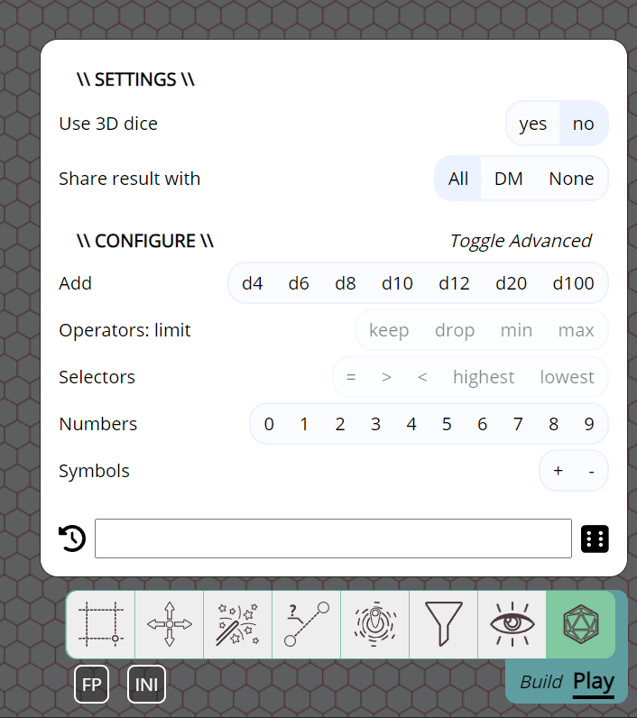

Es ist wieder ein paar Monate seit dem letzten Release vergangen, also ohne weitere Umschweife: Hier ist einiges Neues :)

### Erneuter Deprecation-Hinweis

Wie im vorherigen Release angekündigt, ist das Label/Filter-System veraltet und wird im nächsten Release entfernt.

## Einfaches Chat-System

Dieses Release führt ein einfaches Chat-System ein, mit dem du mit anderen Spielern in der Kampagne chatten kannst.

Es ist darauf ausgelegt, einfach und auf den Punkt zu sein. Einige Formatierungen in Form von Markdown sind verfügbar, und Bild-URLs werden automatisch in Bilder umgewandelt.

Wichtig zu wissen: Gesendete Nachrichten werden derzeit nicht auf dem Server gespeichert. Jedes Neuladen oder jede erneute Verbindung zur Session löscht also den Chatverlauf.

Es ist für mich nicht immer leicht zu erkennen, welche Art von Gruppen PA nutzt, weshalb das Chat-Feature relativ minimalistisch ist. Wenn es deiner Gruppe helfen würde, einen persistenten Chatverlauf oder einige andere Chat-Features zu haben, melde dich!

Weitere Informationen zum Chat findest du in der [Dokumentation](../../docs/game/chat), Informationen über Markdown findest du [hier](../../learn/dm/Markdown_Tutorial/markdown/).

## Würfel-Verbesserungen

Ein großer Teil dieses Releases wurde darauf verwendet, verschiedene Aspekte des Würfelns zu verbessern.

### Würfel-Werkzeug-UI

Die UI des Würfel-Werkzeugs wurde komplett überarbeitet.

#### Nicht-3D-Modus

Früher war die einzige Möglichkeit, Würfel zu würfeln, sie mit 3D-Objekten zu simulieren. Das kann Spaß machen, ist aber aus verschiedenen Gründen nicht immer die beste Option.

Ab jetzt gibt es eine Option, Würfelergebnisse automatisch ohne 3D-Simulation aufzulösen.

#### Eingabe-Verbesserungen

Die vorherige Version hatte eine Texteingabe und eine einfache Klick-UI, um Würfel auszuwählen, ohne sie einzutippen (z. B. fügte dreimaliges Klicken auf „d6" 3d6 zum Textfeld hinzu).

Das funktionierte, war aber ziemlich eingeschränkt. Die „Klick"-UI wurde erheblich erweitert.

Auch die Grammatik des Würfel-Parsers wurde erweitert und erlaubt jetzt einige komplexere Ausdrücke wie „kh2 (behalte die höchsten 2)" und Ähnliches.

#### Teilen der Ergebnisse

Es ist jetzt möglich, Würfel vollständig privat zu würfeln, ohne dass auch der DM die Ergebnisse sieht.

Nutzer, die Würfelergebnisse von einem anderen Spieler erhalten, können jetzt auf das Benachrichtigungs-Popup klicken, um die Details des Wurfs zu sehen.

#### Ergebnis-UI & Verlauf

Auch die UI, die die Ergebnisse des Würfelwurfs anzeigt, hat sich leicht geändert.

Um die Übersicht zu verbessern, werden einzelne Würfe in einer Gruppe (z. B. 3d6) nicht mehr angezeigt, können aber durch Überfahren der Gruppe mit der Maus eingeblendet werden.

Auch der Wurfverlauf wurde leicht geändert: Beim Klicken auf eine Zeile im Verlauf wird wieder die vollständige Ergebnis-UI angezeigt.

### 3D-Bibliothek-Update

Für die 3D-Simulation wird die Spiel-Engine babylonjs verwendet. Sie wurde von Version 4 auf 7 aktualisiert. Diese Änderung beinhaltet auch eine Änderung der verwendeten Physik-Engine, da babylonjs jetzt die Havok-Engine statt Ammo verwendet.

Auch die 3D-Wurflogik wurde leicht geändert, aber größtenteils ist dasselbe Verhalten zu erwarten.

### planarally-dice-Bibliothek und Würfelsysteme

Derzeit dreht sich ein Großteil der Würfel-UI um das d20-System, das bei D&D üblich ist, aber auch bei einigen anderen Systemen.

Abgesehen davon wurde die Würfelbibliothek selbst neu geschrieben, sodass sie eine große Vielfalt an Würfelsystemen unterstützen kann. Die PA-UI hat allerdings noch keine Möglichkeit, zwischen den Systemen zu wechseln, daher ist aktuell standardmäßig das d20-System aktiv.

Ich denke gerade darüber nach, wie andere Würfelsysteme in PA selbst am besten angeboten werden können. (z. B. eine Einstellung „dice system" in deinen DM-Kampagnen-Einstellungen, vielleicht sogar eine allgemeine Einstellung „rpg system".)

Es könnten also in Zukunft weitere Änderungen im Zusammenhang mit RPG-Systemen/Würfeln kommen.

## Einfachere Dungeon-Bewegung

Es kann manchmal mühsam sein, eine Gruppe von Token durch einige enge Korridore mit Kurven zu bewegen, da die Kollision mit den Wänden zu Konflikten führt. Zuerst gruppierte ich sie oft manuell eng zusammen und breitete sie dann wieder aus, sobald ein Punkt erreicht war, an dem die Position wieder wichtig wurde. In letzter Zeit bewegte ich meist einfach 1 Form umher und verschob die anderen per Umschalttaste zur Endposition, einfach weil das weniger Arbeit war.

Keine der beiden Lösungen ist jedoch wirklich schön, daher fügt dieses Release ein neues Feature hinzu, das die beiden Ansätze etwas weniger manuell kombiniert.

Du kannst jetzt mit einem Rechtsklick auf eine Gruppe von Formen „Collapse" (Einklappen) auswählen, wodurch alle auf die Form zentriert werden, mit der du das Einklappen gestartet hast. Wenn du dann nur diese eine Form bewegst, folgen alle anderen automatisch. Sobald eine bestimmte Position erreicht ist, kannst du mit Rechtsklick „Expand" (Ausklappen) wählen, wodurch alle Formen in ihre ursprüngliche Position relativ zu der Form zurückgeschoben werden, mit der du das Einklappen gestartet hast.

Es gibt auch eine Tastenkombination: Während du den Buchstaben „c" (für collapse) gedrückt hältst, wird deine Auswahl eingeklappt; sie wird automatisch ausgeklappt, wenn du entweder die Maustaste loslässt oder „c" erneut drückst.

<video autoplay loop muted style="max-width: min(750px, 75vw);">
    <source src="/blog/release-2024.3/collapse-drag.webm" type="video/webm" />
    <source src="/blog/release-2024.3/collapse-drag.mp4" type="video/mp4" />
</video>

 
 

## Kampagnen-Features

Eine kleinere Ergänzung ist die Möglichkeit für den DM, bestimmte Features zu deaktivieren. Insbesondere die Chat- und Würfel-Werkzeuge können ab diesem Release deaktiviert werden.

Das ist eher ein Beta-Feature, da ich noch nicht sicher bin, wie ich dazu stehe. Diese Einstellungen passen vielleicht besser als Nutzerpräferenzen.

## Werkzeuge

### Änderung der Werkzeugleisten-UI

Eine kleine Änderung an der Symbolleisten-UI: Die erweiterte UI aller Werkzeuge wird jetzt vollständig rechtsbündig angezeigt, statt über dem jeweiligen Werkzeug zu schweben. Das bedeutet auch, dass der kleine Pfeil, der die Werkzeug-UI mit der Symbolleiste verband, jetzt ebenfalls weg ist.

Während der Arbeit an den Änderungen am Select-Werkzeug (siehe unten) wurde deutlich, dass die UI der Werkzeuge weiter in Richtung Mitte einige Probleme hatte. Entweder konnte das Werkzeug keine große UI haben, oder sie blockierte einen großen Teil des Hauptbildschirms.

Indem alle Werkzeug-UIs nach rechts verschoben werden, können sie mehr Platz einnehmen, ohne mit dem zentralen Bildschirmbereich zu konkurrieren.

### Select- und Ruler-Zustand

Wenn eine Form ausgewählt ist, bot die UI des Select-Werkzeugs eine Option, der Bewegung der Form ein Lineal hinzuzufügen.

Das ist ziemlich nett, aber die Einstellungen dieses Lineals (z. B. ob es für andere Spieler sichtbar ist) waren nur im Ruler-Werkzeug konfigurierbar. Das bedeutete, dass du oft zwischen beiden Werkzeugen hin- und herwechseln musstest, um die Lineal-Einstellungen zu ändern oder zu bestätigen.

Jetzt zeigt auch das Select-Werkzeug die Lineal-Einstellungen an und erlaubt dir, sie direkt zu ändern.

### Hexagone im Spell-Werkzeug

Das vorherige Release brachte ein großes Upgrade für Hexagone, deckte aber nicht alle Stellen ab, an denen sie nützlich sein könnten.

In diesem Release wird das Spell-Werkzeug auf den von dir verwendeten Rastertyp aufmerksam und bietet nun die Option, Zaubereffekte in verschiedenen Hexagon-Größen zu erstellen.

### Bugfixes

- Draw-Werkzeug: Das Klicken auf das Label „blocks movement" in den Sicht-Einstellungen des Draw-Werkzeugs schaltet jetzt das zugehörige Kontrollkästchen korrekt um
- Ruler-Werkzeug: Im Rastermodus synchronisierte die Leertaste das eingerastete Ende nicht korrekt mit anderen Spielern
