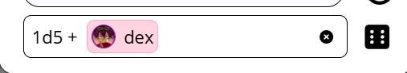
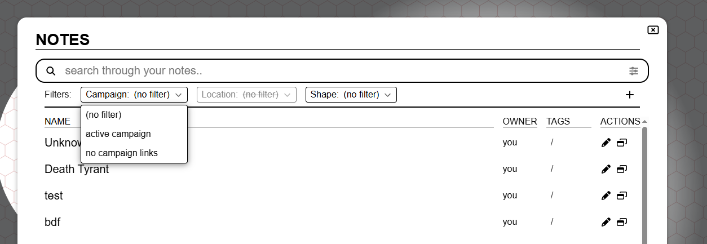

import Info from "/src/components/directives/Info.astro";
import Warning from "/src/components/directives/Warning.astro";

In diesem Release stecken einige aufregende Dinge! Ein paar Highlights:

- UI/UX-Updates für Initiative und Notizen
- Fixes für Kopieren/Einfügen und ähnliche Systeme
- Ein neues Konzept namens „custom data" (eigene Daten) wurde zu Formen hinzugefügt, das unter anderem einen einfachen Charakterbogen ermöglicht

<Info title="Veraltungs-Hinweis">
    Die Varianten-Funktionalität wird in 2026.2 vereinfacht, mehr dazu unter [Varianten](#variants).
</Info>

Dieses Release war ursprünglich für November/Dezember geplant, aber die technischen Überarbeitungen (siehe weiter unten) benötigten letztlich mehr Zeit, um die Stabilität auszubügeln.

Dieses Release enthält außerdem Beiträge von verschiedenen Personen, vielen Dank an euch alle sowie an alle, die Bugs auf dem Entwicklungszweig gemeldet haben!

<Warning title="Änderungen an der Server-Konfiguration">Siehe [den Server-Abschnitt](#server-changes)</Warning>

## Initiative

_Diese Änderungen wurden von Rexy712 beigesteuert_

Wie in der Einleitung erwähnt, hat die UI einige Updates erhalten, wie unten zu sehen ist.

Sie verfügt nun außerdem über ein internes Overflow-Scrolling,
sodass das Initiative-Element selbst nicht riesig wird, wenn viele Akteure in der Initiative sind.

Eine weitere Neuerung: Beim Hinzufügen von Effekten kannst du einen Effekt nun auch zeitlich unbegrenzt machen,
vorher musstest du immer eine Anzahl von Runden angeben, bis der Effekt verschwinden würde.

Als DM gibt es nun außerdem die Option, die gesamte Initiative auf einen Schlag zu leeren,
sowie Schaltflächen, um die Initiative um eine volle Runde vorzuspringen.

## Charakterbogen-Grundlagen

### Warum

Eine der Beschwerden, die ich von Zeit zu Zeit erhalte, dreht sich um das Fehlen von Charakterbögen.
Ich habe immer geglaubt, dass ein universeller Charakterbogen, der zu allen Systemen/Verwendungszwecken passt, nicht wirklich machbar ist
und dass Charakterbögen daher besser für Mods geeignet sind.

Allerdings sind Mods nach wie vor sehr experimentell, erfordern technisches Wissen, um sie zu erstellen,
und seien wir ehrlich: PA ist ein sehr nischenhafter VTT.
Es überrascht nicht, dass es in diesem Bereich daher noch keine wirkliche Arbeit gibt.

Ich glaube immer noch, dass ein gut aussehender „Einer-für-alle"-Charakterbogen nicht wirklich machbar ist,
aber ich habe mich aufgemacht, ein rudimentäreres System zu entwickeln, das mit dem Würfelsystem integriert ist.
Auf diese Weise können Mods im Hintergrund weiterhin dieses gemeinsame Kernsystem nutzen und gleichzeitig eine ansprechendere UI anbieten.

### Wie

Dieses Release fügt der „Form bearbeiten"-UI einen neuen Tab namens „custom data" (eigene Daten) hinzu.

Hier kannst du frei Daten hinzufügen, die zur Form gehören. Du kannst die Daten in einer baumartigen Datenstruktur organisieren.

Die Daten, die du hinzufügen kannst, können derzeit einen von 3 Typen haben:

- Text
- Zahl
- Würfelausdruck

Die meisten davon sind ziemlich selbsterklärend. Das Schöne an Würfelausdrücken ist, dass du das Würfel-Werkzeug sofort mit dem angegebenen Ausdruck beladen kannst,
der auf andere Elemente der eigenen Daten verweisen kann, kurz Referenzen genannt.

Zusätzlich kannst du diese Referenzen auch direkt im Würfel-Werkzeug verwenden. Es zeigt dann eine Auto-Completion-UI an, die dir hilft, den Wert aus der richtigen Form auszuwählen.

Eine weitere Ergänzung des Würfel-Werkzeugs ist, dass für jede Form in deiner Auswahl, die Würfelausdrücke besitzt, eine Schnell-Schaltfläche vorhanden ist.
Dadurch musst du nicht ständig die Formeinstellungen öffnen, zum custom data-Tab navigieren und die Würfeln-Schaltfläche für den gewünschten Wurf anklicken.

### Zukunft

Das Ziel ist es, auch andere Bereiche zu aktualisieren, damit sie mit den Referenzen interagieren.
Tracker und Auren gehören zu den auffälligsten Bereichen, die von dieser Interaktion profitieren könnten.
(z. B. ein HP-Tracker, der mit einer HP-Referenz verknüpft ist)

Eine weitere Sache, die ich gerne tun würde, ist, einen systembezogenen Charakterbogen-Mod als anständiges Vorzeigeprojekt zu erstellen.
Dabei gibt es für mich jedoch ein großes Problem bezüglich Lizenzen/Rechten.

Bei vielen Systemen ist es nicht erlaubt, oder es müssen Verträge abgeschlossen werden, um diese Dinge offiziell anzubieten.
D&D zum Beispiel ist etwas, das ich in dieser Hinsicht nur sehr zögerlich anfasse – obwohl es das SRD gibt,
haben sie anderen Anbietern gegenüber nicht gerade offen gestanden, da sie ihre eigenen Tools haben.
Ebenso habe ich die Mothership-Leute kontaktiert, um zu sehen, was möglich ist, aber ich habe die Antwort erhalten, dass derzeit keine VTT-Integrationen erlaubt sind.
Das Wildsea-System ist sehr offen, und ich habe tatsächlich mit einem Wildsea-Mod im Beispiel-Mods-Repository begonnen.
Mein großes Problem dabei ist jedoch, dass dieses System eines der seltenen Systeme ist, für die ich selbst gar keinen VTT verwende,
sodass es sich etwas albern anfühlt.

Ich bin also nicht wirklich sicher, wie ich hier weitermachen soll, denn es ist eine Situation nach dem Motto „Tue ich es, bin ich verdammt; tue ich es nicht, bin ich auch verdammt" –
rechtlich kann ich nicht wirklich viel tun, aber die Leute scheinen Integrationen zu wollen.

## Notizen

In Release [2024.1](/de/blog/release-2024.1) wurde eine große Überarbeitung des Notizsystems eingeführt.
Es fügte einen einheitlichen Rahmen und eine bessere UI um einige lose Konzepte hinzu, die es zuvor gab.

Es führte das Konzept ein, dass eine Notiz entweder eine globale Notiz ist, die in all deinen Kampagnen verfügbar ist, oder spezifisch für einen Kampagnen-Ort gilt.
Die Idee dahinter: Du hast meist Notizen, die spezifisch für dein Spiel sind (lokal), oder Notizen, die du oft brauchst, wie Stat-Blocke (global).
Du kannst zwischen lokal/global oder beidem umschalten und auch Filtern wie „nur Notizen für den aktuellen Ort anzeigen".

Zwei Jahre später ist es an der Zeit, neu zu bewerten, wie ich zu dem System stehe, und Dinge zu ändern, die sich nicht richtig anfühlen.

### Probleme mit dem aktuellen System

#### Kampagnen-Notizen

Eines der Probleme, auf die ich oft stoße, ist, dass ich viele Notizen erstelle, die nur für einen bestimmten Ort relevant sind.
Das bedeutet, dass ich, wenn ich an Ort X bin, entweder alle Notizen für alle Orte in meinem Spiel sehe oder nur die für meinen aktuellen Ort.

Auf dem Papier klingt das gut, in der Praxis habe ich jedoch auch einige Notizen, die für die gesamte Kampagne und nur für diese relevant sind.
Das Problem ist, dass jede Notiz inhärent mit dem Ort verknüpft ist, an dem sie erstellt wurde, wodurch diese kampagnenweiten Notizen schwer zu finden sind.
Wenn du deine Notizen auf den aktuellen Ort filterst, siehst du die kampagnenweiten Notizen nicht mehr (es sei denn, sie wurden zufällig an deinem aktuellen Ort erstellt). Wenn du den Filter nicht verwendest, siehst du eine Million Notizen, und es ist schwierig, den Überblick zu behalten.

Der Filter für den aktiven Ort ist außerdem hinter einem zusätzlichen Menü versteckt, was das häufige Umschalten ziemlich umständlich macht.

#### Form-Notizen

Eine weitere Besonderheit ist, dass wir, weil eine Notiz mit dem Ort ihrer Erstellung verknüpft ist, in unbequeme Situationen geraten, wenn die Notiz an einer Form hängt und diese Form den Ort wechselt.
Dadurch erschien die Notiz nicht immer an den richtigen Stellen.

#### Globale Notizen

Wie bereits erwähnt, füllen globale Notizen eine Nische für einige Notizen, die du vielleicht häufig brauchst. In meiner ursprünglichen Vorstellung wären das hauptsächlich Monster-Stat-Blocke oder Systemregelwerke.
Inzwischen haben mir einige Leute gesagt, dass sie manchmal Notizen haben, die für eine Auswahl von Kampagnen relevant sind, weil dieselben NSC darin vorkommen.

Das Problem ist jedoch, dass die Zugriffseinrichtung bei globalen Notizen mehr Aufwand erfordert, weil sie nicht zu einer bestimmten Kampagne gehören und PA nicht weiß, welche Spieler vorgeschlagen werden sollen.
Du musst also jeden Spieler manuell mit jeder solchen Notiz verknüpfen, was schnell mühsam werden kann.

#### Orts-Notizen

Ein letzter Ärgernis-Punkt: Da du nur die Wahl zwischen „allen Orten" oder „aktuellem Ort" hast, erfordert jede Notiz von einem anderen Ort, die du nur kurz nachschlagen möchtest, entweder einen vollständigen Ortswechsel oder das Durchsuchen aller Notizen.
Letzteres ist je nachdem machbar oder nicht, ob du dich an den Titel erinnerst.

### Was sich ändert

Mit diesen Schwachstellen im Hinterkopf überarbeitet dieses Release einige der Konzepte.

#### Global/Lokal wird abgeschafft

Das Lokal-Global-Konzept hat letztlich nicht so funktioniert, wie ich es mir anfangs erhofft hatte.
Die Realität ist, dass Notizen in ihrer Verwendung stark variieren und für einen Ort, mehrere Orte über mehrere Kampagnen hinweg relevant sein können oder gar nicht wirklich einer bestimmten Kampagne zugeordnet sind.

Daher dreht sich jetzt mehr darum, eine bestimmte Kampagne und/oder einen bestimmten Ort mit einer Notiz zu verknüpfen.
Beim Erstellen einer Notiz wählst du nun aus, ob ihr Hauptzweck kampagnenweit, ortspezifisch oder ohne besondere Verknüpfung sein soll –
du kannst aber weiterhin jeden beliebigen anderen Ort verknüpfen.

#### Filter-UI

Statt des verwirrenden Einstellungs-Panels plus Tag-Filterleiste wurde die Such-/Filter-UI zu einer aktiven Filterleiste überarbeitet, die immer sofort zugänglich ist und es dir erlaubt, Notizen von Orten anzuzeigen, an denen du gerade nicht aktiv bist.

#### Serverseitige Paginierung

Etwas, das in den Schwachstellen nicht ausdrücklich erwähnt wurde: Bisher wurden Notizen vollständig clientseitig paginiert.
Das bedeutet, dass dem Client beim Laden einer Kampagne alle Notizen bereitgestellt werden mussten.
Das war anfangs praktisch, um schnell eine funktionierende Version zu haben, belastet aber sowohl die Startzeit als auch die Datenbank,
obwohl man in der Praxis meist nicht mit der Mehrheit der Notizen interagiert.

Jetzt werden Notizen nur noch dann vom Server abgerufen, wenn sie tatsächlich angefordert werden.

Die Paginierungs-UI ist außerdem unten links untergebracht und optisch klarer gestaltet worden.

#### Tags

Es war möglich, jeder Notiz frei formulierte Tags hinzuzufügen. Es gab jedoch keine echte QoL-Unterstützung bei der Verwaltung von Tags.
Du musstest praktisch wissen, wie du einen bestimmten Tag in der Vergangenheit genau eingegeben hast, wenn du ihn zu einer neuen Notiz hinzufügen wolltest, denn es gab keine Dropdown-/Vervollständigungs-/Suchfunktion oder dergleichen.

Dieses Release ändert das: Tags werden nun ordentlich in einer separaten Datenbank-Sammlung verwaltet, statt zufällige JSON-Daten zu sein, die an einer Notiz hängen.
Dadurch kann die UI vorhandene Tags in deinen Notiz-Bearbeitungsdetails anzeigen, und sie sind auch in der Filterleiste präsent.

<video autoplay loop muted style="max-width: min(680px, 75vw);">
    <source src="/blog/release-2026.1/notes-tags.webm" type="video/webm" />
    <source src="/blog/release-2026.1/notes-tags.mp4" type="video/mp4" />
</video>

.

## Varianten

### Berechtigungs-Fixes

_beigesteuert von Rexy712_

Die Art, wie Zugriff/Berechtigungen für Varianten-Formen eingerichtet war, verhinderte, dass Nicht-DMs einige ihrer Aspekte ändern konnten.
Die folgenden Fixes wurden durchgeführt:

- Spieler können nun Varianten zu Formen hinzufügen, auf die sie Bearbeitungszugriff haben
- Spieler können nun zwischen Varianten von Formen wechseln, auf die sie Bearbeitungszugriff haben
- [tech] Die Zugriffsberechtigungen von Varianten basieren nun ausschließlich auf den Berechtigungen der übergeordneten Form

### Ankündigung der Überarbeitung

Varianten sind derzeit auf eine ziemlich komplizierte Weise implementiert.
Für jede Variante gibt es eine echte Forminstanz und eine versteckte Controller-Form, die dafür verantwortlich ist, die richtige Form anzuzeigen und den Zustand/die Interaktionen aller Varianten zu verwalten.

Der positive Aspekt davon ist, dass jede Variante komplett auf das abgestimmt werden kann, was sie sein soll. Alle Formeinstellungen sind einzigartig für diese Variante und bieten volle kreative Freiheit.

Es bringt jedoch auch viele Nachteile mit sich.

- Jedes Konzept, das zwischen den Varianten geteilt werden soll, muss dupliziert werden. Jede Änderung, die möglicherweise auf alle Varianten zutrifft, muss an allen Varianten vorgenommen werden.
    - Ausnahme sind Tracker/Auren, für die ein spezielles System hinzugefügt wurde, um sie teilbar zu machen.
- Die gesamte Codebasis muss allein für dieses Nischenkonzept zusätzliche Logik betreiben, da die Art der Formverwaltung viele Interaktionen beeinflusst
    - Das fügt jeder anderen Funktion zusätzlichen Aufwand hinzu, um gut mit potenziellen Varianten-Formen zusammenzuarbeiten
- Da sie sich so unregelmäßig verhalten wie die überwiegende Mehrheit der Formen, enden sie häufig mit subtilen Problemen

Die Realität ist, dass die volle kreative Freiheit für jede Form den ganzen Aufwand einfach nicht wert ist und in der Praxis in der überwiegenden Mehrheit der Fälle auch gar nicht nötig ist.
Im Kern geht es bei Varianten nur darum, schnell zwischen einigen Art-Assets mit möglicherweise kleinen Unterschieden zu wechseln.

Die kleinen Unterschiede, die ich mir als wirklich praktisch vorstellen kann, sind die Größe des Tokens, möglicherweise ein anderer Name und einige Tracker/Auren.

Ich beabsichtige, die gesamte Komplexität mehrerer Formen und des Wechselns zwischen ihnen auf nur 1 Form zu reduzieren.
Diese 1 Form erhält einen neuen Tab zur Verwaltung von Varianten, in dem du einen neuen Eintrag mit einem Icon und einem Namen hinzufügen kannst.

Und das war's. Für Tracker und Auren bedeutet das auch, dass das spezielle „geteilt"-Konzept entfernt werden kann.
Meine ursprünglichen Pläne sehen vor, keine speziellen Interaktionen für Tracker/Auren anzubieten und den Nutzer beim Wechsel der Varianten die Tracker/Auren einfach nach Bedarf umschalten zu lassen.
Falls sich das als zu umständlich herausstellt, bin ich offen dafür, etwas spezifische Umschaltlogik für Tracker/Auren im neuen Varianten-Tab zu ergänzen.

Das bedeutet auch, dass die UX insgesamt verbessert wird, denn aktuell ist es nicht möglich, eine bestimmte Variante direkt zu laden, wenn du mehrere konfiguriert hast.
Du musst derzeit durch sie hindurchschalten, wodurch sie für alle Spieler, die die Form sehen können, kurzzeitig sichtbar werden.

<Warning>
    Dies wird in 2026.2 geändert. Wenn du Bedenken/Probleme mit dieser Änderung hast, kontaktiere mich, damit wir sehen,
    was möglich ist.
</Warning>

## Fixes zum Einrasten am Raster

_beigesteuert von Rexy712 und Craftidore_

Es wurden verschiedene Fixes für das Einrast-Verhalten vorgenommen.

### Tastatur-Interaktionen

Tastatur-Bewegungen rasten nun ebenfalls in der nächstgelegenen Rasterzelle ein (wenn Einrasten relevant ist).
Bisher wurde das nicht gemacht, was zu seltsamen Fällen führte, in denen du eine Form vom Raster wegbewegt hast, weil sie unterwegs einmal eine Wand berührt hatte.

Außerdem wurde ein Bug behoben, der dazu führte, dass Tastatur-Bewegungen eine Form doppelt bewegten, wenn während der Bewegung das Lineal im Auswahl-Werkzeug aktiviert war.

### Horizontale vs. vertikale Größe

In [2024.2](/de/blog/release-2024.2#shape-grid-size) wurde mehr Kontrolle über die Größe einer Form im Kontext des Rasters hinzugefügt.
Sie erlaubt es dem Nutzer anzugeben, wie groß sich die Form beim Bewegen auf dem Raster verhalten soll, unabhängig von der tatsächlichen Art-Größe.
Außerdem wurde die geschätzte Größe angezeigt, die PA sonst für die Form annimmt.

Dieses Release fügt weitere Verbesserungen hinzu, indem diese Größen-Eigenschaft in eine horizontale und eine vertikale Komponente aufgeteilt wird (für quadratische Raster).
Das behebt einiges an Einrast-Verhalten, wenn eine Form unregelmäßig ist (z. B. 2x7).

## Technische Überarbeitungen

### Verbesserungen der Datenduplizierung

PA hat mehrere technische Refactorings durchlaufen, die eine Reihe lange offener Probleme behoben haben,
die ich erst mit diesen Änderungen beheben konnte.

Insbesondere wurden zwei Dinge geändert:

- Wie Zwischendaten von Formen im Client dargestellt werden
- Wie (Form-)Templates in der Datenbank gespeichert werden

Ich erspare dir die technischen Details, aber das Ergebnis ist, dass die folgenden Aktionen alle eine Reihe gemeinsamer Bugs hatten und nun korrekt funktionieren sollten

- Rückgängig/Wiederherstellen beim Löschen von Formen
- Kopieren und Einfügen einer Form
- Ablegen eines Templates auf dem Spieltisch

Diese 3 Systeme haben alle existiert und (mehr oder weniger) funktioniert. Sie konnten jedoch alle nicht mit Forminformationen umgehen, die an spezielleren Stellen gespeichert sind.
Notizen werden zum Beispiel in einer separaten Datenbank-Sammlung gespeichert, wodurch das Rückgängig/Wiederherstellen die Verbindung einer Notiz mit einer Form vergisst und auch Kopieren/Einfügen keine Ahnung davon hat.

Statt überall Sonderfälle hinzufügen zu müssen, funktioniert die neue Struktur so, dass die oben genannten 3 Systeme die Details gar nicht kennen müssen – es funktioniert einfach.

### Asset-Templates

#### Änderungen der Speicherung

Asset-Templates sind ein schönes System, das es dem Nutzer erlaubt, Daten zu einem bestimmten Asset zu speichern,
sodass das Asset beim Ablegen auf dem Spieltisch in Zukunft vorausgefüllt ist. (z. B. das Merken von HP/RK für einen Goblin)

Neben den im früheren Abschnitt erwähnten Problemen hatten Templates auch einige andere Probleme.
Durch die Art, wie sie in der Datenbank gespeichert wurden, waren sie von Migrationen der Datenbank auf eine neue Version nicht betroffen.

Das bedeutet, dass Templates aus früheren Versionen sich in einer neuen Version möglicherweise nicht korrekt verhalten konnten.

Sie werden nun als reguläre Formen in der Datenbank gespeichert, was sowohl die automatische Migration ermöglicht als auch andere interne Logik konsistenter macht.

#### Asset-Manager-Icon

Das ist keine technische Überarbeitung, hängt aber mit Asset-Templates zusammen.

Der Asset-Manager zeigt nun ein Icon auf denjenigen Assets an, die Template-Daten haben.
Das hilft, wenn du mehrere Assets mit demselben Namen hast (aufgrund verschiedener Kollektionen oder dergleichen) und
nicht sicher bist, zu welchem du Informationen gespeichert hast.

### Pydantic-Upgrade

Das ist ein rein technisches Upgrade einer Datenvalidierungs-Bibliothek, die der Server verwendet.
Es hat jedoch erhebliche Auswirkungen auf den Datenfluss, und obwohl es für Spieler keine tatsächlich spürbare Änderung geben sollte,
ist es immer möglich, dass ich einige Fälle übersehen habe, die Fehler im Server verursachen.

Ich erwähne es hier vor allem für Server-Hosts,
damit sie, falls Validierungsfehler in ihren Server-Logs auftauchen,
diese Probleme so schnell wie möglich melden!

## Bugfixes

#### Inkonsistenz der Form-Reihenfolge

Um sicherzustellen, dass sich überlappende Formen visuell in der richtigen Reihenfolge anzeigen,
führt der Server pro Form eine Position.
Wenn eine Form bewegt wird, müssen einige Formen in ihrer Position angepasst werden, da sie nach oben oder unten gerückt sein können.

Obwohl das lange Zeit ziemlich gut funktioniert hat,
gibt es heute keine echte Fehlerkorrektur.
Wenn also aus irgendeinem Grund irgendwo etwas fehlerhaft ist und eine Lücke in der Reihenfolge oder einen doppelten Positions-Eintrag verursacht,
könnte das zu seltsamem Verhalten führen.

Es wäre ziemlich teuer, ständig die Integrität der Reihenfolge zu prüfen.
Stattdessen habe ich mich auf die Suche nach einer Stelle gemacht, an der die Inkonsistenz leicht geprüft werden kann und die nicht häufig ausgeführt wird.

Von nun an wird bei der Aktion „Form nach hinten verschieben" geprüft,
ob die Anzahl der aktualisierten Formen der erwarteten Anzahl entspricht.
Ist das nicht der Fall, werden alle Formen neu positioniert, und allen verbundenen Clients wird eine Benachrichtigung angezeigt,
die das Problem erklärt und um einen Refresh bittet, um die visuelle Korrektheit sicherzustellen.

Zusätzlich wurde die Positions-Update-Abfrage leistungstechnisch verbessert,
auch wenn du das wahrscheinlich nicht bemerken wirst.

## Server-Änderungen

### Logging

_beigesteuert von nwhansen_

Das Logging-Verhalten kann nun über die Server-Konfiguration konfiguriert werden.

Dadurch kann der Serverbesitzer wählen, ob Datei-Logs geführt werden und welche Schwere die verschiedenen Logger erfassen.

Weitere Details findest du in [der Konfigurationsdokumentation](/de/server/management/configuration/#logging).

<Warning title="Änderungen an der Server-Konfiguration">
    Mit dieser Änderung ist das Standard-Logging nur noch stdout, es gibt also kein Datei-Logging mehr wie vor diesem Release.

    Zusätzlich wurden die Log-Einstellungen „max_log_backups" und „max_log_size_in_bytes", die sich ursprünglich im Abschnitt „general" der Konfiguration befanden, in den Abschnitt für Datei-Logging verschoben.
    Wenn du diese explizit konfiguriert hattest, wird dein Server nicht mehr starten!

</Warning>

## Verschiedenes

- Token-Richtungsbilder außerhalb des Bildschirms liefen über ihren Container hinaus
- Tastenkürzel im select-Element ignorieren
- kaufmännisches Und in Kampagnennamen brach das Spiel
- Fixes für gedrehte Polygone
    - Schneiden
    - Punkte verschieben
- Kampagnenersteller können ihre eigene Rolle nicht mehr ändern oder sich selbst entfernen
- Text in den Konto-Einstellungen überlappte bei kleineren Ansichtsbreiten
- Das Verschieben spezieller Verbergen/Enthüllen-Formen von der Kriegsnebel-Ebene konnte zu einem Nischen-Bug führen
- Der Rotations-Schieberegler zeigte beim Laden der Komponente den aktuellen Wert nicht im Texteingabefeld an
- DDraft-Dateien können nicht mehr in den Asset-Manager hochgeladen werden
- Das Überfahren eines Initiative-Eintrags, der Teil einer Gruppe ist, aber nicht als Gruppeneintrag markiert ist, hob alle Gruppenmitglieder hervor
- Fehler-Log über Ansichten auf dem Server
- Das Umschalten der Initiative deaktivierte die Interaktionen mit der Sicht-Sperre
- Das Zahnrad der Initiative öffnete den Initiative-Tab in den Client-Einstellungen nicht
- Initiative-Einträge blieben unscharf, wenn der fokussierte Eintrag von einem anderen Spieler entfernt wurde.
- Das Gruppensystem räumte bei Ortswechseln nicht richtig auf
- Gruppen-Abzeichen wurden in den Gruppen-Einstellungen einer Form beim Zahlensatz nicht numerisch sortiert.
- Der Tracker-Eingabewert wurde auf den letzten Wert zurückgesetzt, wenn das Feld leer gelassen wurde
