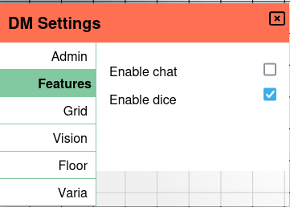

import Warning from "/src/components/directives/Warning.astro";

# **Chat**

Der In-Game-Chat ist seit dem Release 2024.3 möglich, indem du einfach auf den `Chat`-Button unten links im Ansichtsfenster klickst.

Wenn von einem Benutzer eine Chat-Nachricht gesendet wird, erscheint die Anzahl der ungelesenen Nachrichten neben dem Button.

Das Chat-Fenster akzeptiert Markdown-Eingaben, sodass neben Stilen und Links auch fortgeschrittenere Formatierungen verwendet werden können. Siehe dazu das [Markdown-Tutorial](../../../learn/dm/Markdown_Tutorial/markdown)

<Warning title="Chat-Persistenz">
    Der Chat wird nicht auf dem Server gespeichert. Er ist flüchtig und verschwindet, sobald du die Seite aktualisierst
    oder die Verbindung zurückgesetzt wird.
</Warning>

Der Chat kann über den Tab `Feature` in den `DM settings` deaktiviert werden, indem du das Häkchen der Chat-Aktivierung entfernst.

