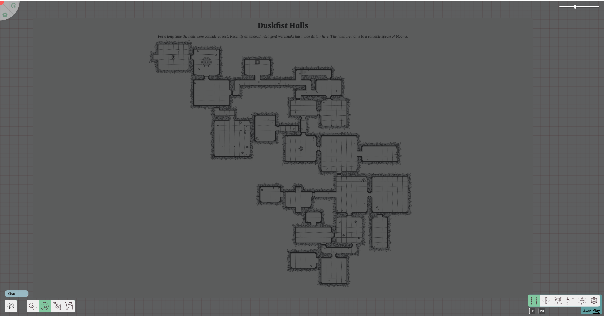
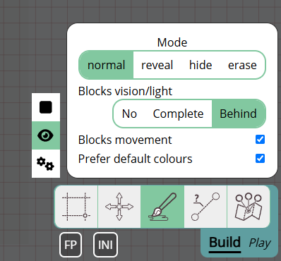

import Cog from "~icons/fa-solid/cog";
import Info from "/src/components/directives/Info.astro";
import Tip from "/src/components/directives/Tip.astro";

# Deine erste Karte

Die meisten Spiele drehen sich um eine Karte; das ist zwar nicht immer der Fall, aber in diesen Leitfäden gehen wir davon aus, dass wir ein klassisches Dungeon-Crawling-Setup verwenden.

In diesem Leitfaden fügen wir eine Karte hinzu, konfigurieren Wände, Lichter, Spielercharaktere und Monster.

## Konfiguration

Bevor wir uns an die eigentliche Arbeit machen, werfen wir zunächst einen Blick auf einige Konfigurationen, die wir möglicherweise ändern möchten.

Öffne das <Cog /> oben links und klicke auf „DM-Einstellungen".
Dadurch öffnet sich die Benutzeroberfläche, in der du eine Vielzahl globaler Einstellungen für die gesamte Kampagne konfigurieren kannst.

### Admin-Einstellungen

<Info>
    Um Spieler zu deinem Spiel hinzuzufügen, musst du ihnen den Einladungslink senden, den du auf dieser Registerkarte
    findest!
</Info>

Für unsere aktuellen Vorbereitungen relevanter sind jedoch die Registerkarten Raster und Sicht.

### Raster-Einstellungen

Je nach Spiel können diese Standardwerte in Ordnung sein oder eine gewisse Anpassung erfordern.

Einige bemerkenswerte Punkte hier:

- Standardmäßig wird ein quadratisches Raster verwendet; dies kann auf Hex-Raster geändert werden
- Eine einzelne Rasterzelle wird standardmäßig für verschiedene Dinge als ein 5x5-Fuß-Raster interpretiert (z. B. für das Ruler-Werkzeug)

### Sicht-Einstellungen

Aktiviere vorerst nur „Canvas mit Kriegsnebel füllen".

Ich persönlich stelle die Deckkraft des Kriegsnebels auch gerne höher ein (z. B. 0.7), aber das ist Geschmackssache.
Sie bestimmt, wie stark die Bereiche, die die Spieler nicht sehen können, für dich als DM sichtbar sind.

Warum haben wir diese Kriegsnebel-Einstellung aktiviert?

Wir werden einen tief unter der Erde liegenden Dungeon simulieren, daher wird die Standardkonfiguration vermutlich so aussehen, dass alles in Dunkelheit gehüllt ist und nur ein paar Fackeln hier und da Licht in die Szene bringen.
Deshalb haben wir die Leinwand mit Kriegsnebel gefüllt.

Nachdem diese ersten Einstellungen konfiguriert sind, schließen wir die DM-Einstellungen und fügen tatsächlich eine Karte hinzu.

## Assets hinzufügen

PA verfügt über einen Asset-Manager, in dem du hochgeladene Assets – ähnlich wie im Datei-Explorer deines Betriebssystems – in Ordnern organisieren, umbenennen usw. kannst.
Sobald du mehrere Spiele hast oder einfach viele Token-Grafiken auf einmal hochladen möchtest, solltest du den Asset-Manager wirklich gründlich erkunden.

Für jetzt ziehen wir jedoch einfach ein Asset aus dem Datei-Explorer deines Betriebssystems auf die Karte.
Wenn alles gut gelaufen ist, solltest du nun Folgendes sehen:

Die hier verwendete Karte wurde zufällig mit dem [Donjon-Dungeon-Generator](http://donjon.bin.sh/d20/dungeon/index.cgi) erzeugt.

Beachte, dass der Bildschirm ziemlich dunkel ist; das liegt an meiner Deckkraft-Einstellung von 0.7. Wenn jetzt ein Spieler der Sitzung beitreten würde, sähe er einen rein schwarzen Bildschirm.

## Ein Zwischenspiel über Ebenen

Wenn du auch den Spieler-Leitfaden befolgt hast, ist dir vielleicht die zusätzliche Benutzeroberfläche unten links aufgefallen, die der Spieler nicht sehen konnte.
Hier steuerst du Etagen und Ebenen. Etagen sind ein fortgeschritteneres Thema, das wir vorerst überspringen, aber Ebenen sind ein unverzichtbares Werkzeug in deinem DM-Arsenal.

Ebenen sind vertikal übereinander angeordnet und dienen dazu, die Renderleistung zu verbessern, aber auch eine Trennung der Zuständigkeiten zu erreichen.

Die standardmäßig ausgewählte Ebene ist die „Token"-Ebene. Sie ist für alle allgemeinen Token gedacht (sei es Spieler, NSCs oder Monster).
Es ist die einzige Ebene, mit der Spieler tatsächlich interagieren können.

Als DM hast du Zugriff auf eine Reihe weiterer Ebenen. Links von der Token-Ebene befindet sich die Karten-Ebene. Dies ist die unterste Ebene; die Idee ist, dass du hier deine großen Kartenelemente platzierst.
Dadurch wird sichergestellt, dass zu keinem Zeitpunkt eine Form hinter der Karten-Grafik hängen bleibt oder du versehentlich das Karten-Asset selbst bewegst.

Die dritte Ebene ist die DM-Ebene; dies ist einfach eine Ebene, auf der du als DM alles speichern kannst, was Spieler nicht sehen sollen.
Vielleicht hast du irgendwo ein verstecktes Monster, das du erst enthüllen möchtest, wenn der richtige Zeitpunkt gekommen ist, oder du hast an bestimmten Stellen Text als Erinnerung hinzugefügt.

Die letzte Ebene ist die Sicht-Ebene; diese werden wir gleich nutzen, aber für jetzt reicht es zu wissen, dass dies der übliche Ort ist, um Wände und Ähnliches zu zeichnen.

### Unsere Karte verschieben

Was wir nun tatsächlich gelernt haben, ist, dass die zuvor hinzugefügte Karte auf der falschen Ebene liegt!

Wir könnten die Karte löschen, zur Karten-Ebene wechseln und die Karte erneut hinzufügen, aber das ist viel Aufwand.

Stattdessen klicken wir mit der rechten Maustaste auf das Karten-Asset. (Stelle sicher, dass du dich noch auf der Token-Ebene befindest! Du kannst nicht direkt mit Assets von einer anderen Ebene interagieren)

Hier können wir die ausgewählte Form auf eine andere Ebene verschieben!
Auf diese Weise bringst du auch das versteckte Monster von der DM-Ebene auf die Token-Ebene.

<Info title="Die versteckte Ebene">
    Es gibt tatsächlich noch eine weitere Ebene, eine, die du nicht auswählen kannst: die Raster-Ebene. Die Raster-Ebene
    sitzt gemütlich zwischen der Karten- und der Token-Ebene und kann nur innerhalb der DM-Raster-Einstellungen konfiguriert
    werden, wie wir bereits gesehen haben.

    Beachte, wie die Rasterlinien verdeckt waren, als die Karte auf der Token-Ebene lag, während sie jetzt tatsächlich über der Karte liegen!

</Info>

## Ein Licht einrichten

Okay, wir haben unsere Karte auf der richtigen Ebene; lass sie uns zum Leuchten bringen!

Jede Form kann als Lichtquelle fungieren, also zeichnen wir zunächst einen kleinen Kreis, der eine Fackel in einem Raum darstellt.

### Grundform

Um Formen zu zeichnen, müssen wir das Draw-Werkzeug verwenden. Es ist eines der Werkzeuge, das Teil des Build-Modus der Werkzeugleiste ist, da seine Hauptverwendung in der Vorbereitung der Sitzung liegt.
Wechseln wir also in den Build-Modus (denk an das <kbd>tab</kbd>-Kürzel) und wählen das Draw-Werkzeug.

Wähle einen Kreis (oder eine andere Form!), eine Farbe und zeichne ihn auf den Spieltisch. Formen werden im Allgemeinen gezeichnet, indem man mit der linken Maustaste klickt und zieht.

<video autoplay loop muted style="max-width: min(680px, 75vw);">
    <source src="/learn/dm/add-light-shape.webm" type="video/webm" />
    <source src="/learn/dm/add-light-shape.mp4" type="video/mp4" />
</video>

### Lichtquelle hinzufügen

Wir können nun die Eigenschaften der gerade gezeichneten Form öffnen und eine Lichtquelle hinzufügen!

Dies kann auf der Registerkarte Tracker geschehen, indem man eine Aura konfiguriert, die als Lichtquelle fungiert und öffentlich ist.

Spiel ruhig damit herum! Die beiden Reichweitenwerte sind jeweils die Reichweite für helles und gedämpftes Licht.
Statt eines vollständigen Kreises kannst du die Lichtquelle auf einen Kegel beschränken und ihn in eine bestimmte Richtung ausrichten.

Du kannst deinem Licht auch eine bestimmte Farbe geben, um es eher wie eine echte Fackel wirken zu lassen.

<video autoplay loop muted style="max-width: min(680px, 75vw);">
    <source src="/learn/dm/add-light-source.webm" type="video/webm" />
    <source src="/learn/dm/add-light-source.mp4" type="video/mp4" />
</video>

## Die Kartendimensionen korrigieren

Nachdem wir ein Licht hinzugefügt haben, das einen Radius von 40 ft haben soll, fragst du dich vielleicht, wie das eigentlich mit den Kartendimensionen zusammenhängt, da wir das Kartenbild ohne weitere Änderungen einfach auf den Spieltisch geworfen haben.

Wenn du das Ruler-Werkzeug nimmst und die Größe einer einzelnen Rasterzelle auf der Karte misst, würden deine Vermutungen bestätigt: Die Karte ist überhaupt nicht richtig skaliert!
Die Nichtübereinstimmung der Karte mit dem PA-Raster hat dies vielleicht bereits verraten ;)

Wir könnten versuchen, die Kartendimensionen manuell zu korrigieren, indem wir das Select-Werkzeug verwenden und die Karte (im Build-Modus) skalieren.
Das ist jedoch fehleranfällig und mühsam. Stattdessen nutzen wir ein Build-Werkzeug, auf das nur DMs Zugriff haben: das Map-Werkzeug.

Dieses Werkzeug ermöglicht es dir, die Dimensionen der Karte zu konfigurieren. Du kannst die gesamte Breite/Höhe entweder in erwarteten Rasterzellen oder einfach in erwarteten Pixel-Breite/-Höhe eingeben,
aber du kannst auch einen Bereich ziehen und konfigurieren, was dieser Bereich in # Rasterzellen darstellen soll. Ich finde Letzteres am einfachsten.

<video autoplay loop muted style="max-width: min(680px, 75vw);">
    <source src="/learn/dm/map-tool.webm" type="video/webm" />
    <source src="/learn/dm/map-tool.mp4" type="video/mp4" />
</video>

Im obigen Video führen wir die folgenden Schritte aus:

1. Wechsle zur Karten-Ebene (da wir mit unserer Kartenform interagieren möchten)
2. Wähle die Karte aus und wechsle zum Map-Werkzeug
3. Ziehe einen Bereich auf der Kartenform auf
4. Gib im Map-Werkzeug ein, wie viele Rasterzellen der gezogene Bereich sowohl horizontal als auch vertikal darstellen soll
5. Ich habe die Anzahl der horizontal gezogenen Zellen gezählt, das sind 5, und sie in das horizontale Feld eingetragen
6. Bevor ich die Zahl eingetragen habe, habe ich auf das Kettensymbol geklickt, das dafür sorgt, dass jede Änderung das andere Feld automatisch aktualisiert, um das Seitenverhältnis beizubehalten
7. Das ergab ~5.02 für das vertikale Feld, was in Ordnung zu sein scheint
8. Nach dem Klicken auf Übernehmen wird die Kartenform sofort auf die gewünschten Abmessungen skaliert
9. Sie ist jedoch immer noch falsch ausgerichtet, also kehren wir zum Select-Werkzeug zurück und ziehen sie so, dass sie mit dem PA-Raster (den roten Linien) übereinstimmt

Das mag ziemlich aufwendig wirken, aber wenn du erst einmal den Dreh raus hast, ist es ein ziemlich schneller Weg, um Karten auszurichten.

<Tip title="Tipps">
    1. Wenn du einen größeren Bereich ziehst, steigt die Genauigkeit! Es erfordert nur mehr Arbeit, die Anzahl der
    ausgewählten Rasterzellen zu zählen.  
    2. Ich habe mein Raster relativ dezent dargestellt; du kannst dies in deinen Client-Einstellungen ändern  
    3. Auch wenn das Endergebnis nicht perfekt ist, solltest du die Karte jetzt viel einfacher genauer ausrichten
    können, wenn die allgemeine Größe ungefähr stimmt
</Tip>

## Wände hinzufügen

Wir haben nun eine korrekt ausgerichtete Karte und ein Licht, aber das Licht ignoriert unsere Karte einfach.
Um das zu beheben, müssen wir PA mitteilen, wo sich die Wände befinden.

<Info>
    Einige fortgeschrittenere Optionen wie das Hochladen einer SVG mit den Wandinformationen sind verfügbar, um dir bei
    diesem Prozess zu helfen. (Obwohl ich die Wände persönlich meistens von Hand zeichne)
</Info>

Wie das Licht werden auch die Wände mit dem Draw-Werkzeug gezeichnet.
Die Hauptfrage ist: Auf welcher Ebene möchten wir diese zeichnen?

Obwohl es eine optimale Wahl gibt, könnten wir tatsächlich jede Ebene wählen, mit Ausnahme der DM-Ebene, da diese für die Spieler nicht sichtbar wäre.

Wir könnten sie auf der Karten- oder Token-Ebene zeichnen, aber die Sicht-Ebene bietet einige Annehmlichkeiten, die sie interessanter machen:

Erstens werden Formen auf der Sicht-Ebene nicht gerendert, wenn du dich auf einer anderen Ebene befindest, was bedeutet, dass das visuelle Rauschen vieler Wandformen usw. beim eigentlichen Spielen verborgen werden kann.
Das bedeutet auch, dass du deine Formen farbcodieren kannst, um bestimmte Dinge zu bedeuten (z. B. sind die orangefarbenen Wandsegmente geheime Türen), ohne dass diese Farben in die Hauptszene auslaufen.

Der zweite Vorteil ist, dass das Draw-Werkzeug automatisch einige Einstellungen aktiviert, wenn du die Sicht-Ebene auswählst:

Wie du sehen kannst, sind die Einstellungen `blocks vision/light` und `blocks movement` automatisch aktiviert.
Das ist eine kleine Annehmlichkeit, die das Konfigurieren von Wänden ein wenig einfacher macht, da du nicht daran denken musst, diese Einstellungen jedes Mal zu konfigurieren, wenn du eine Wand zeichnen möchtest.

Diese 2 Einstellungen sind ziemlich wichtig und können nach dem Zeichnen geändert werden. Wie der Name schon sagt, werden Licht und Bewegung durch diese Form blockiert.
Das willst du normalerweise für eine Wand! Wenn wir ein Fenster nachahmen möchten, würden wir `blocks movement` aktiviert lassen, aber das Blockieren von Licht und Sicht deaktivieren.

<Info title="Standardfarben">
Eine weitere Annehmlichkeit ist die Standardfarben-Einrichtung für Sichtformen.
Diese können im Bereich „Darstellung" deiner Client-Einstellungen konfiguriert werden:
 

Die Form verwendet automatisch die hier definierte Farbe, wenn sie relevant ist. (z. B. Formen mit beiden Block-Einstellungen fungieren als Wände, und solche mit nur blockierter Bewegung als Fenster).

Wenn du diese Formen in einer bestimmten Farbe statt ihrer Standardfarbe zeichnen möchtest, kannst du die Option „Standardfarben bevorzugen" in den Sicht-Einstellungen des Draw-Werkzeugs deaktivieren.

</Info>

Nachdem das geklärt ist, zeichnen wir tatsächlich unsere Wand! Du kannst jede beliebige Form verwenden, aber das Polygon-Werkzeug ist für das Zeichnen von Wänden am vielseitigsten.

<video autoplay loop muted style="max-width: min(680px, 75vw);">
    <source src="/learn/dm/draw-walls.webm" type="video/webm" />
    <source src="/learn/dm/draw-walls.mp4" type="video/mp4" />
</video>

Wie du sehen kannst, ist das Zeichnen von Wänden super einfach! Es ist eine Frage des Geschmacks, wie viel von der tatsächlichen Wand du den Spielern sichtbar lassen möchtest;
normalerweise zeige ich ihnen ein wenig, damit sie visuell erkennen, dass es eine Wand gibt, anstatt sich nur auf den Schatten zu verlassen.

<Tip>
    Du musst mit der rechten Maustaste klicken, um die Polygonform abzuschließen!
     
    Mach dir nicht zu viele Gedanken über nicht ganz gerade Linien oder Punkte, die du vergessen hast hinzuzufügen. Das
    Select-Werkzeug im Build-Modus ermöglicht es dir, Punkte auf dem Polygon zu verschieben sowie neue Punkte
    hinzuzufügen oder bestehende zu entfernen. Erst die große Form zu zeichnen und danach ein wenig nachzubessern ist
    meistens viel schneller.
</Tip>

Überprüfe, wie es aussieht, wenn du zum Beispiel zur Token-Ebene wechselst: Beachte, dass die gezeichneten Wandformen verschwunden sind, der Schatten aber bleibt!

## Charaktere hinzufügen

Wir haben nun eine Karte mit einigen Wänden und einer Lichtquelle, aber noch keine Charaktere. Es gibt nichts, das die Spieler repräsentiert, und es gibt keine Monster oder NSCs.

Wir können wie bei der Karte einige Tokens per Drag & Drop auf den Spieltisch ziehen. Für dieses Beispiel-Setup werden wir jedoch einen grundlegenden Charakter-Token direkt in PA erstellen.
Das sind kleine kreisförmige Tokens mit nur einer Textbeschriftung. Praktisch für schnelles Prototyping oder wenn du schnell einen NSC auf den Spieltisch brauchst und keine Zeit mit der Suche nach einem Asset in deiner Sitzung verschwenden möchtest.

Um einen grundlegenden Charakter-Token hinzuzufügen, klicke mit der rechten Maustaste auf eine leere Stelle auf dem Spieltisch. Idealerweise tun wir das auf der Token-Ebene!

<video autoplay loop muted style="max-width: min(680px, 75vw);">
    <source src="/learn/dm/basic-token.webm" type="video/webm" />
    <source src="/learn/dm/basic-token.mp4" type="video/mp4" />
</video>

Im obigen Video haben wir:

- Einen grundlegenden Token mit dem Namen „test" erstellt
- Dem Spieler mit dem Benutzernamen „test" Zugriff auf die Form gegeben
- Ihn ein wenig herumgezogen, um zu testen, ob die Wand funktioniert, und ja, sie funktioniert!

Wenn wir nun prüfen, was der Spieler mit dem Benutzernamen „test" sehen kann, stellen wir folgendes Problem fest:

Unser Spieler kann alles in dem Raum mit dem Licht sehen, obwohl sich sein Charakter gar nicht dort befindet!

### Sichtzugriff

Bevor wir uns in die Sichtlinien-Sicht stürzen, müssen wir einen kurzen Umweg machen, um über die Zugriffsrechte auf Formen zu sprechen.

Als wir dem 'test'-Spieler oben Zugriff auf die Form gegeben haben, wurden die 3 Zugriffsberechtigungen (Bearbeitung/Bewegung/Sicht) automatisch erteilt.
Die 3 Zugriffsrechte werden nicht immer sofort erteilt; es hängt von einigem Kontext ab, daher ist es wichtig zu verstehen, was sie bewirken.

Insbesondere die Sichtzugriffs-Berechtigung ist wichtig, da sie bestimmt, was die Spieler sehen können.
Bei aktiviertem Zugriff geht PA davon aus, dass der Spieler Sichtzugriff auf die privaten Auren der Form hat und im Wesentlichen das sieht, was der Token in der Welt sehen kann.

Auch wenn auf dem Token keine Auren konfiguriert sind, ist immer eine minimale Sicht-Aura um ihn herum vorhanden, damit du ihn nicht verlierst, wenn du dich an einem Ort bewegst, an dem du nicht viel sehen kannst.

Wenn du den Sichtzugriff für den Token deaktivieren würdest, würden wir stattdessen Folgendes sehen:

Obwohl wir also Bearbeitungs- und Bewegungszugriff haben, sehen wir die Form nicht, weil nichts den Bereich, in dem sich die Form befindet, gerade beleuchtet.

## Sicht

Wie bereits erwähnt, mag es seltsam erscheinen, dass der Spieler den Raum sehen kann, der von jenem Licht beleuchtet wird, während sein Charakter nicht dort ist.
Das liegt daran, dass wir dem Spieler derzeit keine Sichteinschränkungen auferlegen. Er kann einfach alles sehen, was (öffentlich) beleuchtet ist.

Das kann in bestimmten Konfigurationen gut funktionieren, aber wenn du erwartest, dass der Spieler nur das sehen kann, was sein Charakter sehen kann,
kann das sehr mühsam werden, da du als DM die Lichter an- und ausschalten musst, während die Spieler die Karte erkunden.

Und dieser arbeitsintensive Ansatz führt letztendlich immer noch dazu, dass die Spieler sehen können, was andere Spieler sehen, was vielleicht auch nicht das ist, was du möchtest.

Um die Sicht pro Charakter richtig zu aktivieren, brauchen wir zwei Dinge:

1. Spieler müssen Sichtzugriff auf ihre Formen haben
2. Der Ort muss so konfiguriert sein, dass Sichtlinien aktiviert sind

(1) Das haben wir im früheren Abschnitt „Sichtzugriff" behandelt, das ist also bereits abgedeckt, aber für (2) müssen wir zurück zu unseren DM-Einstellungen gehen, [wo wir die Einstellung „voller Kriegsnebel" aktiviert haben](#vision-settings).

<Tip>
Wenn du mehrere Orte hast (siehe später), können diese DM-Einstellungen oft auch pro Ort konfiguriert werden.

Die DM-Einstellungen sind die Standardeinstellungen und werden verwendet, wenn sie nicht explizit durch einen Ort überschrieben werden.

</Tip>

Wenn alles richtig gelaufen ist, haben wir nun die folgende Ansicht (auf der DM-Seite):

Was hier also passiert, ist, dass der Spieler nun nur die Stellen sieht, an denen Licht innerhalb seiner Sichtlinie, basierend auf den von uns gezeichneten Wänden, sichtbar ist.
(Denk daran, dass wir nur die Innenwand in der Kammer rechts gezeichnet haben).

Um zu veranschaulichen, warum das so dargestellt wird, habe ich diese grobe Zeichnung angefertigt:

- Die roten Linien sind die Wände, die wir erstellt haben; sie blockieren Licht.
- Die gelben Linien zeigen den Kegel, den das Licht abstrahlt und der durch die Türöffnung geht, die wir in der Wand gelassen haben
- Die grünen Linien zeigen den Kegel, den der Charakter durch dieselbe Türöffnung in den anderen Raum sehen kann

Für den Raum, in dem sich der Charakter befindet:

- Der Charakter kann den gesamten Raum sehen
- Das Licht beleuchtet nur einen Abschnitt (diesen gelben Kegel)

-> Nur der Kegelabschnitt ist tatsächlich sichtbar

Für den Raum, in dem sich das Licht befindet:

- Der Charakter kann nur den grünen Kegelabschnitt sehen
- Das Licht beleuchtet den gesamten Raum

-> Nur der Kegelabschnitt ist tatsächlich sichtbar

### Spieler-Auren

Normalerweise haben Charaktere eine angeborene Fähigkeit, bis zu einer bestimmten Entfernung durch die Dunkelheit zu sehen, oder sie besitzen schlicht einen Gegenstand wie eine Fackel, der Licht spendet.

Wir haben [zuvor](#add-light-source) gesehen, wie man eine Aura für das Licht im anderen Raum erstellt; wir können dasselbe einfach für unseren Spielercharakter tun!
Öffne die Formeinstellungen, gehe zur Registerkarte Tracker und füge eine neue Aura hinzu.

Als öffentlich konfigurierte Auren erscheinen für alle Spieler (mit Sicht auf die Aura), was perfekt für eine Fackel ist, während eine private Aura besser für angeborene Fähigkeiten wie Dunkelsicht geeignet ist.

Es ist wichtig, die Eigenschaft „fungiert als Lichtquelle" zu markieren, denn das ist es, was sie tatsächlich als Licht-/Sichtquelle funktionieren lässt. (Sichtquelle ist wahrscheinlich der bessere Name)

--

Das sollte dir das Nötigste geben, um deine Karten fürs Spiel vorzubereiten!

[Weiter](/de/learn/dm/other-features) werden wir uns einige andere Funktionen ansehen, die du als DM wahrscheinlich kennen solltest.
