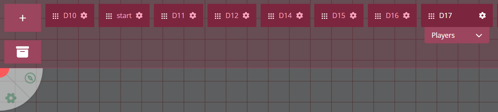

import Info from "/src/components/directives/Info.astro";
import Warning from "/src/components/directives/Warning.astro";

# Weitere erwähnenswerte Funktionen

Dieser Abschnitt ist kürzer und verweist hauptsächlich auf einige Funktionen, die du als DM bei deiner Vorbereitung oder während deiner Spiele erkunden möchtest.

<Warning>
    Einige der verlinkten Referenzseiten sind möglicherweise veraltet. Diese neuen Einführungsdokumente sind ein erster
    Schritt in dem Bemühen, die Dokumentation auf den neuesten Stand zu bringen!
</Warning>

## Initiative

_vollständige Referenz: [die Initiative-Dokumentation](/de/docs/tools/initiative/)_

Ein häufiger Aspekt von Rollenspielen ist irgendeine Form des Kampfs. PA bietet einen einfachen Initiative-Tracker, um Runden zu verfolgen.

Das Wesentliche ist, dass du die Initiative-Benutzeroberfläche öffnen kannst, indem du mit der rechten Maustaste auf den Spieltisch klickst.
Wenn du dabei auf eine Form klickst, kannst du stattdessen die jeweilige Form zur Initiative hinzufügen, wodurch sie einen Eintrag in der Benutzeroberfläche erhält.

Einträge können für Spieler verborgen werden, bis sie relevant werden; Timer können hinzugefügt werden, um Effekte zu verfolgen, die X Runden andauern, usw.

## Orte

_vollständige Referenz: [die Ort-Dokumentation](/de/docs/dm/locations/)_

Wir haben nun unsere erste Karte erstellt, aber was ist mit einer zweiten Karte?

Wir könnten einfach einen weiteren Bereich des Spieltischs einer neuen Karte widmen,
aber das bringt mehrere Probleme mit sich:

- Die Navigation kann schnell schwierig werden, wenn man sich merken muss, wo welcher Teil lag, und
- Es gibt einfach immer mehr Daten, was PA verlangsamt
- Du möchtest vielleicht andere Einstellungen für bestimmte Karten (z. B. ein anderes Raster-Layout, ein anderes Beleuchtungs-Setup)

Stattdessen ist es einfacher, deine Karten in etwas zu trennen, das PA einen „Ort" nennt.

Die Ort-Leiste kann als DM über den zweiten Griff des UI-Elements oben links geöffnet werden.
Sie zeigt eine Liste all deiner aktiven Orte (du kannst Orte archivieren/reaktivieren) und wo sich bestimmte Spieler gerade befinden.

Jeder Ort kann einzeln konfiguriert werden, um die DM-Einstellungen zu überschreiben, die wir in den vorherigen Teilen gesehen haben. Als DM kannst du durch Klicken auf einen Eintrag schnell einen Ort für dich laden.

### Spieler verschieben

Um Spieler von einem Ort zu einem anderen zu verschieben, gibt es 2 Optionen.

Option 1 ist, die Spieler-Box von einem Ort zu einem anderen zu ziehen;
Option 2 ist, im Ziel-Ort etwas zu erstellen, das man Spawn-Ort nennt, und per Rechtsklick auf eine Form (oder mehrere Formen) diese zu einem anderen Ort zu verschieben.

Letzteres mag nach viel mehr Arbeit klingen, aber Ersteres verschiebt quasi nur die Kamera der Spieler. Mit den Spawn-Orten verschiebst du hingegen tatsächlich ihre Token an einen bestimmten neuen Platz im Ziel-Ort.

Option 1 eignet sich daher besser für Orte, an denen keine Charakter-Tokens nötig sind, vielleicht eine Übersichtskarte oder ein Ort, an dem du verschiedene lose Bilder für Rollenspiele vorbereitet hast.

Option 2 ist fast immer der sauberere Weg für die Spieler, zwischen Orten zu wechseln. Wir werden später im Logik-Abschnitt einige zusätzliche Hilfsmittel sehen, die dir dabei helfen.

## Etagen

_vollständige Referenz: [die Etagen-Dokumentation](/de/docs/dm/floors/)_

Das Ort-System ist großartig, um mit einer Vielzahl von Orten umzugehen, die deine Spieler erkunden könnten.
Manchmal haben wir es jedoch mit Orten zu tun, an denen es Vertikalität gibt.
Ein Haus mit mehreren Etagen ist ein einfaches Beispiel dafür.

Für jede Etage einen anderen Ort zu verwenden, ist ziemlich umständlich, da jeder Ort ein wenig wie eine andere Ebene in einem Videospiel ist, bei der einige Interna komplett zurückgesetzt werden und man einen kleinen Ladebildschirm bekommt.
Andere Dinge wie die Initiative werden auch pro Ort verfolgt, sodass das schnell problematisch wird, wenn man mit Charakteren überall zu tun hat.

Eine einfache Lösung ist, die anderen Etagen einfach auf einen anderen Bereich deines „Haus"-Ortes zu legen. Du kannst weiterhin Spawn-Orte innerhalb desselben Ortes verwenden, sodass das Wechseln zwischen Etagen ziemlich unkompliziert bleiben kann.

PA hat jedoch eine spezielle Zusatzfunktion, die treffend „Etagen" genannt wird. Sie ermöglicht es dir, einen völlig neuen Satz von Ebenen über dem aktuellen Satz hinzuzufügen.
In Kombination mit Transparenz bedeutet das, dass eine Form auf der oberen Etage tatsächlich die Treppe hinunterschauen und einen Charakter auf einer tieferen Etage sehen kann!
Etwas, das du ohne diese Funktion nicht nachbilden könntest.

Das verbessert ehrlich gesagt die Immersion enorm, und die Übergänge zwischen den Etagen sind viel flüssiger, da die Kamera nicht herumspringen muss.

## Logik

_vollständige Referenz: noch nicht erstellt :(_

PA hat derzeit zwei verschiedene „Logik"-Systeme, die man sich als Interaktionselemente für den DM oder die Spieler während des Spiels vorstellen kann.

### Türen

Eine Form kann als Tür markiert werden, wodurch die Form zwischen einem geöffneten und einem geschlossenen Zustand umschalten kann.
Während sie geöffnet ist, blockiert die Form keine Sicht/Bewegung; während sie geschlossen ist, tut sie es!

Das ist eine einfache Annehmlichkeit, hauptsächlich für DMs, da sie einfach auf Türen klicken können, während die Spieler erkunden, aber du kannst deine Türen optional auch so konfigurieren, dass sie für deine Spieler interagierbar werden.

<Info>
    Die Türinteraktion ist nur im Play-Modus möglich; im Build-Modus ist sie deaktiviert, um Frustration zu vermeiden,
    z. B. beim Skalieren einer Tür.
</Info>

Obwohl die Funktion „Tür(en)" heißt, kannst du tatsächlich ändern, welcher Blocker durch die Interaktion umgeschaltet werden soll. Das bedeutet, dass du nur den Sicht-Blocker umschalten kannst und du ein Fenster bekommst!
Wenn du stattdessen nur die Bewegung blockierst, hast du so etwas wie eine versteckte Tür in einer glatten Wand.

### Teleportzonen

Das andere Logik-Element ist die Teleportzone. Ein Bereich kann als Teleportzone ausgewiesen werden, was bedeutet, dass Formen, die in sie eintreten, zu einem anderen Ort teleportiert werden können (d. h. einem Spawn-Ort).

Teleportzonen können so konfiguriert werden, dass sie automatisch auslösen (z. B. eine Teleport-Falle) oder eine Aktion anzeigen, die dich fragt, ob du teleportieren möchtest.

Beispielhafte Verwendungen von Teleportzonen sind Treppenabsätze zwischen Etagen, wodurch das schnelle Wechseln zwischen Etagen viel einfacher wird.

## Assets

_vollständige Referenz: [die Asset-Dokumentation](/de/docs/dashboard/assets/)_

Weiter oben in der Einführung haben wir den Asset-Manager erwähnt, aber statt ihn zu verwenden, haben wir Assets direkt auf die Karte gezogen.

Der Asset-Manager ist eine Funktion, mit der du deine verschiedenen Assets organisieren kannst. Er ist außerhalb des Spiels im Haupt-Dashboard verfügbar, kann aber auch im Spiel aufgerufen werden.

Du könntest zum Beispiel einen speziellen Ordner für alle deine D&D-Token haben, aber auch einen speziellen Ordner für jede Kampagne.
