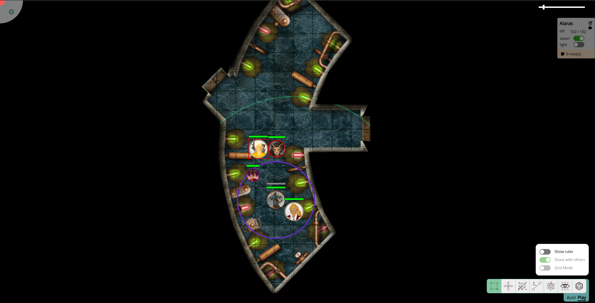

import Cog from "~icons/fa-solid/cog";
import Info from "/src/components/directives/Info.astro";
import Warning from "/src/components/directives/Warning.astro";

# Einführung

Herzlichen Glückwunsch, deine Gruppe zieht PlanarAlly für euer nächstes Spiel in Betracht!
Aber wie benutzt man es eigentlich?

In diesem Einführungs-Leitfaden schauen wir uns an, wie man ein Konto erstellt, einem Spiel beitritt und
machen uns mit den wichtigsten UI-Elementen vertraut, die beim Öffnen eines Spiels sichtbar sind!

## Kontoerstellung

<Info title="PA-Server">
    Es gibt nicht einen einzigen PlanarAlly-Server; jeder ist frei, seine eigene Version zu hosten und sie für andere
    offen oder geschlossen zu machen. Normalerweise hat jemand aus deiner Gruppe geklärt, auf welchem PA-Server ihr
    spielt; wenn nicht, muss sich jemand mit der [Server-Dokumentation](/de/server/setup/) befassen und einen
    gemeinsamen Server festlegen.
</Info>

Wenn du den gewählten Server-Host besuchst, wirst du sofort mit einer Anmeldeseite begrüßt.
PlanarAlly verlangt von dir nichts Besonderes, wenn du dich für ein neues Konto registrierst,
nur einen Benutzernamen und ein Passwort, optional mit einer E-Mail-Adresse.

Derzeit wird die E-Mail-Adresse in PA selbst für nichts verwendet,
aber ein Server-Administrator könnte sie nutzen, um Benutzer über anstehende Wartungsarbeiten oder Ähnliches zu informieren.

## Einem Spiel beitreten

Nach der Anmeldung wirst du mit dem Haupt-Dashboard begrüßt; es zeigt Spiele, an denen du teilnimmst, und falls du später selbst ein Spiel hostest, werden sie auch hier angezeigt.

Damit ein Spiel hier erscheint, musst du jedoch zuerst eingeladen werden.

Dein Host sendet dir eine URL, die beim Besuch automatisch die Verbindung mit deinem Konto herstellt und dich in das Spiel bringt.
In Zukunft wird das Spiel in deinem Haupt-Dashboard angezeigt, wie oben erklärt!

## Kurze Einführung in die Benutzeroberfläche

Sobald du ein Spiel öffnest, wirst du sofort mit einer Vielzahl von UI-Elementen begrüßt.

Den Großteil des Bildschirms dominiert der Kern eines jeden VTT: die Karte mit Tokens, Sicht und Beleuchtung.
Dein DM wird das vorher vorbereitet haben.

<Warning title="Es ist alles schwarz?!">
    Es ist möglich, dass du nur das pure schwarze Nichts siehst. Aber keine Sorge, dein DM muss dir wahrscheinlich
    noch Zugriff auf eine Form geben!

    Wenn er das getan hat und du immer noch nichts siehst, versuche <kbd>space</kbd> zu drücken, um den Bildschirm auf
    einen Token zu zentrieren, auf den du Sichtzugriff hast.

</Warning>

Im nächsten Kapitel sehen wir, wie wir richtig mit der Karte interagieren, sie verschieben und zoomen sowie unsere Charaktere bewegen.

Lass uns zunächst die Ecken des Bildschirms vorstellen, an denen PA die meisten anderen prominenten UI-Elemente platziert.

Oben links gibt es ein <Cog />, das eine Seitenleiste öffnet;
das dient meist zur Konfiguration einiger weniger genutzter Einstellungen und ist auch der Weg, das aktuelle Spiel zu verlassen und zum Haupt-Dashboard zurückzukehren.

Oben rechts gibt es einen Zoom-Regler zur Steuerung des Zoom-Levels der Karte, und du siehst auch ein UI-Element mit Informationen über den aktuell ausgewählten Charakter.

Wenn wir weiter im Uhrzeigersinn gehen, sehen wir unten rechts eine Reihe von Symbolen und einen Build/Play-Umschalter.
Diese hängen alle mit einer Vielzahl von Werkzeugen zusammen, die PA bietet. Das reicht von Dingen wie Draw-Werkzeugen bis hin zu Linealen und Würfeln.
Mehr dazu im nächsten Kapitel!

Zu guter Letzt gibt es die untere linke Ecke, die im obigen Screenshot leer ist.
Dieser Bereich ist hauptsächlich für DM-spezifische Dinge reserviert, kann aber auf der Spielerseite erscheinen, wenn dein DM eine spezielle PA-Funktion namens „Etagen" verwendet.
Auch der Text-Chat erscheint hier, wenn dein DM diese Funktion aktiviert hat!

Diese kurze Einführung war nur der Anfang; tauchen wir ganz ein und schauen wir uns an, was diese Werkzeuge können und wie wir mit unserem Charakter interagieren können [im nächsten Kapitel](/de/learn/player/interaction/)!
