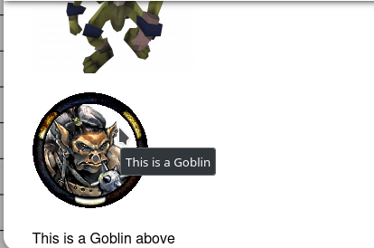

# **Markdown-Tutorial-Leitfaden.**

Leitfaden von [@veritanuda](https://keybase.io/veritanuda)

Dieser Leitfaden untersucht die Möglichkeiten der Markdown-Formatierung in PlanarAlly im Detail. Sie wird sowohl in den [Notizen](../../../../docs/game/notes)-Feldern als auch im [Chat](../../../../docs/game/chat)-Fenster verwendet.

Die Informationen in diesem Leitfaden stammen weitgehend aus diesem [Syntax-Leitfaden](https://markdown-it.github.io/)

## **Text-Effekte**

Das Folgende ist ein Beispiel für die Text-Effekte, die angewendet werden können.


Darin kannst du sehen:

- Titelgrößen
- Textformatierung
- Textstile

So sieht es im Notizen-Fenster aus.


Und so sieht es im Bearbeitungsmodus aus.


Das Zeichen `#` kann verwendet werden, um Titelgrößen festzulegen. 1 ergibt die größte Größe `Title Size 1`

2 `#` ergeben die nächstkleinere Größe `Title Size 2`

3 `#` die wiederum nächstkleinere Größe `Title Size 3`

4 `#` entspricht der Verwendung von Fettdruck, der entweder durch `**` oder `__` um den Text herum erreicht werden kann. `Title Size 4`

Unterstreichungen erfordern die HTML-Notation, die auch für andere Text-Effekte wie kursiv `<i> </i>` und fett `<b></b>` funktioniert.

`<u>Unterstrichen</u>`

`*` ist _Kursiv_

`**` ist **fett**

`***` ist **_Fett und Kursiv_**

`~~` ist ~~Durchgestrichen~~

`<sup> </sup>` ist Super<sup>script</sup>

`<sub> </sub>` ist Sub<sub>script</sub>

``is`code`

` ``` ` ist

```
code
block
```

---

## **Text-Layout**

Das Folgende ist ein Beispiel für Text-Layouts


### <u>Unsortierte Listen</u>

Unsortierte Listen können entweder `*` oder `-` verwenden, um Elemente in der Liste zu trennen.

```
Unordered List 1
* First
* Second
* Third
* Fourth
```

Unordered List 1

- First
- Second
- Third
- Fourth

```
Unordered List 2
- First
- Second
- Third
- Fouth
```

Unordered List 2

- First
- Second
- Third
- Fouth

### <u>Sortierte Listen</u>

Sortierte Listen verwenden `<Nummer>.` mit Zahlen, die ab der ersten Zahl, die du angibst, erhöht werden.

```
Ordered List
1. First
2. Second
3. Third
4. Fourth
```

Ordered List

1. First
2. Second
3. Third
4. Fourth

### <u>Gestufte/mehrstufige Listen</u>

Gestufte Listen, auch mehrstufige Listen genannt, können erreicht werden, indem zwischen jeder Listenebene ein doppeltes Leerzeichen eingefügt wird.

```
Stepped List
- First
- Second
- Third
  - 3 a
  - 3 b
- Fourth
```

Stepped List

- First
- Second
- Third
    - 3 a
    - 3 b
- Fourth

### <u>Tabellen</u>

Tabellen verwenden `|` zum Trennen von Spalten, während `-` und `:` zur Angabe der Ausrichtung verwendet werden (optional, da linksbündig die Standardeinstellung ist)

```
|Col A|Col B|Col C|
|--|:--:|--:|
|Row 1|Row One|R 1|
|Left|Centre|Right|
```

| Col A |  Col B  | Col C |
| ----- | :-----: | ----: |
| Row 1 | Row One |   R 1 |
| Left  | Centre  | Right |

---

## <u>Bilder und Links</u>

Unten ist ein Beispiel für Inline-Bilder und Hyperlinks.


Für **_die meisten_** Bild-URLs kannst du einfach die Bildadresse kopieren und einfügen, und es sollte das Bild aufgelöst werden.

Falls nicht, solltest du Inline-Bilder einfügen können, indem du dem Element ein `!` voranstellst, einen Tag-Namen in `[ ]` angibst und dann den Link in `( )`.

```
This is a Goblin below.


```

Es gibt eine alternative Methode, die den Code sauberer machen kann: die Referenzmethode, bei der du statt eines Links zum Bild einen Verweis verwenden kannst, der wiederum auf das Bild verlinkt.

```
![Goblin][Goblin1]

This is a Goblin above

This is another Goblin

![Goblin2][Goblin2]

[Goblin1]:https://www.imarvintpa.com/Mapping/Tokens/g1/Goblin.png "This is a Goblin"
[Goblin2]:https://gamepedia.cursecdn.com/crafttheworld_gamepedia/thumb/b/be/Cave_Goblin.png/150px-Cave_Goblin.png "This is a Cave Goblin"
```

Verweise können auch Tooltips liefern: Wenn der Cursor über ein Bild fährt, kann ein Tooltip angezeigt werden. Diese werden erstellt, indem der Tooltip-Text nach der URL in `" "` gesetzt wird



**HINWEIS:** Beim Einfügen ausgewählter Bilder werden diese im Chat-Fenster skaliert, aber wenn du auf das Bild klickst, öffnet sich eine größere Version in einem anderen Fenster.

## <u>**URL-Links**</u>

URL-Links sind wie oben, jedoch ohne das vorangestellte `!`

```
[5E Character Sheet](https://media.wizards.com/2016/dnd/downloads/5E_CharacterSheet_Fillable.pdf)
```

[5E Character Sheet](https://media.wizards.com/2016/dnd/downloads/5E_CharacterSheet_Fillable.pdf)

# Fazit

Die Verwendung von Markdown in Notizen oder im Chat ist eine nützliche Möglichkeit, mit deinen Spielern zu interagieren und ihnen Zugang zu Dingen wie Handouts oder Monsterbildern zu geben, um einem Spiel mehr Tiefe zu verleihen. Aus Sicht eines GMs kann die Verwaltung von Notizen auf Tokens für Werte, besondere Fähigkeiten, allgemeine Informationen, Ortsbeschreibungen usw. die Menge an Informationen, die du außerhalb eines Spiels speichern und nachschlagen musst, erheblich reduzieren. Das macht das Leiten eines Spiels viel flüssiger und reibungsloser.

Viel Spaß beim Spielen!
