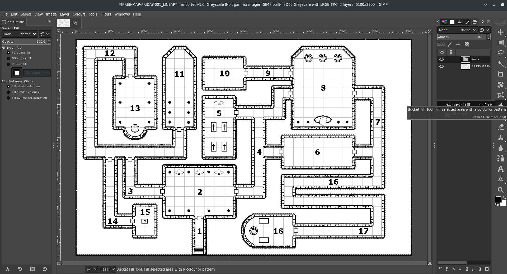
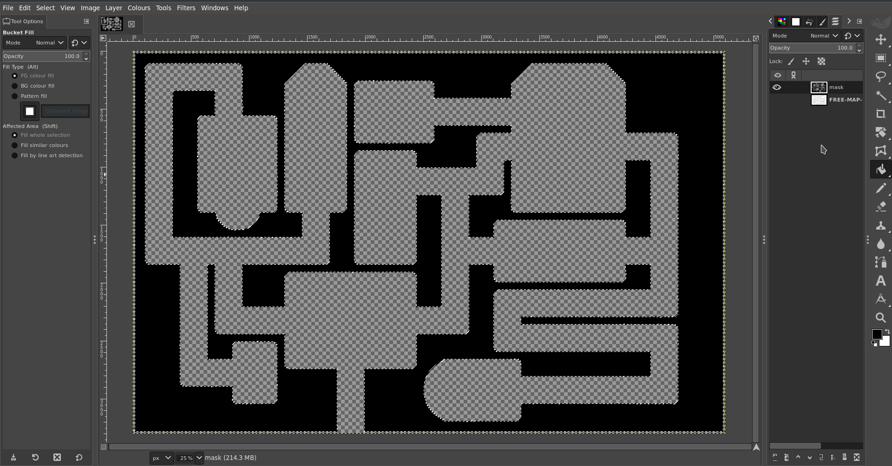
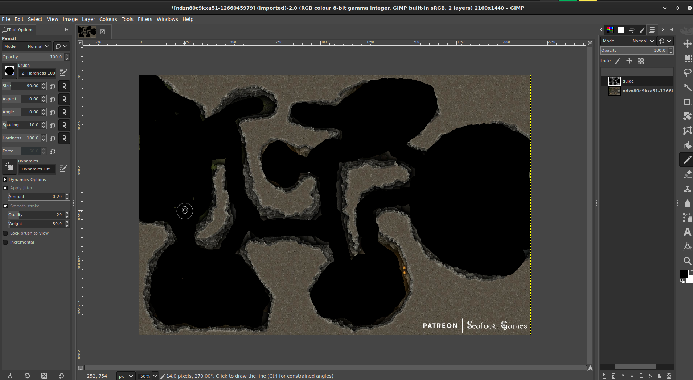

# **Leitfaden zum Erstellen von Wandmasken.**

Leitfaden von [@veritanuda](https://keybase.io/veritanuda)

Diese Methode sollte für jede Karte funktionieren, abhängig von ihrer Genauigkeit, aber auch unregelmäßige Karten wie Höhlen können leicht maskiert werden.

# Anforderungen

Die folgenden Anweisungen verwenden die frei verfügbaren Werkzeuge [GIMP](https://gimp.org) und [potrace](https://potrace.sourceforge.net/); du kannst natürlich auch proprietäre Werkzeuge verwenden, um die gleichen Ergebnisse zu erzielen, aber es gibt keine Garantie, dass sie sich gleich verhalten.

---

Im Folgenden zeige ich 2 Methoden.

- Eine Methode ist für Dungeons und vorgefertigte Karten
- Die andere Methode ist für unregelmäßige Karten und eigene Karten.

# **Methode Eins**

Für diese Methode wähle ich eine zufällige Karte von Free Friday Maps. Du kannst sie [hier](https://www.drivethrurpg.com/browse/pub/10213/Paths-to-Adventure/subcategory/25973_33572/Free-Map-Friday) bekommen, aber jede Karte funktioniert, solange sie ein paar wichtige Eigenschaften hat.

- Sie hat eine Schwarz-Weiß-Version und
- sie hat eine Option ohne Raster.

    Diese sind nicht zwingend erforderlich, aber sie machen die Erstellung der Maske nur ein wenig weniger zeitaufwendig.

Das ist also die Karte, mit der ich beginnen werde.

Sie kommt in einigen Varianten, unter anderem als Lineart. Das ist die, die wir verwenden werden.

# Hintergrund entfernen

Auf dieser Karte gibt es um die Karte herum eine unregelmäßige Schraffur als Hintergrund. Glücklicherweise hat sie eine andere Farbe, eine Art Grau. Wenn du also das Werkzeug `Fuzzy select/Colour Select` wählst, wähle `Colour Select`, klicke auf einen der grauen Bereiche des Hintergrunds und du solltest sehen, wie das gesamte Grau hervorgehoben wird.

Das ist gut, aber da die Linien dazwischen nicht ausgewählt sind, würde das Löschen jetzt nur das schwarze „Crazy-Paving"-Aussehen hinterlassen.

Während also alles ausgewählt ist, klicke mit der rechten Maustaste auf das Bild und gehe zu `Select` `>` `Grow...`

Vergrößere die Auswahl um ein paar Pixel, bis sie die Linien zwischen den grauen Punkten abdeckt. Wenn du zufrieden bist, dass du alles erwischt hast, drücke `Delete` und _POOF_ verschwindet der Hintergrund.

Gehe nun zurück zu `Fuzzy Select` und wähle diesmal `Fuzzy Select`. Klicke auf den nun weißen Hintergrund und sieh, wie alles ausgewählt wird.

- _Hinweis: Wenn du geschlossene Flächen hast, wie diese Karte sie hat, musst du die Umschalttaste gedrückt halten und hineinklicken, um sie zur Auswahl hinzuzufügen._

Füge nun im `Ebenen`-Panel `Neue Ebene` hinzu und nenne die Ebene `mask`.

Wähle auf dieser Ebene das Werkzeug `Bucket Fill`. Klicke auf die Auswahl des Hintergrunds, die du vorher gemacht hast, und es sollte alles schwarz gefüllt werden.

Blende die Lineart-Ebene aus und prüfe, ob du eine vollständige Maske ohne fehlende Teile hast.

Wenn du etwas übersehen hast, keine Panik: Drücke einfach `Cntrl-Z` zum Rückgängigmachen und gehe zurück zum Auswählen der Teile, die du übersehen hast.

Je nach Karte und wie du den Hintergrund ausgewählt hast, könnten auch einige Türen mitgemalt worden sein. Du musst mit dem Radiergummi-Werkzeug und einem Pinsel in der passenden Form über alle Türen und geheimen Türen gehen und das Schwarz entfernen.

Wenn du das nicht tust, machst du eine Tür unpassierbar. Du kannst jederzeit Tür-Tokens zu jeder Öffnung hinzufügen, die du gemacht hast, sobald die Karte importiert und die Wände hinzugefügt sind.

Sobald du mit deiner Maske zufrieden bist, kannst du die Lineart-Ebene löschen.

Der nächste Teil ist **entscheidend**, wenn du sie richtig in SVG konvertieren willst, was PlanarAlly für Wände verwendet.

Klicke mit der rechten Maustaste auf das Bild und gehe zu `Image` `>` `Mode`; wenn du, wie ich, die Lineart importiert hast, wäre es `greyscale` gewesen. Manchmal musst du eine Farbkarte in `greyscale` konvertieren, um das Löschen von Hintergründen usw. zu erleichtern. Aber jetzt muss der Modus `RGB` sein. Ändere das Bild entsprechend.

Klicke dann mit der rechten Maustaste auf das Bild, gehe zu `File` `>` `Export As...` und speichere das Bild als `BMP`. Schalte `Run Length Encoding` AUS, schalte `Do not write colour space information` AUS und stelle sicher, dass du unter `Advanced` auf `32 Bits` bist

Sobald das gespeichert ist, kannst du entweder das Kommandozeilen-`potrace` verwenden oder es kostenlos online auf [dieser Website](https://svg-converter.com/potrace) erledigen.

Der Befehl dafür ist extrem einfach.

`potrace -s FREE-MAP-FRIDAY-001_LINEART_WALLS.bmp`

Das sollte dir eine `svg` geben, die, wenn du sie in einem Grafikprogramm öffnest, schwarz ist, wo das Licht blockiert wird, und klar, wo das Licht scheinen kann.

# **Methode Zwei**

Angenommen, du hast eine unregelmäßige Karte oder der Hintergrund ist nicht so leicht zu entfernen. Nun, du kannst eine Maske immer noch von Hand nur mit normalen Werkzeugen erstellen.

Für dieses Beispiel verwende ich [diese Karte](https://www.reddit.com/r/FantasyMaps/comments/hrf51h/battlemap30x202160x1440pxcavejunglepirateoc/)

Importiere die Karte in gimp.

Erstelle eine neue Ebene und nenne sie `guide`.

Wähle mit dem `Pencil tool` den `Circle` als Pinsel und mache ihn schwarz. Skaliere bei Bedarf neu. Stelle sicher, dass du die `guide`-Ebene ausgewählt hast, und beginne, auf den farbigen Teilen der Karte **innerhalb** der Wände zu zeichnen.

Wenn du zufrieden bist, dass die gesamte Form ausgefüllt ist, erstelle eine weitere Ebene namens `walls`.

Verwende auf der `guide`-Ebene das Werkzeug `Select by colour` und klicke auf den schwarzen Leitfaden, den du erstellt hast. Invertiere dann die Auswahl.

Verwende dann auf der `walls`-Ebene das Bucket-Fill-Werkzeug, um die invertierte Auswahl mit Schwarz zu füllen und die Wände auszufüllen.

Wenn das erledigt ist, blende die vorherigen Ebenen aus; wenn du zufrieden bist, dass du nichts übersehen hast, lösche diese Ebenen und speichere das Bild wie oben als BMP, um es mit einer der obigen Methoden zu konvertieren.

# Wände in PA importieren

Lade diese SVG nun zusammen mit der Spielerkarte und, falls vorhanden, der GM-Karte in deinen `Assets`-Ordner auf PlanarAlly hoch.

Ziehe diese Assets an einen Ort, wobei die Spielerkarte auf der MAP-Ebene und die GM-Karte auf der GM-Ebene liegt. Klicke auf der MAP-Ebene mit der rechten Maustaste darauf, rufe die Eigenschaften auf und setze einen `Name` und aktiviere unter `Advanced` die Optionen `Blocks Vision/Light` und `Blocks Movement`. Gehe dann zum Reiter `Extra` und unter `Lighting & Vision` `>` `Upload walls`. Wähle die SVG aus, die du gerade in deine Assets hochgeladen hast. Deine Wände sollten nun angewendet werden.

Teste es mit einem Token, der eine Lichtquelle hat, auf der `Token`-Ebene, und du bist fast fertig. Wenn es nun Türen oder geheime Gänge gibt, müssen diese manuell mit Tür-Tokens oder Kriegsnebel abgetrennt werden, deine Wahl. Aber wenn alles gut läuft, musst du dir keine Sorgen mehr um das händische Erstellen von Wänden machen.

Viel Spaß beim Spielen!

\*/}
