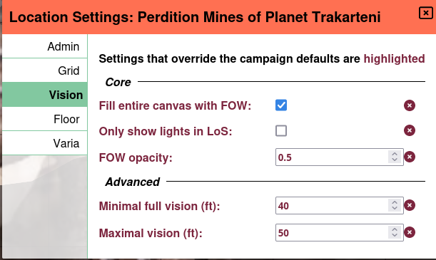
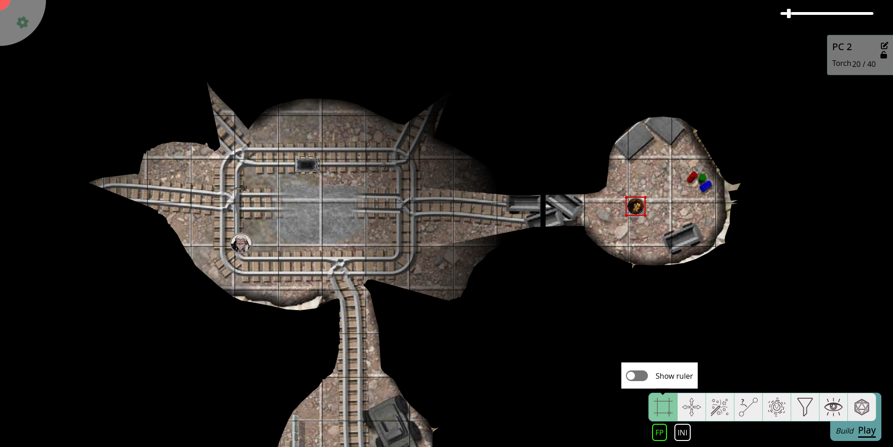
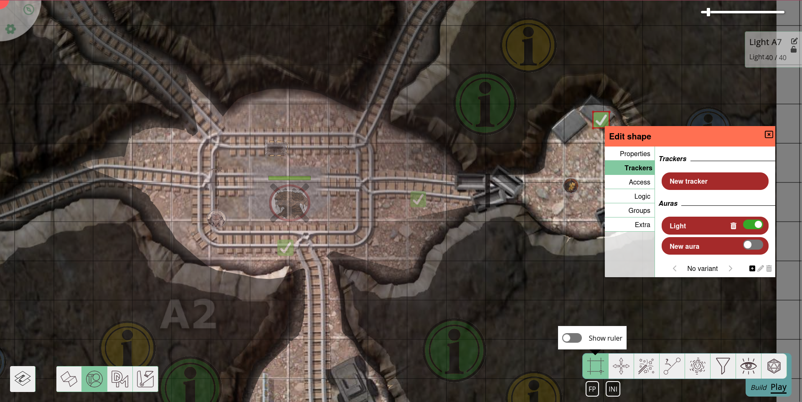

import Lightbulb from "~icons/fa-solid/lightbulb";

# RTS-artige Beleuchtung

Leitfaden von [@veritanuda](https://keybase.io/veritanuda)

Dieses Tutorial konzentriert sich auf ein komplexeres Beleuchtungs-Setup.
Stelle sicher, dass du mit dem [Beleuchtungs- & Sichtsystem](/de/docs/dm/lighting-vision/) von PlanarAlly vertraut bist, sowie mit seinen [Ebenen](/de/docs/dm/layers) und den [Auren](/de/docs/game/shapes/#trackers--auras) und dem [Zugriff](/de/docs/game/shapes/#access) der Tokens.

In diesem Tutorial möchten wir Beleuchtungs-Setups im RTS-Stil (*R*eal-*T*ime-*S*trategy) nachahmen.
Das Setup **wird**:

- den Spielern eine Karte zum Erkunden geben und
- ihnen Bereiche zeigen, die sie bereits erkundet haben.

Das Setup **wird nicht**:

- die tatsächliche Sichtlinie der Spieler berücksichtigen, sondern mit Vereinfachungen arbeiten,
- einen „dünnen Kriegsnebel" hinzufügen, der nur Tokens, aber nicht die Karte verdeckt (PlanarAlly kann das nicht), oder
- den Prozess automatisieren.

## Konzept

Echtzeitstrategie-Spiele konfrontieren Spieler oft mit unerkundeten Karten.
Doch in dem Moment, in dem ein Kundschafter das Gebiet erreicht, wird die Karte aufgedeckt, und jeder Kriegsnebel verdeckt nur die Einheiten anderer Spieler, nicht aber die Karte.
Das ist eine Funktion, die oft angefragt wurde.
Dennoch wurde sie aus verschiedenen Gründen (noch?) nicht in PlanarAlly implementiert.

Aber es ist einfach, einen ähnlichen Effekt nachzuahmen.
Er hat die oben genannten Nachteile, gibt den Spielern aber mehr (und bessere) Orientierung auf der Karte als nur ihre eigene Sichtlinie.

Im Wesentlichen werden wir:

- die Karte in Zonen aufteilen,
- jede dieser Zonen mit Lichtquellen versorgen,
- die Zonen in dem Moment beleuchten, in dem die Spieler sie erkundet haben, damit sie sie auch sehen können, wenn sie sie verlassen haben.

## Vorbereitung

Richte zuerst deine reguläre Karte mit dem Beleuchtungs- und Sichtsystem ein: Fülle die Leinwand mit Kriegsnebel, füge ein paar Wände und Lichter nach Belieben hinzu.

### Sektoren

Sieh dir dann deine Karte an, um Abschnitte zu identifizieren, die unabhängig erkundet werden können.
Für dein reguläres Dungeon sollte das einfach sein, da es bereits in mehrere Räume aufgeteilt ist.

Platziere nun eine oder mehrere Lichtquellen (je nach Layout der Zone).
Diese Lichter sollten die gesamte Zone beleuchten können.
Du wirst wahrscheinlich nur scharfe Auren ohne gedämpftes Licht an den Rändern wollen.

Verstecke die Lichter auf der _DM_-Ebene und/oder deaktiviere die Auren für die spätere Verwendung.

## Umsetzung

In dem Moment, in dem die Zone für deine Spieler sichtbar sein soll (entweder wenn sie sie betreten oder wenn sie sie vollständig erkundet haben), schalte die Lichter ein.
Tue das, indem du die Aura aktivierst (falls du sie deaktiviert hast) und die Lichtquelle auf die `fow`-Ebene verschiebst, um die Zone zu beleuchten.
Setze die Lichtquelle auch auf _öffentlich_, damit die Spieler sie tatsächlich sehen können.

Da sich die Lichtquelle auf der _fow_-Ebene befindet, wird ihre Aura auf der Token-Ebene gezeichnet, während die Form selbst unsichtbar bleibt.
Die `fow`-Ebene entzieht der Aura auch _jede_ Farbe.

Falls du zwischen echter Sicht und RTS-artiger Sicht unterscheiden können möchtest, gib der Sicht der Spieler entweder einen leichten Farbton oder verschiebe die Lichtquellen stattdessen auf die _map_-Ebene.
Du kannst den Token unsichtbar machen oder ihn unter allen Kartenbildern verstecken, die du über die Funktion `move to back` hinzugefügt hast.
Verwende die Funktion `lock`, um zu verhindern, dass die Lichter versehentlich mit deiner Gruppe oder anderen Elementen der Karte mitgezogen werden.

Falls du die Option _nur Lichter innerhalb der Sichtlinie anzeigen_ aktiviert hast, musst du stattdessen _Sicht_-Zugriff für alle Spieler auf die Lichter hinzufügen, die du verwenden möchtest.
Andernfalls verlieren sie das Wissen über die bereits erkundete Zone, sobald eine Wand zwischen ihnen und der jeweiligen Zone ist.
In diesem Fall solltest du vorher in den Eigenschaften der Lichtquellen _Einträge_ für alle Spieler hinzufügen, während du jede Zugriffsstufe deaktivierst.

Auf diese Weise musst du nur ein paar <Lightbulb/>-Symbole anklicken, um eine Zone zu beleuchten.

Beachte, dass dadurch nicht nur die _map_-Ebene, sondern auch die _tokens_-Ebene beleuchtet wird.

Wenn du feindliche Bewegungen vor deinen Spielern verbergen möchtest, verschiebe ihre Tokens auf die _DM_-Ebene.
