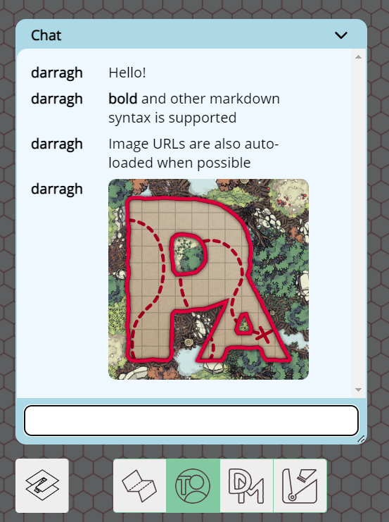

import Warning from "/src/components/directives/Warning.astro";

# **Chat**

In game chat, as of the 2024.3 release, is now possible by simply clicking the `Chat` button in the bottom left of the viewport window.

When a chat message is sent by any user then a number of unread messages will appear next to the button.

The chat window accepts Markdown input meaning styles and links can be included as well as more advanced formatting. See the [Markdown Tutorial](../../../learn/dm/Markdown_Tutorial/markdown)

<Warning title="Chat persistence">
    Chat is not stored on the server. It's ephemeral and will disappear when you refresh the page or the connection
    resets.
</Warning>

Chat can be disabled from the `DM settings` `Feature` tab by unticking the chat enable box.

