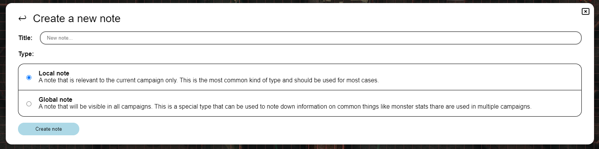
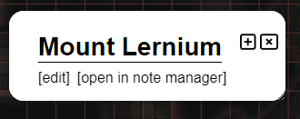

import Info from "/src/components/directives/Info.astro";
import Warning from "/src/components/directives/Warning.astro";

# Notes

As a DM or player you'll sometimes find the need to make notes about a character, a location, an event, ...
This page will show you what PlanarAlly provides in terms of note management.

## Concepts

At its core all notes are simple containers that contain text, an optional title and an author.
They can however be used in a number of different ways.

Notes can be shared with other players, or kept private to the note creator.
Notes can also be attached to shapes, allowing quick access to the note when selecting the shape.
Or simply to remind yourself of something about the shape.

Notes support Markdown formatting. For more information on that see the [Markdown Tutorial](../../../learn/dm/Markdown_Tutorial/markdown)

### Global vs Local

In most cases a note is only relevant to the current campaign/location.
But there are some edge cases where you might want to have a note that is campaign agnostic, and available from anywhere.

The former is called local and the latter global.
During note creation you'll have to decide which one you want to create.

A nice example of a global note is a statblock for a monster.
If you combine this with [Asset templates](/docs/dm/assets/#templates), you'll be able to drop a goblin on the board and
have a note with its stat block attached to it.

## The Note Manager UI

At the core of note interaction, is the note manager.
This is a big UI element that allows searching, filtering and creation of notes.

### Opening

The Note Manager can be opened by clicking the "Notes" section in the side menu on the left-hand side of the screen.

It can also be opened/closed by using the keyboard shortcut <kbd>n</kbd>.

Lastly it can also be opened by using the context menu on a shape or
by using the selection info panel on the right side of the screen when a shape is selected.
In these cases the note manager will be opened with a filter applied to only show notes related to the shape.

### Main view

This shows the list of all notes that are currently available (with specific filters applied).

#### Searching and filtering

The first big UI element is the search bar, which allows you to search through all notes and filter them.

The search bar contains a toggle to switch between local and global notes.
These notes are usually very different in nature and thus have a dedicated separate view.

The second element is the actual search bar input, where you can type your search query.

PA will match all known notes against this query and show the results in the list below.
Where PA will look for your query will depend on the filters used,
this can be configured using the last element of the search bar.

By default PA will look for your query in the title and tags of the note.
It can however be modified to also look into the contents of the note as well as the author.

PA will by default also only look into notes created in the active location.
This can be changed to look into all non-archived locations or even to look into all locations in the current campaign.

It's possible to hide all notes that are attached to shapes,
this can be useful if you want to focus on notes that are more related to the overarching story.

A last possible filter is to ignore the local toggle for global notes that are attached to local shapes.
In essence this will include all notes (regardless of local/global state) that are attached to a shape in the current location.
(e.g. a goblin's global statblock will appear in the local listing, if there is a goblin in the current location)

##### Shape filtering

It's possible to put the note manager in shape filter mode, by using the context menu on a shape and
selecting show notes or by going through the active shape selection notes section.

When this happens, only notes attached to the relevant shape will be shown.
Most search filters will disappear/disable when this happens, as they are no longer relevant. (note that both global & local notes attached to the shape will be shown)

When in this mode, the create new note button will also automatically attach a note to the shape.

<Info>
It's also possible to attach notes to existing notes using the 'shapes' tab in edit view.
</Info>

#### Note listing

The center of the main view shows the title, author, tags and some quick actions for each note that matched the search query and filters.

The title is a clickable link that will open the note in the edit view.

The 2 quick actions available right now are the edit and popout buttons.
The edit icon will just like clicking on the title open the note in edit view,
the popout icon will open the note in a separate modal. (See [Popout notes](#popout-notes) for more info)

This view will be paginated if too many notes match the active filters. In this case a `<` and `>` button will appear in the topright.

### Create a new note

After clicking on the create new note button in the main list view, a new screen will appear to preconfigure a new note.
In this view you can configure the title and the type of note (global or local).

This is done with a separate view, to give some room to explain the difference between global and local notes.

After creating a note, you'll automatically be taken to the edit view for further configuration.

### Edit view

This view is the advanced mode to edit a note.
If you want to return to the main view, you can press the back arrow in the topleft, next to the note's title.

The edit view is split into multiple sections, from top to bottom:

#### Title

This simply shows the title of the note.

If you have edit rights to the note, you can edit it.

On the right side there are again some quick actions available.
Another [popout](#popout-notes) icon is available and a trashcan icon that will delete the note.

#### Tags

This shows all tags that are currently attached to the note.

If you have edit rights to the note, you can add/remove tags.

Tags are freeform and can be anything you want, though ideally they should be relatively short.
Their only use by PA is for filtering/searching notes, so you can organise these as these as you please.

A tag will automatically be assigned a consistent colour based on its content.

<Warning>
Tags are visible to every user that has 'can view' rights to the note. (see [Access Tab](#tab-access))
</Warning>

_The colour generation only works in HTTPS contexts as it uses a SHA1 algorithm, so it will fallback to a gray-ish colour in HTTP contexts_

#### Tab: View & Edit

These two tabs work together and form the core of the note.

In the Edit tab you can write/edit the actual note's content in a textual format that is markdown aware.
The actual rendered markdown can then be seen in the View tab.

#### Tab: Triggers & Visuals

This tab can only be opened if the note is attached to a shape.

It allows configuration of some special behaviour for the note.

It currently offers two options:

Show note icon: This will show a small icon next to the shape (on the map).
This can be used to remind yourself of an important note.

Show text on shape hover: This will show the note's (markdown rendered) content when you hover the shape.
It will appear in the top center of the screen. Be aware that if your note is big, it will likely cover a big portion of the screen.

#### Tab: Access

This tab allows you to configure who can see and edit the note.

By default only the note's author can see and edit the note.
But you might want to give all players view access to a note that they found somewhere.

You can also give granular access to specific players, allowing you to share hidden notes with specific players.

It's important to realise that a note's tags are visible to players with view access.
Make sure that you don't accidentally spoil something by having a `faction:evil` tag or something similar.

<Info>
When giving view access to a player (be it specific or all players), they will receive a notification that a new note is available.

So as a DM, simply giving view access to a note is a good way to notify your players of a particular piece of info they just discovered.
</Info>

#### Tab: Shapes

This tab lists all shapes that are currently attached to the note.

It does this by first listing a numerical sum of all shapes across all campaigns, followed by a sum for the active location.

For the active location it also lists all shapes with their name. Clicking on the name will center your screen on that shape.
Hovering over a name will also show a trashcan icon that when clicked will detach the note from that shape.

## Popout notes

Sometimes you frequently need access to one or multiple notes.
Constantly opening the note manager and swapping notes is a bother in this case.

To solve this PA offers the ability to popout a note into a separate modal.
Multiple of these can be open at the same time and can be dragged around individually.

A popout only offers view and edit functionality, for other note settings you need to open the note manager proper.

It's also possible to collapse a popout, which will hide the note's content and only show the title.
This is especially useful if you have multiple popouts open or know that a certain note is no longer relevant, but will be in the near future.

## Active shape selection notes

PA always shows a UI element at the right side of the screen with some quick information about the currently selected shape.

This section also has a dedicated notes section.
It shows the number of notes attached and an icon to immediately open the note manager with a filter applied to only show notes related to the shape. (See [Shape filtering](#shape-filtering) for more info)

If 1 or more notes are attached to the shape you can also expand/collapse this section, to list the notes.
This allows you to quickly popout a note or open it in the note manager.
Additionally, hovering over these notes will show the note's content at the center top of the screen, regardless of their trigger configuration.