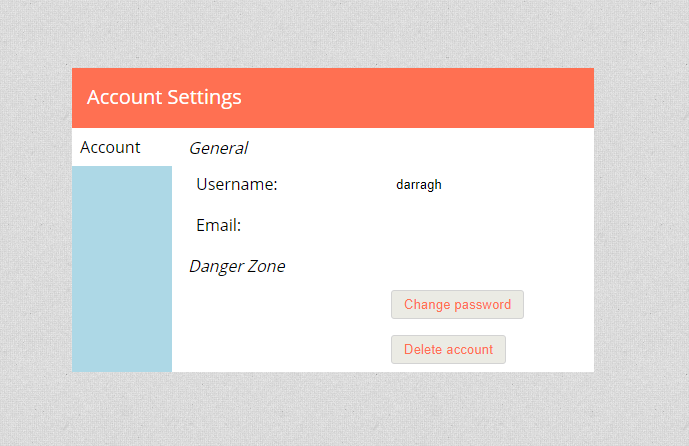

Con 0.19.0 tenemos nuestro primer lanzamiento del año. Hay un par de grandes funciones nuevas (plantas y insignias) y muchas pequeñas correcciones y cambios de calidad de vida.

Los temas mencionados en esta actualización se enumeran a la izquierda, el registro de cambios completo se puede encontrar en [github](https://github.com/Kruptein/PlanarAlly/releases/tag/0.19.0).

_También he creado una [cuenta de patreon](https://www.patreon.com/planarally), no dudes en echarle un vistazo :)_

## Visión

### Plantas

Una de las mayores adiciones de esta versión es la introducción de las plantas. Igual que en la vida real, un edificio puede constar de varias plantas.
Hasta ahora, si querías emular esto en PA, tenías que usar ubicaciones separadas o tener diferentes áreas en una sola ubicación que representaran diferentes plantas.
Ambos enfoques requieren muchos saltos de un lado a otro, lo cual es en última instancia indeseable.

Con esta versión eso cambia: el DM puede crear/eliminar una planta usando el botón de planta en la esquina inferior izquierda, justo al lado del selector de capas. El número que se muestra en esta caja es el número de la planta activa.

La visión y las luces funcionan a través de las plantas de forma natural; una ficha en la planta superior puede ver una ficha con una luz en el jardín a través de una ventana, y de igual manera alguien en el jardín puede ver a la persona en el balcón superior. _Ten en cuenta que esto no es un renderizado 3D real, por lo que pueden ocurrir algunos pequeños casos límite en los que se desconoce la altura de ciertos elementos._

**El video a continuación puede contener spoilers del mapa de la aventura Waterdeep Dragonheist de WotC.**

<video autoplay loop muted style="max-width: min(680px, 75vw);">
    <source src="/blog/release-0.19/newfloors.webm" type="video/webm" />
    <source src="/blog/release-0.19/newfloors.mp4" type="video/mp4" />
</video>

El ejemplo anterior muestra cómo funciona la visión entre plantas, donde el lado izquierdo representa a un jugador con propiedad de la ficha Y en la primera planta. El lado derecho representa al DM, que tiene acceso a ambas fichas.

Para cambiar de planta, haz clic en el botón de planta en la parte inferior izquierda y selecciona la planta deseada. Para cambiar la planta de una forma o de un grupo de formas, haz clic derecho sobre ellas y usa el submenú de planta.

**Consejo de oro:** hay algunos atajos de teclado adicionales dedicados a las plantas, que te permitirán cambiar entre ellas sin problemas. Page Up/Down te mueve una planta hacia arriba o hacia abajo. También puedes mover una selección de formas a otras plantas mediante atajos de teclado; Ctrl + Page Up/Down moverá las fichas una planta hacia arriba/abajo, si quieres moverte junto a ellas de inmediato usa Ctrl + Shift + Page Up/Down.

Ten en cuenta que actualmente los jugadores son libres de moverse a la planta que deseen. En el futuro se añadirá un control de acceso adicional, pero con la configuración de visión adecuada esto debería estar completamente bien.

Cada planta es en esencia un conjunto completo de capas nuevo. Esto también significa que hay carga adicional del lado del cliente por cada planta que añadas. En el futuro se añadirá una opción para renderizar solo la planta activa, para aquellos jugadores que quizás no puedan manejar el aumento de la carga. El caso predeterminado con una sola planta no tendrá sobrecarga adicional en comparación con versiones anteriores.

### Modos disponibles

El modo de visión heredado basado en jerarquías de volúmenes envolventes (bvh) ahora se ha eliminado del juego; cualquier mapa que aún lo usara debería cambiarse al modo predeterminado basado en la expansión de triángulos.

Además, ahora hay un nuevo modo de visión disponible. Es una mejora experimental del modo de visión predeterminado basado en triángulos, que no tiene que recalcular toda la escena, sino que trabaja de forma iterativa. Esto debería proporcionar mejoras de rendimiento notables en mapas con muchos elementos de visión, pero aún podría contener errores que rompan la visión; si eso sucede, recargar la página debería funcionar.

## formas

### insignias

Otra función nueva, sugerida por @adunis en github, es la introducción de las insignias; son pequeños iconos numerados en la esquina inferior derecha de las fichas.

La visualización de las insignias se puede activar o desactivar por grupo de fichas. Aquí, un grupo de fichas se define como todas las instancias que son resultado de copiar y pegar la misma ficha. _(p. ej., arrastro una ficha de orco al tablero y la copio y pego un montón, todas estas fichas son un solo grupo. Arrastrar una nueva ficha de orco al tablero es un grupo diferente.)_

Las insignias toman su color de fondo del color del trazo de la forma, y su color de borde y de fuente son negros o blancos dependiendo de lo que sea más legible. Los números de las fichas se incrementan automáticamente al pegar.

<video autoplay loop muted style="max-width: min(680px, 75vw);">
    <source src="/blog/release-0.19/badges.webm" type="video/webm" />
    <source src="/blog/release-0.19/badges.mp4" type="video/mp4" />
</video>

### anotaciones

Me las arreglé para olvidar un error que se reportó en agosto, ¡pero ahora por fin está corregido!

Las anotaciones dejaban de funcionar al cambiar de ubicación. Esto ahora se ha resuelto :)

## herramientas

### ajuste

La herramienta de polígono es una herramienta que uso mucho. En particular, la versión que no se auto-cierra. Un problema con el que me topaba con frecuencia, sin embargo, es que no tenía una forma confiable de agregar con precisión un punto a mi polígono que coincidiera exactamente con un punto existente (p. ej., conectar muros). Esto causaba problemas muy pequeños, pero perceptibles, con la iluminación alrededor de estas áreas donde se encontraban polígonos abiertos.

Esta versión ahora añade una función de ajuste, que arrastrará automáticamente el cursor de tu mouse hacia un punto existente cercano si te acercas a él. Este comportamiento de ajuste solo está activo al redimensionar o al usar la herramienta de dibujo. La herramienta de dibujo ahora también resalta los puntos ajustables al activarse (esto podría ser algo que elimine en el futuro, dependiendo de los comentarios).

<video autoplay loop muted style="max-width: min(680px, 75vw);">
    <source src="/blog/release-0.19/snapping.webm" type="video/webm" />
    <source src="/blog/release-0.19/snapping.mp4" type="video/mp4" />
</video>

Como puedes ver al final del video, solo aparece 1 punto rojo en el lugar donde se encuentran dos polígonos. En el pasado solía haber varios puntos muy cercanos entre sí.

_Como recordatorio, para cerrar un polígono usa el clic derecho; una versión futura debería hacerlo más claro en la interfaz_.

### gestos táctiles

El soporte táctil siempre ha sido muy inestable, en el mejor de los casos. Este es un primer paso para permitir que los dispositivos táctiles interactúen con PlanarAlly de una manera más intuitiva.

La adición de estos cambios se limita principalmente a interactuar con los diversos elementos de la interfaz mediante el tacto; algunos de los gestos más 'avanzados', como pellizcar para hacer zoom, etc., aún no se han añadido.

_Esta función fue contribuida por @ZachMyers3 en github_

### correcciones de select

Había un conjunto de errores relacionados con la herramienta select que podían resultar en una mala experiencia de usuario; ahora esperamos que estén resueltos.

En particular, arrastrar un grupo de fichas a menudo comenzaba con un salto repentino e inesperado; esto era causado por malas matemáticas vectoriales, y ahora arrastrar varias formas a la vez debería ser mucho mejor.

El cursor de redimensionamiento tampoco aparecía correctamente para todas las formas en una selección múltiple.

Redimensionar en general también estaba roto si arrastraba una esquina sobre otra esquina.

## configuración

### configuración de la cuenta

Se ha creado una página de configuración de la cuenta muy básica. La rueda dentada en el panel ahora por fin tiene un propósito.

Como se puede ver, es bastante limitada en su alcance, pero ahora puedes cambiar tu nombre de usuario, añadir una dirección de correo electrónico, cambiar tu contraseña y eliminar tu cuenta si así lo deseas.

Ten en cuenta que PA no usa la dirección de correo electrónico de ninguna manera (ni es obligatoria), pero está ahí para posibles cambios futuros o si un administrador del servidor desea enviar un correo a sus usuarios.

## Varios

### ctrl 0

Dado que PA tiene un mapa infinito, puede suceder que no puedas volver a encontrar tu mapa real después de desplazarte con pan/scroll.

Como solución sencilla, ahora existe un atajo de teclado ctrl+0 para restablecer la cámara al origen del mapa.

_Esta función fue contribuida por @LDeeJay1969 en github_

### /\_load

Con suerte, la mayoría de los usuarios no lo habrán notado, pero PA solía tener una ruta especial /\_load que se usaba para la transición entre rutas.
Sin embargo, si volvías atrás usando el botón de retroceso de tu navegador, podías terminar en esta página especial que no tiene nada con lo que interactuar.

El mecanismo de carga se ha cambiado y ya no necesita la ruta especial.

_Esta función fue contribuida por @ZachMyers3 en github_

### número de versión

Para poder ver qué versión de PA está usando realmente el servidor en el que estás, el panel de inicio de sesión ahora muestra el número de versión en su título.

_Esta función fue contribuida por @ZachMyers3 en github_

### eliminación de artefactos js

Este es un cambio técnico que solo es relevante para los contribuyentes de código.

En el pasado, los artefactos de compilación js se almacenaban en el repositorio git para que la carpeta del servidor pudiera usarse de inmediato sin ninguna compilación js adicional.
Sin embargo, esto conlleva una tonelada de conflictos de fusión y archivos innecesarios en el repositorio.

Ahora deberías compilar los archivos js tú mismo si quieres probar en local.

## Planificado para 0.20.0

### Renovación de ubicaciones

Lo que me encantaría abordar absolutamente en la próxima versión es la interfaz/UX de la barra de ubicaciones. Ahora es solo algo feo con funcionalidad limitada.

### Marcadores

@LDeeJay1969 ha estado trabajando en un sistema de marcadores para saltar a ubicaciones marcadas.

### Ventana de atajos de teclado

@Daniferrito comenzó a trabajar en una ventana de atajos de teclado.
