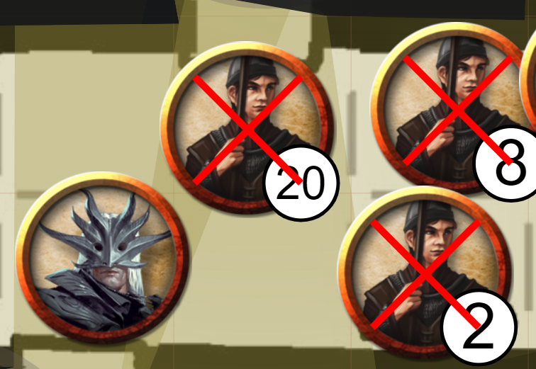

Esta versión contiene bastante variedad en cuanto a tipos de contenido: nuevos rediseños de la interfaz, nuevas opciones de herramientas, mejoras de calidad de vida y mucho más.

También vale la pena mencionar que la versión incluye contribuciones de varios colaboradores del servidor de discord, un agradecimiento especial a scoodle y mischievous.

## Rediseño del panel

Empezaremos con uno de los cambios más evidentes, el panel.
El panel es la página que ves después de iniciar sesión y donde seleccionas la campaña que quieres jugar o dirigir.

Esta página ha sido completamente rediseñada y ahora se ve así:

### Menú

La barra lateral izquierda actúa como un menú que te da acceso instantáneo a varias vistas.

La primera sección del menú está relacionada con todo lo referente al juego: play enumera todas las sesiones en las que eres un jugador activo,
run enumera todas las sesiones en las que eres DM. Por último, la opción Create te permite crear una nueva campaña.

La segunda parte está relacionada con todo lo referente a los recursos. El menú Manage abre el gestor de recursos, un componente que anteriormente solo era accesible desde dentro de una partida. La opción Create aquí aún no está disponible, pero se revelará en una versión futura.

Finalmente tenemos una acción para abrir la configuración y otra para cerrar sesión.

Una nota importante: la configuración y el gestor actualmente aún se abren en sus componentes originales, pero la intención es rediseñarlos para que encajen en esta nueva interfaz del panel.

### Run/Play

En los modos run y play aparece una segunda barra a la derecha que contiene más detalles sobre la campaña actualmente seleccionada.

Las adiciones notablemente nuevas deberían ser la capacidad de establecer logotipos (solo DM), crear pequeñas notas personales relacionadas con una campaña, ver la última vez que jugaste en esa campaña y las acciones para abandonar/eliminar la campaña.

## Herramientas

### Modo borrar planta (DM)

Una nueva adición a los modos de dibujo para el DM es el modo 'borrar'.

Este modo especial te permite hacer transparentes áreas de tu planta actual, permitiéndote a ti y a los jugadores ver lo que está sucediendo en la planta de abajo.

Podrías usarlo para explosiones repentinas que abren un agujero en la planta, o tal vez simplemente olvidaste hacer algo transparente en la preparación y quieres editarlo directamente en PA.

En la imagen de arriba hay 2 plantas.
La planta inferior contiene un rectángulo de color turquesa.
La planta superior contiene todas las demás formas.

La forma poligonal que se asemeja aproximadamente a una flecha gruesa hacia la derecha es una forma dibujada en modo borrar.
Ofrece una vista de la planta inferior.

Esta forma forma parte de la pila de dibujo como cualquier forma normal. Como puedes ver, el rectángulo rojo está sobre esta forma poligonal como si hubiera un tronco cruzando la abertura de la planta. Si mueves el polígono al frente (o el objeto rojo al fondo), ¡solo serían visibles las partes rojas que no están cubiertas por el polígono!

Un último aspecto importante es que esta forma se crea automáticamente en la planta del mapa cuando se dibuja. Sin embargo, nada te impide moverla a otra planta.

### Formas de texto

Una adición bastante sencilla a la herramienta de dibujo, disponible para todos, es la opción de 'dibujar' texto.

Esta primera versión es relativamente simple: ofrece un cuadro de texto cuando haces clic izquierdo con esta forma seleccionada.
La forma se puede rotar/redimensionar como las demás formas.

Espera más mejoras en el futuro.

### Cambios de tamaño de Ping y Ruler

Los pings y las reglas que dibujabas siempre tenían un tamaño constante.
Sin embargo, cuando otros jugadores los dibujaban, su tamaño se veía afectado por el nivel de zoom en el que estaban ellos, no en el que estabas tú.
Esto podía hacer que algunas reglas aparecieran muy gruesas o muy finas en tu pantalla, o que los pings fueran difíciles de detectar.

Esta versión cambia las reglas para estas formas y siempre se dibujarán exactamente con el mismo tamaño. El nivel de zoom tuyo o de la persona que dibuja ya no es relevante para esta decisión.

### Actualización del icono del cono de hechizo

Una pequeña mejora de calidad de vida es que el icono del cono de hechizo ahora es un cono relleno.
Gracias a mi amigo Jiri.

## Configuración

### Rediseño de la configuración del cliente

El panel no fue la única interfaz que recibió un lavado de cara, ¡la configuración del cliente también recibió pintura nueva!

En lugar de ser parte del menú lateral, la configuración del cliente ahora se abre en un modal, igual que la configuración del DM.
Esto ofrece más espacio para respirar y también más margen para más opciones.

Como parte de este rediseño, ahora también existe un concepto de configuración del cliente específica de campaña.
Cuando cambias una configuración, notarás que aparecen dos iconos junto a ella, lo que indica que la configuración se desvía de la configuración predeterminada.

El icono de la izquierda restablece el valor a la configuración global, mientras que el icono de la derecha convierte este nuevo valor en el nuevo valor predeterminado global.

En una versión posterior, la configuración global también se podrá editar desde la vista de configuración del panel.

### Desactivar el zoom con el desplazamiento

Una queja que escuchan a menudo los jugadores que usan paneles táctiles es la solicitud de una opción para desactivar que la herramienta de zoom se active al hacer scroll,
ya que esto puede ocurrir muy fácilmente por accidente cuando se usa un panel táctil.

Esta nueva opción ahora está disponible en la configuración del cliente, en la sección de comportamiento.

### Opción co-dm (DM)

Como DM, ahora podrás ascender jugadores al rol de co-dm desde tu configuración principal de DM.

## Formas

### Derrotado

Las formas solo recibieron un pequeño cambio en esta versión: la propiedad 'derrotado'.
Cuando marcas esta casilla en las propiedades de la forma o cuando presionas 'x' con una o más formas seleccionadas,
todas las formas afectadas recibirán una X roja dibujada sobre ellas.

_Esto fue contribuido por scoodle en discord._

### Barras visuales de seguimiento

Los rastreadores recibieron la misma renovación de interfaz que los auras en la última versión.
Ahora tienen una casilla adicional y dos selectores de color.

Si "display on token" está marcado, se dibujará una barra sobre la ficha en los 2 colores que hayas elegido.

_Esto fue contribuido por scoodle en discord._

## Cargar información de muros (DM)

Otra frustración que algunos DM a veces tienen es el arduo trabajo relacionado con dibujar muros para el sistema de visión.

Esta versión agrega 2 opciones para 'importar' información de muros de fuentes alternativas.

### dungeondraft

Dungeondraft es un servicio popular para preparar tus mapas antes de importarlos a un VTT.
Ofrecen exportaciones en un formato de archivo personalizado dd2vtt.

PlanarAlly ahora entiende este formato y cuando sueltas un recurso en el tablero que es un archivo de este tipo, tendrá esa información adjunta.

Por razones técnicas, los muros, puertas y luces asociados con el archivo dd2vtt no se agregan inmediatamente a la escena.
En su lugar, primero puedes redimensionar/mapear el recurso a una forma que te satisfaga y luego cargar toda la información adicional moviéndote a la pestaña "Extra" de las propiedades de la forma y haciendo clic en el botón 'Apply ddraft info'.

Toda la información se agrega al tablero como formas reales de PlanarAlly, lo que significa que puedes redimensionar cosas, eliminar luces que no necesites, etc.

### svg

Otro enfoque ahora disponible es adjuntar un svg con información de muros a cualquier recurso. Al igual que con los archivos de dungeondraft, esto se puede hacer desde la pestaña 'Extra' en las propiedades de la forma.

**Una advertencia muy grande**: mantén estos svg simples o estarás en un mundo de dolor.

Estos svg están destinados a contener solo información de muros, así que asegúrate de eliminar los muros, fondos, etc. antes de agregarlo.

Una última nota es que estos muros no son interactivos, son puramente internos a la forma, por lo que no puedes redimensionarlos, etc. en este momento.

## Calidad de vida

### El gran borde rojo

Ahora habrá un gran borde rojo alrededor de la pantalla cuando la conexión con el servidor se interrumpa.

Dependiendo del problema, la conexión debería restaurarse automáticamente, pero todo lo que hayas modificado durante la desconexión podría perderse.
Esto siempre fue así, pero ahora debería quedarte claro cuándo se podría perder el progreso.

### Atajos de teclado para Mac

Todos los atajos que usan la tecla ctrl ahora usarán la tecla cmd en computadoras Mac.

### Carga de fuentes

La fuente opensans utilizada en PlanarAlly ahora se obtendrá del servidor en lugar de google fonts.
Esto podría causar problemas de fuentes al jugar sin conexión.

### Animación de carga

El aburrido spinner ha sido reemplazado por una elegante animación de transformación de un dado 3d.

<video loop autoplay muted style="max-width: 680px;">
    <source src="https://app.planarally.io/static/img/loading.webm" type="video/webm" />
</video>

_animación hecha por Jiri en discord_

## Servidor

### Especificar nombre de host público

Por defecto, cuando se le muestra al DM el enlace de invitación en la configuración de DM, se usa la URL actual del navegador para determinar el host.
Sin embargo, cuando el DM está conectado a través de una ip local o localhost, la URL será inutilizable para otros jugadores.

Una nueva configuración del servidor te permite establecer un `public_name` que, si se establece, siempre se usará como host raíz.

_Esto fue contribuido por mischievous en discord._

## Errores notables

### nombre de planta duplicado (DM)

Ya no es posible crear una planta con un nombre que ya esté en uso.
Esto podía provocar múltiples problemas al interactuar con las dos plantas.

Esta es una solución rápida, pero en realidad no debería imponer demasiadas restricciones.

### Interrupciones en la carga de archivos

Se ha añadido una corrección para evitar que las cargas de archivos grandes se detengan después de un breve período.

_Esto fue contribuido por scoodle en discord._

### ajuste de ficha al salir de un muro

Cuando, como parte del movimiento de una ficha, mueves el mouse hacia un muro, podías perder la sincronización con la forma al regresar del muro.
Esto ahora está corregido.

### soltar plantilla con tamaño de cuadrícula no predeterminado

Al soltar una forma con una plantilla que contiene información de tamaño en el tablero, pero usando un tamaño de cuadrícula no predeterminado,
la forma se redimensionaba incorrectamente.

### formas variantes visibles

Cuando usabas la función experimental de variantes, todos los jugadores podían ver cualquier forma variante en todo momento.

### menú contextual fuera de pantalla

Al abrir un menú contextual en el borde inferior o derecho de la pantalla, el contenido se salía de la pantalla.
Estos menús ahora son conscientes de los bordes y se adaptarán en consecuencia.

### navegación hacia atrás

Al navegar hacia atrás usando el botón de retroceso del navegador o un botón de tu mouse, la URL se actualizaba correctamente,
pero nada cambiaba. Esto ahora está corregido.
