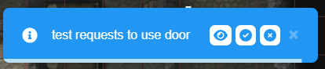

Ha pasado _mucho_ tiempo desde la última versión, más de medio año, y tengo muchas razones sobre el porqué y el cómo, pero al final solo quiero disculparme y espero que veamos una cadencia más regular en un futuro cercano :)

## Cambio del formato de versión

_Puedes saltarte esta parte por completo si solo quieres saber qué cambió de verdad!_

Alguien familiarizado con PlanarAlly probablemente también notará que el número de versión ha cambiado. Esto es algo a lo que aludí en mi publicación de resumen de 2021 y decidí implementarlo para la primera versión de 2022.

Aunque no había nada necesariamente malo con el esquema de versionado original, en mi opinión no había nada dramático en el horizonte que justificara cambiar a una 1.0.0, lo que básicamente hace que el primer número carezca de significado. El número menor cada vez más grande tampoco parecía una buena solución, así que era el momento de algo nuevo.

Pasamos de un esquema de versión major.minor.patch a un esquema year.minor.patch, donde cada año comenzará de nuevo con una 1.0. Esto mantiene los números de versión lo suficientemente pequeños como para razonar sobre ellos fácilmente y los sitúa en un marco temporal claro, mientras que 0.18.0 podría estar en cualquier punto de los últimos 3 años.

## Sistemas de lógica

La principal novedad de esta versión es la incorporación de pequeños módulos de lógica que pueden añadirse a las formas. Esta versión trae dos tipos: puertas (Doors) y zonas de teletransporte.

Se ha añadido una nueva pestaña al diálogo de edición de forma desde la que puedes activar, desactivar y configurar el comportamiento de estos módulos.

#### Permisos

Ambos módulos se pueden configurar con un sistema de permisos. El DM siempre tendrá acceso y, por defecto, el resto de jugadores no. Puedes modificar el acceso predeterminado y configurar el acceso para jugadores específicos como enabled/request/disabled, donde request significa que el DM recibirá una notificación para permitir o denegar la acción.

### Puertas

Cuando los jugadores se encuentran con una forma que bloquea el acceso a otra área, hay varias formas en las que el DM puede permitir a los jugadores superar esta obstrucción. El DM podría simplemente moverlos sobre el objeto con sus poderes mágicos de mayús. Podría simplemente eliminar la forma. Podría ir a las propiedades de la forma y desactivar las propiedades "blocks vision" y "blocks movement". O podría entrar en build mode y arrastrar la forma de manera que los jugadores puedan pasar.

Personalmente solía usar la última opción, pero mis puertas normalmente también están en la capa fow, así que tenía que cambiar tanto de capa como de modo, en resumen, un fastidio.

Aquí es donde entra en juego el módulo Door. Cuando una forma se configura como puerta, sus propiedades de bloqueo pueden activarse o desactivarse de inmediato simplemente haciendo clic en la forma en play mode desde cualquier capa. ¡Sencillo y fácil!

Para hacerlo aún más fácil, ahora también podrás aplicar esto automáticamente a las formas que dibujes con la herramienta Draw, ¡más sobre esto más adelante!

<video autoplay loop muted style="max-width: min(680px, 75vw);">
    <source src="/blog/release-2022.1/doors.webm" type="video/webm" />
    <source src="/blog/release-2022.1/doors.mp4" type="video/mp4" />
</video>

En el vídeo anterior, la puerta de la izquierda se ha configurado para estar habilitada para todos los jugadores por defecto y, por tanto, el jugador puede activarla sin problemas. La puerta frente al jugador, sin embargo, se ha configurado con el permiso request. En estos casos, el DM recibirá una solicitud como la siguiente, donde puede elegir aceptar o rechazar la solicitud, así como mover la cámara a la puerta en cuestión si está mirando a otro lugar.

### Zonas de teletransporte

El segundo módulo ofrece otra mejora de calidad de vida. Como puedes adivinar por el nombre, te permite configurar una forma para que actúe como una zona especial donde, si una forma entra en ella, se teletransporta a otra ubicación.

Los casos de uso potenciales de esta función son escaleras a otras plantas, trampas o... ¡círculos de teletransporte!

El destino de estas zonas de teletransporte son las ubicaciones de aparición existentes, así que asegúrate de configurarlas primero. Estas ubicaciones de aparición también pueden estar en otras ubicaciones, por lo que los viajes interdimensionales tampoco son un problema.

Por defecto, una zona de teletransporte no se activará de inmediato, sino que se mostrará una notificación a los jugadores mientras estén en la zona que les permitirá activarla cuando quieran (por ejemplo, un jugador podría estar de pie en una escalera sin intención de subir). Sin embargo, también es posible configurarla para que actúe inmediatamente (por ejemplo, ¡una trampa de foso normalmente no es opcional!)

<video autoplay loop muted style="max-width: min(680px, 75vw);">
    <source src="/blog/release-2022.1/tp.webm" type="video/webm" />
    <source src="/blog/release-2022.1/tp.mp4" type="video/mp4" />
</video>

## Interfaz

Se han hecho dos pequeños cambios en la interfaz de las herramientas.

### Reestructuración de la herramienta Draw

El panel de la herramienta Draw se estaba llenando, lo que impedía añadir cosas nuevas. Esta versión rediseña el aspecto de este panel y ahora usa una estructura con 3 pestañas separadas.

La pestaña base tiene la configuración con la que interactuarás la mayoría de las veces y está relacionada con el aspecto real del objeto que vas a dibujar.

La segunda pestaña se centra en el comportamiento FOW. El DM puede seleccionar aquí el modo de dibujo. Además, las propiedades de bloqueo de la forma dibujada ahora también pueden cambiarse desde la herramienta Draw. Estos ajustes seguirán activándose automáticamente al seleccionar la capa fow y desactivándose al seleccionar otra capa. Sin embargo, ahora tienes la opción de configurarlo para todas las formas que vayas a dibujar, sin tener que modificarlas una a una después.

La última pestaña es para los nuevos sistemas de lógica y actualmente solo ofrece una opción para configurar automáticamente el módulo Door para todas las formas dibujadas. Cuando trabajes en mapas, recomiendo hacer primero todas las paredes y luego una pasada para las puertas con este ajuste activado. (¡Y otra pasada para las ventanas con solo block movement activado!)

### Interfaz de edición de polígonos

Una pequeña mejora de calidad de vida en la interfaz de edición de polígonos ahora ocultará la interfaz mientras arrastras, ya que era solo ruido visual que a veces interfería con tu operación de arrastre.

## Gestión de recursos

### Soporte para soltar carpetas

Ahora debería ser posible en la mayoría de los navegadores soltar carpetas en el gestor de recursos. Esta cosa simple se pidió a menudo, comprensiblemente, pero el soporte de los navegadores en algunas de las funciones usadas aún no estaba estandarizado, lo que ahora debería ser el caso.

### Información de dimensiones

Si un recurso tiene información de dimensiones en su nombre, ocupará automáticamente la cantidad esperada de celdas de la cuadrícula cuando se suelte en el tablero.

PA busca específicamente un patrón que coincida con ?x?, donde los signos de interrogación representan uno o varios dígitos (por ejemplo, 20x20 o 5x12), con los números representando la cantidad de celdas de cuadrícula en las direcciones X e Y.

## Gestión del servidor

Para quienes alojan un servidor PA, ¡también tenemos algunos cambios divertidos!

### Deshabilitar el registro

Ahora es posible impedir que la gente registre cuentas nuevas, haciendo efectivamente que tu servidor sea privado. Simplemente configura la opción `allow_signups` en tu archivo de configuración del servidor y listo.

Todavía no hay ningún mecanismo que ofrezca al propietario del servidor (o a otra persona) la capacidad de admitir a personas concretas. Sin embargo, es posible añadir manualmente un nuevo usuario si estás familiarizado con python, o simplemente habilitar los registros durante un breve período.

### Panel de administración

Ahora se puede habilitar un panel de administración básico, que se ejecuta en el mismo puerto que el servidor API. Con este panel puedes listar todos los usuarios registrados, restablecer su contraseña o eliminarlos por completo. Además, también puedes listar todas las campañas.

### Soporte docker arm64

Una función de nicho es que PA ahora también compila imágenes docker arm64 para las ramas release y dev.

### [BREAKING] Gestión de subpaths

La forma en que se gestiona el alojamiento por subpath se ha modificado en esta versión. Si alojas un servidor PlanarAlly que se aloja usando un subpath, asegúrate de actualizar tu configuración.

#### ¿Estoy usando un subpath?

El alojamiento por subpath aquí se refiere específicamente a una configuración en la que no alojas PA en la raíz de tu dominio (por ejemplo, `http://somedomain.org/`, `http://somedomain.org:2345/` o `http://subdomain.somedomain.org/`), sino en un subpath (por ejemplo, `http://somedomain.org/planarally/`)

Ahora se espera que el cliente se compile específicamente con la información del subpath. Esto significa que la variable de entorno PA_BASEPATH debe establecerse durante la compilación.

Además, la ruta ahora debe terminar explícitamente con una barra.

Si usabas docker, ahora tendrás que compilar la imagen tú mismo, ya que tendrás que proporcionar esta información extra para el paso de compilación del cliente usando la bandera `--build-arg PA_BASEPATH='/subpath/'` en lugar de la configuración anterior que usaba `--env PA_BASEPATH`

## Corrección de errores

¡Se corrigieron muchos errores en esta versión!

- La planta no se recordaba al recargar después de la acción "Bring Players"
- El pegado de formas no aumentaba correctamente los contadores de insignias
- Las formas de visión predeterminadas siempre actuaban como fichas (independientemente de isToken)
- El bloqueo de relación de aspecto de la herramienta Map ya no funcionaba
- Los modales ahora cambiarán de ubicación cuando redimensionar la ventana los sacara del área visible de la pantalla
- Corregidas las barras de desplazamiento visibles porque el lienzo de dados no se dimensionaba estrictamente
- Corregidos los bloqueadores de movimiento que se intersectaban a sí mismos al moverse en la capa de fichas
- Corregidos los recursos que se volvían invisibles al usar una configuración de subpath (solo aplica a los recursos nuevos)
- Corregido el selector de color que no permitía cambiar manualmente los valores rgba/hsla/hex
- La eliminación de la cuenta no redirigía correctamente al inicio de sesión
- Seleccionar una forma dibujada en modo reveal ya no elimina la sombra durante la selección
- Eliminar un recurso eliminaba cualquier campaña que lo usara como logo
- La entrada numérica de la dirección del aura no sincronizaba el cambio con el servidor
- Algunas fugas de memoria al cambiar de ubicación
- Comportamiento de iluminación de las plantas para imágenes que cargan tarde
- Las subidas de DDraft no progresaban en el gestor de recursos
- Las luces de DDraft no se configuraban correctamente
- [asset-manager] El gestor de recursos no comprobaba los archivos obsoletos al eliminar una carpeta
