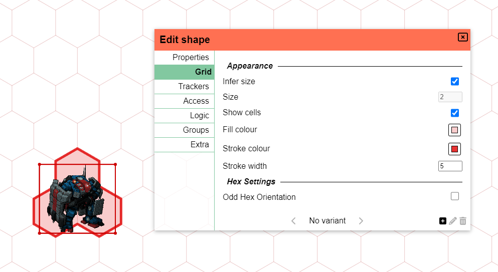

Esta versión trata sobre las cuadrículas y, en particular, sobre darle un poco de cariño a los hexágonos.

## Aviso de deprecación

Antes de pasar a las cosas buenas,
me gustaría anunciar que tengo la intención de eliminar el sistema de etiquetas/filtros en algún momento del futuro.
Esto, _creo_, no se usa mucho y es un poco una reliquia del pasado.

Es posible que en el futuro se proporcione un reemplazo o alguna alternativa,
pero la implementación actual es demasiado torpe para mantenerla.

Si esto es algo que usas activamente, por favor contáctame.

## Configuración de cuadrícula de formas

Se ha añadido una nueva pestaña en el diálogo Editar Forma llamada 'cuadrícula' para configurar algunas configuraciones nuevas relacionadas con el comportamiento de la cuadrícula de la forma.

### Tamaño de cuadrícula de la forma

Ajustar formas a la cuadrícula funciona bien para formas 1x1.
Pero cuando tienes una forma más grande que 1x1, el comportamiento de ajuste puede ser un poco impredecible.
Esto se debe a que PA tiene que hacer una suposición sobre cuántas celdas de cuadrícula se supone que representa una forma determinada.

Si una forma ocupa 75px por 75px y la cuadrícula es de 50px, ¿debería ajustarse a un área de cuadrícula de 1x1 o 2x2?
La respuesta depende de la forma real. Tal vez es solo un recurso de arte muy grande, pero debería ocupar solo 1 celda de cuadrícula.
Pero también podría ser un recurso muy pequeño para una criatura más grande.

Esta versión da más control sobre este comportamiento al ofrecer la opción de especificar explícitamente el tamaño de cuadrícula que una forma debería ocupar.
PA todavía estimará por defecto el tamaño de cuadrícula basándose en las dimensiones de la forma, pero ahora puedes anularlo.

### Mostrar ocupación de cuadrícula

Esta es una configuración nueva que te permite mostrar las celdas de cuadrícula que una forma está ocupando actualmente.
Puedes especificar el color de fondo y el color del borde de las celdas de cuadrícula.

Esto puede ser útil si tienes algunos recursos que podrían no indicar claramente su tamaño y quieres asegurarte de que su influencia se muestre claramente.

### Orientación de hexágonos

Parte del soporte mejorado de hexágonos es la capacidad de configurar la orientación de los hexágonos de tamaño uniforme.

Estos hexágonos pueden tener 2 orientaciones, así que esta configuración te permite alternar entre las dos.

## Hexágonos

PA ha tenido soporte para cuadrículas hexagonales desde hace un tiempo, pero siempre fue un poco un ciudadano de segunda clase.
Aparte de renderizar una cuadrícula hexagonal plana o puntiaguda, nada más en el sistema interactuaba con los hexágonos.
Esto causó muchos problemas al intentar usar hexágonos en la práctica.
Por ejemplo, ajustar formas a la cuadrícula o a puntos no se comportaba correctamente, ya que aún usaba una representación cuadrada para su lógica.

Esta versión tiene como objetivo arreglar eso y hacer que los hexágonos sean un ciudadano de primera clase en PA.

En particular, el ajuste se ha actualizado para funcionar correctamente con hexágonos.
Esto incluye ajustar un punto a la cuadrícula, pero también ajustar formas a la cuadrícula.

Las herramientas Select, Draw, Ruler y Map se han actualizado para funcionar mejor con hexágonos.

## Herramienta Ruler: Modo cuadrícula

Otro cambio relacionado con la cuadrícula es que la herramienta ruler ahora tiene una nueva opción que se puede habilitar llamada 'modo cuadrícula'.

En el modo cuadrícula, el ruler ya no medirá la distancia entre 2 puntos en línea recta, sino que medirá la distancia siguiendo la cuadrícula.
Esto debería resolver algunos problemas al medir distancias grandes en cuadrículas donde solo te importa el número de celdas recorridas y
no tanto la distancia real en píxeles.

Al habilitar el modo cuadrícula, el ruler mostrará tanto el número de celdas como la distancia total.
Sin embargo, este comportamiento se puede configurar en tu Configuración del Cliente, permitiéndote mostrar solo 1 de los dos.

## Actualización de la interfaz del menú contextual

El menú contextual del clic derecho recibió una actualización visual muy esperada.

En primer lugar, la interfaz tiene más espacio, lo que facilita su lectura y navegación.

En segundo lugar, como el menú seguía creciendo, se han añadido nuevas subsecciones.
En particular, todas las acciones relacionadas con mover una forma a otro lugar
se han movido a una nueva sección 'Mover'.

## Exportar/Importar

### Datos faltantes

El nuevo sistema de notas implementado en la última versión rompió la funcionalidad de exportar e importar.

Esta versión arregla eso, así como otras cosas que me olvidé de añadir al sistema de exportar/importar.
En particular, ahora los Personajes, los DataBlocks y las Notas se exportan correctamente.

### Nombre de importación

Al importar una campaña, ahora puedes especificar qué nombre debería tener en lugar de usar siempre el nombre del archivo.

### Limpieza de importación

Se hicieron pequeñas mejoras al código de importación.

Cuando las importaciones fallan, la sala en la que se estaba importando ahora se limpia correctamente.

También se resolvió un caso límite donde el código de importación podía ejecutarse dos veces.

## Editar Forma: Interfaz de grupos

Esta pestaña en el diálogo Editar Forma no había respondido durante un tiempo.
Los cambios realizados no se actualizaban de inmediato, causando confusión sobre si realmente funcionaba o no.

Esta versión renovó completamente el interior de esta interfaz y ahora debería responder y funcionar como uno esperaría.
Esto se aplica a todas las configuraciones relacionadas con las insignias, pero también a la adición/eliminación de miembros al grupo.

## Cambios menores

### Correcciones de notas

El nuevo sistema de notas funciona bastante bien en general, pero se han informado y resuelto algunos pequeños errores.

- El filtro no se volvía a ejecutar correctamente al abrir notas de forma, causando que las notas de la forma anterior siguieran siendo visibles a veces
- Al filtrar por forma, el nombre de la forma en la interfaz cambiaba si hacías clic en otra forma con la herramienta select.
- Los iconos de notas dibujados en una forma podían dibujarse detrás de la forma en algunas circunstancias.
- Se arreglaron los eventos 'añadir forma' y 'eliminar forma' que no se sincronizaban inmediatamente si solo tienes acceso de vista
- Se arregló el renderizado de markdown que incluía elementos HTML sin procesar en las anotaciones
- Las notas no se guardaban correctamente en las plantillas

### Correcciones de ajuste

Las herramientas Select y Draw tuvieron algunos pequeños problemas resueltos donde algunas operaciones (p. ej. ajustar a punto, redimensionar) intentaban ajustarse al punto que se estaba moviendo.
Esto causaba un comportamiento extraño donde parecía que no te estabas ajustando en absoluto.

La herramienta draw tampoco se ajustaba a un punto en el clic inicial.

### Herramienta Spell

La herramienta Spell tiene lógica integrada para volver a la herramienta select después de lanzar un hechizo.
Sin embargo, estaba siendo un poco demasiado insistente en su requisito de volver a la herramienta select.

Seleccionar manualmente otra herramienta siempre resultaba en que se seleccionara la herramienta select en su lugar; esto se ha resuelto.

Otra pequeña corrección de calidad de vida es que la entrada de tamaño ahora se comporta mejor cuando intentas ingresar un número menor que 1.

### Comprobación de contención de polígonos

La lógica para detectar si hiciste clic en un polígono tenía dos fallas que se han resuelto.

Si un polígono reutilizaba un punto (debido a alguna auto-intersección), el código de contención comenzaba a alucinar.

La línea imaginaria entre el primer y el último punto al usar un polígono no cerrado también se veía como parte del polígono.

### Otras correcciones de errores

- Mover formas al frente/atrás no se actualizaba inmediatamente
- Se arregló un problema donde Initiative.Order.Change fallaba cuando se llamaba con algunos Shape Ids.
- Cambiar la configuración del cliente para la cuadrícula no actualizaba la pantalla inmediatamente
