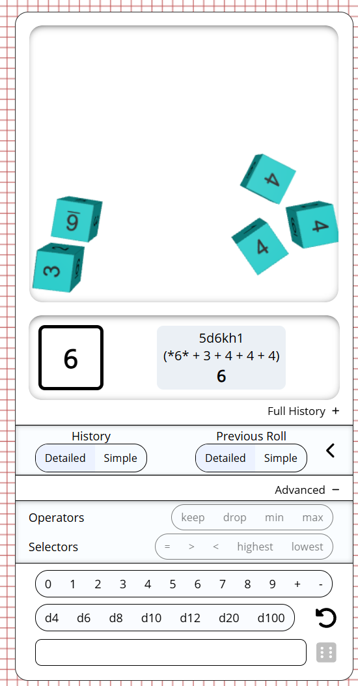

import Warning from "/src/components/directives/Warning.astro";

Es un nuevo año y tenemos algunos buenos cambios en camino para ti.

<Warning title="Actualización del servidor">
    Si eres el administrador de un servidor, revisa los cambios en los recursos para 3 cambios relacionados con el
    servidor.
</Warning>

## ELIMINADO

Esta versión trae consigo algo de limpieza con 2 funciones eliminadas:

### Etiquetas/Filtros

Como se anunció en las últimas 2 notas de la versión, este conjunto de funciones ahora se ha eliminado oficialmente.

Las etiquetas eran tags que podías colocar en las formas y la herramienta de filtro te permitía ocultar/mostrar formas en la pantalla filtrando por estos tags.
Aún veo algunos casos de uso para esto, pero la implementación actual no era buena, se veía muy anticuada y, que yo sepa, no se usaba.
El hecho de que nadie haya preguntado por ellas desde que se publicó el aviso de deprecación es una señal de que eliminarlas no hará daño a nadie.

### Archivos .paa

En una versión anterior de PA, el administrador de recursos tenía la opción de exportar todos tus recursos a un archivo `.paa`, que luego podías importar en otra instalación de PA.

Desde entonces, el administrador de recursos fue renovado y ya no ofrece esta funcionalidad en su interfaz.
Originalmente mi intención era traer de vuelta esta funcionalidad, pero mientras tanto se añadió la capacidad de exportar campañas, que exporta automáticamente todos los recursos relacionados.

Esto cubrió la mayoría de los casos de uso de la configuración original de paa. De manera similar a la otra eliminación, nadie me ha preguntado por esta función que ya no está disponible en la interfaz,
así que era un buen momento para hacer limpieza, ya que parte de la lógica interna de los recursos ha sido reescrita para algunos cambios más adelante en estas notas de la versión.

## Dados

### Interfaz de la herramienta

_contribución de rexy712_

En la 2024.3, la herramienta de dados recibió una nueva y brillante interfaz, que ya era un paso adelante respecto a la interfaz original, pero rexy se tomó la libertad de mejorarla aún más.

La interfaz recibió algunas transiciones fluidas y unifica los resultados de una tirada en la interfaz en lugar de abrir un modal separado, haciendo la experiencia menos distractora.
Además, el historial de dados está mejor integrado y se ha añadido un botón para repetir rápidamente la última tirada.

Los dados 3D ahora también pueden lanzarse en 2 modos separados: default y box. Default es el comportamiento original en el que se lanzan por toda la pantalla,
box abrirá una pequeña sección en la parte superior similar a una bandeja de dados.

## Ajustes en la simulación de dados 3D

_contribución de rexy712_

Se realizaron cambios en las propiedades físicas de los dados 3D que deberían dar como resultado un mejor comportamiento,
en particular los dados deberían dejar de deslizarse mucho más rápido.

## Manejo de D100

El manejo de las tiradas de D100 era muy diferente entre el modo 2D y el modo 3D: el modo 2D cubría todos los valores entre 1-100,
mientras que el modo 3D solo cubría las decenas (p. ej. 10/20/30/...) y requería lanzar un d10 adicional para cubrir las unidades,
pero no había ninguna lógica para manejar lo que debería suceder si se lanzaban, por ejemplo, un 00 y un 0.

Esta versión mejora todo lo anterior. En el modo 3D, al lanzar un d100, se lanzará automáticamente un d10 junto a él,
así que no necesitas especificarlo tú mismo. Además, hay una lógica integrada que dicta el comportamiento del caso 00/0.

La librería de dados subyacente `@planarally/dice` se puede configurar para estar en modo 0-99 o 1-100.
Sin embargo, la interfaz actual de PlanarAlly no ofrece forma de configurarlo, así que por ahora siempre se selecciona el modo 1-100.

## Recursos

Otro conjunto de grandes cambios está relacionado con los recursos. Se hicieron algunos cambios técnicos en el servidor, así como actualizaciones visuales en el cliente.

### Interfaz en el juego del DM

El administrador de recursos es una buena forma de organizar tus recursos fuera del juego, para preparar las cosas para una sesión.

Sin embargo, en el juego, el DM tiene una vista completamente diferente de sus recursos.
Hay una barra lateral con una estructura de árbol, pero no son posibles interacciones reales, excepto arrastrar un recurso específico al mapa.

Esta versión cambia esto y elimina la barra lateral, reemplazándola con un modal grande algo similar a la nueva interfaz de notas,
pero con una apariencia y sensación similar a la del administrador de recursos fuera del juego.
De hecho, los administradores de recursos dentro y fuera del juego ahora comparten gran parte del código de su interfaz.

Al igual que la renovada interfaz de notas del año pasado, la interfaz de recursos se puede abrir desde la barra lateral, pero también pulsando el atajo <kbd>a</kbd>.

#### Búsqueda

La barra lateral siempre tuvo una barra de búsqueda, que sigue disponible en la nueva interfaz y está implementada de forma mucho más eficiente,
ya que ya no requiere cargar toda la información de los recursos por adelantado al conectarse al juego.

Su comportamiento es ligeramente diferente al de la búsqueda de la barra lateral, dado que la representación es completamente diferente.
Mostrará directamente todos los recursos que coincidan con la búsqueda. La barra lateral, en cambio, mantenía visibles todas las carpetas que tuvieran un recurso coincidente en su interior.

#### Atajos

Otra función nueva es la capacidad de marcar una carpeta como atajo. Los atajos aparecerán en el lado izquierdo, debajo del atajo permanente "All assets".
Te permiten ir rápidamente a una carpeta concreta que puedas necesitar con frecuencia (p. ej. la carpeta principal de la campaña, fichas de dnd comunes, ...).

Los atajos se guardan por campaña.

#### Arrastrar

Te estarás preguntando cómo se supone que debes arrastrar un recurso al mapa ahora que la nueva interfaz ocupa una buena parte del centro de la pantalla.

Cuando empiezas a arrastrar un recurso, puedes arrastrarlo sobre una carpeta para moverlo a esa carpeta, como harías en el administrador de recursos.
Sin embargo, si arrastras el recurso fuera de la interfaz, esta desaparecerá por completo permitiéndote colocarlo realmente en el mapa.

Para garantizar la claridad, siempre se muestra un mensaje en la parte inferior de la interfaz al arrastrar para informarte de este comportamiento.

<video autoplay loop muted style="max-width: min(680px, 75vw);">
    <source src="/blog/release-2025.1/asset-drop.webm" type="video/webm" />
    <source src="/blog/release-2025.1/asset-drop.mp4" type="video/mp4" />
</video>

### Cambios menores en el administrador de recursos

#### Interfaz de renombrado

_contribución de rexy712_

Renombrar un recurso solía abrir una ventana emergente donde tenías que insertar el nuevo nombre.
Esto se ha hecho menos intrusivo, permitiéndote en cambio editar el nombre en el lugar, como podrías estar acostumbrado a hacer en el explorador de archivos de tu sistema operativo.

#### Selección en el menú contextual

Al hacer clic derecho en un recurso en el administrador de recursos, aparece un menú contextual.
Esto siempre restablecía la selección a solo el recurso en el que habías hecho clic derecho.

Esto ya no es así, permitiéndote seleccionar correctamente un grupo de archivos y eliminarlos usando el menú contextual.
Acciones como "renombrar" no se muestran cuando hay varios recursos seleccionados.

La selección se restablecerá a solo el recurso clicado si este no formaba parte de la selección actual para empezar.

### Miniaturas

Los recursos se pueden subir en una amplia variedad de calidades y cuando se muestran en el mapa, queremos que tengan la misma calidad.

Sin embargo, hay otros lugares donde interactuamos con los recursos donde la calidad superior no es necesaria y solo hace que las cosas sean más pesadas.
El administrador de recursos es el principal candidato, donde cargamos potencialmente muchas imágenes a la vez.

A partir de esta versión, el servidor intentará generar miniaturas para todos los recursos subidos y preferirá usarlas al mostrar recursos, p. ej. en el administrador de recursos.
Esto hará que el administrador de recursos cargue mucho más rápido, ya que no tiene que cargar un montón de imágenes de mayor calidad.

<Warning title="Actualización del servidor">
    Al iniciar el servidor, se iniciará un trabajo en segundo plano para generar miniaturas de todos los recursos existentes. Esto registrará
    algo de progreso de vez en cuando, pero por lo demás no bloquea el comportamiento principal del servidor.

    También hay un comportamiento de respaldo en caso de que las miniaturas no existan, por lo que este proceso es menos crítico.

</Warning>

### Límites de carga y almacenamiento

El administrador del servidor ahora puede configurar límites globales para los recursos en la configuración del servidor.
Hay dos nuevas configuraciones disponibles: una para limitar el tamaño máximo de un solo recurso y otra para limitar el tamaño total de todos los recursos que un usuario determinado tiene en el servidor.

Ambas configuraciones no tienen límite por defecto, así que asegúrate de modificarlas a lo que quieras hacer.

Es importante señalar que los cambios en los límites solo se aplican a los recursos recién subidos.
Si un usuario está usando más espacio antes de que se añadiera la configuración, ninguno de sus recursos existentes se eliminará, pero no podrá subir más recursos.

<Warning title="Actualización del servidor">
    Esto añade nuevas entradas al archivo de configuración. Asegúrate de añadirlas a tu configuración o el servidor no
    podrá iniciarse.
</Warning>

### Ubicación de guardado

_este es un cambio técnico del servidor, puedes omitirlo si eres un jugador_

Los archivos físicos asociados con los recursos subidos se almacenan en disco en una carpeta concreta con todos sus nombres iguales al hash del recurso.
Hasta ahora se almacenaban en 1 carpeta plana, pero por razones de rendimiento esta versión los almacenará en su lugar en una estructura de subcarpetas basada en el hash.
Esto reducirá algunos tiempos de operaciones de E/S, ya que ya no necesitan operar en 1 carpeta grande.

<Warning title="Actualización del servidor">
    Se realizará una migración única para mover todos los archivos existentes a su nueva ubicación al iniciar.
    Dependiendo de la cantidad de recursos en tu servidor, esto podría llevar un tiempo.

    Es esencial que este proceso no se interrumpa, ya que se mueven tanto los archivos físicos como los datos en la base de datos que lo vinculan todo.

</Warning>

## Notas

Un último grupo de cambios está relacionado con las notas. Sin embargo, la mayoría de estos son cambios menores y correcciones de errores.

### Ventana emergente completa

Con la introducción de la nueva interfaz de notas, una nota puede extraerse del administrador de notas, dando como resultado un modal flotante que puedes arrastrar dentro de la pantalla de PA.

Esta versión hace posible extraer este modal completamente fuera de la página, permitiéndote arrastrar la nota a otra pantalla y continuar interactuando con ella.
Este diálogo flotante sigue vinculado a la página abierta de PA, pero no está vinculado a una ubicación de pantalla concreta. Cerrar la pestaña de PA hará que el diálogo flotante también se cierre.

### Acceso global a las notas

Se ha eliminado el acceso predeterminado a las notas globales.
Esto permitía a los usuarios establecer una nota como visible (o incluso editable) globalmente entre todos los usuarios, algo que no es exactamente lo que queremos.

### Pequeñas mejoras de la interfaz

- Ahora puedes limpiar la barra de búsqueda de notas con un botón.
- El interruptor local/global ahora es un menú desplegable con la opción de filtrar todas las notas
- El botón de notas en la barra lateral ahora también es visible para los jugadores
- Las ventanas emergentes de notas sin acceso de escritura ahora dicen "Ver fuente" en lugar de "Editar"

### Correcciones

- Se resuelven varios errores de la interfaz relacionados con la interacción con el acceso de solo vista
- La paginación de las notas no se restablecía al alterar la búsqueda/filtros
- El acceso de edición predeterminado a las notas no funcionaba correctamente
- La barra de búsqueda se superponía a otras interfaces
- Era posible editar localmente una nota de solo lectura (estos cambios siempre eran rechazados por el servidor)

## Colores predeterminados de la herramienta Draw

Cuando dibujo en la capa de niebla de guerra, tiendo a cambiar a menudo entre dibujar muros, ventanas, puertas, etc.
Para cada uno de ellos tiendo a usar un color particular para que destaquen visualmente de inmediato cuando abro la capa de niebla de guerra.

Hasta ahora esto era un poco una molestia, ya que siempre tenías que cambiar los colores al cambiar entre los distintos tipos, y aunque la herramienta de color tiene memoria de los colores usados recientemente,
seguía siendo una molestia.

Esto cambia ahora con la adición de colores predeterminados: en tu configuración del cliente ahora puedes configurar colores predeterminados para muros/ventanas y puertas.
Se aplicarán por defecto cuando sean relevantes en la herramienta Draw.

Para comunicar esto claramente, los selectores de color están deshabilitados en la herramienta Draw cuando se usaría un color predeterminado.
Sin embargo, aún puedes deshabilitar este comportamiento y elegir colores específicos para un objeto particular desmarcando la casilla 'usar colores predeterminados' en la configuración de visión de la herramienta Draw (2.ª pestaña).

Esta es una pequeña adición, pero ya me ha ahorrado mucho tiempo.

## Varios

- SuikaXhq se tomó la molestia de actualizar muchas de las etiquetas en inglés codificadas en la interfaz para usar etiquetas de traducción
- Se actualizaron los colores del borde del botón de nuevo juego en el panel de control
- Se corrigió un manejo extraño de los cambios cuando la selección cambiaba (p. ej. cambiar el nombre de una forma y hacer clic en otra forma antes de salir del campo de entrada del nombre)
- Arrastrar modales ahora también los enfoca
- Teletransportar formas compuestas podía provocar algunos errores en el lado del cliente
- El ajuste de la herramienta Select ahora se comporta igual que el ajuste de la herramienta Draw (es decir, una vez ajustado a un punto, ya no se ajusta a la cuadrícula al soltar el ratón)
- Hacer clic en una sesión que comparte nombre con otra sesión desplegaba ambas
