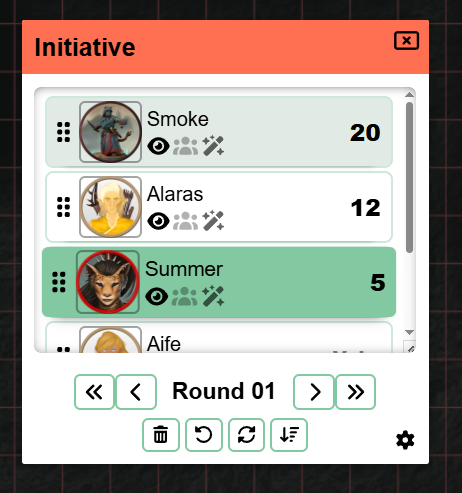
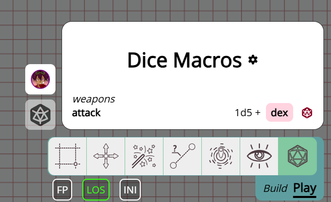

import Info from "/src/components/directives/Info.astro";
import Warning from "/src/components/directives/Warning.astro";

¡Hay algunas cosas emocionantes en esta versión! Algunos puntos destacados:

- Actualizaciones de UI/UX en Iniciativa y Notas
- Correcciones en copiar y pegar y sistemas similares
- Se ha añadido un nuevo concepto de 'datos personalizados' a las formas, que permite, entre otras cosas, una hoja de personaje sencilla

<Info title="Aviso de deprecación">
    La funcionalidad de las variantes se simplificará en 2026.2, consulta [Variantes](#variants) para más información.
</Info>

Esta versión estaba originalmente prevista para noviembre/diciembre, pero los rediseños técnicos (ver más adelante) acabaron necesitando un período más largo para estabilizar los problemas.

Esta versión también contiene contribuciones de varias personas, gracias a todos vosotros, así como a todas las personas que reportaron errores en la rama de desarrollo.

<Warning title="Cambios en la configuración del servidor">Consulta [la sección del servidor](#server-changes)</Warning>

## Iniciativa

_Estos cambios han sido contribuidos por Rexy712_

Como se menciona en la introducción, la UI ha recibido algunas actualizaciones, como se puede ver a continuación.

Ahora también tiene un scroll de overflow interno,
para que el elemento de iniciativa no se vuelva gigantesco si hay muchos actores en la iniciativa.

Otra novedad es que al añadir efectos, ahora también puedes hacer que un efecto sea infinito en el tiempo;
antes siempre tenías que rellenar un número de turnos hasta que desapareciera.

Como DM ahora también tienes la opción de limpiar toda la iniciativa de una sola vez,
además de botones para avanzar la iniciativa un turno completo.

## Conceptos básicos de la hoja de personaje

### Por qué

Una de las quejas que suelo recibir de vez en cuando gira en torno a la falta de hojas de personaje.
Siempre he creído que una hoja de personaje genérica que se ajuste a todos los sistemas/usos no es realmente factible
y, como resultado, que las hojas de personaje se adaptan mejor a los mods.

Dicho esto, los mods siguen siendo muy experimentales, requieren conocimientos técnicos para crearlos
y, seamos honestos, PA es un VTT muy de nicho.
No es de extrañar que, como resultado, no haya habido realmente ningún trabajo en este espacio.

Sigo creyendo que una hoja de personaje de aspecto decente 'que sirva para todos' no es realmente factible,
pero me aventuré a crear un sistema más rudimentario que se integra con el sistema de dados.
De esta manera, los mods pueden seguir usando en segundo plano este sistema central común, ofreciendo a la vez una UI visualmente más agradable.

### Cómo

Esta versión añade una nueva pestaña a la interfaz "editar forma", llamada "datos personalizados".

Aquí puedes añadir libremente datos relacionados con la forma. Puedes organizar los datos en un formato de datos tipo árbol.

Los datos que puedes añadir pueden ser de 3 tipos actualmente:

- texto
- número
- expresión de dados

La mayoría de estos son bastante autoexplicativos. Lo bueno de las expresiones de dados es que puedes cargar inmediatamente la herramienta Dados
con la expresión dada, que puede hacer referencia a otros elementos de datos personalizados, llamados referencias para abreviar.

Además, también puedes usar estas referencias directamente en la herramienta Dados, que mostrará una UI de autocompletado para ayudarte a seleccionar la estadística de la forma correcta.

Otra adición a la herramienta Dados es que hay un botón rápido para cada forma en tu selección que tenga expresiones de dados.
Esto hace que no tengas que abrir constantemente la configuración de la forma, navegar a la pestaña de datos personalizados y hacer clic en el botón de lanzamiento para la tirada deseada.

### Futuro

El objetivo es actualizar también otros lugares para que interactúen con las referencias.
Los rastreadores y las auras son uno de los lugares más destacados que podrían beneficiarse de esta interacción.
(p. ej. un rastreador de HP relacionado con una referencia de HP)

Otra cosa que me encantaría hacer es crear un mod de hoja de personaje específico de un sistema como una buena muestra.
Sin embargo, hay para mí un gran problema de licencias/derechos a este respecto.

Para muchos sistemas no está permitido, o se necesitan contratos, ofrecer estas cosas de forma oficial.
D&D, por ejemplo, es algo que me da mucha reticencia tocar a este respecto, aunque exista la SRD;
no han sido muy acogedores con otros players dado que tienen sus propias herramientas.
Del mismo modo, contacté con la gente de Mothership para ver qué es posible, pero recibí un mensaje de que actualmente no se permiten integraciones vtt.
El sistema wildsea es muy abierto y de hecho empecé a trabajar en un mod relacionado con wildsea en el repositorio de mods de ejemplo,
pero mi gran problema allí es que ese sistema es uno de los pocos sistemas para los que yo mismo no uso un VTT en absoluto,
así que se siente un poco extraño.

Así que no estoy muy seguro de qué voy a hacer a partir de aquí, ya que es un tipo de situación en la que haga lo que haga salgo perdiendo:
legalmente no puedo hacer mucho, pero la gente parece querer integraciones.

## Notas

En la versión [2024.1](/es/blog/release-2024.1) se introdujo un gran rediseño del sistema de notas.
Añadió un framework unificado y una mejor UI en torno a algunos conceptos sueltos que existían antes.

Introdujo el concepto de que la nota es una nota global, disponible en todas tus campañas, o es específica de una ubicación de la campaña.
La idea es que normalmente tienes notas específicas de tu juego (locales) o notas que necesitas a menudo, como bloques de estadísticas (globales).
Puedes cambiar entre local/global o ambos y también puedes hacer algunos filtros como "solo mostrar las notas de la ubicación actual".

Ahora, 2 años después, es un buen momento para reevaluar cómo me siento con el sistema y cambiar las cosas que no parecen correctas.

### Problemas con el sistema actual

#### Notas de campaña

Uno de los problemas con los que suelo encontrarme es que hago muchas notas que solo son relevantes para una ubicación concreta.
Esto significa que cuando estoy en la ubicación X, o veo todas las notas de todas las ubicaciones de mi juego, o solo veo las de mi ubicación actual.

En papel esto suena bien, sin embargo, en la práctica también tengo algunas notas que son relevantes para toda la campaña y solo para esa campaña.
El problema es que, como cada nota está inherentemente asociada a la ubicación en la que se creó, estas notas de toda la campaña son difíciles de encontrar.
Si filtras tus notas a la ubicación actual, ya no ves las notas de toda la campaña (a menos que se hayan creado en tu ubicación actual); si no filtras, ves un millón de notas y es difícil llevar un seguimiento de cualquier cosa.

El filtro de ubicación activa también está oculto detrás de un menú extra, lo que hace bastante engorroso alternar entre esto con frecuencia.

#### Notas de forma

Otra rareza es que, como una nota está asociada a la ubicación en la que se creó, nos encontramos con configuraciones incómodas cuando la nota está adjunta a una forma y esa forma cambia de ubicación.
Esto hacía que la nota no apareciera siempre en los lugares correctos.

#### Notas globales

Como se mencionó antes, las notas globales cubren un nicho para algunas notas que podrías necesitar con frecuencia. En mi visión original, esto sería sobre todo para bloques de estadísticas de monstruos o reglamentos de sistemas.
Desde entonces, algunas personas me han mencionado que a veces tienen notas relevantes para una selección de campañas porque los mismos (p)nj podrían aparecer en ellas.

El problema, sin embargo, es que para las notas globales la configuración de acceso requiere más trabajo, porque al no pertenecer a una campaña concreta, PA no sabe qué jugadores sugerir.
Así que tienes que vincular manualmente a cada jugador con cada una de esas notas, lo que puede volverse engorroso bastante rápido.

#### Notas de ubicación

Una última molestia es que, como solo tienes la opción entre "todas las ubicaciones" o "ubicación actual", cualquier nota de otra ubicación que quieras simplemente consultar rápidamente requiere cambiar completamente de ubicación o buscar entre todas las notas.
Esto último puede o no ser factible dependiendo de si recuerdas el título.

### Qué está cambiando

Así que, con estos puntos dolorosos en mente, esta versión revisa algunos de los conceptos.

#### Eliminación de global/local

La división local-global simplemente no acabó funcionando como esperaba inicialmente.
La realidad es que las notas varían mucho en su uso y pueden ser relevantes para 1 ubicación, varias ubicaciones de varias campañas o ninguna campaña específica en particular.

Como resultado, ahora se centra más en vincular una campaña y/o ubicación específica a una nota.
Al crear una nota inicialmente, ahora eliges si su objetivo principal es para toda la campaña, específico de una ubicación o sin un vínculo en particular,
pero aún puedes vincular cualquier otra ubicación que quieras.

#### UI de filtros

En lugar del confuso panel de preferencias + la barra de filtros de etiquetas, la UI de búsqueda/filtro se ha rediseñado como una barra de filtros activa, siempre accesible de inmediato, que te permite mostrar notas de ubicaciones en las que no estás activo actualmente.

#### Paginación del lado del servidor

Algo no mencionado específicamente en los puntos dolorosos es que hasta ahora las notas se paginaban completamente del lado del cliente.
Esto significa que todas las notas tenían que proporcionarse al cliente cuando cargabas una campaña.
Esto era fácil para tener una versión funcional rápida al principio, pero solo añade más carga tanto al tiempo de inicio como a la base de datos,
mientras que en realidad normalmente no interactúas con la mayoría de las notas.

Ahora las notas solo se obtienen del servidor cuando se solicitan realmente.

La UI de paginación también se ha movido a la parte inferior izquierda y se ha hecho visualmente más clara.

#### Etiquetas

Era posible añadir etiquetas de forma libre a cualquier nota. Sin embargo, no había una QoL real que te ayudara a gestionar las etiquetas.
Prácticamente tenías que saber exactamente cómo habías escrito una etiqueta concreta en el pasado al añadirla a una nota nueva, ya que no hay desplegable/autocompletado/búsqueda ni nada por el estilo.

Esta versión lo cambia para que las etiquetas se gestionen correctamente en una colección de base de datos separada en lugar de ser datos json aleatorios adjuntos a una nota.
Esto permite que la UI muestre realmente las etiquetas existentes en los detalles de edición de tu nota y que también estén presentes en la barra de la UI de filtros.

<video autoplay loop muted style="max-width: min(680px, 75vw);">
    <source src="/blog/release-2026.1/notes-tags.webm" type="video/webm" />
    <source src="/blog/release-2026.1/notes-tags.mp4" type="video/mp4" />
</video>

.

## Variantes

### Correcciones de permisos

_contribución de Rexy712_

La forma en que se configuró el acceso/los permisos para las formas variantes impedía que los no DM modificaran algunos aspectos de ellas.
Se han realizado las siguientes correcciones:

- Los jugadores ahora pueden añadir variantes a las formas sobre las que tienen acceso de edición
- Los jugadores ahora pueden cambiar entre variantes de las formas sobre las que tienen acceso de edición
- [tech] Los permisos de acceso de las variantes ahora se basan solo en los permisos de la forma padre

### Anuncio del rediseño

Las variantes están actualmente implementadas de una manera bastante complicada.
Para cada variante hay una instancia de forma real y hay una forma de control oculta responsable de mostrar la forma correcta y gestionar el estado/las interacciones de todas las variantes.

El aspecto positivo es que cada variante se puede ajustar completamente a lo que quieras. Todos los ajustes de la forma son exclusivos de esa variante, permitiendo total libertad creativa.

Sin embargo, conlleva muchos inconvenientes.

- Cualquier concepto que se suponga que debe compartirse entre las variantes tiene que duplicarse. Cualquier cambio que hagas que pueda aplicarse a todas las variantes debe hacerse en todas las variantes.
    - La excepción son los rastreadores/auras, para los que se añadió un sistema especial para hacerlos compartibles.
- Todo el código base tiene que hacer lógica extra solo para este concepto de nicho, ya que la forma en que se gestionan las formas afecta a muchas interacciones
    - Esto añade una sobrecarga extra a todas las demás funciones para intentar funcionar bien con posibles formas variantes
- Debido a que funcionan de manera tan irregular en comparación con la gran mayoría de las formas, a menudo terminan con problemas sutiles

La realidad es que la total libertad creativa para cada forma no vale todo el lío y, en realidad, tampoco es necesaria en la gran mayoría de los casos.
En esencia, la idea de las variantes es solo poder cambiar rápidamente entre algunos recursos de arte con potencialmente algunas pequeñas diferencias.

Las pequeñas diferencias que imagino que pueden ser realmente útiles son el tamaño de la ficha, potencialmente un nombre diferente y algunos rastreadores/auras.

Tengo la intención de reducir toda la complejidad de múltiples formas y el cambio entre ellas, a solo 1 forma.
Esta forma tendrá una nueva pestaña para gestionar las variantes, donde puedes añadir una nueva entrada con un icono y un nombre.

Y eso es todo. Para los rastreadores y las auras, esto también significa que el concepto especial "compartido" se puede eliminar.
Mis planes iniciales son no ofrecer interacciones especiales para rastreadores/auras y simplemente hacer que el usuario active/desactive los rastreadores/auras según sea necesario al cambiar de variante.
Si esto acaba siendo demasiado engorroso, estoy abierto a estudiar la posibilidad de añadir alguna lógica de toggle específica para rastreadores/auras a la nueva pestaña de variantes.

Esto también significa que la UX mejorará en general, ya que actualmente no es posible cargar una variante concreta directamente si tienes varias configuradas.
Actualmente necesitas recorrerlas en ciclo, lo que las revela momentáneamente a todos los jugadores que pueden ver la forma.

<Warning>
    Esto cambiará en 2026.2. Si tienes preocupaciones/problemas con este cambio, contáctame para que podamos ver qué es
    posible.
</Warning>

## Correcciones del ajuste a la cuadrícula

_contribución de Rexy712 y Craftidore_

Se han realizado una variedad de correcciones al comportamiento del ajuste.

### Interacciones con el teclado

El movimiento con el teclado ahora también se ajusta a la celda de la cuadrícula más cercana (cuando el ajuste es relevante).
Hasta ahora esto no se hacía, lo que provocaba algunos casos extraños en los que mueves una forma fuera de la cuadrícula porque tocó una pared una vez en el camino.

Además, se corrigió un error que hacía que el movimiento con el teclado moviera una forma dos veces si la regla Ruler estaba habilitada en la herramienta Select durante el movimiento.

### Tamaño horizontal vs vertical

En [2024.2](/es/blog/release-2024.2#shape-grid-size) se añadió más control sobre el tamaño de una forma en el contexto de la cuadrícula.
Permitiendo al usuario indicar cuán grande debe actuar la forma en la cuadrícula al moverla, independientemente del tamaño real del arte.
También te mostraría el tamaño inferido que PA cree que tiene la forma en caso contrario.

Esta versión añade mejoras adicionales dividiendo esta propiedad de tamaño en un componente horizontal y otro vertical (para cuadrículas cuadradas).
Esto corrige algunos comportamientos de ajuste cuando una forma es irregular (p. ej. 2x7).

## Rediseños técnicos

### Mejoras en la duplicación de datos

PA sufrió múltiples refactorizaciones técnicas que corrigieron una serie de problemas abiertos desde hacía mucho tiempo,
que no podía corregir hasta que se hicieran estos cambios.

En particular, se modificaron dos cosas:

- Cómo se representan los datos intermedios de las formas en el cliente
- Cómo se almacenan los (modelos de) formas en la base de datos

Te ahorraré los detalles técnicos, pero el resultado es que las siguientes acciones tenían todas una variedad de errores en común que ahora deberían funcionar correctamente:

- deshacer/rehacer la eliminación de formas
- copiar y pegar una forma
- soltar una plantilla en el tablero

Estos 3 sistemas han existido y funcionado (en cierta medida). Sin embargo, todos ellos no podían tratar la información de las formas almacenada en lugares más especializados.
Las notas, por ejemplo, se almacenan en una colección de base de datos separada, lo que hacía que deshacer/rehacer olvidara la relación de una nota con una forma y que copiar y pegar tampoco tuviera ni idea.

En lugar de tener que añadir casos especiales por todas partes, la nueva reestructuración funciona de tal manera que los 3 sistemas anteriores no tienen que conocer los detalles: simplemente funciona.

### Plantillas de recursos

#### Cambios de almacenamiento

Las plantillas de recursos son un buen sistema que permite al usuario guardar datos relacionados con un determinado recurso
para que, si sueltas el recurso en el tablero en el futuro, se rellene previamente (p. ej. recordando los PG/CA de un goblin).

Entre los problemas mencionados en la sección anterior, las plantillas también tenían otros problemas.
Por cómo se almacenaban en la base de datos, no se veían afectadas por ninguna migración de la base de datos a una nueva versión.

Esto significa que las plantillas creadas en versiones anteriores podían comportarse potencialmente de manera incorrecta al usarse en una versión nueva.

Ahora se almacenarán como formas normales en la base de datos, lo que permite la migración automática y hace que otra lógica interna sea más coherente.

#### Icono del gestor de recursos

Esto no es un rediseño técnico, pero está relacionado con las plantillas de recursos.

El gestor de recursos ahora muestra un icono en aquellos recursos que tienen datos de plantilla.
Esto ayuda si tienes varios recursos con el mismo nombre (debido a diferentes colecciones o similares) y
no estás seguro de sobre cuál has guardado información.

### Actualización de Pydantic

Esta es una actualización puramente técnica de una librería de validación de datos que usa el servidor.
Sin embargo, tiene un impacto significativo en el flujo de datos y, aunque no debería haber ningún cambio perceptible para los jugadores,
siempre es posible que se me haya escapado algún caso que provoque errores en el servidor.

Lo menciono aquí principalmente para los hosts del servidor,
para que si ven errores de validación apareciendo en sus registros del servidor,
¡informen de estos problemas lo antes posible!

## Correcciones de errores

#### Inconsistencia en el orden de las formas

Para garantizar que las formas se muestren visualmente en el orden correcto cuando se superponen,
el servidor realiza un seguimiento de una posición por forma.
Al mover una forma, algunas formas necesitan que se ajuste su posición, ya que pueden haberse movido hacia arriba o hacia abajo.

Aunque esto ha funcionado bastante bien durante mucho tiempo,
hoy no hay una corrección de errores real,
así que si por alguna razón algo falla y causa un hueco en el orden o una entrada de posición duplicada,
podría causar algún comportamiento extraño.

Sería bastante costoso comprobar constantemente la integridad del orden,
así que en su lugar me aventuré a encontrar un lugar donde la inconsistencia se pueda comprobar fácilmente y que no se ejecute con frecuencia.

De ahora en adelante, si haces la acción "mover la forma al fondo",
se hará una comprobación para ver si la cantidad de formas actualizadas coincide con la cantidad esperada.
Si no es así, todas las formas se recolocarán y aparecerá una notificación a todos los clientes conectados
que explica el problema y pide una actualización para garantizar la corrección visual.

Además, la consulta de actualización de posición se ha mejorado desde el punto de vista del rendimiento,
aunque probablemente no lo notarás.

## Cambios en el servidor

### Registros (logging)

_contribución de nwhansen_

El comportamiento del logging ahora se puede configurar usando la configuración del servidor.

Esto permite al propietario del servidor elegir si se mantienen o no registros en archivo y qué severidad capturan los distintos loggers.

Consulta [la documentación de configuración](/es/server/management/configuration/#logging) para más detalles.

<Warning title="Cambios en la configuración del servidor">
    Con este cambio, el logging predeterminado es solo stdout, por lo que no hay registro en archivo como antes de esta versión.

    Además, los ajustes de log "max_log_backups" y "max_log_size_in_bytes" que estaban originalmente en la sección "general" de la configuración ahora se han movido a la sección de logging de archivo.
    ¡Si los tenías configurados específicamente, tu servidor ya no se iniciará!

</Warning>

## Varios

- las imágenes de dirección de fichas fuera de pantalla desbordaban su contenedor
- ignorar los atajos de teclado en el elemento select
- el ampersand en el nombre de la campaña rompía el juego
- correcciones de polígonos rotados
    - corte
    - movimiento de puntos
- El creador de la campaña ya no puede cambiar su propio rol ni expulsarse a sí mismo
- Texto de la configuración de la cuenta superpuesto en anchos de vista más pequeños
- Mover formas especiales de ocultar/revelar desde la capa de niebla de guerra podía llevar a un error de nicho
- El control deslizante de rotación no mostraba el valor actual en el campo de texto al cargar el componente
- Los archivos DDraft ya no se pueden subir al gestor de recursos
- Pasar el ratón sobre una entrada de iniciativa que forma parte de un grupo pero no está marcada como entrada de grupo resaltaba a todos los miembros del grupo
- Registro de errores sobre las vistas en el servidor
- Desactivar la iniciativa bloqueaba las interacciones de bloqueo de visión
- La rueda dentada de iniciativa no abría la pestaña de iniciativa en la configuración del cliente
- Las entradas de iniciativa permanecían difuminadas si la entrada enfocada era eliminada por otro jugador.
- El sistema de grupos no se limpiaba correctamente en los cambios de ubicación
- Las insignias de grupo no se ordenaban numéricamente en la configuración de grupos de una forma cuando estaban configuradas con el conjunto de caracteres de números.
- La entrada del rastreador vuelve al último valor si se deja vacía
